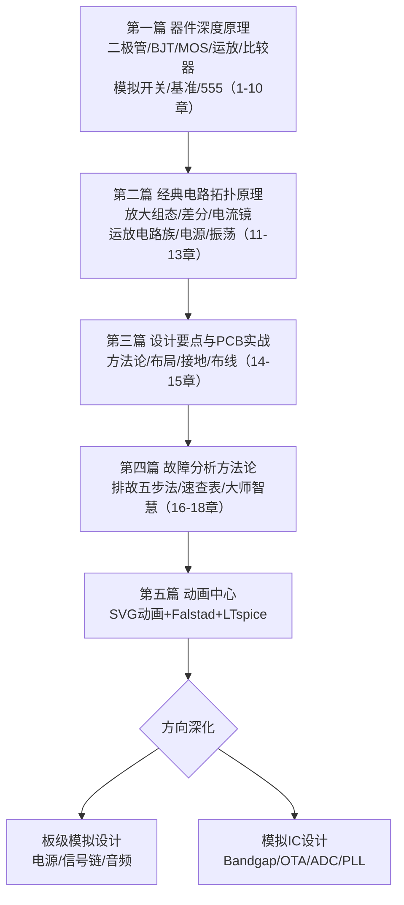

# 通往模拟电路之路 🛤️

> 一份由社区资源滋养的模拟电路（Analog Circuits）系统学习指南
> 仿《通往 AGI 之路》知识体系风格 —— 从欧姆定律到芯片内部结构
> 特色：**原理推导 + 器件内部剖析 + 故障分析 + 动画演示**
> 最后更新：2026-10

---

<p align="center">
  
</p>

<p align="center">
  <a href="LICENSE"></a>
  
  
</p>

## 📖 前言

数字电路统治了世界，但世界本身是模拟的。传感器电压、麦克风声波、天线射频、电池电量全是模拟量；每颗数字芯片的供电、时钟、接口背后都站着模拟电路。模拟设计无法被综合工具替代，至今仍是一门"手艺活"。

本指南与其他教程的区别：**不只告诉你"是什么"，更讲透"为什么"**——每个器件从物理原理讲起，剖析经典芯片的内部电路，给出真实故障案例，配套动画演示。

---

## 🗺️ 学习路线图



---

# 第一篇：器件深度原理解析 🔬

> 每个器件按统一结构讲解：**物理原理 → 数学模型 → 内部电路 → 关键参数 → 典型应用 → 故障模式 → 动态分析（四拍拆解）→ 配套视频**

---

## 第 1 章 无源元件的真实面目

理想元件不存在。理解寄生参数是区分"教科书学习者"和"工程师"的第一道门槛。

### 1.1 真实电阻的等效模型

```
        引线电感 L (~5nH/cm)
理想 R ──/\/\/──mmmm──┬──
      (标称阻值)      │
                    ┌─┴─┐
                    │ C │ 并联寄生电容 (~0.2pF)
                    └─┬─┘
──────────────────────┴──
```

- **碳膜/金属膜电阻**：精度 1%/5%，温度系数 50~200ppm/°C
- **绕线电阻**：功率大但电感大，**绝不能用于高频**
- **贴片 0603/0805**：寄生最小，高频首选
- 失效模式：过功率烧毁（开路）、潮湿导致阻值漂移

### 1.2 真实电容：ESR 与 ESL

<p>


</p>

> 📷 贴片元件有多小：0805 = 2.0×1.25mm（左图与毫米尺对比）。手焊 0805（右图）是模拟工程师的成年礼——烙铁尖+镊子+放大镜，一个周末就能练出来。


电容的完整模型是 **C 串联 ESR（等效串联电阻）再串联 ESL（等效串联电感）**：

- **电解电容**：容量大（µF~mF），ESR 大（0.1~10Ω），寿命随温度指数下降（每升 10°C 寿命减半），反接会爆炸
- **陶瓷电容**：MLCC，ESR 极小（mΩ 级），但 X7R/X5R 有直流偏压效应（标称 10µF 在 5V 偏压下可能只剩 4µF！）
- **薄膜/C0G(NP0)**：性能最好，容量小

**工程铁律**：芯片电源引脚就近放 100nF 陶瓷电容（去耦），距离越近越好——因为长走线的电感会让高频噪声无处泄放。

### 1.3 真实电感与变压器

- 寄生参数：绕线电阻 DCR、匝间电容 → 存在自谐振频率 SRF，超过 SRF 后电感变成电容！
- 磁芯饱和：电流过大时磁导率骤降，电感量塌缩 → 电源电感选型必须看饱和电流
- 继电器/电机断电时的**反电动势** $v = -L\frac{di}{dt}$ 可产生数百伏尖峰 → 必须并联续流二极管


### 📺 配套视频

<p>
<a href="https://www.youtube.com/watch?v=BcJ6UdDx1vg"></a>
<a href="https://www.youtube.com/watch?v=1xicZF9glH0"></a>
</p>

> **EEVblog #859 / #1085**（Dave Jones）：去耦电容为什么用、怎么放、封装的影响——先用阻抗分析仪实测验证理论，再可视化给你看。与本章 1.2 节 + 第 15 章"贴脸放"军规绝配。

> 🎯 **通关打卡**：你眼里不再有"理想元件"——每个电阻/电容/电感都带着寄生参数上场，选型先翻 datasheet 的频率特性曲线。

---

## 第 2 章 二极管：单向导电的物理本质


> 📷 二极管实物：玻璃壳里那截 tiny 的 PN 结，阳极进阴极出——阴极一端有**色环**标记。接反了？轻则不工作，重则放烟花。


### 2.1 PN 结的形成

P 型半导体（空穴多）与 N 型半导体（电子多）接触时：
1. 交界处电子与空穴复合 → 形成**耗尽层**（无载流子）
2. 耗尽层建立**内建电场**（约 0.7V for Si），阻止进一步扩散
3. 正向加压抵消内建电场 → 导通；反向加压加宽耗尽层 → 截止

### 2.2 伏安特性与数学模型

$$I_D = I_S\left(e^{\frac{V_D}{nV_T}} - 1\right), \quad V_T = \frac{kT}{q} \approx 26\text{mV @ 300K}$$

- $I_S$：反向饱和电流（nA~µA 级）
- $n$：理想因子（1~2）
- **温度敏感性**：$V_D$ 约 **-2mV/°C**——这就是 PN 结能当温度传感器的原因，也是热失控的根源

**工程近似模型**（三种精度，按场景选用）：
1. 理想开关：导通 0V 压降
2. 恒压降：Si 管 0.7V、肖特基 0.3V、LED 1.8~3.4V
3. 恒压降 + 体电阻：大电流场合用

### 2.3 整流原理

<p align="center"></p>


**半波整流**：只用半个周期，输出脉动大，效率低
**桥式全波整流**（4 只二极管）：
- 正半周：D1、D4 导通；负半周：D2、D3 导通
- 任意时刻电流都同向流过负载，但**损失两个管压降（~1.4V）**
- 加滤波电容后：电容在峰值充电、谷值放电 → 输出带纹波的直流

纹波估算：$\Delta V \approx \frac{I_{load}}{f_{ripple} \cdot C}$（全波整流后 $f_{ripple}=2f_{AC}=100$Hz）

🎬 **动画演示**：见第五篇 [整流滤波动画](#demo2)

### 2.4 特殊二极管家族

| 类型 | 原理要点 | 典型应用 |
|---|---|---|
| 稳压二极管 | 反向击穿区工作，动态电阻小 | 简易基准、过压钳位 |
| 肖特基 | 金属-半导体结，无少子存储，恢复快 | 高频整流、防反接 |
| LED | 直接带隙材料复合发光 | 指示/照明（必须限流！） |
| TVS | 大面积结，ns 级钳位 | ESD/浪涌防护 |
| 变容二极管 | 耗尽层宽度随反压变化→结电容可变 | VCO、调谐 |

### 2.5 故障模式与排故 🔧

| 故障现象 | 可能原因 | 排查方法 |
|---|---|---|
| 整流输出电压低 | 某桥臂二极管开路 → 变成半波 | 万用表二极管档逐只测 |
| 输出纹波突然增大 | 滤波电容干涸（ESR 暴增） | 示波器看纹波、电容测温 |
| 二极管发烫 | 电流超额定或反向漏电大 | 测正向压降、红外测温 |
| 肖特基电路"莫名"耗电 | 肖特基反向漏流大（高温下更严重） | 对比规格书漏流曲线 |
| 继电器驱动管反复击穿 | 忘接续流二极管/续流管失效 | 示波器抓关断尖峰 |

### 2.6 动态分析：整流滤波电源的一个周期（四拍拆解）🔬

> 电路：变压器 → 桥式整流 → 4700µF 滤波电容 → 1A 负载。跟着时间走一遍，看每一拍**谁导通、电流走哪、电压怎么变**。

**初始态**（上电前）：电容完全放空，$v_C=0$；副边正弦刚刚爬升。

**扰动**（第一次过峰）：$|v_{AC}|$ 超过 $v_C+1.4V$（两只二极管压降），D1/D4 导通。

**中间态**（浪涌！）：空电容=瞬时短路，充电电流只受绕组电阻+二极管动态电阻限制——**首冲电流可达 10~50A**。这就是上电"啪"一声的来源，也是保险丝要选**慢断型**（T 型）的原因：它得扛过这几 ms 的合法浪涌。

**稳态**（峰值充电、谷值放电的无限循环）：
- **导通角只有 ~20%**：电容电压紧贴正弦峰顶，二极管只在 $|v_{AC}| > v_C+1.4V$ 的峰顶小窗口导通
- **峰值电流 = 负载电流 ×5~10**：整个周期负载消耗的电荷，全在 20% 窗口内补回——1A 负载，二极管峰值 ≈5~10A
- **放电段**：二极管全关，电容独自供负载，近似线性放电 $\Delta V = I_{load}\cdot\Delta t/C$

🧮 **算一笔**：1A 负载、4700µF、全波 100Hz：$\Delta V = \frac{1A \times 10ms}{4700µF} ≈ 2.1V$ 纹波；二极管峰值电流 ≈ $\frac{10ms}{2ms}\times 1A = 5A$。**所以选整流管看的是 $I_{FRM}$（重复峰值），不是标称平均电流**——1A 电源用 1N4007（1A 均值）其实余量很紧。

> 🎯 **通关打卡**：PN 结不再神秘——你能从载流子扩散讲到 0.7V 的由来，知道接反会怎样，也记住了续流二极管救过多少驱动管。

---

## 第 3 章 BJT 三极管：完整概念体系

### 3.1 结构与载流子输运原理

 

NPN 管 = 两块 N 型夹一块**极薄**的 P 型基区：

```
   集电极 C                    发射极 E
      │                          │
   ┌──┴──┐    基区 P(薄)      ┌──┴──┐
   │  N  ├───┬─────────────┬──┤ N+ │  ← 发射区重掺杂
   └──┬──┘   │    B        │  └──┬──┘
      └──PN结(集电结)────PN结(发射结)──┘
```

**放大原理（放大区的物理图像）**：
1. 发射结正偏 → 发射区向基区大量注入电子
2. 基区**极薄且轻掺杂** → 99% 电子来不及复合，直接扩散到集电结边缘
3. 集电结反偏 → 强电场把电子扫入集电极，形成 $I_C$
4. 只有 ~1% 电子与基区空穴复合，形成小电流 $I_B$
5. 结果：$I_C = \beta \cdot I_B$，小电流控制大电流

> 💡 **核心理解**：BJT 是电流控制器件。$\beta$（即 $h_{FE}$）不是精密常数——同一型号离散 50~300，还随温度、$I_C$ 变化。**好的设计绝不依赖 β 的具体值。**

### 3.2 三个工作区（判断方法是看两个 PN 结的偏置）

| 工作区 | 发射结 | 集电结 | 特征 | 用途 |
|---|---|---|---|---|
| **截止** | 反偏/零偏 | 反偏 | $I_C≈0$，相当于断开开关 | 开关"关"态 |
| **放大** | 正偏 | 反偏 | $I_C=\beta I_B$，$V_{CE}$ 可变 | 模拟放大 |
| **饱和** | 正偏 | **正偏** | $V_{CE}≈0.2V$，相当于闭合开关 | 开关"开"态 |

**临界记忆值**：$V_{BE}≈0.7V$（导通）、$V_{CE(sat)}≈0.2V$（饱和压降）

### 3.3 三种组态对比

| 组态 | 输入/输出 | 电压增益 | 电流增益 | 输入阻抗 | 输出阻抗 | 相位 | 典型用途 |
|---|---|---|---|---|---|---|---|
| 共射 CE | B进C出 | **高**（$-g_mR_C$） | 高（β） | 中 | 中 | **反相** | 主放大级 |
| 共集 CC（射随） | B进E出 | ≈1 | 高 | **高** | **低** | 同相 | 缓冲、阻抗变换 |
| 共基 CB | E进C出 | 高 | ≈1 | **极低** | 高 | 同相 | 高频、电流缓冲 |

### 3.4 偏置电路：为什么必须用分压偏置

<p align="center"></p>

> 💎 **精髓**：上图用**固定偏置**讲清放大的本质（结构最简、计算最透）。但请注意——固定偏置依赖 β 的准确值，而 β 离散 3 倍！它恰恰是本小节要"批判"的对象：看完它怎么工作，再看为什么工程上必须用分压偏置。


固定偏置（单电阻从 Vcc 到基极）：$I_B=(V_{CC}-0.7)/R_B$，$I_C=\beta I_B$ —— **β 离散导致工作点完全不可控**。

**分压偏置**（工程标准做法）：
1. R1、R2 分压固定基极电位 $V_B \approx V_{CC}\frac{R_2}{R_1+R_2}$（分压电流 ≫ $I_B$，基流扰动可忽略）
2. 发射极串电阻 $R_E$：$V_E = V_B - 0.7$，$I_E = V_E/R_E$ —— **与 β 无关！**
3. 负反馈稳定机制：温度↑→$I_C$↑→$V_E$↑→$V_{BE}$↓→$I_C$↓，自动抑制漂移

设计经验法则：$V_E$ 取 1~2V，分压电流取 $I_B$ 的 10 倍以上。

### 3.5 BJT 作开关：驱动 LED/继电器

```
Vcc ──┬──────────────┐
      │              │
   [继电器线圈]      │
      │           [续流二极管1N4148]
      C              │
MCU ──[Rb]── B  Q1(NPN 2N2222/8050)
      │              
      E ──────────── GND
```

基极电阻计算（以继电器 5V/70mA 线圈为例）：
1. 饱和条件取**强制 β=10**（深度饱和保险系数）：$I_B = 70mA/10 = 7mA$
2. $R_B = \frac{V_{MCU}-V_{BE}}{I_B} = \frac{3.3-0.7}{7mA} ≈ 360Ω$

> ⚠️ **继电器线圈是感性负载**：三极管关断瞬间线圈反电动势会击穿三极管。**续流二极管不是可选项，是必需品。**

### 3.6 达林顿管

两级 NPN 级联：$β_{total} = β_1 × β_2$（可达 10000），代价：$V_{BE}$ 翻倍（1.4V）、$V_{CE(sat)}$ 升高（约 0.9V，第二级无法深度饱和）、速度慢。集成件 **ULN2003**（7 路达林顿阵列+续流二极管）是驱动继电器/步进电机的经典芯片。

### 3.7 热失控（BJT 特有死因）

正反馈死亡螺旋：
$$\text{温度↑} \;\Rightarrow\; V_{BE}\text{↓（}-2\text{mV/°C）} \;\Rightarrow\; I_C\text{↑} \;\Rightarrow\; \text{功耗↑} \;\Rightarrow\; \text{温度↑↑}$$

对策：发射极负反馈电阻、散热器、恒流偏置。**功率放大器偏置漂移烧管，八成是热失控。**

### 3.8 BJT 故障模式速查 🔧

| 故障 | 特征 | 快速判断 |
|---|---|---|
| 发射结击穿 | B-E 短路 | 断电测 B-E 电阻≈0 |
| 集电结开路 | $I_C=0$ 但 $V_{BE}=0.7V$ 正常 | 在线测三个电极电压 |
| 软击穿（漏电） | 截止时 $I_C$ 异常大 | 测漏流，换管验证 |
| β 严重衰减 | 放大倍数远低于规格 | 晶体管图示仪/换管对比 |
| 过热 | 管壳烫手、参数漂移 | 核算功耗 $P=V_{CE}·I_C$ vs 散热 |

**在线速判口诀**（NPN，放大态）：$V_B≈0.7V$、$V_E≈0V$（直耦）或 $V_E=V_B-0.7$、$V_C$ 明显高于 $V_B$。三个电压一量，哪个不对查哪个回路。

### 3.9 动态分析：信号一个周期里的共射放大器（四拍拆解）🔬

> 电路：12V 单电源、分压偏置共射、$R_C=2kΩ$、Q 点 $I_C=3mA$、$V_{CE}=6V$。输入 10mV 正弦，跟着信号走一圈。

**初始态**：Q 点安静——$V_B≈2.5V$、$V_E≈1.8V$、$V_C=6V$。所有电压都叠在这个"地基"上。

**扰动**（正半周）：输入微升 10mV → $v_{BE}$ 微升。

**中间态**：$i_B$ 微增 → $i_C=\beta i_B$ 放大百倍地增 → $R_C$ 压降增大 → $v_C = 12V - i_C R_C$ **下降**。输入升、输出降——**"反相"不是公式结论，是这条电流路径的必然**：晶体管把电源能量"按输入的指挥"多放一些到 $R_C$ 上，留给自己的就少了。负半周镜像：$i_C$ 减、$v_C$ 升。

**边界**（摆幅推过头会怎样）：
- 正半周推太猛：$i_C$ 过大 → $v_{CE}$ 撞 **0.2V 饱和压降** → 输出底部削平（饱和失真）
- 负半周推太猛：$i_B$ 被拉到 0 → 管子截止 → 输出顶部削平（截止失真）

🧮 **算一笔**：最大不失真摆幅 = $2\times\min(V_{CEQ}-0.2V,\ I_{CQ}R_C) = 2\times\min(5.8,\ 6) ≈ 11.6V_{pp}$。增益 $|A_v| = \frac{R_C\parallel R_L}{r_e} ≈ \frac{2k}{26mV/3mA} ≈ 230$——想输出 11.6Vpp，输入上限 ≈50mVpp，超过必削波。**Q 点居中就是为了让正负两半周有相等的余量。**


### 📺 配套视频

- 🅱️ [模拟电子技术基础（华成英，56 讲全）](https://www.bilibili.com/video/BV19s411a7KL/)——第 10~20 讲正是 BJT 放大，配合本章食用

> 🎯 **通关打卡**：β 离散再也坑不到你——分压偏置闭眼能算，三个电压一量就知道管子活没活。

---

## 第 4 章 MOSFET：电压控制的开关王者

### 4.1 沟道形成原理（N 沟道增强型）

<p align="center"></p>


1. P 型衬底上两个 N+ 区（源 S、漏 D），中间隔栅氧层+栅极 G
2. $V_{GS}=0$：两个背靠背 PN 结，不导通
3. $V_{GS} > V_{TH}$：栅极电场把电子吸引到氧化层下方 → 形成 N 型**反型层沟道**，S-D 导通
4. 沟道电阻受 $V_{GS}$ 连续控制

**与 BJT 的本质区别**：MOSFET 是**电压控制**器件，栅极只取位移电流（pA 级），驱动功耗极低；靠多子导电，无少子存储 → 开关快；导通电阻 $R_{DS(on)}$ 正温度系数 → **并联自动均流**（BJT 并联会热失控抢流）。

### 4.2 输出特性与数学模型

线性区（$V_{DS}$ 小）：$I_D = \mu_n C_{ox}\frac{W}{L}\left[(V_{GS}-V_{TH})V_{DS} - \frac{V_{DS}^2}{2}\right]$ —— 像可变电阻

饱和区（$V_{DS} \ge V_{GS}-V_{TH}$）：$I_D = \frac{1}{2}\mu_n C_{ox}\frac{W}{L}(V_{GS}-V_{TH})^2$ —— 放大工作区，跨导 $g_m = \frac{\partial I_D}{\partial V_{GS}}$

### 4.3 米勒平台：驱动波形的秘密

MOSFET 栅极充电时 $V_{GS}$ 波形出现的"平台"：此时 $V_{DS}$ 正在下降，$C_{gd}$（米勒电容）的 $dV/dt$ 抽走全部驱动电流。平台期间管子处于**线性区**——电压电流同时存在，**开关损耗主要发生在这里**。栅极电阻越小→平台越短→损耗越小→但 EMI 越大，这是电源工程师的经典权衡。

### 4.4 体二极管与栅极保护

- MOSFET 结构天然寄生 S-D 体二极管 → 可做续流，也是"为什么 MOS 管不能反向阻断电压"
- 栅氧层仅几十 nm，**耐压通常 ±20V**，ESD 极易击穿 → 未用的 MOS 栅极不得悬空；驱动回路串 10~100Ω 电阻抑制振铃

### 4.5 故障模式速查 🔧

| 故障 | 原因 | 对策 |
|---|---|---|
| 栅氧击穿 | ESD、驱动电压超限 | 栅源并联稳压管、防静电手环 |
| 雪崩击穿 | 感性负载关断尖峰超过 $V_{DS}$ 额定 | TVS/RC 吸收、选雪崩额定器件 |
| 误导通 | $dv/dt$ 经 $C_{gd}$ 耦合抬升栅压 | 栅源并 10kΩ 下拉、米勒钳位 |
| 半桥直通 | 上下管同时导通 → 炸管 | 死区时间控制 |
| 热失效 | 只看了 $R_{DS(on)}$ 没算开关损耗 | 总损耗=导通+开关+驱动损耗 |

### 4.6 动态分析：MOSFET 开通的四个阶段与 Miller 平台（四拍拆解）🔬

> 电路：20V 母线、5A 负载、驱动 10mA。开通瞬间不是"啪"一下就通——是四个阶段连放的微型电影。

**初始态**：$V_{GS}=0$，沟道关闭，$V_{DS}$=20V 母线全压。

**扰动**：驱动电压阶跃加到栅极。

**中间态（四阶段）**：
① **延时区**：驱动电流给 $C_{GS}$ 充电，$V_{GS}$ 从 0 爬到 $V_{th}$——沟道还没开，$I_D=0$，纯等待
② **电流上升区**：$V_{GS}>V_{th}$，$I_D$ 从 0 升到 5A，但 $V_{DS}$ 仍是 20V——**电压电流重叠，损耗最大区**
③ **Miller 平台**：$V_{DS}$ 开始雪崩式下跌，$C_{GD}$ 把变化"反馈"回栅极，$V_{GS}$ 被钉在平台电压上一动不动——驱动电流全部去搬运 $C_{GD}$ 的电荷。这就是 datasheet 里 $Q_{gd}$（Miller 电荷）的物理现场
④ **完全增强**：平台结束，$V_{GS}$ 继续爬到驱动电压，$R_{DS(on)}$ 降到最低

**稳态**：$P_{cond} = I^2 R_{DS(on)} = 25\times 0.03Ω = 0.75W$。

🧮 **算一笔**：AO3400 $Q_g≈7nC$，10mA 驱动 → 开关时间 $≈\frac{7nC}{10mA}=700ns$。若母线 20V/5A、重叠区 100ns、开关频率 100kHz：$P_{sw} = \frac{1}{2}\times 20\times 5\times 100ns\times 100kHz = 5W$——**是导通损耗的 6 倍！**这就是高频场合必须看 $Q_g$ 而不能只看 $R_{DS(on)}$ 的原因，也是栅极驱动器动辄 2A 峰值电流的原因：把平台期挤短，损耗就小。


### 📺 配套视频

<a href="https://www.youtube.com/watch?v=Te5YYVZiOKs"></a>

> **Afrotechmods《Transistor / MOSFET tutorial》**：N 沟 MOSFET 开关实战入门最佳短片——面包板实拍，看完就能点亮第一个 LED 负载。（别忘了他说的：栅极对地接 100k，默认保持关断）

> 🎯 **通关打卡**：MOSFET 在你手里是"电压阀门"——选型会同时看 $V_{th}$、$R_{DS(on)}$、$Q_g$ 三项，不会再让 3.3V GPIO 硬推 10V 驱动的管子。

---

## 第 5 章 输出结构彻底讲透：推挽、开漏、上拉下拉

> 这是数字与模拟交界处**最容易翻车**的概念群。I2C 不通、GPIO 烧毁、总线冲突，十有八九源于此。

### 5.1 推挽输出（Push-Pull / 图腾柱）

```
        VDD
         │
      ┌──┴──┐
      │ PMOS│  ← 上管：导通时把输出"推"向高电平
      └──┬──┘
         ├────── OUT
      ┌──┴──┐
      │ NMOS│  ← 下管：导通时把输出"拉"向低电平
      └──┬──┘
         │
        GND
```

**工作原理**：两个互补管轮流导通，**两个方向都能主动驱动大电流**：
- 输出高：上管导通，主动供流（source current）
- 输出低：下管导通，主动吸流（sink current）

**优点**：驱动能力强、上升/下降沿都快、静态功耗低
**致命禁忌**：⚠️ **两个推挽输出直连且电平相反 = 短路**（一个推高一个推低，电流仅受管阻限制，可烧毁 IO）。所以：
- 多设备共享总线时**绝不能**用推挽
- 上下管切换瞬间存在微小共同导通窗口 → 直通电流（shoot-through），CMOS 芯片动态功耗和电源毛刺的来源之一

**典型应用**：MCU GPIO 默认模式、74HC 逻辑输出、B 类/AB 类音频功放的输出级（NPN+PNP 互补对管，会有**交越失真**——两管都未导通的死区造成波形过零畸变，AB 类用二极管偏置消除）。

### 5.2 开漏输出（Open-Drain）

<p align="center"></p>

> 💎 **精髓**：推挽是"两个人抢着开车"——独享时最快，共享时互撞；开漏+上拉是"大家都能踩刹车"——慢，但永不冲突。I2C 用速度换来了多主仲裁的能力。


```
                    VDD
                     │
                  [上拉电阻 Rp]  ← 必须外接（或内部使能）
                     │
OUT ────────────────┤
                     │
                  ┌──┴──┐
                  │ NMOS│  ← 只有下管
                  └──┬──┘
                     │
                    GND
```

**工作原理**：只有 NMOS 下管，漏极悬空：
- 管子导通 → 输出**主动拉低**
- 管子截止 → 输出**浮空**，靠上拉电阻拉到高电平

**三大不可替代用途**：

**① 线与（Wired-AND）总线 —— I2C 的物理基础**
多个开漏输出接同一根线：**任何一个拉低，全线为低**；全部释放才是高。这天然实现了：
- 多主机仲裁（I2C 逐位仲裁：发 1 时监听总线，发现被拉低就认输退出）
- 时钟延展（从机拉低 SCL 强制主机等待）
- 这就是为什么 **I2C 规范强制要求开漏 + 上拉电阻**

**② 电平转换**
上拉电阻接到目标电压：3.3V 芯片的开漏输出上拉到 5V → 直接驱动 5V 逻辑。双向电平转换芯片（如 PCA9306）内部就是这个原理。

**③ 共享中断/复位线**
多个芯片的 INT 输出挂在同一根线上（低有效），任何一个都能拉低请求中断，互不冲突。

**上拉电阻计算**（速度 vs 功耗的权衡）：
- 下限（驱动能力）：$R_{p(min)} = \frac{V_{DD}-V_{OL(max)}}{I_{OL}}$，I2C 标准模式典型 3mA → 5V 系统约 1.5kΩ 起
- 上限（上升时间）：总线电容 $C_b$ 充电，$t_r ≈ 0.8473 \times R_p \times C_b$，I2C 快速模式要求 $t_r<300ns$、$C_b<400pF$ → $R_p ≲ 1kΩ$
- 经验值：**I2C 常用 2.2kΩ~4.7kΩ**；低速/长线偏大，高速/短距离偏小

### 5.3 上拉电阻与下拉电阻

**为什么需要**：逻辑输入端不能浮空（高阻态）——浮空引脚像天线，随机感应高低电平，导致误触发、功耗异常（CMOS 输入在半电平时内部两管同时微导通，形成直通电流）。

| 类型 | 接法 | 默认电平 | 典型场景 |
|---|---|---|---|
| 上拉 | 信号线→电阻→VDD | 高 | 低有效按键、开漏总线、EN 引脚默认使能 |
| 下拉 | 信号线→电阻→GND | 低 | 高有效按键、未用 MOS 栅极防误导通 |

**取值原则**：
- 太弱（阻值大）→ 抗干扰差、翻转慢；太强（阻值小）→ 浪费功耗、驱动器拉不动
- 经验范围：**1kΩ~100kΩ**，常用 10kΩ
- MCU 内部上拉通常 30~50kΩ（弱上拉，仅供防浮空，**不能**当 I2C 上拉用）

### 5.4 三态（Tri-State）与高阻态

第三种输出状态：上下管**都关断** → 高阻（Hi-Z），相当于与总线断开。配合片选信号，多个三态器件可共享并行总线（内存总线的原理）。⚠️ 三态总线必须有机制保证**同一时刻只有一个器件驱动**，否则回到推挽冲突的地狱。

### 5.5 故障案例 🔧

| 故障 | 根因 | 教训 |
|---|---|---|
| I2C 总线全高、无应答 | 忘接上拉电阻（依赖 MCU 弱上拉勉强工作，挂多设备后崩溃） | 开漏必须配强上拉 |
| I2C 波形上升沿"爬坡"缓慢 | 上拉过大/总线电容过大 | 减小 Rp 或降速 |
| GPIO 烧坏 | 两个推挽输出直连冲突 | 共享线改开漏，或串联电阻限流 |
| 按键随机误触发 | 输入浮空未加上下拉 | 10kΩ 上拉/下拉 |
| 复位异常、上电乱码 | NRST 线多个推挽源互怼 | 复位线统一改开漏+上拉 |
| 电池设备待机电流 mA 级 | 开漏总线被拉低后上拉电阻持续耗电 | 休眠前释放总线/加大上拉 |

> 🎯 **通关打卡**：I2C 为什么慢、为什么要上拉、为什么能线与——你能给同事讲明白，还敢在总线上挂第二个主机。


---

## 第 6 章 运算放大器：从内部结构到参数字典

### 6.1 解剖一只 741：运放内部四大模块

运放不是黑盒。以 µA741 为例，内部约 20 只晶体管，分四级：

```
IN+ ──┐   ┌─────────┐   ┌──────────┐   ┌────────┐
      ├─→ │ ①差分输入 │ → │ ②中间增益级 │ → │ ③输出级 │ → OUT
IN- ──┘   │ (长尾对)  │   │ (共射+密勒) │   │(互补推挽)│
           └────┬────┘   └──────────┘   └────────┘
                │ ④偏置电路：电流镜网络，给全芯片供稳定偏流
```

**① 差分输入级**（长尾对 + 电流镜负载）：
- 两只输入管构成差分对 → 只放大**差模**信号 $V_{IN+}-V_{IN-}$，抑制共模（这是 CMRR 的物理来源）
- 恒流源"长尾"提供稳定射极电流
- 输入级决定了 $V_{OS}$、$I_B$、输入阻抗

**② 中间增益级**：共射放大提供主要电压增益（741 约 200,000 倍开环）；**密勒补偿电容**（741 内部 30pF）把主极点压到低频，保证稳定——代价是压摆率被限制（741 仅 0.5V/µs）。

**③ 输出级**：互补推挽（见第 5 章），提供带载能力；AB 类偏置消除交越失真；内含过流保护。

**④ 偏置网络**：电流镜阵列。电流镜原理——两只匹配管 $V_{BE}$ 相同 → $I_C$ 相同 → 一路基准电流被"复制"到全芯片各处。

> 💡 理解了这张框图，运放的每个 datasheet 参数都能对应到具体的物理位置。

### 6.2 LM358：最常见的国产双运放

与 741 的差异：
- **单电源设计**：输入级用 PNP 管，共模范围包含地（0V ~ Vcc-1.5V）→ 单电源 5V 系统直接可用
- 输出非轨到轨：最高只能摆到 Vcc-1.5V
- GBW 1MHz、SR 0.5V/µs —— 低速信号链够用，音频勉强，视频免谈

### 6.3 Datasheet 参数逐项解析 📋

**① 输入失调电压 $V_{OS}$（Input Offset Voltage）**
- 定义：让输出为零需要在输入端补偿的微小差分电压，源于输入对管的失配
- 典型值：LM358 = 2mV（max 7mV）；精密运放 OP07 = 75µV；零漂运放（斩波型）< 1µV
- 为什么重要：增益 100 倍时，2mV 失调 → 输出端 200mV 误差！**直流精度电路的第一杀手**
- 温漂：µV/°C 级，精密应用必须看

**② 输入偏置电流 $I_B$ 与失调电流 $I_{OS}$**
- 定义：流入两个输入端的电流（BJT 输入 = 基极电流；FET 输入 = 栅极漏电 pA 级）
- LM358：45nA；JFET 输入 TL072：30pA —— **差 1000 倍**
- 危害路径：$I_B$ 流过源阻抗产生压降 → 变成额外失调。高源阻抗（>100kΩ）电路必须选 FET 输入型

**③ 开环增益 $A_{OL}$**
- 典型 100dB（10 万倍）以上；越深越好，但会随频率滚降（-20dB/十倍频）

**④ 增益带宽积 GBW（Gain-Bandwidth Product）**
- 定义：开环增益降到 1（0dB）的频率；**闭环增益 × 闭环带宽 = GBW**（近似）
- LM358：1MHz → 增益 100 时带宽仅 10kHz！放大音频高频都吃力
- 选型公式：GBW ≥ 增益 × 信号最高频率 × 10（留裕量）

**⑤ 压摆率 SR（Slew Rate）**
- 定义：输出大信号的最大变化速率 V/µs，受内部补偿电容充电电流限制
- **全功率带宽**：$f_{max} = \frac{SR}{2\pi V_p}$。例：SR=0.5V/µs 输出 5V 峰值正弦 → $f_{max}≈16$kHz，再高就畸变成三角波
- 小信号看 GBW，**大信号看 SR**——两个都要验算

**⑥ 共模抑制比 CMRR 与电源抑制比 PSRR**
- CMRR：对共模干扰的抑制能力，典型 80~120dB。**仪用放大器>100dB** 的原因
- PSRR：电源纹波耦合到输出的衰减，高频下急剧变差 → 去耦电容不能省

**⑦ 输入共模范围与输出摆幅**
- 共模范围：LM358 含地不含正轨；"轨到轨输入"（RRIO）才能全范围
- 输出摆幅：普通运放距轨 1~2V；轨到轨输出（RRO）mV 级贴近（但带载后变差）
- **单电源设计必查项**，超出共模范围会出现**相位反转**（见故障节）

**⑧ 噪声**
- 电压噪声密度 $e_n$（nV/√Hz）：LM358 40、NE5532 5（音频经典）、OPA627 4.5
- 低频 1/f 噪声、爆米花噪声；总噪声 = 密度 × √带宽

### 6.4 常用运放选型速查

| 型号 | 类型 | GBW | $V_{OS}$ | 特点 | 场景 |
|---|---|---|---|---|---|
| µA741 | 双极 | 1MHz | 2mV | 教科书化石，仅学习用 | 教学 |
| LM358 | 双极双运放 | 1MHz | 2mV | 单电源、便宜 | 低速信号链 |
| TL072 | JFET 输入 | 3MHz | 3mV | 低 $I_B$、低噪 | 音频前级 |
| NE5532 | 双极低噪 | 10MHz | 0.5mV | $e_n$=5nV/√Hz | 音频黄金标准 |
| OP07 | 精密 | 0.6MHz | 75µV | 低失调 | 直流测量 |
| OP07/OPA2188 零漂类 | 斩波 | 2MHz | 1µV | 近零漂移 | 称重/热电偶 |
| MCP6001 | CMOS RRIO | 1MHz | 4.5mV | 轨到轨、低压 | 电池设备 |

### 6.5 经典应用电路原理

<p align="center"></p>


- **反相放大**：$A_v = -R_f/R_{in}$；虚地——同相端接地，反相端被反馈强制为虚地
- **同相放大**：$A_v = 1 + R_f/R_g$；输入阻抗极高
- **电压跟随器**：增益=1 的缓冲器，阻抗变换
- **仪用放大器**（三运放结构）：前级双跟随器提供高输入阻抗+差分增益，后级减法器转单端；一个 $R_G$ 调增益，CMRR 轻松 >100dB → 桥式传感器标配
- **有源滤波器**：Sallen-Key 二阶低通，$f_c = \frac{1}{2\pi RC}$，Q 值由增益设定

### 6.6 运放故障案例 🔧

| 故障 | 根因 | 解法 |
|---|---|---|
| 输出锁定在电源轨 | 输入超出共模范围 / 反相端反馈开路 | 查共模范围、查反馈回路焊接 |
| 相位反转（输出跳到相反轨） | 老式运放输入超共模时内部结正偏 | 选带相位反转保护的型号/限幅输入 |
| 高频自激振荡 | 驱动容性负载（长电缆）破坏相位裕度 | 输出串 10~100Ω 隔离电阻 |
| 输出三角波化 | SR 不足 | 降幅度或换高速运放 |
| 直流误差超标 | $V_{OS}$×增益；$I_B$×源阻抗 | 换精密运放/降低源阻抗 |
| 微音效应/杂音 | 高增益电路受振动（陶瓷电容压电效应） | C0G 电容、减振布局 |


### 📺 配套视频

<a href="https://www.youtube.com/watch?v=K03Rom3Cs28"></a>

> **w2aew #75《Basics of Opamp circuits》**：用"运放会拼命让两个输入相等"一句话讲透所有运放电路的分析法——78 万播放的 9 分钟，胜过教材一章。
> 🅱️ 中文字幕平替：[上海交大 郑益慧 模电（4K）](https://www.bilibili.com/video/BV1qA5DzWEVh/)——运放章节的物理图像讲得极好。

> 🎯 **通关打卡**：虚短虚断已成直觉，datasheet 二十几个参数里你知道先看哪五个——GBW、$V_{OS}$、$I_B$、压摆率、轨到轨。

---

## 第 7 章 比较器：专为"判决"而生

### 7.1 比较器 vs 运放：为什么不能混用

| 维度 | 运放 | 比较器 |
|---|---|---|
| 设计目标 | 线性放大（闭环工作） | 快速判决（开环工作） |
| 内部补偿 | 有密勒电容 → SR 受限 | **无补偿** → 翻转极快 |
| 输出级 | 推挽线性输出 | 常为**开漏**（LM393） |
| 饱和恢复 | 慢（内部电容饱和） | 专门优化 |

> ⚠️ 用运放当比较器"能亮灯"但翻转慢、可能振荡；用比较器当放大器则完全不行。

### 7.2 解剖 LM393

内部四级：PNP 差分输入级 → 增益级 → **开漏输出管**（输出端只有一只 NPN 对地开关）。

**输出必须接上拉电阻**（回顾第 5.2 节）——这不是缺点，是特性：
- 上拉可接任意电压 → 天然电平转换（3.3V 比较、5V 输出）
- 多路比较器输出可线与（窗口检测器）

**LM393 关键参数**：
- 输入失调电压：2mV typ（决定判决精度）
- 输入共模范围：0 ~ Vcc-1.5V（**接地，单电源友好**）
- 传播延迟：约 1.3µs（大信号）——低速应用足够
- 电源：2~36V 单电源或 ±1~18V 双电源
- 静态电流：0.4mA（低功耗）

### 7.3 迟滞（Hysteresis）：噪声免疫的数学

<p align="center"></p>


无迟滞比较器在阈值附近遇到噪声 → 输出多次抖动（🎬 见第五篇 [迟滞动画](#demo4)）。

**施密特触发解法**：正反馈分压引入双阈值：

```
IN+ ◄── 经 R1 从基准分压，同时经 R2 从输出正反馈
```

以上拉型开漏比较器为例，两个翻转阈值：
$$V_{TH+} = V_{REF}\left(1+\frac{R_1}{R_2}\right) - \frac{R_1}{R_2}V_{OL},\qquad V_{TH-} = V_{REF}\left(1+\frac{R_1}{R_2}\right) - \frac{R_1}{R_2}V_{OH}$$

迟滞窗口 $\Delta V = V_{TH+}-V_{TH-} = \frac{R_1}{R_2}(V_{OH}-V_{OL})$

**设计规则**：窗口要大于噪声峰峰值的 2 倍；但太大降低灵敏度。$R_2/R_1$ 常用 100:1（窗口约电源的 1%）。

### 7.4 比较器故障案例 🔧

| 故障 | 根因 | 解法 |
|---|---|---|
| 输出一直为低 | LM393 忘接上拉电阻 | 输出到 Vcc 接 4.7kΩ |
| 阈值附近连发误触发 | 无迟滞+输入噪声 | 加正反馈迟滞、输入端并小电容 |
| 高频自激 | 输出线耦合回输入（布线寄生） | 输入输出走线远离、地平面隔离 |
| 判决点偏移 | 输入源阻抗过高，$I_B$ 压降 | 降低源阻抗/补偿对称电阻 |
| 上电瞬间误输出 | 电源爬升期内部状态未定 | 加 RC 延时/选带 POR 的型号 |

> 🎯 **通关打卡**：迟滞=正反馈造免疫区——三个电阻算阈值，再抖的输入信号到你手里都干净利落。

---

## 第 8 章 模拟开关与多路复用器：CMOS 传输门

### 8.1 传输门原理：为什么必须 NMOS+PMOS 并联

模拟开关的核心是**传输门**（Transmission Gate）：

```
        ┌── NMOS ──┐
IN ─────┤          ├───── OUT
        └── PMOS ──┘
         栅极接互补控制信号 EN / EN̅
```

- **单 NMOS 开关的缺陷**：传输高电平时，当 $V_{IN}$ 接近 $V_{DD}-V_{TH}$，栅源电压不足 → 高电平传不干净（"阈值损失"）
- **单 PMOS 相反**：低电平传不干净
- **并联互补**：NMOS 负责传输低电平、PMOS 负责传输高电平 → 全摆幅无损导通

### 8.2 经典芯片：CD4066 与 CD4051

| 芯片 | 结构 | 用途 |
|---|---|---|
| **CD4066** | 4 路独立双向开关 | 信号通断、斩波 |
| **CD4051** | 8 选 1 多路复用器（3 位地址） | 多传感器共用一个 ADC |
| **CD4052** | 双 4 选 1 | 差分信号切换 |
| **CD4053** | 三路 2 选 1 | 信号路由 |
| **74HC4051** | 高速版 4051 | 较高速信号 |

### 8.3 关键参数解析 📋

<p align="center"></p>

> 💎 **精髓**：模拟开关不是理想开关——关断瞬间沟道里攒的电荷"无家可归"，被挤进保持电容。ΔV=Q/C，这是采样电路里最隐蔽的误差源，数据手册里叫 Charge Injection。


**① 导通电阻 $R_{ON}$**
- CD4066：典型 80~250Ω（随电源电压升高而降低）；74HC4066：约 30Ω；专用低阻开关 <1Ω
- **$R_{ON}$ 平坦度**：$R_{ON}$ 随输入电压变化的幅度——造成**信号失真**（THD 元凶）
- 后接高阻负载（如运放输入）时 $R_{ON}$ 影响极小；接低阻负载就是分压器

**② 电荷注入（Charge Injection）与时钟馈通**
- 开关关断瞬间，沟道电荷被"挤"进信号路径 → 采样保持电路的保持电压跳变
- 典型几 pC；对策：增大保持电容、选低注入型号（如 MAX319）、差分结构抵消

**③ 漏电流**
- 关断态漏流 nA 级，高温下指数增长 → 高阻源/长保持时间应用的关键误差源

**④ 带宽与串扰**
- -3dB 带宽：CD4066 约 40MHz；通道间串扰随频率恶化

**⑤ 先断后合（Break-Before-Make）**
- 多路复用器切换时先断开旧通道再接通新通道，防止两路信号源短路互怼（对比推挽冲突！）

### 8.4 故障案例 🔧

| 故障 | 根因 | 解法 |
|---|---|---|
| 芯片发烫烧毁 | 输入信号超出电源轨 → 寄生可控硅**闩锁（Latch-up）** | 输入串限流电阻、信号先入后上电 |
| 采样值漂移 | 电荷注入+保持电容过小 | 加大电容/选低注入开关 |
| 关断后仍有信号 | 高频串扰、漏流 | 换高隔离度型号、屏蔽布线 |
| 多路切换瞬间短路 | 用了先合后断（make-before-break）型号接了两个电源 | 确认 BBM 特性 |

> 🎯 **通关打卡**：电荷注入、$R_{ON}$ 平坦度、先断后合——采样电路的坑，你提前知道它们藏在哪。

---

## 第 9 章 电压基准与稳压器：系统的"定盘星"

### 9.1 齐纳 vs 带隙：两种基准原理

**齐纳基准**：反向击穿稳压管。5.6V 附近温度系数最小（齐纳击穿负温漂与雪崩击穿正温漂抵消）；噪声大、精度差 → 只适合粗基准。

**带隙基准（Bandgap）**：利用两个温度特性相反的电压互相补偿：
$$V_{REF} = \underbrace{V_{BE}}_{-2mV/°C} + \underbrace{K \cdot V_T \ln N}_{+0.085mV/°C \times K} \approx 1.25V$$
- $V_{BE}$ 随温度下降，热电压 $V_T$ 随温度上升 → 调好比例 K，零温漂
- 1.25V ≈ 硅的带隙电压 → 名字由来。这是**所有现代电压基准芯片的核心**

### 9.2 TL431：会"变身"的可调基准

三端器件（阴极 K、阳极 A、参考端 REF），内部 = 带隙基准 + 运放 + 输出管：

**工作原理**：内部运放持续比较 REF 与 2.5V 基准，驱动输出管调整阴极电流，**强制 REF = 2.5V**。外接两个电阻分压：
$$V_{KA} = 2.5 \times \left(1 + \frac{R_1}{R_2}\right)$$

**用法百变**：精密稳压源、比较器、恒流源、开关电源反馈环路（光耦+TL431 是反激电源的经典组合）。

⚠️ 经典坑：TL431 阴极对地电容过大（>1µF 且 ESR 不合适）会**振荡**——规格书有"不稳定边界图"。

### 9.3 LDO 线性稳压器剖析

<p align="center"></p>

> 💎 **精髓**：LDO 不是"稳压元件"，而是一个**闭环控制系统**——误差放大器每秒钟纠正几千次。理解这一点，你就理解了为什么输出电容的 ESR 能把它逼疯（环路稳定性）。


```
VIN ──[调整管 PMOS/PNP]── VOUT
           ▲                │
      [误差放大器] ◄── [R1/R2 分压] 
           ▲
      [带隙基准 1.25V]
```

**本质**：带隙基准 + 误差放大器 + 调整管的**负反馈环路**，强制 $V_{OUT} = V_{REF}(1+R_1/R_2)$。

**Datasheet 参数逐项** 📋：

| 参数 | 定义 | 为什么重要 |
|---|---|---|
| 压差 $V_{DROP}$ | 维持稳压的最小输入输出压差 | 7805 需 2V（5V 输出要 7V 输入！）；真 LDO 如 AMS1117=1.1V、现代 LDO 可低至 100mV |
| 静态电流 $I_Q$ | 芯片自身耗电 | 电池设备命脉：AMS1117=5mA 太差，TPS7A02 仅 25nA |
| PSRR | 输入纹波抑制比 | 1kHz 时 60~80dB，但 1MHz 可能只剩 20dB → 开关电源后级滤波要看高频段 |
| 线性调整率 | VIN 变化引起的 VOUT 偏移 | 电池全程电压范围核算 |
| 负载调整率 | 负载变化引起的 VOUT 偏移 | 动态负载（MCU 唤醒）必查 |
| 瞬态响应 | 负载阶跃时的过冲/恢复时间 | 看规格书示波器截图，输出电容决定 |
| 输出噪声 | µV RMS（10Hz~100kHz） | 给 ADC/PLL 供电必须用低噪 LDO（如 LT3042 0.8µV RMS） |

**稳定性大坑** 🔧：老式 LDO（LM1117 等 NPN 准 LDO）**依赖输出电容的 ESR 造零点**——要求 ESR 在 0.3~22Ω 区间。全贴陶瓷电容（ESR≈5mΩ）反而**振荡**！现代"陶瓷电容稳定"（ceramic-stable）LDO 才可以用 MLCC。→ 换料必查此项。


> 📷 7805 实物（TO-220 封装）：金属背板是散热片安装面——还记得吗，$(V_{IN}-5V) \times I$ 全变成热，大电流必须上散热片。

### 9.4 7805/AMS1117 故障案例

| 故障 | 根因 | 解法 |
|---|---|---|
| 7805 发烫关机 | $(V_{IN}-5V)×I$ 全变成热；12V→5V@300mA = 2.1W 无散热片必热关断 | 降输入电压/加散热/换 DCDC |
| 输出有 100Hz 纹波 | 输入滤波电容不足，整流谷值跌破 $V_{OUT}+V_{DROP}$ | 加大电容/核算纹波谷值 |
| AMS1117 输出振荡 | 输出电容 ESR 不合要求 | 换型号或按规格书加钽电容 |
| 上电过冲烧后级 | 输入高压+快上电，调整管未及时响应 | 软启动/选带过冲抑制型号 |

> 🎯 **通关打卡**：LDO 在你眼里是闭环控制系统，7805 的发热你算得清，换料前会先查"输出电容 ESR"那一行。

---

## 第 10 章 555 定时器：最经典的混合信号芯片


### 10.1 内部结构：一只 555 = 3 个电阻 + 2 个比较器 + 1 个触发器 + 1 个放电管

<p align="center"></p>


```
Vcc ──┬──[R]──┬──[R]──┬──[R]──┬── GND      ← 三个 5kΩ 电阻分压（555 名字由来）
       │  2/3Vcc│  1/3Vcc│
   ┌───┴───┐ ┌──┴────┐
   │比较器A │ │比较器B │         ← 阈值 THRES(6脚) vs 2/3Vcc；触发 TRIG(2脚) vs 1/3Vcc
   └───┬───┘ └──┬────┘
       R        S
     ┌─┴────────┴─┐
     │  RS 触发器  │── OUT(3脚)（经输出级）
     └─────┬──────┘
           └── 放电管 DISCH(7脚)：Q̅ 控制一只对地 NPN 开关
```

**工作逻辑**（无稳态模式）：
1. 电容经 R1+R2 充电，电压升到 **2/3 Vcc** → 比较器 A 翻转 → 触发器复位 → OUT=低，放电管导通
2. 电容经 R2 对地放电，降到 **1/3 Vcc** → 比较器 B 翻转 → 触发器置位 → OUT=高，放电管截止
3. 无限循环 → 输出方波

$$f = \frac{1.44}{(R_1 + 2R_2)\,C}, \qquad 占空比 = \frac{R_1+R_2}{R_1+2R_2} > 50\%$$

🎬 **动画演示**：见第五篇 [555 振荡动画](#demo6)

### 10.2 三种模式

<p>


</p>

> 📷 左：NE555 的 DIP-8（插件）与 SOIC-8（贴片）封装——同一颗芯，两种外衣。右：第一颗 555 的晶圆照片——你看到的分压电阻、比较器、放电管，全在这几平方毫米里。


| 模式 | 接法要点 | 用途 |
|---|---|---|
| 无稳态 Astable | R1+R2+C 自由振荡 | 时钟、PWM、蜂鸣器、闪光灯 |
| 单稳态 Monostable | TRIG 触发一次输出定时脉冲 | 按键消抖、定时、看门狗 |
| 双稳态 Bistable | TRIG/THRES 当 S/R 用 | 简易锁存开关 |

### 10.3 参数与故障 🔧

- 双极版 NE555：电源 4.5~16V，输出电流 200mA（可直接驱动继电器！），静态功耗大、输出非轨到轨
- CMOS 版（TLC555/LMC555）：2~15V，低功耗，输出电流小
- 常见故障：5 脚（CTRL）悬空拾取干扰导致频率漂移 → **标准做法接 10nF 到地**；输出驱动容性负载振荡；双极版电源毛刺需大容量去耦

> 🎯 **通关打卡**：3 电阻+2 比较器+1 触发器+1 放电管刻进脑子——单稳/无稳/双稳三种模式随手搭，5 脚记得接 10nF。

---

# 第二篇：经典电路拓扑原理 ⚡

> 器件是"字"，拓扑是"句"。第一篇把每个字讲透了，这一篇组句：**为什么电路长成这个样子？**——每个拓扑都按同一逻辑讲：它要解决什么问题 → 这个结构凭什么能解决 → 关键设计式 → 经典翻车点。

---

## 第 11 章 放大电路拓扑：三种组态与四大积木

### 11.1 共射/共集/共基：一只晶体管的三种人生

**问题**：同一只 BJT，为什么有三种接法？答案：信号从哪个极进、从哪个极出、哪个极做交流"公共端"，决定了电路的性格。

| 组态 | 进→出 | 电压增益 | 输入阻抗 | 输出阻抗 | 相位 | 干什么用 |
|---|---|---|---|---|---|---|
| **共射 CE** | B→C | 高（几十~几百） | 中（~kΩ） | 中（~kΩ） | **反相** | 放大主力 |
| **共集 CC（射随器）** | B→E | ≈1（略小） | **高** | **低（~Ω级）** | 同相 | 缓冲/阻抗变换/驱动 |
| **共基 CB** | E→C | 高 | **极低（~几十Ω）** | 中 | 同相 | 高频放大（无 Miller 效应） |

> 💎 **精髓**：共射用"电压放大"换了一切平庸；射随器放弃电压增益，换来"高进低出"的阻抗变形金刚——前级怕带不动？中间插一级射随器。共基牺牲输入阻抗，换来高频性能（Miller 电容不接地了）。

**射随器为什么"射极跟随"**：$V_E = V_B - 0.7V$——基极动多少，发射极跟着动多少（差一个死板的 0.7V）。看起来"没放大"？它放大的是**电流**（β 倍）：信号源只出 $I_B$，负载拿走 $I_E=(1+\beta)I_B$。

### 11.2 差分对：为什么所有运放的第一级都是它

**问题**：要放大传感器 10mV 的**差**信号，同时扛住两根线上共同的 5V 电源噪声和温度漂移——单管放大器把差模共模一起放大，完蛋。

**结构**：两只配对的晶体管，发射极连在一起，共用一个"长尾"恒流源 $I_{EE}$；信号从两个基极进，从两个集电极出（或单端出）。

**原理**：
- **差模**（一升一降）：尾电流此消彼长——左管多吃 1mA，右管就少吃 1mA，集电极输出拉开差距 → **放大**
- **共模**（同升同降）：两管想一起多吃，但尾电流是恒流源顶着"总量不变"——谁也多吃不了 → **抑制**

> 💎 **精髓**：差分对是"只认差、不认同"的减法器。共模抑制比 CMRR 的全部秘密就是那只**长尾电流源的内阻**——内阻越大，共模越动弹不得（所以 IC 里用电流镜做"有源尾巴"）。温度漂移之所以被抑制：温度让两管的 $V_{BE}$ **同向**漂移——是共模信号，被差分结构天然免疫。

### 11.3 电流镜：模拟 IC 的"复印机"

**问题**：芯片里做不出大电阻（占面积），而放大器处处需要偏置电流和高阻负载，怎么办？

**结构**：两只工艺上紧挨着的匹配管，左边管子 C-B 短接（"二极管接法"）注入参考电流 $I_{REF}$，右边管子复制输出。

**原理**：两管 $V_{BE}$ 相同（物理并联）、工艺匹配 → $I_C$ 相同——**电流被"复印"了**。误差来源：基极电流分走一份（β 越大越准）、Early 效应（输出管 $V_{CE}$ 变化时复制电流略变 → Wilson 镜改进）。

**两大用途**：
1. **偏置分发**：一个参考电流，镜像出十几路，喂饱整个芯片的各级——IC 里的"电流总线"
2. **有源负载**：用电流镜替换共射级的 $R_C$——等效阻抗趋近无穷大 → 单级增益从几百飙到上万。**这是运放高增益（>100dB）的第一功臣**

> 💎 **精髓**：分立电路用电阻，IC 用晶体管——因为在硅片上，**晶体管比电阻便宜**。电流镜是"用管子省电阻"思想的代表。

### 11.4 达林顿与推挽输出级

**达林顿**：两管级联（前管发射极直接喂后管基极），等效 $\beta = \beta_1 \times \beta_2$——50×50=2500，微安级输入驱动安培级负载。代价：$V_{BE}$ 翻倍（1.4V）、饱和压降大（≥0.9V，不能像单管压到 0.2V）、关断慢。ULN2003 内部就是 7 路达林顿。

**乙类推挽**（功放输出级）：
```
        VCC
         │
      [NPN] ← 正半周工作
         ├──── 输出
      [PNP] ← 负半周工作
         │
        −VEE
```
正半周 NPN 推、负半周 PNP 拉，效率高（无静态电流）。**但输入在 ±0.7V 死区里两管全关 → 交越失真**：正弦过零处豁一个口。

**甲乙类解法**：两个基极之间塞两只二极管（或 $V_{BE}$ 倍增器），给两管预加"将开未开"的微偏置 → 死区消失。**几乎所有分立音频功放输出级都是这个结构**；热隐患：偏置管要贴着功率管安装做热耦合，否则热失控。

> 🎯 **通关打卡**：三态组态表能默写；差分对"长尾"的作用一句话说清；电流镜两大用途（偏置/有源负载）刻进脑子；看到乙类推挽立刻想到交越失真和二极管偏置。

---

## 第 12 章 运放应用电路族：两条公理推演一切

### 12.1 方法论：虚短 + 虚断

负反馈闭环工作时，运放用变态的增益（>100dB）强迫两个输入端电压相等：
- **虚短**：$V_+ = V_-$——不是真短路，是反馈"摁"住的相等
- **虚断**：输入端不吸电流（输入阻抗 MΩ~TΩ 级）

**推导示范（反相放大器）**：$V_+$=0（接地）→ 虚短 → $V_-$=0（"虚地"）→ 虚断 → $R_{in}$ 电流全部流入 $R_f$：
$$\frac{V_{in}-0}{R_{in}} = \frac{0-V_{out}}{R_f} \;\Rightarrow\; V_{out} = -\frac{R_f}{R_{in}}V_{in}$$
**三行出结果——运放电路分析就是这套拳法，后面每个电路都是它的变体。**

### 12.2 三个基本拓扑对比

| 拓扑 | 增益 | 输入阻抗 | 特点 |
|---|---|---|---|
| 反相 | $-R_f/R_{in}$ | $=R_{in}$（不高！） | 虚地是天然"电流求和点" |
| 同相 | $1+R_f/R_1$ | 极高（运放本征） | 高阻源首选 |
| 跟随器 | =1 | 极高 | 同相 $R_f$=0 特例：阻抗变换器 |

⚠️ 反相放大器的输入阻抗就是 $R_{in}$——增益 100 倍时 $R_{in}$ 往往只有几 kΩ，**前级高阻传感器会被拖垮**（改用同相或仪放）。

### 12.3 加法器与差分放大器

**反相加法器**：多路输入电阻同接虚地点，各路电流在虚地"汇合"流入 $R_f$ → $V_{out} = -R_f(V_1/R_1 + V_2/R_2 + \cdots)$。音频混音器就是这个。

**差分放大器**（减法器）：$V_{out} = \frac{R_2}{R_1}(V_2 - V_1)$（四电阻匹配时）。
> 💎 **精髓**：四只电阻的**匹配精度直接等于共模抑制能力**——1% 电阻只有 40dB CMRR；要 80dB 以上？0.1% 电阻或买集成差放（激光修调匹配）。**教科书从不强调这条，工程上它是血坑。**

**仪表放大器（三运放）**：前两运放做"双同相跟随"（输入阻抗 GΩ 级、差模增益可调），第三级做差分放大。心电、应变片、热电偶标配——因为这些传感器**源阻抗高、信号毫伏级、共模干扰大**，三个痛点仪放一次解决。

### 12.4 积分器与微分器

**积分器**：反馈电阻换电容 → $V_{out} = -\frac{1}{RC}\int V_{in}\,dt$。
- 应用：三角波发生器、ADC 前端抗混叠、PID 的 I
- 🔧 **实战坑**：运放 $V_{OS}$ 会被当成直流一直积分 → 输出慢慢爬向电源轨（"漂移饱和"）→ **必须并在电容上一个超大电阻**（如 10MΩ）泄放直流

**微分器**：输入电阻换电容 → $V_{out} = -RC\,\frac{dV_{in}}{dt}$。
- 🔧 **实战坑**：微分=高频增益无限上升=**噪声放大器**，极易自激 → 输入串小电阻、反馈并小电容，把高频增益摁住

### 12.5 有源滤波：Sallen-Key 二阶低通

**问题**：一级无源 RC 只有 −20dB/十倍频，滚降太肉；两级无源级联互相拖累。怎么办？把无源网络接进运放（跟随器隔离+反馈），互不拖累还能提 Q。

$$f_c = \frac{1}{2\pi\sqrt{R_1R_2C_1C_2}} \quad(\text{常用 } R_1{=}R_2{=}R,\ C_1{=}C_2{=}C:\ f_c=\frac{1}{2\pi RC})$$

> 💎 **精髓**：滤波器不是"衰减器"，是**受控的谐振**——Q 值决定峰化：Q=0.707（Butterworth，最平坦）、Q 大则通带边缘鼓包甚至振荡。级数每+1，滚降+20dB/dec；要 −80dB/dec 就四级级联。

### 12.6 精密整流与峰值检测

**问题**：普通二极管整流有 0.7V 死区——整 50mV 的小信号？全军覆没。

**精密整流**：把二极管放进运放反馈环里。运放会自动把输出多顶 0.7V，恰好抵消二极管压降 → 整流精度到 mV 级。**"把非理想元件关进反馈的笼子"——这是运放应用最深的思想之一。**

**峰值检测**：精密整流 + 保持电容 + 跟随器缓冲 → 抓住峰值不放。泄放电阻决定"遗忘速度"。

> 🎯 **通关打卡**：虚短虚断两公理能当堂推导反相/同相/加法/差分四式；差放的电阻精度=CMRR 这条血坑记住；积分器并泄放电阻、微分器限高频成为本能。

---

## 第 13 章 电源与信号产生电路

### 13.1 分立串联稳压：LDO 的祖爷爷

**最简版**：齐纳二极管（基准）+ NPN 射随器（电流放大）：
$$V_{out} = V_Z - 0.7V$$
齐纳管出 μA 级参考，射随器出 A 级负载电流——稳压的本质：**基准电压 + 误差放大 + 调整管**，和第 9 章 LDO 内部框图一模一样。7805/AMS1117 无非是把这三块做进硅片、再加保护。

### 13.2 Buck 降压：电感是能量搬运工

**问题**：12V→5V 用 LDO，效率只有 42%，7V 压差全烧在调整管上（第 9 章算过这笔账）。要效率，就不能让任何元件"顶着压差过电流"——改用开关。

**结构**：开关管（通/断）→ 电感 → 输出；续流二极管从地接到开关节点。

**原理（一个周期）**：
- **开关闭合**：输入经电感向输出灌能量，电感电流斜坡上升（储能 $\frac{1}{2}LI^2$）
- **开关断开**：电感"不许电流突变"（$v=L\,di/dt$），把开关节点拉到负压，续流二极管导通，电感继续向输出送能，电流斜坡下降

**伏秒平衡**（稳态铁律：电感一个周期平均电压必须为 0，否则电流无限爬升）：
$$(V_{in}-V_{out})\cdot D \cdot T = V_{out}\cdot(1-D)\cdot T \;\Rightarrow\; \boxed{V_{out}=D\cdot V_{in}}$$

> 💎 **精髓**：开关电源的主角不是开关，是**电感的惯性**——它像飞轮，把"断续的能量包"碾平成连续输出。占空比 D 就是电压的"档位"。效率 90%+ 的秘密：开关要么全开（压降≈0）要么全关（电流=0），都不耗功率。

### 13.3 Boost 升压与电荷泵

**Boost**：把 Buck 的电感和开关换个位置——开关闭合时电感对地储能；断开瞬间，电感电压**叠加**在输入电压上，经二极管泵向输出：$V_{out} = \dfrac{V_{in}}{1-D}$（理想）。升压的物理图像：**电感是个"憋气弹簧"，先充电再猛地松手把电压顶上去**。

**电荷泵**（无电感）：电容当"飞桶"——开关阵列先把电容并联到电源充电，再串联到输出放电：倍压（2×）、反压（−1×）。ICL7660 是经典负压发生器；优点无磁件、EMI 小，缺点带载能力弱（几十 mA）。

### 13.4 文氏桥正弦振荡器：正弦从哪里来

**问题**：信号源里的正弦波，最初是怎么"无中生有"的？

**结构**：RC 串并联选频网络 + 同相放大器。

**原理**：RC 串并网络在 $f_0=\dfrac{1}{2\pi RC}$ 处恰好**相移为 0、衰减为 1/3**；配一个增益=3 的同相放大器补偿衰减：
$$\text{环路增益}=3\times\frac{1}{3}=1,\quad \text{环路相移}=0°$$
满足**巴克豪森判据**（增益=1、相移=0）→ 只有 $f_0$ 这一频率能自我维持——开机噪声里 $f_0$ 分量被选中、放大、循环、长成纯净正弦。

> 💎 **精髓**：**所有振荡器都是"增益=1 的正反馈"**。难点不在起振（增益>1 就行），在**稳幅**——经典做法用白炽灯泡做负反馈电阻：幅度大→灯丝热→阻值升→增益降，自动稳在 3 倍。惠普公司的第一桶金（HP200A 音频振荡器）就是这颗灯泡。

### 13.5 恒流源家族

| 电路 | 原理 | 用在哪 |
|---|---|---|
| 射极负反馈恒流 | $I_E=(V_B-0.7)/R_E$，基极电压被基准钉住 | LED 驱动、传感器激励 |
| 电流镜（见 11.3） | 复制参考电流 | IC 内部偏置 |
| 运放+晶体管恒流 | 运放比对采样电阻电压与基准，驱动调整管 | 精密毫安级恒流、电池充电 |
| Howland 电流泵 | 运放+四电阻，可把电流"灌入"接地负载 | 医疗刺激、阻抗测量 |

> 🎯 **通关打卡**：伏秒平衡推出 $V_{out}=D\cdot V_{in}$；Boost"憋气弹簧"图像记住；巴克豪森判据（增益=1、相移=0）成为审视一切振荡电路的尺子；知道恒流源的四种实现与选型。


# 第三篇：电路设计要点与 PCB 实战 🛠️

---

## 第 14 章 电路设计方法论

### 14.1 设计流程五部曲

```
需求指标 → 拓扑选择 → 器件选型 → 仿真验证 → 降额与保护 → 打样测试
```

1. **需求指标先行**：把"好用"翻译成数字——精度多少 mV？带宽多少 Hz？功耗多少 mA？温度范围？没有指标的设计就是赌博
2. **拓扑选择**：先选架构再选器件。差分还是单端？LDO 还是 DCDC？反馈还是开环？
3. **器件选型**：读 datasheet 的绝对最大额定值（Absolute Maximum）→ 电特性表 → 典型特性曲线
4. **仿真验证**：LTspice 跑 DC 工作点 + 瞬态 + AC + 温度扫描
5. **降额设计（Derating）**：军工/工业惯例——电容耐压用 50%~80%、电阻功率用 50%、半导体电流用 60%~80%。**额定值是"会死的边界"，不是工作点**

### 14.2 十条设计军规

| # | 军规 | 反面教材 |
|---|---|---|
| 1 | 先保证 DC 工作点，再谈交流性能 | 偏置错了，增益公式全是白算 |
| 2 | 每个 IC 电源脚就近 100nF 去耦 + 板级 10~100µF 储能 | 省电容 → 莫名其妙振荡 |
| 3 | 不依赖 β、$V_{TH}$ 等离散参数的绝对值 | 固定偏置电路换管就漂移 |
| 4 | 用负反馈换取稳定性和精度 | 开环增益不可控 |
| 5 | 感性负载必须配续流/吸收回路 | 继电器烧驱动管 |
| 6 | 所有输入端有确定电平（上拉/下拉） | 浮空引脚随机触发 |
| 7 | 上电/掉电时序要推演 | 信号先于电源 → 闩锁 |
| 8 | 留测试点：关键节点引出焊盘 | 调试时飞线毁板 |
| 9 | 保护器件预算不省：TVS、保险、限流 | 一次 ESD 回到解放前 |
| 10 | 最坏情况分析（WCCA）：参数全取极限值仍要工作 | 常温正常，-20°C 罢工 |

### 14.3 电源设计要点

- **树状供电**：输入 → 板级储能 → 各功能模块 LDO/DCDC → 每芯片去耦，逐级净化
- **去耦电容的物理意义**：芯片开关瞬间需要瞬态电流，电源远端来不及供（走线电感阻挡）→ 本地电容充当"微型水库"。100nF 管高频、10µF 管中频、大电解管低频
- **LDO vs DCDC 决策**：压差小/电流小/噪声敏感 → LDO；压差大/电流大 → DCDC（效率优先）+ 后级 LDO（净化噪声）

> 🎯 **通关打卡**：设计五部曲+降额+裕量——你的第一块板子，就有老师傅级别的稳健。

---

## 第 15 章 PCB 绘制注意事项


### 15.1 布局（Placement）——决定 80% 的成败

<p align="center"></p>

> 💎 **精髓**：去耦电容不是"滤波"，是**本地水库**——ns 级电流尖峰面前，10cm 走线电感就是断路。所以"100nF 贴脸 &lt;3mm"不是建议，是铁律。


1. **功能分区**：模拟区 / 数字区 / 电源区 / 射频区，物理隔开；**混合信号芯片（ADC）骑跨分界线**，单点连接两地
2. **信号流向直线化**：输入→放大→滤波→ADC 一字排开，避免信号来回穿插
3. **去耦电容贴脸放**：与 IC 电源脚的距离 <3mm，电容→过孔→地平面的回路越短越好。**放远了等于没放**（走线电感抵消高频去耦）
4. **晶振三不**：不走线穿晶振下方、不让晶振靠近板边、外壳接地
5. **热器件布局**：功率器件远离电解电容（烤干）、远离温度传感器（自欺）、考虑气流方向

### 15.2 接地——模拟工程师的终极命题

- **地平面优先**：双层板至少保留一整层完整地做地平面，**不要在地平面走线/开槽**（见下方动画）
- **回流路径**：高速信号的回流电流在地平面上贴着信号线正下方流动（最小环路阻抗路径 = 最小电感路径）。地平面开槽 → 回流绕路 → 环路面积暴增 → 变成天线辐射 EMI

<p align="center"></p>

> 💎 **精髓**：高频回流是"镜像电流"——它不认识原理图上的 GND 符号，只认电感最小的路，那就是信号线的正下方。地平面开一道槽，等于把回流的桥拆了：绕路=大环路=天线。**布线前先问：这条信号的回家路通吗？**


🎬 **动画演示**：[PCB 回流路径动画](#demo7) —— 左：完整地平面回流紧贴信号；右：开槽后回流被迫绕行

- **模拟地/数字地**：教科书说分割，现代实践更推荐**完整地平面 + 分区布线**（模拟器件集中布在模拟区，数字回流自然不穿越）；必须分割时，ADC 下方单点桥接
- **接地环路**：大电流回流与小信号地分开走，汇于星形点，避免大电流压降污染小信号基准

### 15.3 布线（Routing）规则

| 规则 | 数值/做法 | 原因 |
|---|---|---|
| 线宽载流 | 1oz 铜 1mm 宽≈1A（经验值，温升 10°C） | 电源线过细发热甚至烧断 |
| 45° 拐角 | 不用 90° | 90° 尖角蚀刻不均、高频反射（轻度） |
| 过孔寄生 | 每过孔约 1nH+0.5pF | 高速/大电流路径少打孔，电源过孔打多个并联 |
| 差分对 | 等长、等距、紧邻 | 保持差分阻抗与抗共模 |
| 敏感线 | 远离时钟/开关节点，必要时两侧包地 | 串扰耦合 |
| 阻抗控制 | USB 90Ω、RF 50Ω | 与板厂确认叠层参数计算线宽 |

### 15.4 丝印、工艺与 DFM

- **丝印标注**：每个元件位号、电源极性、接口功能、版本号——半年后调试的你会感谢现在的你
- **测试点**：电源轨、关键信号留焊盘，示波器探头能搭上
- **拼板与工艺边**：小板 V-cut 或邮票孔拼板；板边 5mm 禁布区
- **DRC 规则检查**：布线完成后必跑；ERC（电气规则）查未连接网络
- **打样前 Gerber 自检**：用 Gerber 查看器逐层核对（丝印镜像、钻孔偏移是经典翻车点）

### 15.5 PCB 常见翻车案例 🔧

| 事故 | 根因 | 预防 |
|---|---|---|
| ADC 读数跳动大 | 数字回流穿过模拟区/去耦太远 | 分区+完整地平面 |
| 无线模块距离短 | 天线净空区铺了铜 | 天线区全层禁布 |
| 板子上电芯片发烫 | 电源/地网络接反（丝印看错） | Gerber 自检+上电限流 |
| EMC 认证辐射超标 | 地平面开槽/晶振贴板边/电缆无共模扼流圈 | 回流路径审查 |
| 手工焊接虚焊一片 | 焊盘设计过小、散热焊盘无热隔离 | 用封装库标准+热焊盘设计 |

> 🎯 **通关打卡**：布局定 80%、回流在脚下、去耦贴脸放——你的板子 EMC 一次过的概率翻倍。

---

# 第四篇：故障分析与排故方法论 🩺

---

## 第 16 章 排故五步法

<p>


</p>

> 📷 排故两大神器：万用表管"静态"（电压/通断/二极管档），示波器管"动态"（纹波/振荡/时序）。**先静后动**——80% 的故障万用表就够了。


```
① 症状确认 → ② 二分定位 → ③ 假设验证 → ④ 修复 → ⑤ 回归测试
```

### 16.1 五步法详解

**① 症状确认——先看再做，先问再拆**

上手前先问 5 个问题：一直坏还是偶发？温度相关吗？上电瞬间坏还是运行后坏？带载才坏？**最近改过什么？**
- 🧠 **为什么**：偶发故障 80% 是焊接/连接问题；"最近改过"是最高产线索——故障往往随变更引入
- 🔧 **案例**：设备偶发复位，空调房里正常、机箱盖合上 10 分钟后出现 → 温度相关 → 热风枪逐区域加热，晶振焊点一吹就复位 → 虚焊，5 分钟收工

**② 二分定位——对数收敛，不要乱枪打鸟**

信号链中点测一下：好 → 故障在后半段；坏 → 在前半段。$n$ 个串联节点，最多 $\lceil\log_2 n\rceil$ 次测量定位。
- 🧠 **为什么**：6 级放大链只需 3 次测量；随机乱查的期望次数是其 2 倍以上
- 🔧 **技巧**：不必死守几何中点——从"最可疑 × 最易测"的节点下刀（电源、连接器、最近焊过的地方优先）

**③ 假设验证——一次只改一个变量**

每改一处前记录原始状态（拍照/记下阻值档位）；设计实验时想"什么结果能**证伪**我的假设"，而不是找支持证据。
- 🔧 **案例**：怀疑运放损坏，换新后故障依旧 → 假设被证伪，及时回头 → 实则是反馈电阻虚焊。很多人换完芯片故障还在，就"再换一颗试试"——这是排故头号时间杀手

**④ 修复——修根因，不是修症状**

保险丝烧了，先找**为什么烧**再换；换件先断电；烙铁 320~350°C，单点加热 &lt;3 秒；贴片件焊完用洗板水清掉助焊剂残留（吸潮漏电）

**⑤ 回归测试——修好不算完，跑过才算**

全温（冷冻喷剂+热风枪走一遍）、全程（老化 24h）、全工况（额定负载上下拉偏）；写维修日志：症状/根因/解法/复发率——这是团队最值钱的知识资产

### 16.2 思维工具箱：老手的四个暗器

| 暗器 | 做法 | 什么时候用 |
|---|---|---|
| **内外归因** | 先换"已知好的"电源/线缆/传感器，把故障域切到板内或板外 | 开工第一步，30 秒排除一半嫌疑 |
| **对比法** | 有一块好板就并排同点测量——**差异即线索** | 量产批次不良、玄学故障 |
| **极限法** | 电压拉偏 ±10%、温度吹风/冷冻，把偶发故障**逼成必现** | 偶发故障（不现形就没法测） |
| **隔离法** | 断开疑似负载/后级，看前级是否恢复 | 短路、过载、闩锁定位 |

### 16.3 测量本身不破坏电路（Jim Williams 铁律）

- **探头是负载**：示波器 ×1 档 1MΩ‖~100pF，测高阻节点直接压垮电路——测模拟节点一律 ×10 档（10MΩ‖~10pF）
- **电流档=短路**：万用表电流档内阻≈0，并联到电源两端=放炮。测完电流**立刻把表笔插回电压孔**——肌肉记忆保命
- **上电先限流**：新板第一次上电串限流灯泡或用恒流模式电源（限 50mA）——短路板子冒的是灯泡的烟，不是芯片的
- **地线最后接**：示波器探头地夹与市电共地，测市电相关电路会短路——要么隔离变压器，要么差分探头

> 🎯 **通关打卡**：你现在拿到一块故障板，会先问 5 个问题、按对数切半定位、一次只改一个变量——而不是抓起烙铁就换芯片。

## 第 17 章 故障模式速查总表

### 17.1 电源类
| 症状 | 头号嫌疑 | 验证手段 |
|---|---|---|
| 输出为 0 | 保险丝/保护管开路、调整管击穿 | 断电测通断 |
| 输出偏低且纹波大 | 滤波电容干涸 | 示波器看纹波频率（100Hz→电容） |
| 芯片反复重启 | 电源带载能力不足，电压跌落触发复位 | 负载阶跃时抓电源波形 |
| LDO 输出振荡 | 输出电容 ESR 不符 | 并联 1Ω 电阻试验/换钽电容 |

### 17.2 放大类
| 症状 | 头号嫌疑 | 验证手段 |
|---|---|---|
| 输出顶到电源轨 | 反馈开路、输入超共模 | 量反相端电压是否≈同相端（虚短检验） |
| 高频尖叫（自激） | 容性负载、布局耦合 | 示波器看 MHz 级振荡；输出串 47Ω 试验 |
| 增益不对 | 反馈电阻虚焊/错值 | 断电实测电阻 |
| 直流漂移 | Vos 温漂、热电势（不同金属接点） | 热风枪/冷冻喷剂定位 |

### 17.3 振荡类（所有"不该振荡却振荡"）
排查顺序：电源去耦 → 反馈环路相位裕度 → 布线寄生耦合 → 接地环路。**示波器探头本身就是负载**（10pF+）——接上探头振荡消失，说明电路本就在临界稳定。

### 17.4 热类
- 手指测温法（小心烫伤）：刚上电就烫 → 短路/闩锁；慢慢升温 → 功耗设计不足
- 冷冻喷剂/热风枪：温度敏感的漂移故障定位神器

### 17.5 焊接与连接类（占比最高的真实故障）


> 📷 面包板：入门神器，也是"随机故障发生器"——老化插孔接触不良会让你怀疑人生。**验证性电路请上焊接板。**

- **虚焊**：肉眼难辨，摇动元件测通断；贴片件侧光检查
- **冷焊**：焊点发灰不亮 → 重熔加助焊剂
- **锡桥**：相邻引脚连锡 → 吸锡带清理
- **面包板接触不良**：老化面包板插孔松 → 故障随机到怀疑人生，**重要验证用焊接板**

> 🎯 **通关打卡**：症状→嫌疑→验证三列口诀随身带——故障现场，你不再慌。

## 第 18 章 大师的排故智慧

### 18.1 Bob Pease：模拟排故的「老中医」

国家半导体（NSC）首席科学家，《Pease Porridge》专栏写了十余年（约 1991–2004），《Troubleshooting Analog Circuits》（1991）是排故方法论的开山之作。他的经验之谈（转述）：

- **"如果电路不工作，先量电源"**——他统计的真实维修记录里，电源问题占近一半。电压不对，后面全是白查
- **"怀疑一切，包括你的仪器"**——万用表电池快没电时读数偏高、示波器探头补偿没调方波就变形。仪器自己先"校准信任"
- **"数字万用表测不出振荡"**——一个"稳定的 2.5V 读数"可能是 ±2V 的 MHz 级振荡被平均了。**模拟节点永远示波器复核**
- **记录一切**：他的工作台上永远有笔记本，每个故障的"症状-假设-结果"都存档——大师和新手差距不在天赋，在数据库

### 18.2 Jim Williams：把示波器用成手术刀

Linear Technology 应用笔记之王（AN47 等），以**先想透再动手**闻名：

- **"测量之前，先在脑子里预测波形"**——预测与实测不符的地方，就是理解缺口。没有预测的测量只是"看热闹"
- **测量链不能改变被测对象**：为测 20µV 级信号，他自制低噪声前置放大器；探头地线从 15cm 换成 1cm，振铃立刻现形——**你看到的异常，可能是你的测量方式造成的**
- **把故障做小**：面对复杂系统，他先做"最小可复现电路"——剥掉一切无关部分，让故障在裸骨架上现形

### 18.3 共通心法

> **"故障是物理现实与思维模型的差异"**——电路永远是对的，错的是你的模型。每处差异都是一次模型升级的机会。

三位大师的共同点：**慢观察、快假设、严验证**。排故不是体力活，是科学方法——观察→假设→实验→结论，一次循环逼近真相。

> 🎯 **通关打卡**：你拥有了一份排故"军规清单"——先量电源、预测波形再测量、仪器也会撒谎、最小化复现。下次故障现场，你就是那个最冷静的人。

---

# 第五篇：动画演示中心 🎬

> 全部 SVG 动画（SMIL，浏览器直接播放）位于 `assets/svg/` 目录，由 `scripts/generate_svgs.py` 一键生成；配套 Falstad 在线电路可实时交互。

## 5.1 RC 充电 <a id="demo1"></a>

<p align="center"></p>


**看点**：电流箭头随充电逐渐变慢（alpha 衰减）——$i_C=(V_S-v_C)/R$ 随电容电压升高而减小，这正是指数曲线的成因。τ 时刻恰好充到 63.2%。

🔗 Falstad 交互：`Circuits → Basics → RC Circuit`

## 5.2 桥式整流与滤波 <a id="demo2"></a>

<p align="center"></p>

**看点**：负半周被"翻转"上来；滤波电容在峰值充电（跟随橙色）、谷值放电（绿色自由衰减）——纹波大小正比于负载电流、反比于电容。

🔗 Falstad 交互：`Circuits → Diodes → Full-Wave Rectifier`

## 5.3 共射放大器失真 <a id="demo3"></a>

<p align="center"></p>

**看点**：绿线 Q 点居中，波形完好；红线摆幅过大，顶部被截止区"削平"、底部撞饱和压降。**静态工作点是放大器的第一设计。**

🔗 Falstad 交互：`Circuits → Transistors → Common-Emitter Amp`

## 5.4 比较器迟滞 <a id="demo4"></a>

<p align="center"></p>

**看点**：同一路带噪信号——红色无迟滞输出在阈值附近疯狂抖动；绿色施密特输出干净利落。**正反馈不是振荡的代名词，用得对就是抗噪利器。**

🔗 Falstad 交互：`Circuits → Op-Amps → Comparator → Hysteresis`

## 5.5 推挽 vs 开漏 <a id="demo5"></a>

<p align="center"></p>

**看点**：推挽上升沿陡峭（上管主动驱动）；开漏上升沿是 RC 充电曲线（上拉电阻对总线电容充电）——这就是 I2C 高速模式要减小上拉电阻的原因。

## 5.6 555 无稳态振荡 <a id="demo6"></a>

<p align="center"></p>

**看点**：电容电压（青色）在 1/3 与 2/3 Vcc 两条紫色阈值线之间荡秋千；输出（绿色）同步翻转。充电经 R1+R2、放电只经 R2 → 占空比永远 >50%。

🔗 Falstad 交互：`Circuits → 555 Timer Chip → Astable Multivibrator`

## 5.7 PCB 回流路径 <a id="demo7"></a>

<p align="center"></p>

**看点**：红色信号粒子向前、绿色回流粒子紧贴其正下方反向回家（环路面积≈0）；地平面开槽后，紫色回流被迫绕到槽底走大圈，阴影区域就是 EMI 天线。

## 5.8 Falstad 内置示例地图（全部带动画）

| 主题 | 菜单路径 |
|---|---|
| 欧姆定律/分压 | Circuits → Basics |
| RC/RLC 暂态与谐振 | Circuits → Basics → RLC |
| 二极管整流全家桶 | Circuits → Diodes |
| 晶体管放大器 | Circuits → Transistors |
| 运放全家桶（跟随/反相/积分/滤波） | Circuits → Op-Amps |
| 555 系列 | Circuits → 555 Timer Chip |
| 开关电源 Buck/Boost | Circuits → Power Converters |

---

# 第六篇：常用芯片实物图鉴与速查 🧩

## 6.1 实物图鉴

| 分立晶体管（TO-92） | 电解电容家族 | 晶体管集合 |
|---|---|---|
|  |  |  |


*以上图片：Wikimedia Commons，公有领域/CC 授权*

## 6.2 常用芯片速查表

### 运算放大器
| 型号 | GBW | Vos | 特点一句话 |
|---|---|---|---|
| µA741 | 1MHz | 2mV | 教科书化石，只用于学习 |
| LM358 | 1MHz | 2mV | 单电源双运放，万能入门 |
| TL072 | 3MHz | 3mV | JFET 输入，音频前级 |
| NE5532 | 10MHz | 0.5mV | 音频黄金标准 |
| OP07 | 0.6MHz | 75µV | 精密直流 |
| MCP6001 | 1MHz | 4.5mV | 轨到轨、1.8V 可工作 |

### 比较器
| 型号 | 传播延迟 | 输出 | 备注 |
|---|---|---|---|
| LM393 | 1.3µs | 开漏（需上拉） | 双路，最常用 |
| LM339 | 1.3µs | 开漏 | 四路版 |
| TLV3501 | 4.5ns | 推挽 | 高速场合 |

### 模拟开关/多路器
| 型号 | R_ON | 结构 |
|---|---|---|
| CD4066 | ~125Ω | 4 路双向开关 |
| CD4051 | ~125Ω | 8 选 1 |
| 74HC4051 | ~30Ω | 高速 8 选 1 |
| MAX4617 | 10Ω | 低阻精密 |

### 基准与稳压
| 型号 | 类型 | 关键指标 |
|---|---|---|
| TL431 | 可调分流基准 | 2.5V 基准，百变应用 |
| LM336-2.5 | 固定基准 | 2.49V |
| REF5025 | 精密基准 | 0.05% 精度，3ppm/°C |
| 7805 | 线性稳压 | 压差 2V，1.5A |
| AMS1117-3.3 | LDO | 压差 1.1V，注意假货多 |
| LM317 | 可调稳压 | 1.25~37V 可调 |

### 其他经典
| 型号 | 功能 | 一句话 |
|---|---|---|
| NE555 | 定时器 | 三电阻+双比较器+触发器 |
| LM386 | 音频功放 | 1W 小喇叭直接推 |
| ULN2003 | 达林顿阵列 | 7 路继电器/步进驱动，内含续流二极管 |
| MCP4725 | DAC | I2C 12 位，快速原型 |
| ADS1115 | ADC | I2C 16 位 4 通道，带 PGA |

---

## 6.3 官方 datasheet 直达 📎

> 读 datasheet 是模拟工程师的日常。以下全部是**原厂官网**直链（已验证）；同一颗料常有多个厂家（TI/onsemi/Nexperia…），认准厂家 Logo。

| 类别 | 器件 | 官方 datasheet |
|---|---|---|
| 运放 | LM358 | [TI PDF](https://www.ti.com/lit/ds/symlink/lm358.pdf) |
| 运放 | NE5532（音频） | [TI PDF](https://www.ti.com/lit/ds/symlink/ne5532.pdf) |
| 运放 | OP07（精密） | [ADI PDF](https://www.analog.com/media/en/technical-documentation/data-sheets/op07.pdf) |
| 运放 | µA741 | [TI PDF](https://www.ti.com/lit/ds/symlink/ua741.pdf) |
| 比较器 | LM393 | [TI PDF](https://www.ti.com/lit/ds/symlink/lm393.pdf) |
| 比较器 | TLV3501（高速） | [TI PDF](https://www.ti.com/lit/ds/symlink/tlv3501.pdf) |
| 模拟开关 | CD4066B | [TI PDF](https://www.ti.com/lit/ds/symlink/cd4066b.pdf) |
| 定时器 | NE555 | [TI PDF](https://www.ti.com/lit/ds/symlink/ne555.pdf) |
| 基准 | TL431 | [TI PDF](https://www.ti.com/lit/ds/symlink/tl431.pdf) |
| 基准 | REF5025（精密） | [TI 产品页](https://www.ti.com/product/REF5025) |
| 稳压 | LM317 | [TI PDF](https://www.ti.com/lit/ds/symlink/lm317.pdf) |
| MOSFET | AO3400（N 沟） | [AOS PDF](https://aosmd.com/res/data_sheets/AO3400.pdf) |
| 二极管 | 1N4148 | [Vishay PDF](https://www.vishay.com/docs/81857/1n4148.pdf) |
| 音频功放 | LM386 | [TI PDF](https://www.ti.com/lit/ds/symlink/lm386.pdf) |
| 驱动阵列 | ULN2003 | [TI PDF](https://www.ti.com/lit/ds/symlink/uln2003a.pdf) |
| ADC | ADS1115（16 位 I2C） | [TI PDF](https://www.ti.com/lit/ds/symlink/ads1115.pdf) |
| DAC | MCP4725（12 位 I2C） | [Microchip PDF](https://ww1.microchip.com/downloads/en/DeviceDoc/22039d.pdf) |

**找不到官方 datasheet？** 检索口诀：`型号 + "datasheet" + 厂家名 + filetype:pdf`；聚合站 [Octopart](https://octopart.com/)、[Alldatasheet](https://www.alldatasheet.com/)、立创商城商品页（附中文参数翻译，新手友好）。

# 第七篇：视频资源汇总 📺

## 7.1 B 站（中文系统课程）

| 课程 | 讲师/来源 | 链接 | 特点 |
|---|---|---|---|
| **模拟电子技术基础（56 讲全）** | 清华大学 华成英 | [BV19s411a7KL](https://www.bilibili.com/video/BV19s411a7KL/) | 国内模电第一课，体系严谨 |
| **模电 4K 高清重制版（189P）** | 华成英 | [BV1Vp411f71S](https://www.bilibili.com/video/BV1Vp411f71S/) | 画质修复版，带目录 |
| **模拟电子技术（4K 降噪）** | 上海交大 郑益慧 | [BV1qA5DzWEVh](https://www.bilibili.com/video/BV1qA5DzWEVh/) | 讲透物理图像，口碑炸裂 |
| 模电第五版课后习题精讲 | 清华教材配套 | [BV1XGSkYBESb](https://www.bilibili.com/video/BV1XGSkYBESb/) | 刷题必备 |
| 数字电子技术基础 | 清华大学 王红 | [BV18p411Z7ce](https://www.bilibili.com/video/BV18p411Z7ce/) | 数电姐妹篇 |
| 硬件工程师入门教程 | 硬件工程师入门 | [BV1gHSyY3E6q](https://www.bilibili.com/video/BV1gHSyY3E6q/) | 偏工程实践 |

## 7.2 YouTube（英文频道）

| 频道 | 链接 | 特点 |
|---|---|---|
| **EEVblog** | [@EEVblog](https://www.youtube.com/@EEVblog) | Dave Jones，硬件界第一大 V，排故/拆解/设计哲学 |
| **Afrotechmods** | [@Afrotechmods](https://www.youtube.com/@Afrotechmods) | 模拟入门最佳动画讲解（晶体管/运放/电源） |
| **Ben Eater** | [@BenEater](https://www.youtube.com/@BenEater) | 面包板搭建全流程，8-bit CPU 神作 |
| **w2aew** | [@w2aew](https://www.youtube.com/@w2aew) | 示波器与测量技术大师，运放/PLL 深度视频 |
| **Falstad 仿真频道** | [播放列表](https://www.youtube.com/playlist?list=PLDp9Jik5WjRsZhPgjX-5uqaWuQQi714m3R) | 电路动画仿真演示 |
| Op-Amp 系统教程 | [播放列表](https://www.youtube.com/playlist?list=PLfox_rt4mFCL94d_hcqqFCABmmup9VIK9) | 从基础到实战电路 |
| Analog Electronics 全课程 | [播放列表](https://www.youtube.com/playlist?list=PLgwJF8NK-2e7jeZYKrMQd1_Iq8_gJvG6RM) | OP-AMP/PLL/VCO/稳压器 |

**MIT OCW 6.002 视频**：[课程主页](https://ocw.mit.edu/courses/6-002-circuits-and-electronics-spring-2007/) 内含 Anant Agarwal 全部讲课录像——MIT 新生第一门 EE 课，激情四射。

---

# 第八篇：学习路线与资源索引 📚

## 8.1 分阶段路线图

| 阶段 | 内容 | 建议时长 | 验证标准 |
|---|---|---|---|
| 0 | 数学物理地基 | 1~2 月（可并行） | 会解一阶 RC 微分方程 |
| 1 | 电路分析（本文第 1 章） | 2 月 | 戴维南等效随手算 |
| 2 | 器件（第 2~4 章） | 1.5 月 | 看懂伏安特性曲线 |
| 3 | 放大器拓扑（第 3/6/11 章） | 2 月 | 手算共射增益与实测相符 |
| 4 | 频响与反馈（第 6 章） | 1.5 月 | 会读波特图、会算相位裕度 |
| 5 | 应用芯片（第 7~10 章） | 1.5 月 | 独立完成比较器+运放信号链 |
| 6 | 电路拓扑专题（第 11~13 章） | 1 月 | 徒手推 Buck 伏秒平衡、设计 Sallen-Key 滤波器 |
| 7 | 方向深化：板级（第 14-15 章）/ IC 设计 | 长期 | 里程碑项目（8.4 节） |

## 8.2 完整书单

| 阶段 | 书目 | 定位 |
|---|---|---|
| 1 | 邱关源《电路》/ MIT 6.002 教材 | 电路分析 |
| 终身 | **Horowitz & Hill《The Art of Electronics》3rd** | 电子学圣经，案头必备 |
| 2-3 | Sedra & Smith《Microelectronic Circuits》 | 器件+放大器最友好 |
| 3-4 | Razavi《Fundamentals of Microelectronics》 | 入门放大器 |
| 反馈 | Gray & Meyer《Analysis and Design of Analog Integrated Circuits》 | 灰色圣经 |
| 运放 | Walt Jung《Op Amp Applications Handbook》（ADI 官网免费 PDF） | 运放应用大全 |
| 实战 | Bob Pease《Troubleshooting Analog Circuits》 | 排故圣经 |
| 实战 | Jim Williams 应用笔记（[索引](https://www.specialtycircuits.com/list-of-jim-williams-application-note-at-linear-technology.html)；[《The Art and Science of Analog Circuit Design》公开 PDF](http://bitsavers.trailing-edge.com/components/linearTechnology/Jim_Williams/Williams_-_The_Art_and_Science_of_Analog_Circuit_Design_1995.pdf)） | 大师武功秘籍 |
| IC | **Razavi《Design of Analog CMOS Integrated Circuits》**（中文版《模拟CMOS集成电路设计》） | 模拟 IC 入门首选 |
| IC | Allen & Holberg《CMOS Analog Circuit Design》 | 课程经典 |
| IC | Sansen《Analog Design Essentials》 | 进阶浓缩 |

## 8.3 里程碑项目清单

1. ⭐ RC 充放电实测与仿真对比
2. ⭐ 二极管桥式整流 + 滤波 + 稳压电源
3. ⭐⭐ 单管共射音频放大器（测增益/失真/带宽）
4. ⭐⭐ 运放 Sallen-Key 有源滤波器
5. ⭐⭐⭐ LM393 迟滞比较器光控开关
6. ⭐⭐⭐ 555 无稳态 PWM 调光台灯
7. ⭐⭐⭐⭐ 完整信号链：传感器→仪放→滤波→ADS1115→OLED 显示
8. ⭐⭐⭐⭐ Buck 开关电源（测效率/纹波/瞬态）
9. ⭐⭐⭐⭐⭐ 开源 PDK 设计两级 OTA，过 DRC/LVS（[Tiny Tapeout](https://tinytapeout.com/) 免费流片）
10. ⭐⭐⭐⭐⭐ 带隙基准源 PVT 全仿真

## 8.4 社区与论坛

- 英文：[EEVblog Forum](https://www.eevblog.com/forum/) · [r/chipdesign](https://www.reddit.com/r/chipdesign/) · [All About Circuits](https://forum.allaboutcircuits.com/) · EDAboard · Electronics StackExchange
- 中文：电子发烧友 · 21ic · EETOP 创芯网（IC 方向）· 知乎模电话题 · 立创开源硬件平台（oshwhub.com 看别人完整项目）

## 8.5 工具箱

| 工具 | 场景 | 获取 |
|---|---|---|
| Falstad | 零门槛动画直觉 | [falstad.com/circuit](https://www.falstad.com/circuit/)（[运放演示直达](https://www.falstad.com/circuit/e-opamp.html)） |
| LTspice | 板级仿真标准 | [ADI 官网免费](https://www.analog.com/en/resources/design-tools-and-calculators/ltspice-simulator.html) |
| Ngspice | 开源 SPICE | [ngspice.sourceforge.io](https://ngspice.sourceforge.io/) |
| KiCad / 嘉立创EDA | PCB 设计 | kicad.org / lceda.cn |
| Xschem+Magic+KLayout+SKY130 | 开源 IC 全流程 | IIC-OSIC-TOOLS |
| Cadence Virtuoso | 工业界标准 | 学校/公司授权 |

## 8.6 GitHub 仓库

- [leeic007/Analog_Circuits](https://github.com/leeic007/Analog_Circuits) — 中文模拟电路仓库（学习路线+速查表）
- [xym-ee/electronics](https://github.com/xym-ee/electronics) — 438⭐ 中文电子学笔记（电路分析/模电/数电/电机）
- [kitspace/awesome-electronics](https://github.com/kitspace/awesome-electronics) — 电子资源策展
- [parkerluxu/awesome-Analog-IC-Design-Automation](https://github.com/parkerluxu/awesome-Analog-IC-Design-Automation) — AI+模拟 IC 前沿
- [Awesome Analog Tools](https://analog-ml.github.io/awesome-analog-tools/) — 开源模拟 EDA
- [IC自学指南](https://crys-chen.github.io/ic-guide/) · [模拟电子技术自学指南](https://samkuler.github.io/analog-electronics-guide/)
- [JKU 模拟 IC 设计课程](https://iic-jku.github.io/analog-circuit-design/aicd.html) — 免费公开中级课程

## 8.7 FAQ

**Q：模拟和数字哪个难？** 模拟难在连续、非理想、无标准答案——同样的原理图换个版图就不工作。培养周期 5~10 年，稀缺性高。

**Q：没有示波器能学吗？** 前期 Falstad+LTspice 足够；阶段 5 后建议二手示波器（几百元）+ 万用表。

**Q：AI 会取代模拟设计师吗？** 短期相反——AI 芯片的供电/高速接口全是模拟。学会"AI 辅助模拟设计"是差异化优势。

**Q：数学不好能学吗？** 板级 80% 工作只需代数+波特图直觉；IC 设计绕不开复频域，边用边补。

## 8.8 官方资料与应用笔记（免费的"原厂内功心法"）🏭

> 芯片厂为了卖料，把最好的应用知识免费开放——这是比多数教材更实战的学习资源。

| 资源 | 出品 | 内容 | 入口 |
|---|---|---|---|
| **TI Precision Labs** | TI | 运放系统视频课（噪声/稳定性/输入输出范围分专题），工程师圈公认第一 | [training.ti.com/ti-precision-labs-op-amps](https://training.ti.com/ti-precision-labs-op-amps) |
| **ADI MT 系列教程** | ADI | MT-032（理想运放）、MT-075（精密基准）等百余篇短教程，每篇讲透一个主题 | [MT-032 PDF](https://www.analog.com/media/en/training-seminars/tutorials/MT-032.pdf) · [MT-075 PDF](https://www.analog.com/media/en/training-seminars/tutorials/MT-075.pdf) · [全部技术文章](https://www.analog.com/en/resources/technical-articles.html) |
| **Analog Dialogue** | ADI | 1967 年创刊的模拟技术杂志（对，比读者年龄都大） | [analog.com/en/analog-dialogue.html](https://www.analog.com/en/analog-dialogue.html) |
| **The Signal — TI 模拟工程师口袋书** | TI | 官方免费电子书：运放/ADC/电源常见问答 | [PDF 直链](https://www.ti.com/lit/eb/slyy181/slyy181.pdf) |
| **Jim Williams 应用笔记** | Linear(现 ADI) | AN18/AN47 等——大师手把手级电路散文，见 8.2 书单 | 见 8.2 |

**应用笔记编号速查**：TI 搜 `SLVA/SLOA/SNOA + 主题`；ADI 搜 `AN-编号`；onsemi 搜 `AND-编号`；Microchip 搜 `AN + 编号`。遇到新器件，先搜"型号 + application note"。

## 8.9 经典论文：回到思想的源头 📜

> 今天每个 LDO 里的带隙基准、每个乘法器里的 Gilbert 单元，都诞生于下面几篇论文。IEEE Xplore 需机构权限，但作者主页/学校存档常有公开 PDF。

| 论文 | 作者/年份 | 为什么值得读 |
|---|---|---|
| [New Developments in IC Voltage Regulators](https://doi.org/10.1109/JSSC.1971.1050151) | **Robert Widlar**, IEEE JSSC 1971 | **带隙基准的诞生**——用 ΔV_BE 正温漂抵消 V_BE 负温漂，造出与温度无关的 1.2V 基准。今天每颗芯片都在用 |
| [A Simple Three-Terminal IC Bandgap Reference](https://doi.org/10.1109/JSSC.1974.1050534) | **Paul Brokaw**, IEEE JSSC 1974 | Brokaw 单元——TL431/REF 系列的直系祖先，结构上更实用 |
| [A Precise Four-Quadrant Multiplier](https://doi.org/10.1109/JSSC.1968.1049925) | **Barrie Gilbert**, IEEE JSSC 1968 | Gilbert 单元——混频器/调幅/PLL 检相的核心，"用差分对做乘法" |

**入门建议读法**：论文正文前的 Introduction 往往是最精华的"问题史"——先读它，知道前人卡在哪，再看作者的解法妙在哪。

---

> 🌟 **结语**：模拟电路是"慢就是快"的路。每搭一个电路、每排一次振荡、每读一篇应用笔记，都在积累无法速成的直觉。祝你在连续的世界里，找到属于自己的增益带宽积。

*本文档由 AI 参考公开社区资源整理；动画 SVG（SMIL）由本项目 `scripts/generate_svgs.py` 生成（`assets/svg/`）；实物图片来自 Wikimedia Commons（公有领域/CC 授权）；视频与仓库链接以访问时为准。*
