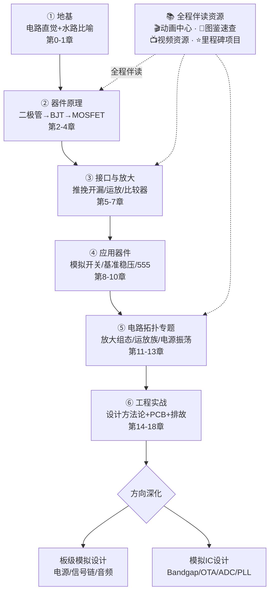

# 通往模拟电路之路 🛤️

> 一份由社区资源滋养的模拟电路（Analog Circuits）系统学习指南
> 仿《通往 AGI 之路》知识体系风格 —— 从欧姆定律到芯片内部结构
> 特色：**原理推导 + 器件内部剖析 + 故障分析 + 动画演示**
> 最后更新：2026-10

---

<p align="center">
  
</p>

<p align="center">
  <a href="LICENSE"></a>
  
  
  
  <a href="https://zhuguang-ZFG.github.io/analog-circuit-roadmap/"></a>
</p>

<p align="center">
🧭 <a href="#roadmap">路线图</a> · 📑 <a href="#toc">目录</a> · 🔬 <a href="#part1">器件原理</a> · ⚡ <a href="#part2">电路拓扑</a> · 🛠️ <a href="#part3">设计与PCB</a> · 🩺 <a href="#part4">排故方法</a> · 🎬 <a href="#part5">动画中心</a> · 🧩 <a href="#part6">图鉴速查</a> · 📺 <a href="#part7">视频</a> · 📚 <a href="#part8">路线索引</a> · 🧪 <a href="docs/p9-00-quiz.md">自测题库</a>
</p>

<a id="news"></a>
## 📰 更新速递

> 每次回来先看这一屏；完整历史见 [🗓️ 更新日志](docs/p9-12-changelog.md)。

| 日期 | 更新 | 直达 |
|---|---|---|
| 2026-10 | **v3.27 站点 SEO 与首屏性能补齐**：59 页从「共用一句摘要」改为**每页独立 meta description**（自动摘要器跳过代码围栏 / 压不动的公式 / 版权行，`og:`/`twitter:` 同步）；第五篇 102 张动画图（约 1.9MB）改**懒加载 + 按画布比例预留高度**，消除整页滚动抖动；新增 2 项站点回归测试 | [v3.27](docs/p9-12-changelog.md) |
| 2026-10 | **v3.26 明色模式可读性补齐**：修掉 `#94a3b8`/`#0ea5e9`/`#f59e0b` 三个弱化色当文字用太淡（19 张图）；新增「文字被后绘形状盖住」审计项，抓出 mosfet-curves 轴标题被面板整块盖住；全库最小字号提到 9px；对比度回归测试扩展为明暗两套主题 | [v3.26](docs/p9-12-changelog.md) |
| 2026-10 | **v3.25 暗色模式可读性硬化 + 回归测试上线**：修掉运放三角/锁存器等非 rect 器件体在暗色下仍为浅色的盲区，补齐 6 个未映射浅底色；**暗色对比度 < 3.0 的图 11 → 0 张**；新增版面几何 + 暗色可读性两个永久回归测试并入 CI | [v3.25](docs/p9-12-changelog.md) |
| 2026-10 | **v3.24 动画全面美化 + 版面全量审计修复**：102 张动画升级为「渐变底 + 点阵网格 + 暗角 + 卡片投影 + 字幕药丸 + 粒子辉光」；并批量修掉标题重影、字幕压字、注释框文案溢出、内容出界被裁等 30+ 处版面硬伤 | [v3.24](docs/p9-12-changelog.md) |
| 2026-10 | **v3.23 知识深度加厚**：加厚 §11.5 相位裕度/极点分裂、§11.6 噪声预算、§13.6 量化噪声与 ENOB、§12.5 Sallen-Key 理论；新增 **§12.12 开关电容电路**；自测题库 **25 道专题加练** | [v3.23](docs/p9-12-changelog.md) |
| 2026-10 | 新增 **§12.12 开关电容电路**：$R_{eq}=1/(f_{clk}C)$，精度来自时钟与电容比值 | [12.12](#ch12) |
| 2026-10 | 加厚 **§11.6 噪声预算**（$e_n$/$i_n$、噪声带宽、Friis、一路算到 SNR/ENOB）与 **§11.5 极点分裂** | [11.5](#ch11) · [11.6](#ch11) |
| 2026-10 | **v3.22 内容补强续**：第 1 章补 **§1.6 LC 谐振四拍**（19 章器件章动态分析全覆盖）；第 16 章补 **§16.4 排故记录模板 + 复盘**；第 18 章补 **§18.4 设计评审清单**（17 章故障倒推成四道评审关口）；§6.3 新增 8 颗 datasheet；自测题库 **18 道专题加练** | [v3.22](docs/p9-12-changelog.md) |
| 2026-10 | 新增 **§1.6 动态分析：LC 谐振四拍**——低频电容拦 / 谐振两清账 / 高频电感拦，谐振时电压放大 $Q$ 倍 | [1.6](#ch1) |
| 2026-10 | 新增 **§16.4 排故记录模板 + 复盘** 与 **§18.4 设计评审清单**——把一次故障沉淀成团队免疫 | [16.4](#ch16) · [18.4](#ch18) |
| 2026-10 | **v3.21 内容补强**：第 17 章升级为「故障速查总表」四列大表 + 分诊决策树动画（第 102 张）；补齐 5 个缺失主题小节；自测题库加 **15 道专题加练** | [v3.21](docs/p9-12-changelog.md) |
| 2026-10 | 新增 **§12.10 跨阻放大器 TIA**：$V_{out}=-I_{ph}R_f$、补偿电容公式、四个必踩的坑 | [12.10](#ch12) |
| 2026-10 | 新增 **§13.8 电流检测**（低侧/高侧、开尔文连接）与 **§13.9 音频功放与 THD**（A/B/AB/D 效率账、交越失真） | [13.8](#ch13) · [13.9](#ch13) |
| 2026-10 | 新增 **§14.5 热设计**（$T_J=T_A+P\sum\theta$ 倒推散热器）与 **§14.6 LTspice 实操方法论**（五种分析 + 五个常见坑） | [14.5](#ch14) · [14.6](#ch14) |
| 2026-10 | **v3.20 站点化 + 工程化**：正文拆为 `docs/` 单一数据源，README 由脚本生成；上线在线知识站（侧栏目录 · 全文搜索 · 动画画廊） | [v3.20](docs/p9-12-changelog.md) |
| 2026-10 | 新增 **第九篇 自测与练习**：19 章 × 3 题，答案折叠，先算再对 | [🧪 自测题库](docs/p9-00-quiz.md) |
| 2026-10 | 新增 **§2.8 接口保护三件套**：TVS + 限流电阻 + 钳位二极管，含 ESD 8kV 算一笔 | [2.8](#ch2) |
| 2026-10 | 新增 **§12.9 稳定性实战**：容性负载/长电缆为什么会振，隔离电阻与噪声增益两招 | [12.9](#ch12) |
| 2026-10 | 新增 **§15.6 EMC/EMI**：三要素、十条硬规矩、三个真实整改现场 | [15.6](#ch15) |

**三个新入口**：🌐 [在线知识站](https://zhuguang-ZFG.github.io/analog-circuit-roadmap/)（可搜索、可深浅色切换）· 🎬 [动画画廊](docs/p5-00-part5.md)（102 张按章筛选）· 🧪 [自测题库](docs/p9-00-quiz.md)（19 章 × 3 题 + 25 道专题加练）

<a id="preface"></a>
## 📖 前言

数字电路统治了世界，但世界本身是模拟的。传感器电压、麦克风声波、天线射频、电池电量全是模拟量；每颗数字芯片的供电、时钟、接口背后都站着模拟电路。模拟设计无法被综合工具替代，至今仍是一门"手艺活"。

本指南与其他教程的区别：**不只告诉你"是什么"，更讲透"为什么"**——每个器件从物理原理讲起，剖析经典芯片的内部电路，给出真实故障案例，配套动画演示。


## 🚪 如何使用本指南

| 你是谁 | 推荐路线 |
|---|---|
| **零基础小白** | [前言](#preface) → [第 1 章](#ch1) 建立直觉 → 每章**先看动画再做题** → [里程碑项目 1-2](#part8) 动手焊起来 |
| **有数电/单片机基础** | 直奔 [第 5 章 推挽开漏](#ch5)（痛点高发区）→ [第 12 章 运放电路族](#ch12) → [第 15 章 PCB](#ch15) |
| **工程师转模拟/复习** | [第 17 章 故障速查](#ch17) 当手册 → [第 11~13 章 拓扑](#part2) 补原理 → [8.8 官方资料](#sec88) 深入 |
| **时间紧只要精华** | 下方 ⭐ 必读精选——6 个锚点吃透一半模拟电路 |

## ⏱️ 读多久：三条时间线

> waytoagi 式读法：**先按时间预算挑一条，别对着全站目录焦虑。**

| 你有多少时间 | 读什么 | 读完能做什么 |
|---|---|---|
| **5 分钟** | [0.1 水路比喻](#ch0) + [0.3 分压器](#ch0) + [⭐ 必读精选](#picks) 里的「虚短虚断」 | 看懂最常见的三种电路图，会算分压与带载误差 |
| **1 小时** | 第 0 章全部 + 第 1 章 + 第 5 章 + 看 5 张动画（[demo1](#demo1)/[demo4](#demo4)/[demo5](#demo5)/[demo22](#demo22)/[demo36](#demo36)） | 建立「电压/电流/回路」三件套直觉，能读懂 datasheet 前两页 |
| **一周末** | 第 0~5 章 + 第 6 章参数 + 第 12 章运放族 + 焊一个里程碑项目 | 独立设计并调试一块含运放的小板子 |

**三种速度的读法**：5 分钟只扫标题与表格；1 小时顺着「先直流后交流」读；
一周末必须动手——每一章的 🔬 四拍拆解和 🧮 算一笔是给这个阶段准备的。

## 🎯 按需求找电路（情景导航）

> 别从头翻——先对号入座直达那一章；每个场景都有动画或仿真可以马上动手。

| 你想做的事 | 直达 | 为什么是它 |
|---|---|---|
| LED 亮度要稳，电池电压变了也不变 | [13.5 恒流源](#ch13) | R_E 负反馈把电流钉死，与负载脱钩 |
| 做一个可调稳压电源 | [第 9 章 基准与稳压](#ch9) + [13.1 分立串联稳压](#ch13) | 从齐纳到 LDO 一条进化线 |
| MCU 引脚推不动继电器/灯带 | [第 5 章 推挽与开漏](#ch5) | 驱动能力、上拉下拉、I2C 为什么用 4.7kΩ |
| 定时、闪灯、按键去抖 | [第 10 章 555 定时器](#ch10) | 单稳 t=1.1·RC、无稳振荡全章拆解 |
| 把毫伏级信号放大几百倍 | [第 3 章 BJT](#ch3) → [11.1 三种组态](#ch11) → [第 6 章 运放](#ch6) | 单管不够上运放，差分对是心脏 |
| 采温度/应变桥的微伏级信号 | [14.4 PT100 全链复盘](#ch14) | 仪放→滤波→ADC 每一环怎么选、为什么 |
| 波形顶部被削/整体被抬高 | [2.7 限幅与钳位](#ch2) | 同一个 0.7V：一个当闸门，一个当垫脚石 |
| ADC 引脚怕过压/负压 | [2.7 轨到轨钳位](#ch2) + [第 8 章 模拟开关](#ch8) | 二极管钳位是保护的第一道墙 |
| 要"冻结"快速变化的信号 | [8.4 采样保持](#ch8) | droop 与电荷注入决定保持精度 |
| 电机要正反转 | [13.7 H 桥](#ch13) | 两对角线定方向，死区保命 |
| 电源噪声让 ADC 读数跳 | [15.2 接地](#ch15) + [15.1 布局](#ch15) | 回流在脚下 + 去耦电容贴脸放 |
| 板子偶发复位/莫名振荡 | [第 16 章 排故五步法](#ch16) → [第 17 章 速查总表](#ch17) | 症状对号入座，一次只改一个变量 |
| 高频信号过不去/边沿变肉 | [第 1 章 无源元件](#ch1) + [12.5 Sallen-Key](#ch12) | 寄生电感电容的真实代价 |
| 只想先看动画找感觉 | [第五篇 动画中心](#part5) | 101 张 SMIL 动画随便点开 |


<a id="picks"></a>
## ⭐ 必读精选（编辑之选）

1. 🪣 [RC 充电动画](assets/svg/rc-charge.svg) —— 用水桶与细水管，30 秒建立电容直觉
2. 🚗 [推挽 vs 开漏](#ch5) —— "两人抢开车 vs 大家都能踩刹车"，I2C 的终极答案
3. ⚡ [MOSFET Miller 平台](#ch4) —— 开关损耗是导通损耗 4 倍的现场还原
4. 📐 [虚短虚断两公理](#ch12) —— 三行推导打遍运放电路
5. 🏠 [去耦电容贴脸放](#ch15) —— "本地水库"与回流在脚下，PCB 两条军规
6. 🩺 [排故五步法](#ch16) —— 先问 5 个问题，对数切半，一次只改一个变量

---

<a id="roadmap"></a>
## 🗺️ 学习路线图



<a id="toc"></a>
## 📑 目录

<details open>
<summary><b>九篇十九章 · 点击收起</b></summary>

- **[第一篇：器件深度原理解析](#part1)** 🔬
  - [第 0 章 电路直觉学前班](#ch0) · [第 1 章 无源元件](#ch1) · [第 2 章 二极管](#ch2) · [第 3 章 BJT](#ch3) · [第 4 章 MOSFET](#ch4) · [第 5 章 推挽/开漏](#ch5)
  - [第 6 章 运算放大器](#ch6) · [第 7 章 比较器](#ch7) · [第 8 章 模拟开关](#ch8) · [第 9 章 基准与稳压](#ch9) · [第 10 章 555 定时器](#ch10)
- **[第二篇：经典电路拓扑原理](#part2)** ⚡
  - [第 11 章 放大电路拓扑](#ch11) · [第 12 章 运放应用电路族](#ch12) · [第 13 章 电源与信号产生](#ch13)
- **[第三篇：设计要点与 PCB 实战](#part3)** 🛠️
  - [第 14 章 设计方法论](#ch14) · [第 15 章 PCB 注意事项](#ch15)
- **[第四篇：故障分析与排故方法论](#part4)** 🩺
  - [第 16 章 排故五步法](#ch16) · [第 17 章 故障速查表](#ch17) · [第 18 章 大师智慧](#ch18)
- **[第五篇：动画演示中心](#part5)** 🎬 — 102 张 SVG 动画 + Falstad 地图
- **[第六篇：实物图鉴与速查](#part6)** 🧩 — 实物照片 · 参数速查 · 元件标识速查 · [官方 datasheet 直达](#part6)
- **[第七篇：视频资源](#part7)** 📺 — B站系统课 · YouTube 频道
- **[第八篇：学习路线与资源索引](#part8)** 📚 — 路线图 · 书单 · 项目清单 · [官方资料](#sec88) · [经典论文](#sec89) · [术语表](#sec810) · [顺口溜总表](#sec811) · FAQ
- **[第九篇：自测与练习](docs/p9-00-quiz.md)** 🎯 — 19 章 × 3 题 + 25 道专题加练，答案折叠自测

</details>

---

<a id="part1"></a>
# 第一篇：器件深度原理解析 🔬

> 每个器件按统一结构讲解：**物理原理 → 数学模型 → 内部电路 → 关键参数 → 典型应用 → 故障模式 → 动态分析（四拍拆解）→ 配套视频**

---

<a id="ch0"></a>
## 第 0 章 电路直觉学前班：先上车，再赶路 🍼

> 这一章没有公式推导、没有复杂术语——只有一套"水路"比喻和三个思维习惯。**后面的每一章都建立在这套直觉上。**学完你能做到：看到一个陌生电路，先说出"水从哪来、往哪去、路上被谁拦住"。

### 0.1 水路比喻总纲（全书通用语言）

| 电 | 水 | 一句话直觉 |
|---|---|---|
| **电压 V** | 水压 | 推动电流的"势"，永远相对两点而言 |
| **电流 I** | 水流 | 电荷的流量，**必须成环**——没有"只进不出"的电流 |
| **电阻 R** | 细水管 | 越细（R 越大）同样的水压流出的水越少 |
| **电容 C** | 蓄水池 | 攒水位（电压）的池子，水位不能突变 |
| **电感 L** | 水车/涡轮的惯性 | 水流转速不能突变，断电时"惯性"顶着继续冲 |
| **二极管** | 单向阀 | 只许水往一个方向流 |
| **MOSFET** | 闸门 | 栅极电压是闸门管理员：一声令下开闸放水 |
| **地 GND** | 海平面 | 所有水位（电压）的测量基准，不是"下水道" |

> 💎 **精髓**：这套比喻不是科普点缀——工程师分析电路时的内心戏就是它。第 1 章的 ESR（池子漏）、第 4 章的开关损耗（闸门开一半时最费劲）、第 13 章的 Buck（水车惯性碾平断续水流），全都用得上。

<p align="center"></p>

🔗 [动画演示 5.87](#demo87)

**看图**：环形水路一圈走完八个词——水泵推水位（电压）、细管卡流量（电阻）、水池攒水位（电容）、水车扛惯性（电感）、单向阀防倒流（二极管）、闸门听栅压指挥（MOSFET）、海平面当 0V 基准（地）；蓝色粒子就是必须成环的电流。→ 本节 [0.1](#ch0)


### 0.2 欧姆定律与"电压降"世界观

$$V = I \times R$$

三个量，知二求一。但真正值钱的理解方式是反着读：**电流流过电阻，会在电阻上"留下"一份电压（电压降）**。一条串联路径上，各电阻按阻值大小瓜分总电压——阻大的分得多。

🧮 **算一笔**：5V 加在串联的 1kΩ+4kΩ（总 5kΩ）上 → I = 5V/5kΩ = **1mA**。同一股电流流过两电阻：4kΩ 降掉 4V，1kΩ 降掉 1V——加起来恰好 5V，不多不少。**谁 R 大，谁分的电压多**——这是分压器的全部秘密。

<p align="center"></p>

🔗 [动画演示 5.89](#demo89)

**看图**：左边电路、右边「电压剖面」——同一股 1mA 电流依次流过 4kΩ 与 1kΩ，各自「留下」4V 与 1V，加起来恰好 5V；剖面图上每一段竖降就是跨过一个电阻的电压降，横走段是理想导线（不降压）。→ 本节 [0.2](#ch0)


### 0.3 分压器：模拟电路出场率第一名

```
V ──[R1]──┬── Vout = V × R2/(R1+R2)
          │
         [R2]
          │
         GND
```

偏置 BJT（第 3 章）、设定比较器阈值（第 7 章）、采样输出电压给 LDO 反馈（第 9 章）——全是它。

⚠️ **血坑预警**：分压公式只在**空载**时成立！从 Vout 抽电流 = 给 R2 并联了一个电阻 → Vout 塌陷。
🧮 **算一笔**：R1=R2=10k 分 10V，空载 5V；接上 10k 负载后 R2 等效变 5k → Vout=10×5/(10+5)=**3.3V**（塌了 33%！）。口诀：**分压器带载能力 ≈ 它自己的内阻**（R1∥R2）。

<p align="center"></p>

🔗 [动画演示 5.39](#demo39)

上图把 12V÷2 的"稳稳 6V"和挂上 RL 后的"塌到 4V"并排画在一起：**电压指针矮了三分之一**，
白算的 50% 只在空载时成立。三条活路：后级输入阻抗 ≫ R2、R1/R2 取小（代价是功耗）、
**后面跟一级运放缓冲**（[12.1](#ch12) 虚短虚断）——教科书答案。

### 0.4 地：参考点，不是下水道

"接地"是选一个地方宣布"从这里量起，它是 0V"。电流回流到电源负极是因为**回路**，不是因为地被"吸走"了。理解这一点，第 15 章的"回流路径"军规一读就懂。

### 0.5 三个思维习惯（带走用一辈子）

1. **量电压，先问"相对谁"**——电压永远是两点之差，悬空说"这点 5V"没有意义
2. **看电路，先追"电流回路"**——从电源正极出发，跟着电流走一圈回家，沿途谁分压、谁储能、谁开关，电路就懂了
3. **先直流，后交流**——先把电容当开路、电感当短路的"静态"算明白（这就是第 3 章"工作点"），再谈信号（交流）。顺序反了必乱

### 0.6 恒压源与恒流源：电源的两种性格

<p align="center"></p>

🔗 [动画演示 5.78](#demo78)

看 **V-I 曲线**的形状，一眼分清两种源：

| | 理想曲线 | 性格 | 灾难 | 常态 |
|---|---|---|---|---|
| **恒压源** | **竖线**（I 怎么变，V 不动） | 内阻趋近 0 | 短路 | 开路 |
| **恒流源** | **水平线**（V 怎么变，I 不动） | 输出阻抗趋近 ∞ | 开路 | 短路 |

🧮 **算一笔**（内阻怎么毁掉「恒压」）：实际电源的 V-I 是一条**斜线**，斜率就是输出阻抗。
- 实验室电源 $Z_{out}\approx1m\Omega$：$\Delta V = 5A\times1m\Omega = 5mV$（0.1%）→ 可以当恒压源
- 劣质适配器 $Z_{out}\approx100m\Omega$：$\Delta V = 2A\times100m\Omega = 200mV$（4%）→ 负载一重电压就塌
- 反过来说：**恒流源要的正是「大输出阻抗」**——$R_o=10M\Omega$ 时，负载电压从 0 变到 10V，电流只掉 0.1%

**两个必须记住的推论**：
1. **唯一「天生的」源是恒压源**（电池、电源适配器都是）——恒流源全是拿恒压源 + 负反馈**做出来**的
   （射极负反馈、电流镜、运放+采样电阻、Howland 电流泵，见 [13.5 恒流源家族](#ch13)）
2. **负载怎么接，取决于源的性子**：
   - 恒压源 → 负载**并联**在它两端（各自独立取电流；如多路 LED **各自**串一个限流电阻）
   - 恒流源 → 负载**串联**在同一回路里（同一个电流穿过所有负载；如多颗 LED **串联**做恒流驱动）

> 💡 回头看一眼 [0.3 分压器](#ch0)：它「带载就塌」的根因，正是**分压器的输出阻抗**（$R_1\parallel R_2$）太大——
> 用这一节的眼光看，它是「一个不合格的恒压源」。

> 🎯 **通关打卡**：你现在有了一套通用语言（水路八词）、一个第一电路（分压器带载塌陷的账）、三个思维习惯、

> 📺 **配套视频**：[模拟电子技术（4K 降噪）· 上海交大 郑益慧](https://www.bilibili.com/video/BV1qA5DzWEVh/)（B站）——把物理图像讲透，第 0 章的「直觉」部分配它最顺——先建立感觉，再上公式。见 [7.1 视频资源汇总](#part7)。
> 以及**电源的两种性格**。**从这里开始，每一章都在给这套直觉添砖加瓦。**

<a id="ch1"></a>
## 第 1 章 无源元件的真实面目

> 📚 **先修**：[第 0 章水路比喻](#ch0)——本章告诉你"水池也会漏、水管也有惯性"（寄生参数）。

理想元件不存在。理解寄生参数是区分"教科书学习者"和"工程师"的第一道门槛。

### 1.1 真实电阻的等效模型

```
        引线电感 L (~5nH/cm)
理想 R ──/\/\/──mmmm──┬──
      (标称阻值)      │
                    ┌─┴─┐
                    │ C │ 并联寄生电容 (~0.2pF)
                    └─┬─┘
──────────────────────┴──
```

- **碳膜/金属膜电阻**：精度 1%/5%，温度系数 50~200ppm/°C
- **绕线电阻**：功率大但电感大，**绝不能用于高频**
- **贴片 0603/0805**：寄生最小，高频首选
- 失效模式：过功率烧毁（开路）、潮湿导致阻值漂移

**为什么几 nH 的引线电感能在高频"夺权"？** 感抗 $X_L=2\pi fL$ 随频率线性增长，而电阻值不变——频率足够高时，电感分走的电压会超过电阻本身。

<p align="center"></p>

🔗 [动画演示 5.60](#demo60)

上图把「理想 1kΩ」（灰虚线）与「真实电阻」（蓝线）叠在一起：**远低于拐点（≈0.8GHz）时两条线几乎重合**，
过了拐点体电容 0.2pF 开始分流、阻抗按约 −20dB/dec 下坠——到 1GHz 只剩 **575Ω**；继续往上在 **3.6GHz**
（L 与 C 谐振）探到谷底 **≈49Ω**，之后引线电感接管、阻抗重新爬升——元件又「变回电感」。
**每个元件都有两个寄生夺权点：C 在 $f_1=1/(2\pi RC)$ 开始、L 在 $f_2=R/(2\pi L)$ 结束——中间才是它「当电阻」的区间。**

🧮 **算一笔**：1kΩ 电阻带 10nH 引线电感，在 100MHz 下 $X_L=2\pi\times10^8\times10^{-8}\approx 6.3\Omega$（尚可忽略）；到 3GHz，$X_L\approx 190\Omega$——"1kΩ 电阻"已经变成"1kΩ 串 190Ω 感抗"，射频电路里这是两颗元件。所以高频电路用贴片（引线≈0），并且元件值本身也要按频率特性曲线复核。

### 1.2 真实电容：ESR 与 ESL

<p>


</p>

> 📷 贴片元件有多小：0805 = 2.0×1.25mm（左图与毫米尺对比）。手焊 0805（右图）是模拟工程师的成年礼——烙铁尖+镊子+放大镜，一个周末就能练出来。


电容的完整模型是 **C 串联 ESR（等效串联电阻）再串联 ESL（等效串联电感）**：

- **电解电容**：容量大（µF~mF），ESR 大（0.1~10Ω），寿命随温度指数下降（每升 10°C 寿命减半），反接会爆炸


> 📷 反接或过压的电解电容——顶部防爆阀（刻痕）应声炸开，电解液喷溅。这就是为什么 1.2 节说"反接会爆炸"不是修辞：防爆阀是拿封装完整性换人身安全。换电容时先看耐压余量（≥1.5× 工作电压），再看极性。
- **陶瓷电容**：MLCC，ESR 极小（mΩ 级），但 X7R/X5R 有直流偏压效应（标称 10µF 在 5V 偏压下可能只剩 4µF！）
- **薄膜/C0G(NP0)**：性能最好，容量小

**工程铁律**：芯片电源引脚就近放 100nF 陶瓷电容（去耦），距离越近越好——因为长走线的电感会让高频噪声无处泄放。

<p align="center"></p>

🔗 [动画演示 5.43](#demo43)

上图把两种电容的 $|Z|$ 画在同一条对数频率轴上：**100nF MLCC 谷底 0.3Ω @ 22.5MHz，10µF 电解谷底 1Ω @ 356kHz**——
到 100MHz 时电解已经涨回 **13Ω**，而 MLCC 还只有 0.42Ω。**去耦选电容 = 选谷底低、谷底宽的那条**，
所以低频储能交给电解、高频去耦必须用小封装 MLCC，两者不能互相替代。

**为什么去耦电容必须"贴脸放"？** 完整推理链：芯片瞬时拉电流 → 电流路径上有电感（走线每厘米 ≈5nH）→ $v=L\cdot di/dt$ 在路径上产生压降 → 芯片看到的电源电压塌陷/反弹。去耦电容的作用是**就近**提供这份瞬时电流，把电流环路的物理尺寸缩到毫米级——环路越小，$L$ 越小，压降越小。电容放 5cm 外，走线电感就把它的好意全废了。从阻抗-频率曲线看：低频段电容扛（容抗 $1/2\pi fC$ 下降）、ESR 在中频段兜底（阻抗曲线谷底）、ESL 在高频段接管（感抗上升）——**选去耦电容，本质是选谷底够低、谷底够宽的那条曲线**。

### 1.3 真实电感与变压器

- 寄生参数：绕线电阻 DCR、匝间电容 → 存在自谐振频率 SRF，超过 SRF 后电感变成电容！
- 磁芯饱和：电流过大时磁导率骤降，电感量塌缩 → 电源电感选型必须看饱和电流

**自谐振频率（SRF）是怎么回事？** 电感的绕组一圈挨一圈，匝与匝之间隔着绝缘漆——这就是无数个并联小电容。电感与自己的匝间电容构成 LC 谐振回路：低于 SRF 时感性主导（是个电感），**高于 SRF 时容性主导（变成电容）**。所以射频电感的 datasheet 必标 SRF，工作频率必须留 3 倍以上余量。

**变压器的正职：换电压**——两个绕组共用一个磁芯，初级电流建立磁通 Φ，磁通穿过次级感应出电压：$V_2/V_1 = N_2/N_1$（变比）。电流反着来：$I_2/I_1 = N_1/N_2$——升压的地方电流自动减半，**$V_1 I_1 \approx V_2 I_2$，能量原样过**。初次级之间没有导线相连，只有磁通耦合——这就是「隔离」的物理根源（电源隔离、信号隔离都靠它）。
<p align="center"></p>

**看点**：变比 1:2 升压——紫色磁通粒子沿磁芯流动把能量搬过去，红/绿电流粒子同步进出；电压翻倍处电流减半，功率原样过。→ 第五篇 [动画 5.101](#demo101)

**反电动势的直觉**：电感是"电流的惯性"——它不许电流突变。继电器线圈断电瞬间，驱动电流被迫从工作值跳向 0，$di/dt$ 极大，电感就"发飙"：$v=-L\frac{di}{dt}$ 感应出数百伏尖峰，极性与原供电相反，专烧驱动管。续流二极管的作用是给这股"惯性电流"一条温柔的出路——断电后电流经二极管绕圈慢慢衰减（时间常数 $L/R$），尖峰被钳在 0.7V。**这不是保护技巧的点缀，是电感物理的必然推论**——第 13 章 Buck/Boost 的全部工作原理，就是把这只"发飙的电感"驯化成能量搬运工。
- 继电器/电机断电时的**反电动势** $v = -L\frac{di}{dt}$ 可产生数百伏尖峰 → 必须并联续流二极管

<p align="center"></p>

🔗 [动画演示 5.36](#demo36)

**看点**：蓝色 Zc 一路降价、红色 Zl 一路涨价，5kHz 处狭路相逢（LC 谐振）——同一只元件在不同频段是完全不同的"人"。→ 本节 [1.1-1.3](#ch1)


### 1.4 戴维南与诺顿：把任何网络压成两个元件

<p align="center"></p>

🔗 [动画演示 5.79](#demo79)

**任何线性网络**，从任意两个端子看进去，都等价于：

| 等效形式 | 长相 | 两个参数 |
|---|---|---|
| **戴维南（Thévenin）** | 电压源 **串** 一个电阻 | $V_{th}$（开路电压）、$R_{th}$ |
| **诺顿（Norton）** | 电流源 **并** 一个电阻 | $I_N$（短路电流）、$R_N$ |

**求法（两步）**：① $V_{th}$ = 负载拿掉后输出端的开路电压；② $I_N$ = 输出端短路后的电流；
③ $R_{th}=R_N=V_{th}/I_N$（也可把独立源置零后求等效电阻：电压源短路、电流源开路）。

🧮 **算一笔**（12V 经 R1=R2=10k 分压）：
- 开路电压 $V_{th}=12V\times\dfrac{10k}{10k+10k}=\mathbf{6V}$
- 短路电流 $I_N=12V/10k=\mathbf{1.2mA}$（此时 R2 被短路）
- 内阻 $R_{th}=6V/1.2mA=\mathbf{5k\Omega}$（= R1∥R2 ✓ 两条路算得一致）

**等效之后，带载误差一眼看出**：$V_{out}=V_{th}\cdot\dfrac{R_L}{R_{th}+R_L}$——
$R_L=R_{th}$ 时**只剩一半**（3V）；$R_L=1M\Omega$ 时才 5.97V（差 0.5%）。
**「带不带得动」永远只需比 $R_{th}$ 与 $R_L$ 两个数**——这就是 [0.3 分压器](#ch0)「带载就塌」
与 [0.6 恒压源](#ch0)「内阻决定性格」的共同答案。

### 1.5 品质因数 Q 与选频网络：从「谐振」到「挑频率」

**谐振回顾**：[1.3](#ch1) 说过电感的 SRF 是它与自己的匝间电容谐振；更一般地，任何 LC 组合都有一个"唱得最响"的频率 $f_0=\dfrac{1}{2\pi\sqrt{LC}}$——这就是选频的起点。

- **串联谐振**（L 与 C 串联）：$f_0$ 处 $X_L=X_C$ 互相抵消，总阻抗 = R（最小）→ **带通**：$f_0$ 附近电流最大
- **并联谐振**（L 与 C 并联）：$f_0$ 处阻抗趋向无穷（理想）→ **带阻**：$f_0$ 附近被"挡住"
- **品质因数** $Q = \dfrac{f_0}{BW}$（BW = 半功率带宽）——**Q 高 = 峰又尖又窄 = 选频锐利；Q 低 = 峰钝 = 宽容**
  - 串联 RLC：$Q = \dfrac{1}{R}\sqrt{\dfrac{L}{C}}$——R 越小 Q 越高；物理意义是**一个周期内储能与耗能之比**
- **选频网络 = 会挑频率的"门卫"**：收音机用 LC 谐振选台（调电容改 $f_0$），中频滤波器用晶体谐振器（Q 上万），电源滤波用 LC（低 Q 宽带宽）
- 实战提示：**Q 高 ≠ 更好**——选台要高 Q（锐利），电源滤波要低 Q（防振铃过冲）

> 💎 **精髓**：Q 是"谐振的持久度"——Q=10 的回路像敲一下响很久的钟（带宽窄、选频锐），Q≈0.7 像沙袋（带宽宽、不振荡）。**先想清楚要"挑得多尖"，再定 Q。**（谐振峰见 [1.3](#ch1) impedance-freq 动画的 5kHz 相逢处）

### 1.6 动态分析：LC 谐振的一个周期（四拍拆解）🔬

> 电路：串联回路 $R=1\Omega$、$L=1mH$、$C=10\mu F$，谐振频率 $f_0=\dfrac{1}{2\pi\sqrt{LC}}\approx1592Hz$。把频率从低到高扫一遍，看每一拍**谁说了算、电流怎么变**。

**拍 ① 低频区（$f\ll f_0$）**：容抗 $X_C=\dfrac{1}{2\pi fC}$ 巨大、感抗 $X_L=2\pi fL$ 微小 → **电容说了算**，回路呈容性，电流超前电压。低频信号被电容"拦住过不去"。

**拍 ② 逼近谐振（$f\to f_0$）**：$X_C$ 一路降、$X_L$ 一路升，两者越靠越近。阻抗 $|Z|=\sqrt{R^2+(X_L-X_C)^2}$ 里的 $(X_L-X_C)$ 迅速缩小 → **总阻抗从几千欧一路跌向 $R$**，电流同步上涨。

**拍 ③ 谐振点（$f=f_0$）**：$X_L=X_C$ **完全抵消** → 阻抗只剩 $R=1\Omega$（最小）→ 电流冲到峰值 $I=\dfrac{V}{R}$。此时元件两端电压被"放大"了 $Q$ 倍（见算一笔）——**能量在电感（磁场）与电容（电场）之间来回倒，电源只负责补 $R$ 上耗掉的那一点点。**

**拍 ④ 高频区（$f\gg f_0$）**：$X_L$ 变得巨大 → **电感说了算**，回路呈感性，电流滞后电压。高频信号被电感"拦住过不去"。

**一句话记住四拍**：低频电容拦、谐振两清账、高频电感拦——**中间那条"放行"的窄缝就是选频**。

🧮 **算一笔**（$R=1\Omega$、$L=1mH$、$C=10\mu F$、$V_{in}=1V$）：
- 谐振频率 $f_0=\dfrac{1}{2\pi\sqrt{1mH\times10\mu F}}=\dfrac{1}{2\pi\times10^{-4}}\approx\mathbf{1592Hz}$
- 谐振时 $X_L=X_C=\sqrt{\dfrac{L}{C}}=\sqrt{\dfrac{1mH}{10\mu F}}=\mathbf{10\Omega}$，阻抗只剩 $R=1\Omega$ → 电流峰 $I=\dfrac{1V}{1\Omega}=\mathbf{1A}$
- **电压放大 $Q$ 倍**：$V_L=V_C=I\cdot X_L=1A\times10\Omega=\mathbf{10V}$——**电源只有 1V，元件上却有 10V！** 谐振时 $V_L=V_C=Q\cdot V_{in}$，这就是品质因数 $Q=\dfrac{X_L}{R}=10$ 的物理含义（见 [1.5](#ch1)）
- **带宽** $BW=\dfrac{f_0}{Q}=\dfrac{1592}{10}\approx\mathbf{159Hz}$ → 只有约 1500~1670Hz 这段能过（选频锐利）

<p align="center"></p>

🔗 [动画演示 5.36](#demo36)

**看点**：把 [1.3](#ch1) 那张阻抗曲线当成时间轴重读一遍——蓝线 Zc 一路降价、红线 Zl 一路涨价，两线交叉处就是「拍 ③ 谐振点」：$X_L$ 与 $X_C$ 数值相等、方向相反，彼此抵消，电流冲到最大。**同一张图，频率扫过去就是四拍。**（动画里这对 L/C 在 5kHz 相逢，本节算例是 1.6kHz——道理一样：**交叉点即谐振点**。）→ 本节 [1.6 LC 谐振](#ch1)

> 💎 **精髓**：理想元件只活在课本里——真实世界里寄生参数随频率"逐渐上位"，元件的身份由工作频段决定；而**把元件放进网络，频率还决定"谁说了算"**：LC 谐振点前后电容与电感轮流夺权，中间那条窄缝就是选频。**高频设计的第一课，是学会不再"眼瞎"；选频设计的第一课，是先算清 $f_0$ 与 $Q$。**

> 🎯 **通关打卡**：你眼里不再有"理想元件"——每个电阻/电容/电感都带着寄生参数上场，选型先翻 datasheet 的频率特性曲线；任何线性网络能压成戴维南/诺顿两个数，带载误差一眼估；LC 谐振四拍能讲成故事——低频电容拦、谐振两清账、高频电感拦，还会算谐振电压放大 $Q$ 倍。

### 📺 配套视频

<p>
<a href="https://www.youtube.com/watch?v=BcJ6UdDx1vg"></a>
<a href="https://www.youtube.com/watch?v=1xicZF9glH0"></a>
</p>

> **EEVblog #859 / #1085**（Dave Jones）：去耦电容为什么用、怎么放、封装的影响——先用阻抗分析仪实测验证理论，再可视化给你看。与本章 1.2 节 + 第 15 章"贴脸放"军规绝配。

> 📺 想系统跟一门课：[模拟电子技术基础（56 讲全）· 清华 华成英](https://www.bilibili.com/video/BV19s411a7KL/)（B站）——无源元件与 RLC 谐振、Q 值在系统课里逐节推导，与 1.3~1.6 对应。更多见 [7.1 视频资源汇总](#part7)。

---

<a id="ch2"></a>
## 第 2 章 二极管：单向导电的物理本质

> 📚 **先修**：[第 0 章单向阀比喻](#ch0) + [第 1 章寄生参数](#ch1)。


> 📷 二极管实物：玻璃壳里那截 tiny 的 PN 结，阳极进阴极出——阴极一端有**色环**标记。接反了？轻则不工作，重则放烟花。


### 2.1 PN 结的形成

P 型半导体（空穴多）与 N 型半导体（电子多）接触时：
1. 交界处电子与空穴复合 → 形成**耗尽层**（无载流子）
2. 耗尽层建立**内建电场**（约 0.7V for Si），阻止进一步扩散
3. 正向加压抵消内建电场 → 导通；反向加压加宽耗尽层 → 截止

<p align="center"></p>

🔗 [动画演示 5.56](#demo56)

上图把三步画成一条线：**扩散想散开（载流子往里跑）→ 跑掉的地方留下不能动的离子（电荷墙）→
墙的电场把后来的往回推**。三步的平衡点就是内建电势。

**把三步展开讲**：
- **为什么会复合？** 浓度差驱动扩散——N 侧电子浓度高、P 侧空穴浓度高，交界处电子"掉"进空穴里两两湮灭。这与一滴墨水滴入清水会散开是同一个统计规律。
- **为什么扩散会自己停下来？** 电子跑掉后，N 侧留下带正电的施主离子、P 侧留下带负电的受主离子——它们不能移动，在交界处排成一堵"电荷墙"，电场方向恰好把后续电子往回推。扩散多一分，墙就厚一分、推力大一分——**最终推力恰好抵消扩散冲动，达成动态平衡**。这堵墙就是耗尽层，对应的电势差即内建电势（Si 约 0.7V）。
- **正向导通的本质**：外加正压把内建电势"垫高抵消"一部分，墙变薄、扩散重新启动——电流爆发式增长。所以二极管不是"过 0.7V 突然开"，而是**外加电压与内建电势的拔河**，指数曲线就是拔河的比分牌。

### 2.2 伏安特性与数学模型

$$I_D = I_S\left(e^{\frac{V_D}{nV_T}} - 1\right), \quad V_T = \frac{kT}{q} \approx 26\text{mV @ 300K}$$

- $I_S$：反向饱和电流（nA~µA 级）
- $n$：理想因子（1~2）
- **温度敏感性**：$V_D$ 约 **-2mV/°C**——这就是 PN 结能当温度传感器的原因，也是热失控的根源

<p align="center"></p>

🔗 [动画演示 5.46](#demo46)

上图把 25℃ 与 60℃ 两条曲线画在一起：**每上升 60mV 电流爬一个十倍**，而温度每升 35℃ 就让整条曲线
**左移 70mV**——同一个 1mA，25℃ 要 0.36V，60℃ 只要 0.29V。这就是「二极管不能当精密基准」的根因：
它的值只听温度的，温度一漂，电压就跟着跑。：① $V_T=26mV$ 是"热电压"——电压每增加约 60mV，电流翻 10 倍（十倍频/60mV 是模拟工程师的常用速算）；② $-2mV/°C$ 意味着**同样电流下，温度升 35°C，$V_D$ 就掉 70mV**——用 PN 结测温（几乎所有数字温度传感器内部就是它），也正因如此，大功率二极管要防"温度升→电流增→更热"的正反馈。

**工程近似模型**（三种精度，按场景选用）：
1. 理想开关：导通 0V 压降
2. 恒压降：Si 管 0.7V、肖特基 0.3V、LED 1.8~3.4V
3. 恒压降 + 体电阻：大电流场合用

### 2.3 整流原理

<p align="center"></p>

🔗 [动画演示 5.2](#demo2)


**半波整流**：只用半个周期，输出脉动大，效率低
**桥式全波整流**（4 只二极管）：
- 正半周：D1、D4 导通；负半周：D2、D3 导通
- 任意时刻电流都同向流过负载，但**损失两个管压降（~1.4V）**
- 加滤波电容后：电容在峰值充电、谷值放电 → 输出带纹波的直流

纹波估算：$\Delta V \approx \frac{I_{load}}{f_{ripple} \cdot C}$（全波整流后 $f_{ripple}=2f_{AC}=100$Hz）

🎬 **动画演示**：见第五篇 [整流滤波动画](#demo2)

### 2.4 特殊二极管家族

| 类型 | 原理要点 | 典型应用 |
|---|---|---|
| 稳压二极管 | 反向击穿区工作，动态电阻小 | 简易基准、过压钳位 |
| 肖特基 | 金属-半导体结，无少子存储，恢复快 | 高频整流、防反接 |
| LED | 直接带隙材料复合发光 | 指示/照明（必须限流！） |
| TVS | 大面积结，ns 级钳位 | ESD/浪涌防护 |
| 变容二极管 | 耗尽层宽度随反压变化→结电容可变 | VCO、调谐 |

<p align="center"></p>

🔗 [动画演示 5.61](#demo61)

上图把五族的**特征电压（横轴）与速度（纵轴）**摆成一张地图（肖特基/LED 标正向压降，稳压管/TVS/变容管标反向电压）：肖特基在左上（0.3V 且最快）、
LED 在下方（压降大、速度慢，但唯一会发光）、TVS 在右上（面积换速度，专门替接口挨打）。
**选型看两件事：要它「快」还是「省压降」——位置越靠前线越看速度。**

### 2.5 故障模式与排故 🔧

| 故障现象 | 可能原因 | 排查方法 |
|---|---|---|
| 整流输出电压低 | 某桥臂二极管开路 → 变成半波 | 万用表二极管档逐只测 |
| 输出纹波突然增大 | 滤波电容干涸（ESR 暴增） | 示波器看纹波、电容测温 |
| 二极管发烫 | 电流超额定或反向漏电大 | 测正向压降、红外测温 |
| 肖特基电路"莫名"耗电 | 肖特基反向漏流大（高温下更严重） | 对比规格书漏流曲线 |
| 继电器驱动管反复击穿 | 忘接续流二极管/续流管失效 | 示波器抓关断尖峰 |

### 2.6 动态分析：整流滤波电源的一个周期（四拍拆解）🔬

> 电路：变压器 → 桥式整流 → 4700µF 滤波电容 → 1A 负载。跟着时间走一遍，看每一拍**谁导通、电流走哪、电压怎么变**。

**初始态**（上电前）：电容完全放空，$v_C=0$；副边正弦刚刚爬升。

**扰动**（第一次过峰）：$|v_{AC}|$ 超过 $v_C+1.4V$（两只二极管压降），D1/D4 导通。

**中间态**（浪涌！）：空电容=瞬时短路，充电电流只受绕组电阻+二极管动态电阻限制——**首冲电流可达 10~50A**。这就是上电"啪"一声的来源，也是保险丝要选**慢断型**（T 型）的原因：它得扛过这几 ms 的合法浪涌。

**稳态**（峰值充电、谷值放电的无限循环）：
- **导通角只有 ~20%**：电容电压紧贴正弦峰顶，二极管只在 $|v_{AC}| > v_C+1.4V$ 的峰顶小窗口导通
- **峰值电流 = 负载电流 ×5~10**：整个周期负载消耗的电荷，全在 20% 窗口内补回——1A 负载，二极管峰值 ≈5~10A
- **放电段**：二极管全关，电容独自供负载，近似线性放电 $\Delta V = I_{load}\cdot\Delta t/C$

🧮 **算一笔**：1A 负载、4700µF、全波 100Hz：$\Delta V = \frac{1A \times 10ms}{4700µF} ≈ 2.1V$ 纹波；二极管峰值电流 ≈ $\frac{10ms}{2ms}\times 1A = 5A$。**所以选整流管看的是 $I_{FRM}$（重复峰值），不是标称平均电流**——1A 电源用 1N4007（1A 均值）其实余量很紧。
<p align="center"></p>

🔗 [动画演示 5.83](#demo83)

**看点**：四拍拆解从空电容到稳态纹波——初始态电容放空、浪涌充电 10~50A、稳态峰值充电 5~10A、谷值放电电容独供负载。→ 本节 [2.6](#ch2)


### 2.7 限幅与钳位：二极管的"整形"手艺

整流只是二极管的第一份工作。凭"过 0.7V 才导通"这一条，它还能干两种波形整形活：

**限幅（Clipper）：削掉超过门槛的部分**
```
输入 ──[R]──┬── 输出（被削顶）
           ┌┴┐
           │D│ 接偏置 V_ref（或双管接 ±电源轨）
           └┬┘
           GND / V_ref
```
输出电压想越过 $V_{ref}+0.7V$，二极管立刻导通把多余部分"泄"掉——波形顶部被削平在门槛上。**头号应用是保护**：MCU 的 ADC 引脚怕负压/过压，两只二极管一只接 VCC 一只接地（"轨到轨钳位"），输入超出 $-0.7V \sim V_{CC}+0.7V$ 就被旁路——[13.6](#ch13) ADC 前端几乎必配。注意电阻 R 是限流命根：泄放电流全经它，缺失时二极管和信号源对烧。

**钳位（Clamper）：把整个波形"抬"起来**
```
输入 ──[C]──┬── 输出（整体抬高 ≈V_峰值）
           ┌┴┐
           │D│（阳极地、阴极朝节点）
           └┬┘
           GND
```
负半周峰值处二极管导通，电容充电到约「峰值 − 0.7V」（管压降）；此后二极管常关，电容像一块"串联电池"把波形整体垫高：原本 ±5V 摆动的正弦，出来变成 ≈ −0.7~9.3V 摆动——**直流分量被恢复了**。老式电视机的"直流恢复器"、倍压整流（多级钳位级联，[13.3 电荷泵](#ch13) 的亲兄弟）都是它。

🧮 **算一笔**：±3V 正弦进钳位电路（二极管阳极地）。负峰值 −3V 时 D 导通，节点被钳在 $-0.7V$，C 充到 **≈2.3V**（3V 峰 − 0.7V 管压降，左正右负）；之后任意时刻 $v_{out}=v_{in}+2.3V$——输出在 $-0.7V \sim 5.3V$ 摆动，最低点被"钳"在二极管压降处，这也是"钳位"名字的由来。

<p align="center"></p>

🔗 [动画演示 5.31](#demo31)

**看点**：左限幅——绿输出想冲过 ±2.7V 虚线（基准 ±2V+0.7），红粒子经二极管闸门泄走，顶底削平；右钳位——负半周绿粒子给 C 充到峰值，此后 C 变"串联电池"把整条波形垫高到 −0.7~5.3V。→ 上文 [2.7 限幅与钳位](#ch2)

> 💎 **精髓**：限幅动"幅度"（削顶）、钳位动"直流"（垫高）——同一个 0.7V，一个当闸门一个当垫脚石。看到波形缺了顶或被抬了底，先想二极管。

<a id="sec28"></a>
### 2.8 接口保护三件套：TVS + 限流电阻 + 钳位二极管 🔧

每个伸到板外的引脚（USB、按键、传感器线、RS-485、电源入口）都是一条**挨打的通道**。人体一摸就是几千伏：ESD 人体模型（HBM）约 **100pF + 1.5kΩ**，2kV 放电的峰值电流就有 ~1.3A、前沿 <10ns——芯片内部的 ESD 二极管只扛得住"出厂后不再挨打"的量级，扛不住现场反复放电。

**三件套各司其职**：

| 角色 | 器件 | 干什么 | 选型要点 |
|---|---|---|---|
| 泄放大能量 | **TVS / ESD 阵列** | 把 kV 级脉冲钳到十几伏，能量走地 | 看 $V_{RWM}$（正常工作不导通，≥信号最高电平）、$V_{BR}$、$V_C$（钳位电压，必须 < 被保护引脚的绝对最大值）、$P_{PP}$ |
| 限流 | **串联电阻 / PTC** | 让钳位器件不必独自吃掉全部能量 | $R \ge (V_{surge}-V_C)/I_{max}$，同时不能破坏信号带宽（$R$ 与后级 $C_{in}$ 构成低通） |
| 兜底 | **钳位二极管到电源轨** | 把残余过冲引到轨上 | 优先用芯片内部 ESD 二极管 + 外部限流电阻；外加分立肖特基要防止往电源轨灌电流 |

> ⚠️ **钳位二极管往电源轨灌电流**是最隐蔽的坑：外部信号高于 $V_{CC}$ 时，电流经二极管灌进电源轨，若电源吸不进去（轻载/LDO 不能倒灌），$V_{CC}$ 被抬高 → 整板芯片过压，甚至 latch-up。**要么在轨上并一颗稳压/TVS 吸收，要么确认电源能吸收这部分电流。**

🧮 **算一笔**：5V 系统的 GPIO 经 1m 排线外接按键，ESD 枪打 8kV（IEC 61000-4-2，330Ω/150pF）。选 $V_{RWM}=5V$、$V_C=9.2V$ 的 TVS；前级串 **100Ω**（对 <1MHz 按键信号毫无影响）。最坏灌入电流 ≈ $(8000-9.2)/330 ≈ 24A$（枪内阻限流，实际前沿由 TVS 分流），TVS 需承受 $P_{PP}≈ V_C \times I_{pp}$，选 400W 以上、$V_C<V_{CC}+0.6$ 才能保证后级 GPIO 不被顶穿；100Ω 电阻把进入 GPIO 内部二极管的残流压到 10mA 级——这就是"限流电阻救芯片"的算术。

**四条布局军规**：① TVS 必须**贴着接口放**，先于任何滤波/串阻——它的地回到**机壳/PE 或接口地**，不要绕到数字地深处；② 防护地回路短而粗（>1mm），寄生电感会让钳位电压在 ns 级尖峰上翻倍（1nH 在 1A/ns 下就是 1V）；③ 高速口（USB3/HDMI）选 **<0.5pF** 的专用 ESD 阵列，普通 TVS 的 50~200pF 会把眼图闭死；④ 防护器件要放在**共模扼流圈/磁珠的外侧**（先泄放再滤波），顺序反了等于让浪涌先穿过滤波器。

**常见翻车**：TVS 离接口 8cm（寄生电感让它形同虚设）· 用稳压管当 TVS（响应 µs 级，ESD 是 ns 级）· TVS 地接到细长走线 · 只保护信号不保护电源入口 · 忘记 $V_{RWM}$ 选低了导致正常工作时 TVS 微导通、漏电毁精度。

> 💎 **精髓**：保护的本质是**给浪涌一条比芯片更轻松的路**——先泄放（TVS）、再限流（电阻）、最后钳位（二极管），三者缺一件，能量就会挑最脆弱的那条路走。


> 🎯 **通关打卡**：PN 结不再神秘——你能从载流子扩散讲到 0.7V 的由来，知道接反会怎样，也记住了续流二极管救过多少驱动管。；接口保护三件套（TVS + 限流 + 钳位）能在画板时一次选对

> 📺 **配套视频**：[模拟电子技术基础（56 讲全）· 清华 华成英](https://www.bilibili.com/video/BV19s411a7KL/)（B站）——二极管一节在系统课里讲得最完整（PN 结 → 整流 → 稳压），与本章逐条对应。见 [7.1 视频资源汇总](#part7)。

---

<a id="ch3"></a>
## 第 3 章 BJT 三极管：完整概念体系

> 📚 **先修**：[第 2 章 PN 结](#ch2)——BJT 就是两个 PN 结背靠背；[0.3 分压器](#ch0) 是偏置的基础。

### 3.1 结构与载流子输运原理

 

NPN 管 = 两块 N 型夹一块**极薄**的 P 型基区：

```
   集电极 C                    发射极 E
      │                          │
   ┌──┴──┐    基区 P(薄)      ┌──┴──┐
   │  N  ├───┬─────────────┬──┤ N+ │  ← 发射区重掺杂
   └──┬──┘   │    B        │  └──┬──┘
      └──PN结(集电结)────PN结(发射结)──┘
```

**放大原理（放大区的物理图像）**：
1. 发射结正偏 → 发射区向基区大量注入电子
2. 基区**极薄且轻掺杂** → 99% 电子来不及复合，直接扩散到集电结边缘
3. 集电结反偏 → 强电场把电子扫入集电极，形成 $I_C$
4. 只有 ~1% 电子与基区空穴复合，形成小电流 $I_B$
5. 结果：$I_C = \beta \cdot I_B$，小电流控制大电流

<p align="center"></p>

🔗 [动画演示 5.66](#demo66)

上图把五步物理图像画成一条流动路径：**发射结正偏注入电子 → 基区极薄（99% 来不及复合）→
集电结反偏的强电场把电子扫走 → 只有约 1% 在基区复合形成 $I_B$**。
所以 $\beta$ 的物理含义是「**漏网比例的倒数**」：$I_C=99\%I_E$、$I_B=1\%I_E$ → $\beta\approx99$。

> 💡 **核心理解**：BJT 是电流控制器件。$\beta$（即 $h_{FE}$）不是精密常数——同一型号离散 50~300，还随温度、$I_C$ 变化。**好的设计绝不依赖 β 的具体值。**

### 3.2 三个工作区（判断方法是看两个 PN 结的偏置）

| 工作区 | 发射结 | 集电结 | 特征 | 用途 |
|---|---|---|---|---|
| **截止** | 反偏/零偏 | 反偏 | $I_C≈0$，相当于断开开关 | 开关"关"态 |
| **放大** | 正偏 | 反偏 | $I_C=\beta I_B$，$V_{CE}$ 可变 | 模拟放大 |
| **饱和** | 正偏 | **正偏** | $V_{CE}≈0.2V$，相当于闭合开关 | 开关"开"态 |

**临界记忆值**：$V_{BE}≈0.7V$（导通）、$V_{CE(sat)}≈0.2V$（饱和压降）

<p align="center"></p>

🔗 [动画演示 5.40](#demo40)

🧮 **算一笔**（图中那只管子）：$V_{CC}=12V$、$R_C=2k$、$R_B=300k$、$β=100$ → $I_B=(12-0.7)/300k≈38µA$，
$I_C=βI_B≈3.8mA$，负载线 $I_C=(12-V_{CE})/2k$ 与 3.8mA 水平线交于 **$V_{CE}≈4.4V$**（图上紫色圆点 Q）。
**信号在负载线上来回扫**：往左扫进饱和区（$V_{CE}$ 掉到 0.2V，β 说了不算），往右扫进截止区（$I_C$ 只剩 nA）。
这就是"设计时必须先用负载线把放大区框死"的含义——框得太窄，一摆就削顶。

### 3.3 三种组态对比

| 组态 | 输入/输出 | 电压增益 | 电流增益 | 输入阻抗 | 输出阻抗 | 相位 | 典型用途 |
|---|---|---|---|---|---|---|---|
| 共射 CE | B进C出 | **高**（$-g_mR_C$） | 高（β） | 中 | 中 | **反相** | 主放大级 |
| 共集 CC（射随） | B进E出 | ≈1 | 高 | **高** | **低** | 同相 | 缓冲、阻抗变换 |
| 共基 CB | E进C出 | 高 | ≈1 | **极低** | 高 | 同相 | 高频、电流缓冲 |

> 📊 三种组态的**图形化对照**（增益/阻抗/相位/用途四行并排 + 级联心法）见 [11.1 节的组态图](#ch11)，
> 那里还讲了「射随器为什么叫跟随」的电流账。

<p align="center"></p>

🔗 [动画演示 5.64](#demo64)

### 3.4 偏置电路：为什么必须用分压偏置

<p align="center"></p>

🔗 [动画演示 5.3](#demo3)

> 💎 **精髓**：上图用**固定偏置**讲清放大的本质（结构最简、计算最透）。但请注意——固定偏置依赖 β 的准确值，而 β 离散 3 倍！它恰恰是本小节要"批判"的对象：看完它怎么工作，再看为什么工程上必须用分压偏置。


固定偏置（单电阻从 Vcc 到基极）：$I_B=(V_{CC}-0.7)/R_B$，$I_C=\beta I_B$ —— **β 离散导致工作点完全不可控**。

**分压偏置**（工程标准做法）：
1. R1、R2 分压固定基极电位 $V_B \approx V_{CC}\frac{R_2}{R_1+R_2}$（分压电流 ≫ $I_B$，基流扰动可忽略）
2. 发射极串电阻 $R_E$：$V_E = V_B - 0.7$，$I_E = V_E/R_E$ —— **与 β 无关！**
3. 负反馈稳定机制：温度↑→$I_C$↑→$V_E$↑→$V_{BE}$↓→$I_C$↓，自动抑制漂移

设计经验法则：$V_E$ 取 1~2V，分压电流取 $I_B$ 的 10 倍以上。

**这套结构为什么能"救命"？把反馈环走一遍**：假设温度升高，$V_{BE}$ 以 $-2mV/°C$ 下降（[2.2](#ch2)）、β 也在变——换固定偏置，$I_C$ 早就飘走甚至热失控。分压偏置里，$I_C$ 一旦抬头，$R_E$ 上的压降 $V_E=I_E R_E$ 立刻跟涨；而基极电位 $V_B$ 被分压器"焊死"（分压电流 ≫ $I_B$，基流怎么抽都撼不动它）——$V_B$ 不动、$V_E$ 涨，$V_{BE}=V_B-V_E$ 被压缩，$I_B$ 回落，$I_C$ 被摁回原位。**$R_E$ 是采样元件，分压器是基准，$V_{BE}$ 是比较器**——这是一套完整的负反馈环路（[12.7](#ch12) 的"电流串联"拓扑），只是没用运放。

🧮 **算一笔**：12V 供电，目标 $I_C=1mA$。取 $V_E=1.2V$ → $R_E=1.2k\Omega$；$V_B=V_E+0.7=1.9V$ → R1:R2 按 12V 分出 1.9V；β 从 100 漂到 300（3 倍！），$I_C$ 变化 <5%。固定偏置同样 β 漂移下 $I_C$ 直接翻 3 倍——这就是"好设计不依赖 β"的落地形态。

### 3.5 BJT 作开关：驱动 LED/继电器

```
Vcc ──┬──────────────┐
      │              │
   [继电器线圈]      │
      │           [续流二极管1N4148]
      C              │
MCU ──[Rb]── B  Q1(NPN 2N2222/8050)
      │              
      E ──────────── GND
```

基极电阻计算（以继电器 5V/70mA 线圈为例）：
1. 饱和条件取**强制 β=10**（深度饱和保险系数）：$I_B = 70mA/10 = 7mA$
2. $R_B = \frac{V_{MCU}-V_{BE}}{I_B} = \frac{3.3-0.7}{7mA} ≈ 371Ω$ → 就近取标称 **360Ω**

<p align="center"></p>

🔗 [动画演示 5.67](#demo67)

上图把三步账摊开：**① 取强制 β=10**（深度饱和保险系数，不用标称 β）→ $I_B=70mA/10=7mA$；
**② $R_B=(3.3V-0.7V)/7mA\approx371\Omega$（就近取标称 360Ω）** —— 分母是 $I_B$ 不是 $I_C$；
**③ 感性负载必须加续流二极管**——线圈关断瞬间 $L\,di/dt$ 的反电动势能到上百伏，三极管扛不住。

> ⚠️ **继电器线圈是感性负载**：三极管关断瞬间线圈反电动势会击穿三极管。**续流二极管不是可选项，是必需品。**

### 3.6 达林顿管

两级 NPN 级联：$β_{total} = β_1 × β_2$（可达 10000），代价：$V_{BE}$ 翻倍（1.4V）、$V_{CE(sat)}$ 升高（约 0.9V，第二级无法深度饱和）、速度慢。

<p align="center"></p>

🔗 [动画演示 5.70](#demo70)

🧮 **算一笔**（β 相乘的机理）：$I_{C2}=\beta_2 I_{B2}=\beta_2 I_{E1}=\beta_2(1+\beta_1)I_{B1}$ →
$\beta_{total}\approx\beta_1\beta_2$（可达 10000+）。三笔代价：**① $V_{BE}$ 翻倍到 1.4V**（3.3V 系统里不可忽略）、
**② $V_{CE(sat)}$ 升到约 0.9V**（Q2 无法深度饱和 → 1A 时白烧 0.9W）、**③ 速度慢**（Q2 基区电荷要多绕一圈泄放）。

集成件 **ULN2003**（7 路达林顿阵列+续流二极管）是驱动继电器/步进电机的经典芯片。

### 3.7 热失控（BJT 特有死因）

正反馈死亡螺旋：
$$\text{温度↑} \;\Rightarrow\; V_{BE}\text{↓（}-2\text{mV/°C）} \;\Rightarrow\; I_C\text{↑} \;\Rightarrow\; \text{功耗↑} \;\Rightarrow\; \text{温度↑↑}$$

<p align="center"></p>

🔗 [动画演示 5.41](#demo41)

上图的红色转圈箭头就是那个正反馈环：**结点越烧越大，转速越来越快**。
唯一的刹车是负反馈——射极电阻 Re 让 $I_C$ 的增量变成 $V_{BE}$ 的减量（$I_C↑ → V_E↑ → V_{BE}↓$）。
没有 Re 的固定 $I_B$ 偏置，升温 → $I_C↑$ → 更热 → $I_C↑$，没有任何回路能自己刹车。

对策：发射极负反馈电阻、散热器、恒流偏置。**功率放大器偏置漂移烧管，八成是热失控。**

### 3.8 BJT 故障模式速查 🔧

| 故障 | 特征 | 快速判断 |
|---|---|---|
| 发射结击穿 | B-E 短路 | 断电测 B-E 电阻≈0 |
| 集电结开路 | $I_C=0$ 但 $V_{BE}=0.7V$ 正常 | 在线测三个电极电压 |
| 软击穿（漏电） | 截止时 $I_C$ 异常大 | 测漏流，换管验证 |
| β 严重衰减 | 放大倍数远低于规格 | 晶体管图示仪/换管对比 |
| 过热 | 管壳烫手、参数漂移 | 核算功耗 $P=V_{CE}·I_C$ vs 散热 |

<p align="center"></p>

🔗 [动画演示 5.74](#demo74)

**在线速判口诀**（NPN，放大态）：$V_B≈0.7V$、$V_E≈0V$（直耦）或 $V_E=V_B-0.7$、$V_C$ 明显高于 $V_B$。三个电压一量，哪个不对查哪个回路。

🧮 **算一笔**（两条判据联合使用）：
- $V_{BE}=0.7V$ 但 $V_C≈+12V$（高挂电源）→ **有基极电流、没有集电极电流** → 查集电极回路（R_C 虚焊/集电结开路）
- $V_{BE}=0.7V$ 但 $V_C≈0.2V$ → **管子已饱和** → 基极电流给太大，或负载短路
- $V_{BE}=0V$ → 发射结没开 → 查基极回路（R_B 焊点/驱动端有没有电平）

**为什么先量电压、不先拆管子？** 拆焊一次就有损伤风险（多层板尤其明显），而三个电压在线 30 秒就能测完——**能定向到"哪个回路"，再动手**。

### 3.9 动态分析：信号一个周期里的共射放大器（四拍拆解）🔬

> 电路：12V 单电源、分压偏置共射、$R_C=2kΩ$、Q 点 $I_C=3mA$、$V_{CE}≈4.2V$（$V_C=6V$、$V_E=1.8V$）。输入 10mV 正弦，跟着信号走一圈。

**初始态**：Q 点安静——$V_B≈2.5V$、$V_E≈1.8V$、$V_C=6V$。所有电压都叠在这个"地基"上。

**扰动**（正半周）：输入微升 10mV → $v_{BE}$ 微升。

**中间态**：$i_B$ 微增 → $i_C=\beta i_B$ 放大百倍地增 → $R_C$ 压降增大 → $v_C = 12V - i_C R_C$ **下降**。输入升、输出降——**"反相"不是公式结论，是这条电流路径的必然**：晶体管把电源能量"按输入的指挥"多放一些到 $R_C$ 上，留给自己的就少了。负半周镜像：$i_C$ 减、$v_C$ 升。

**边界**（摆幅推过头会怎样）：
- 正半周推太猛：$i_C$ 过大 → $v_{CE}$ 撞 **0.2V 饱和压降** → 输出底部削平（饱和失真）
- 负半周推太猛：$i_B$ 被拉到 0 → 管子截止 → 输出顶部削平（截止失真）

🧮 **算一笔**：$v_C$ 从 Q 点 6V 出发——向上最多到 12V（截止），向下最多到 $V_E+0.2V=2V$（饱和）：上行余量 6V、下行余量 4V → 最大不失真摆幅 = $2\times\min(6V,\ 4V) = \mathbf{8.0V_{pp}}$。增益 $|A_v| = \frac{R_C}{r_e} ≈ \frac{2kΩ}{26mV/3mA} ≈ 230$——想输出满 8Vpp，输入上限 ≈ $8/230$ ≈ **35mVpp**，超过必削波。**摆幅由更小的那份余量决定——Q 点偏置的任务，就是把这两份余量尽量平分。**

<p align="center"></p>

🔗 [动画演示 5.81](#demo81)

**看点**：蓝色输入与红色输出**反相**；右侧 6V/4V 两根余量箭头就是 8.0Vpp 摆幅上限的来历——红色波形此刻只用了 2.3Vpp，离削波还很远。→ 本节 [3.9](#ch3)


### 📺 配套视频

- 🅱️ [模拟电子技术基础（华成英，56 讲全）](https://www.bilibili.com/video/BV19s411a7KL/)——第 10~20 讲正是 BJT 放大，配合本章食用

> 🎯 **通关打卡**：β 离散再也坑不到你——分压偏置闭眼能算，三个电压一量就知道管子活没活。

---

<a id="ch4"></a>
## 第 4 章 MOSFET：电压控制的开关王者

> 📚 **先修**：[第 3 章 BJT](#ch3)——对照"电流阀门"理解"电压阀门"。

### 4.1 沟道形成原理（N 沟道增强型）

<p align="center"></p>

🔗 [动画演示 5.92](#demo92)


1. P 型衬底上两个 N+ 区（源 S、漏 D），中间隔栅氧层+栅极 G
2. $V_{GS}=0$：两个背靠背 PN 结，不导通
3. $V_{GS} > V_{TH}$：栅极电场把电子吸引到氧化层下方 → 形成 N 型**反型层沟道**，S-D 导通
4. 沟道电阻受 $V_{GS}$ 连续控制

**"反型层"三个字拆开看**：栅氧层（几纳米厚的 SiO₂）隔开栅极与 P 型衬底，构成一只平板电容。$V_{GS}$ 从零增大时，电场先把衬底表层的空穴**推走**（留下耗尽层）；$V_{GS}$ 超过阈值 $V_{TH}$，电场强到把少数派电子**拉**到氧化层正下方聚成一层薄"地毯"——P 型材料的表面被硬生生"反"成了 N 型，这就是反型层。两个 N+ 区之间凭空出现一条 N 型走廊，源漏导通。$V_{GS}$ 越大，地毯越厚，走廊越宽——$R_{DS(on)}$ 随 $V_{GS}$ 连续下降。所以"栅极不取电流"只在静态成立：开关瞬间要给这只栅电容充放电（$Q_g$ 参数，[4.6](#ch4) 详拆），驱动电路的峰值电流能力决定了开关速度。

**与 BJT 的本质区别**：MOSFET 是**电压控制**器件，栅极只取位移电流（pA 级），驱动功耗极低；靠多子导电，无少子存储 → 开关快；导通电阻 $R_{DS(on)}$ 正温度系数 → **并联自动均流**（BJT 并联会热失控抢流）。


> 📷 **认封装猜功率**：TO-220 大块头是功率 MOSFET（几十 A、背部散热片孔），TO-247 更大；SOT-223/D2PAK 是贴片功率件；SOT-23 小不点是逻辑电平小管子——**脚越粗、身子越大，电流越大**。

### 4.2 输出特性与数学模型

线性区（$V_{DS}$ 小）：$I_D = \mu_n C_{ox}\frac{W}{L}\left[(V_{GS}-V_{TH})V_{DS} - \frac{V_{DS}^2}{2}\right]$ —— 像可变电阻

饱和区（$V_{DS} \ge V_{GS}-V_{TH}$）：$I_D = \frac{1}{2}\mu_n C_{ox}\frac{W}{L}(V_{GS}-V_{TH})^2$ —— 放大工作区，跨导 $g_m = \frac{\partial I_D}{\partial V_{GS}}$

<p align="center"></p>

🔗 [动画演示 5.57](#demo57)

上图四条曲线，每条对应一个 $V_{GS}$；**红色虚线是夹断点** $V_{DS}=V_{GS}-V_{TH}$，把平面切成两块：
左边线性区（I_D 随 V_DS 涨）、右边饱和区（I_D 只认 V_GS）。曲线整体高度 ∝ $(V_{GS}-V_{TH})^2$——
这个平方关系就是跨导 $g_m$ 的来源。

**两个区的物理图像**：沟道像一条河流——$V_{DS}$ 小的时候，河水从源平缓流到漏，$I_D$ 随 $V_{DS}$ 近似线性（线性区，管子=受 $V_{GS}$ 控制的**可变电阻**，模拟开关/可变衰减用这里）；$V_{DS}$ 增大到 $V_{GS}-V_{TH}$，漏端的沟道被"夹断"——电子到达夹断点后被强电场直接"甩"进漏极，再加大 $V_{DS}$ 也不再增流（饱和区，$I_D$ 只听 $V_{GS}$ 的，**恒流特性**——放大就利用这里）。"饱和"在 MOSFET 里恰恰是放大区，与 BJT 的"饱和=开关闭合"**词同义反**——无数初学者在这里掉坑，记法：**MOSFET 饱和=恒流源，BJT 饱和=开关**。

### 4.3 米勒平台：驱动波形的秘密

MOSFET 栅极充电时 $V_{GS}$ 波形出现的"平台"：此时 $V_{DS}$ 正在下降，$C_{gd}$（米勒电容）的 $dV/dt$ 抽走全部驱动电流。平台期间管子处于**线性区**——电压电流同时存在，**开关损耗主要发生在这里**。栅极电阻越小→平台越短→损耗越小→但 EMI 越大，这是电源工程师的经典权衡。

<p align="center"></p>

🔗 [动画演示 5.44](#demo44)

上图用的就是 [4.6](#ch4) 那套账（20V/5A/10mA/AO3400）：$V_{GS}$ 爬到约 2.9V 就被**钉住 160ns**——
这段时间 $=Q_{gd}\div I_{drv}=1.6nC\div10mA$，$V_{DS}$ 从 20V 一路雪崩到 0.15V。
真正的电压电流重叠区是 **150ns（过阈）到 560ns（$V_{DS}$ 到底）= 410ns**，
按 100kHz 算 $P_{sw}\approx2W$——比导通损耗 0.75W 大得多，这就是必须挤短平台的直接理由。

**米勒平台与 [11.5 米勒效应](#ch11) 是同一只物理**：开通瞬间 $V_{DS}$ 要从母线电压降到接近 0——$C_{gd}$ 两端承受全部这个摆幅，$i=C\cdot dv/dt$ 把驱动电流全部"抽去"给米勒电容充电，$V_{GS}$ 被迫原地踏步（平台）。平台长短 = 米勒电荷 $Q_{gd}$ ÷ 驱动电流——所以 datasheet 上 $Q_{gd}$ 比 $C_{rss}$ 更直接地告诉你"这管子开关有多肉"。平台期间 $V_{DS}$ 与 $I_D$ 同时不为零，$P=VI$ 的乘积曲线就是开关损耗的面积——**频率越高，平台每秒出现的次数越多，损耗线性放大**（[4.6 四拍](#ch4) 有完整拆解）。

### 4.4 体二极管与栅极保护

- MOSFET 结构天然寄生 S-D 体二极管 → 可做续流，也是"为什么 MOS 管不能反向阻断电压"
<p align="center"></p>

🔗 [动画演示 5.68](#demo68)

- 栅氧层仅几十 nm，**耐压通常 ±20V**，ESD 极易击穿 → 未用的 MOS 栅极不得悬空；驱动回路串 10~100Ω 电阻抑制振铃

🧮 **算一笔**（体二极管的两面）：**好处**是 H 桥/同步 Buck 在死区时间里靠它续流——这正是 MOS 能替代
二极管整流的原因；**坏处**是想用单只 MOS 做「理想二极管」防反接就不行：反向时体二极管照样导通，
要两只**背靠背（共源）**才有阻断能力。注意体二极管压降比肖特基大、反向恢复也更慢。

### 4.5 故障模式速查 🔧

| 故障 | 原因 | 对策 |
|---|---|---|
| 栅氧击穿 | ESD、驱动电压超限 | 栅源并联稳压管、防静电手环 |
| 雪崩击穿 | 感性负载关断尖峰超过 $V_{DS}$ 额定 | TVS/RC 吸收、选雪崩额定器件 |
| 误导通 | $dv/dt$ 经 $C_{gd}$ 耦合抬升栅压 | 栅源并 10kΩ 下拉、米勒钳位 |
| 半桥直通 | 上下管同时导通 → 炸管 | 死区时间控制 |
| 热失效 | 只看了 $R_{DS(on)}$ 没算开关损耗 | 总损耗=导通+开关+驱动损耗 |

### 4.6 动态分析：MOSFET 开通的四个阶段与 Miller 平台（四拍拆解）🔬

> 电路：20V 母线、5A 负载、驱动 10mA。开通瞬间不是"啪"一下就通——是四个阶段连放的微型电影。

**初始态**：$V_{GS}=0$，沟道关闭，$V_{DS}$=20V 母线全压。

**扰动**：驱动电压阶跃加到栅极。

**中间态（四阶段）**：
① **延时区**：驱动电流给 $C_{GS}$ 充电，$V_{GS}$ 从 0 爬到 $V_{th}$——沟道还没开，$I_D=0$，纯等待
② **电流上升区**：$V_{GS}>V_{th}$，$I_D$ 从 0 升到 5A，但 $V_{DS}$ 仍是 20V——**电压电流重叠，损耗最大区**
③ **Miller 平台**：$V_{DS}$ 开始雪崩式下跌，$C_{GD}$ 把变化"反馈"回栅极，$V_{GS}$ 被钉在平台电压上一动不动——驱动电流全部去搬运 $C_{GD}$ 的电荷。这就是 datasheet 里 $Q_{gd}$（Miller 电荷）的物理现场
④ **完全增强**：平台结束，$V_{GS}$ 继续爬到驱动电压，$R_{DS(on)}$ 降到最低

**稳态**：$P_{cond} = I^2 R_{DS(on)} = 25\times 0.03Ω = 0.75W$。

🧮 **算一笔**：AO3400 $Q_g≈7nC$，10mA 驱动 → 开关时间 $≈\frac{7nC}{10mA}=700ns$。母线 20V/5A、重叠区按 700ns 估、开关频率 100kHz：$P_{sw} = \frac{1}{2}\times 20\times 5\times 700ns\times 100kHz ≈ 3.5W$——**是导通损耗（0.75W）的 4 倍多！**这就是高频场合必须看 $Q_g$ 而不能只看 $R_{DS(on)}$ 的原因，也是栅极驱动器动辄 2A 峰值电流的原因：把平台期挤短，损耗就小。

<p align="center"></p>

🔗 [动画演示 5.82](#demo82)

**看点**：四张小电路把同一次开通钉在四个状态：$C_{GS}$ 先充、$I_D$ 再升、$C_{GD}$ 抢走驱动电流形成 Miller 平台，最后 $R_{DS(on)}$ 落到最低；底部时间轴把 700ns、$Q_{gd}=1.6nC$ 与约 3.5W 开关损耗串成一笔账。→ 本节 [4.6](#ch4)


### 📺 配套视频

<a href="https://www.youtube.com/watch?v=Te5YYVZiOKs"></a>

> **Afrotechmods《Transistor / MOSFET tutorial》**：N 沟 MOSFET 开关实战入门最佳短片——面包板实拍，看完就能点亮第一个 LED 负载。（别忘了他说的：栅极对地接 100k，默认保持关断）

> 🎯 **通关打卡**：MOSFET 在你手里是"电压阀门"——选型会同时看 $V_{th}$、$R_{DS(on)}$、$Q_g$ 三项，不会再让 3.3V GPIO 硬推 10V 驱动的管子。

---

<a id="ch5"></a>
## 第 5 章 输出结构彻底讲透：推挽、开漏、上拉下拉

> 📚 **先修**：[第 3 章](#ch3)/[第 4 章](#ch4) 开关行为 + [0.2 电压降世界观](#ch0)。

> 这是数字与模拟交界处**最容易翻车**的概念群。I2C 不通、GPIO 烧毁、总线冲突，十有八九源于此。

### 5.1 推挽输出（Push-Pull / 图腾柱）

```
        VDD
         │
      ┌──┴──┐
      │ PMOS│  ← 上管：导通时把输出"推"向高电平
      └──┬──┘
         ├────── OUT
      ┌──┴──┐
      │ NMOS│  ← 下管：导通时把输出"拉"向低电平
      └──┬──┘
         │
        GND
```

**工作原理**：两个互补管轮流导通，**两个方向都能主动驱动大电流**：
- 输出高：上管导通，主动供流（source current）
- 输出低：下管导通，主动吸流（sink current）

**优点**：驱动能力强、上升/下降沿都快、静态功耗低
**致命禁忌**：⚠️ **两个推挽输出直连且电平相反 = 短路**（一个推高一个推低，电流仅受管阻限制，可烧毁 IO）。所以：
- 多设备共享总线时**绝不能**用推挽
- 上下管切换瞬间存在微小共同导通窗口 → 直通电流（shoot-through），CMOS 芯片动态功耗和电源毛刺的来源之一

<p align="center"></p>

🔗 [动画演示 5.53](#demo53)

🧮 **算一笔**（两推挽直连有多狠）：5V 供电、上下管各 25Ω →
$I=\dfrac{5V}{25\Omega+25\Omega}=100mA$——**这个电流不经过负载，纯粹在两只管子之间烧掉**。
所以共享总线（I²C、多设备数据线）绝不能用推挽，必须用开漏或三态（[5.2](#ch5)、[5.4](#ch5)）。
另一笔账更隐蔽：上下管换班的几 ns 里两个都半开，VDD→GND 被短暂打通（**直通电流 shoot-through**），
这正是 CMOS 动态功耗和电源毛刺的主要来源，芯片靠「死区时间」（先关后开）把它压下去。

**典型应用**：MCU GPIO 默认模式、74HC 逻辑输出、B 类/AB 类音频功放的输出级（NPN+PNP 互补对管，会有**交越失真**——两管都未导通的死区造成波形过零畸变，AB 类用二极管偏置消除）。

### 5.2 开漏输出（Open-Drain）

<p align="center"></p>

🔗 [动画演示 5.5](#demo5)

> 💎 **精髓**：推挽是"两个人抢着开车"——独享时最快，共享时互撞；开漏+上拉是"大家都能踩刹车"——慢，但永不冲突。I2C 用速度换来了多主仲裁的能力。

**开漏的"线与"为什么安全？** 开漏管只能往下拉（导通灌电流到地）或放手（高阻）——永远不会主动往上推。多个开漏输出并在一根线上：任何一家说"低"，线就是低；所有家都放手，上拉电阻才把线"请"回高。没有推挽上管，就不存在"一个推高一个拉低"的电源短路路径。**代价全在上升沿**：放手后线上电压靠 $R_p$ 对总线电容 $C_{bus}$ 充电，$\tau=R_p C_{bus}$——$R_p$ 小了快但静态费电，大了省电但慢。I2C 标准模式 100kHz 用 4.7kΩ、快速模式 400kHz 要 1~2kΩ，就是这笔账的直接体现（[15.x 高速设计](#ch15) 还会遇到它）。


```
                    VDD
                     │
                  [上拉电阻 Rp]  ← 必须外接（或内部使能）
                     │
OUT ────────────────┤
                     │
                  ┌──┴──┐
                  │ NMOS│  ← 只有下管
                  └──┬──┘
                     │
                    GND
```

**工作原理**：只有 NMOS 下管，漏极悬空：
- 管子导通 → 输出**主动拉低**
- 管子截止 → 输出**浮空**，靠上拉电阻拉到高电平

**三大不可替代用途**：

**① 线与（Wired-AND）总线 —— I2C 的物理基础**
多个开漏输出接同一根线：**任何一个拉低，全线为低**；全部释放才是高。这天然实现了：
- 多主机仲裁（I2C 逐位仲裁：发 1 时监听总线，发现被拉低就认输退出）
- 时钟延展（从机拉低 SCL 强制主机等待）
- 这就是为什么 **I2C 规范强制要求开漏 + 上拉电阻**

**② 电平转换**
上拉电阻接到目标电压：3.3V 芯片的开漏输出上拉到 5V → 直接驱动 5V 逻辑。双向电平转换芯片（如 PCA9306）内部就是这个原理。

**③ 共享中断/复位线**
多个芯片的 INT 输出挂在同一根线上（低有效），任何一个都能拉低请求中断，互不冲突。

**上拉电阻计算**（速度 vs 功耗的权衡）：
- 下限（驱动能力）：$R_{p(min)} = \frac{V_{DD}-V_{OL(max)}}{I_{OL}}$，I2C 标准模式典型 3mA → 5V 系统约 1.5kΩ 起
- 上限（上升时间）：总线电容 $C_b$ 充电，$t_r ≈ 0.8473 \times R_p \times C_b$，I2C 快速模式要求 $t_r<300ns$、$C_b<400pF$ → $R_p ≲ 1kΩ$
- 经验值：**I2C 常用 2.2kΩ~4.7kΩ**；低速/长线偏大，高速/短距离偏小

### 5.3 上拉电阻与下拉电阻

**为什么需要**：逻辑输入端不能浮空（高阻态）——浮空引脚像天线，随机感应高低电平，导致误触发、功耗异常（CMOS 输入在半电平时内部两管同时微导通，形成直通电流）。

| 类型 | 接法 | 默认电平 | 典型场景 |
|---|---|---|---|
| 上拉 | 信号线→电阻→VDD | 高 | 低有效按键、开漏总线、EN 引脚默认使能 |
| 下拉 | 信号线→电阻→GND | 低 | 高有效按键、未用 MOS 栅极防误导通 |

**取值原则**：
- 太弱（阻值大）→ 抗干扰差、翻转慢；太强（阻值小）→ 浪费功耗、驱动器拉不动
- 经验范围：**1kΩ~100kΩ**，常用 10kΩ
- MCU 内部上拉通常 30~50kΩ（弱上拉，仅供防浮空，**不能**当 I2C 上拉用）

<p align="center"></p>

🔗 [动画演示 5.62](#demo62)

两条硬约束互相拉扯：**上升沿 $t_r\approx0.8473\cdot R_p\cdot C$（R 越大越慢）**、
**低电平吸流 $I_{low}=V/R_p$（R 越小越费电）**。3.3V/100pF 下：
1kΩ→85ns/3.3mA、**4.7kΩ→400ns/0.70mA（经典值）**、10kΩ→847ns/0.33mA、47kΩ→4µs（快速模式直接不合格）。
I²C 标准模式（100kHz）要求 $t_r<1000ns$ → $R_p\le11.8kΩ$；快速模式（400kHz）要求 ≤3.5kΩ，所以实板常见 2.2k。

### 5.4 三态（Tri-State）与高阻态

<p align="center"></p>

🔗 [动画演示 5.51](#demo51)

第三种输出状态：上下管**都关断** → 高阻（Hi-Z），相当于与总线断开。配合片选信号，多个三态器件可共享并行总线（内存总线的原理）。⚠️ 三态总线必须有机制保证**同一时刻只有一个器件驱动**，否则回到推挽冲突的地狱。

🧮 **算一笔**（悬空总线能撑多久）：总线电容 $C=20pF$、上拉 $R=10k\Omega$ →
$\tau=RC=0.2\mu s$。也就是**全部驱动器高阻后，总线电平在 0.2µs 量级就开始被上拉/漏电改写**——
所以高速总线的「空档期」必须远短于这个时间常数，否则还没等下一个驱动器接管，电平就已经漂了。
这也解释了为什么 I²C 用**开漏+上拉**（永远不会直通），而并行总线靠**严格的片选时序**分时驱动。

### 5.5 故障案例 🔧

| 故障 | 根因 | 教训 |
|---|---|---|
| I2C 总线全高、无应答 | 忘接上拉电阻（依赖 MCU 弱上拉勉强工作，挂多设备后崩溃） | 开漏必须配强上拉 |
| I2C 波形上升沿"爬坡"缓慢 | 上拉过大/总线电容过大 | 减小 Rp 或降速 |
| GPIO 烧坏 | 两个推挽输出直连冲突 | 共享线改开漏，或串联电阻限流 |
| 按键随机误触发 | 输入浮空未加上下拉 | 10kΩ 上拉/下拉 |
| 复位异常、上电乱码 | NRST 线多个推挽源互怼 | 复位线统一改开漏+上拉 |
| 电池设备待机电流 mA 级 | 开漏总线被拉低后上拉电阻持续耗电 | 休眠前释放总线/加大上拉 |

### 5.6 动态分析：推挽输出级的一个周期（四拍拆解）🔬

> 电路：±12V 双电源、互补射极跟随器（Q1 NPN 上、Q2 PNP 下）、负载 8Ω。跟着信号从负到正走一圈。

**拍 ① 正半周——NPN 上岗**：输入升过 $+V_{BE}$ → Q1 导通、Q2 截止，电流从 +12V 经 Q1 灌进负载，输出跟随输入**减去一个 $V_{BE}$**（这就是"跟随器"名字的由来）。

**拍 ② 交越区——两只管子都够不着**：输入在 0V 附近 ±0.6V 之间时，两只管子的 $V_{BE}$ 都没到导通门限 → 都截止 → 输出出现一段**平肩**，听感"发干"、看波形"断腰"。这是乙类推挽的先天病。

**拍 ③ 负半周——PNP 上岗**：输入降过 $-V_{BE}$ → Q2 导通、Q1 截止，电流方向整个掉头（负载改从 −12V 抽电流）。**一只管子只管半周，合起来才是一个完整正弦。**

**拍 ④ 致命的第四拍——直通（Shoot-through）**：若 Q1、Q2 因偏置错、驱动时序错、或上电瞬间**同时导通**，+12V 就经 Q1→Q2→−12V **直接短路**，电流只受 $V_{BE}$ 倍增电路与走线电阻限制——**毫秒级烧管**。

🧮 **算一笔**：8Ω 负载、±12V，理想峰值 12V → $I_{pk}=1.5A$、$P_{out}=9W$、B 类效率上限 78.5%。但若发生直通，两管 $R_{CE(sat)}$ 之和按 1Ω 估：$I=24/1=\mathbf{24A}$，瞬时功耗 $24^2\times0.5=\mathbf{288W}$ —— 远超 TO-220 的 60W 极限，**几十毫秒就冒烟**。所以 AB 类的偏置必须"够小不交越、够稳不直通"，靠 $V_{BE}$ 倍增 + 热耦合把它钉死。

<p align="center"></p>

🔗 [动画演示 5.53](#demo53)

**看点**：两只管子各管半周、在零点交接——把"交越失真"与"直通电流"这两个推挽的孪生问题放在同一张图上看。→ 本节 [5.1 推挽](#ch5)、[11.4 推挽输出级](#ch11)

> 💎 **精髓**：推挽的全部动态就是**两只管子轮流值班**。值班表写错，轻则交越失真（交接处漏岗），重则直通短路（两个人同时上岗）——**偏置与死区，就是这张值班表的校对手册。**

> 🎯 **通关打卡**：I2C 为什么慢、为什么要上拉、为什么能线与——你能给同事讲明白，还敢在总线上挂第二个主机；推挽一个周期四拍——谁值班、什么时候漏岗（交越）、什么时候两人同时上岗（直通），说得清

> 📺 **配套视频**：[硬件工程师入门教程](https://www.bilibili.com/video/BV1gHSyY3E6q/)（B站）——推挽/开漏属于数字接口常识，工程向课程里讲得最接地气（I2C 上拉、总线冲突都有实例）。见 [7.1 视频资源汇总](#part7)。


---

<a id="ch6"></a>
## 第 6 章 运算放大器：从内部结构到参数字典

> 📚 **先修**：[第 3 章 BJT](#ch3)（内部全是它）——本章出现差分对/电流镜，详解见 [第 11 章](#ch11)。

### 6.1 解剖一只 741：运放内部四大模块

运放不是黑盒。以 µA741 为例，内部约 20 只晶体管，分四级：

```
IN+ ──┐   ┌─────────┐   ┌──────────┐   ┌────────┐
      ├─→ │ ①差分输入 │ → │ ②中间增益级 │ → │ ③输出级 │ → OUT
IN- ──┘   │ (长尾对)  │   │ (共射+密勒) │   │(互补推挽)│
           └────┬────┘   └──────────┘   └────────┘
                │ ④偏置电路：电流镜网络，给全芯片供稳定偏流
```

**① 差分输入级**（长尾对 + 电流镜负载）：
- 两只输入管构成差分对 → 只放大**差模**信号 $V_{IN+}-V_{IN-}$，抑制共模（这是 CMRR 的物理来源）
- 恒流源"长尾"提供稳定射极电流
- 输入级决定了 $V_{OS}$、$I_B$、输入阻抗

**② 中间增益级**：共射放大提供主要电压增益（741 约 200,000 倍开环）；**密勒补偿电容**（741 内部 30pF）把主极点压到低频，保证稳定——代价是压摆率被限制（741 仅 0.5V/µs）。

**③ 输出级**：互补推挽（见第 5 章），提供带载能力；AB 类偏置消除交越失真；内含过流保护。

**④ 偏置网络**：电流镜阵列。电流镜原理——两只匹配管 $V_{BE}$ 相同 → $I_C$ 相同 → 一路基准电流被"复制"到全芯片各处。

> 💡 理解了这张框图，运放的每个 datasheet 参数都能对应到具体的物理位置。

<p align="center"></p>

🔗 [动画演示 5.37](#demo37)

**看点**：蓝粒子从 IN 一路流到 OUT——①差分级只认"差"、②中间级扛下 20 万倍增益（密勒补偿换稳定）、③输出级给低阻，④偏置镜在底下供水。看框图比背参数表管事。→ 本节 [6.1 解剖一只 741](#ch6)

### 6.2 LM358：最常见的国产双运放


> 📷 这就是网上几毛钱一颗的 LM358N——DIP-8 双列直插，8 个脚：1/7 是两路输出，2/3 与 5/6 是两路输入，8 接 Vcc，4 接地。**认封装**：直插（DIP）方便面包板，贴片（SOIC）进量产。

与 741 的差异：
- **单电源设计**：输入级用 PNP 管，共模范围包含地（0V ~ Vcc-1.5V）→ 单电源 5V 系统直接可用
- 输出非轨到轨：最高只能摆到 Vcc-1.5V
<p align="center"></p>

🔗 [动画演示 5.63](#demo63)

- GBW 1MHz、SR 0.5V/µs —— 低速信号链够用，音频勉强，视频免谈

上图把这个「脾气」画成了摆幅条：**Vcc=5V 供电时输出最高只能到约 3.5V（Vcc−1.5V）**——
算输出摆幅时必须先扣掉这 1.5V。想做「接近电源轨」的精密应用，换轨到轨型号（MCP6001/TLV9001）。

### 6.3 Datasheet 参数逐项解析 📋

<p align="center"></p>

🔗 [动画演示 5.71](#demo71)

上图把六个关键参数按「会咬人」的先后排好，每一项都标出**它咬在哪里**：
$V_{OS}$ 被增益放大、$I_B$ 只在高源阻抗时咬人、GBW 管小信号、SR 管大信号……
**读法：按「你电路会疼的地方」跳读，别从头翻到尾。**

**① 输入失调电压 $V_{OS}$（Input Offset Voltage）**
- 定义：让输出为零需要在输入端补偿的微小差分电压，源于输入对管的失配
- 典型值：LM358 = 2mV（max 7mV）；精密运放 OP07 = 75µV；零漂运放（斩波型）< 1µV
- 为什么重要：增益 100 倍时，2mV 失调 → 输出端 200mV 误差！**直流精度电路的第一杀手**
- 温漂：µV/°C 级，精密应用必须看

**② 输入偏置电流 $I_B$ 与失调电流 $I_{OS}$**
- 定义：流入两个输入端的电流（BJT 输入 = 基极电流；FET 输入 = 栅极漏电 pA 级）
- LM358：45nA；JFET 输入 TL072：30pA —— **差 1000 倍**
- 危害路径：$I_B$ 流过源阻抗产生压降 → 变成额外失调。高源阻抗（>100kΩ）电路必须选 FET 输入型

**③ 开环增益 $A_{OL}$**
- 典型 100dB（10 万倍）以上；越深越好，但会随频率滚降（-20dB/十倍频）

**④ 增益带宽积 GBW（Gain-Bandwidth Product）**
- 定义：开环增益降到 1（0dB）的频率；**闭环增益 × 闭环带宽 = GBW**（近似）
- LM358：1MHz → 增益 100 时带宽仅 10kHz！放大音频高频都吃力
- 选型公式：GBW ≥ 增益 × 信号最高频率 × 10（留裕量）

**⑤ 压摆率 SR（Slew Rate）**
- 定义：输出大信号的最大变化速率 V/µs，受内部补偿电容充电电流限制
- **全功率带宽**：$f_{max} = \frac{SR}{2\pi V_p}$。例：SR=0.5V/µs 输出 5V 峰值正弦 → $f_{max}≈16$kHz，再高就畸变成三角波
- 小信号看 GBW，**大信号看 SR**——两个都要验算

**⑥ 共模抑制比 CMRR 与电源抑制比 PSRR**
- CMRR：对共模干扰的抑制能力，典型 80~120dB。**仪用放大器>100dB** 的原因
- PSRR：电源纹波耦合到输出的衰减，高频下急剧变差 → 去耦电容不能省

**⑦ 输入共模范围与输出摆幅**
- 共模范围：LM358 含地不含正轨；"轨到轨输入"（RRIO）才能全范围
- 输出摆幅：普通运放距轨 1~2V；轨到轨输出（RRO）mV 级贴近（但带载后变差）
- **单电源设计必查项**，超出共模范围会出现**相位反转**（见故障节）

**⑧ 噪声**
- 电压噪声密度 $e_n$（nV/√Hz）：LM358 40、NE5532 5（音频经典）、OPA627 4.5
- 低频 1/f 噪声、爆米花噪声；总噪声 = 密度 × √带宽

### 6.4 常用运放选型速查

| 型号 | 类型 | GBW | $V_{OS}$ | 特点 | 场景 |
|---|---|---|---|---|---|
| µA741 | 双极 | 1MHz | 2mV | 教科书化石，仅学习用 | 教学 |
| LM358 | 双极双运放 | 1MHz | 2mV | 单电源、便宜 | 低速信号链 |
| TL072 | JFET 输入 | 3MHz | 3mV | 低 $I_B$、低噪 | 音频前级 |
| NE5532 | 双极低噪 | 10MHz | 0.5mV | $e_n$=5nV/√Hz | 音频黄金标准 |
| OP07 | 精密 | 0.6MHz | 75µV | 低失调 | 直流测量 |
| OP07/OPA2188 零漂类 | 斩波 | 2MHz | 1µV | 近零漂移 | 称重/热电偶 |
| MCP6001 | CMOS RRIO | 1MHz | 4.5mV | 轨到轨、低压 | 电池设备 |

<p align="center"></p>

🔗 [动画演示 5.72](#demo72)

上图把它们放进**「速度（横轴 GBW）× 直流精度（纵轴 $V_{OS}$）」**的坐标里：右上角是最贵的地盘（又快又准），
左下角是便宜的通用件。**两把尺子先量清楚再挑型号**：GBW ≥ 增益×最高频率×10；$V_{OS}$×增益 = 输出端误差。
别忘了 $I_B$：源阻抗 >100kΩ 必须 FET 输入（TL072 的 30pA vs LM358 的 45nA，**差 1000 倍**）。

### 6.5 经典应用电路原理

<p align="center"></p>

🔗 [动画演示 5.93](#demo93)


**先讲透两条公理"凭什么"成立**，再看电路——否则五个拓扑只是五个需要背的形状：
- **虚短**（$V_+ \approx V_-$）：运放开环增益 $A_{OL}$ 高达 $10^5$~$10^6$。输出只要不是饱和的，反推回输入差：$V_+-V_-=V_{out}/A_{OL}$——输出摆 10V，输入差仅 10~100µV，工程上等于零。注意前提：**负反馈把输出拉在线性区**。开环（比较器用法）时虚短立即失效——[第 7 章](#ch7) 比较器恰恰利用开环。
- **虚断**（输入端不取电流）：运放输入级是差分对的基极/栅极（[11.2](#ch11)），偏置电流 pA~nA 级，相对信号电流可忽略。

**公理如何变成公式**——以反相放大为例走一遍：同相端接地 → 虚短说反相端也是 0V（"虚地"）→ 虚断说反相端不吸流 → 流过 $R_{in}$ 的电流无处可去，只能全部拐进 $R_f$（基尔霍夫电流定律）→ $V_{in}/R_{in} = -V_{out}/R_f$ → $A_v=-R_f/R_{in}$。**每一步都有出处，没有一步需要背**——这就是 12.1 方法论说"两条公理推演一切"的含义。

- **反相放大**：$A_v = -R_f/R_{in}$；虚地——同相端接地，反相端被反馈强制为虚地
- **同相放大**：$A_v = 1 + R_f/R_g$；输入阻抗极高
- **电压跟随器**：增益=1 的缓冲器，阻抗变换
- **仪用放大器**（三运放结构）：前级双跟随器提供高输入阻抗+差分增益，后级减法器转单端；一个 $R_G$ 调增益，CMRR 轻松 >100dB → 桥式传感器标配
- **有源滤波器**：Sallen-Key 二阶低通，$f_c = \frac{1}{2\pi RC}$，Q 值由增益设定

### 6.6 运放故障案例 🔧

| 故障 | 根因 | 解法 |
|---|---|---|
| 输出锁定在电源轨 | 输入超出共模范围 / 反相端反馈开路 | 查共模范围、查反馈回路焊接 |
| 相位反转（输出跳到相反轨） | 老式运放输入超共模时内部结正偏 | 选带相位反转保护的型号/限幅输入 |
| 高频自激振荡 | 驱动容性负载（长电缆）破坏相位裕度 | 输出串 10~100Ω 隔离电阻 |
| 输出三角波化 | SR 不足 | 降幅度或换高速运放 |
| 直流误差超标 | $V_{OS}$×增益；$I_B$×源阻抗 | 换精密运放/降低源阻抗 |
| 微音效应/杂音 | 高增益电路受振动（陶瓷电容压电效应） | C0G 电容、减振布局 |

<p align="center"></p>

🔗 [动画演示 5.75](#demo75)

上图把六个坑按**现场出现频率**排好（症状 → 根因 → 解法）。诊断顺序很关键：
**① 先看输出直流电平**（贴轨 → 查共模范围与反馈回路；居中但抖 → 查自激与去耦）→
**② 再看输入端压差**（差几百 mV = 虚短失效、反馈断了；差几 µV = 正常）→
**③ 最后才怀疑运放本身**——绝大多数"运放坏了"其实是外围（反馈、去耦、负载）。


### 📺 配套视频

<a href="https://www.youtube.com/watch?v=K03Rom3Cs28"></a>

> **w2aew #75《Basics of Opamp circuits》**：用"运放会拼命让两个输入相等"一句话讲透所有运放电路的分析法——78 万播放的 9 分钟，胜过教材一章。
> 🅱️ 中文字幕平替：[上海交大 郑益慧 模电（4K）](https://www.bilibili.com/video/BV1qA5DzWEVh/)——运放章节的物理图像讲得极好。

### 6.7 动态分析：运放阶跃响应——压摆率与建立时间（四拍拆解）🔬

> 电路：741 接成跟随器，输入 0→1V 阶跃。输出不是"立刻跟上"的——它要闯三道关。

**初始态**：输入 0、输出 0，虚短成立，一切安静。

**扰动**：输入瞬间跳到 1V。

**中间态**（三幕）：
① **输入级饱和**：阶跃瞬间 $V_+-V_-=1V$——而线性区只有 µV 级！差分对完全失衡，放大功能"宕机"
② **压摆率爬坡**：补偿电容只能用恒定电流充电 → 输出以 $SR=0.5V/µs$ **恒速斜坡**上升（是直线，不是指数曲线！）
③ **线性收尾**：输出逼近 1V，差分对退出饱和回到线性区 → 按 GBW 决定的指数曲线收尾 → 可能带过冲/振铃（相位裕度不足时）

**稳态**：输出=1V。从阶跃到稳定进入误差带（如 0.1%）的总时间叫**建立时间**（Settling Time）——ADC 多路切换前端最关心的指标。

<p align="center"></p>

🔗 [动画演示 5.45](#demo45)

上图把大信号实线和"只受 GBW 限制"的灰色虚线画在一起：**2µs 的直线爬坡**把总建立时间
从约 1.1µs 拖到 **2.6µs**。所以 ADC 多路切换前端要挑**大信号压摆率**够快的运放，
光看 GBW=1MHz 会严重乐观。

🧮 **算一笔**：741 爬 1V 要 $1V ÷ 0.5V/µs = 2µs$。更狠的推论——**全功率带宽** $f_{max}=\dfrac{SR}{2\pi V_p}$：输出 10Vpp 正弦（$V_p$=5V）只有 $\frac{0.5}{2\pi\times 5}≈16kHz$！GBW=1MHz 的小信号带宽看着宽，大信号 16kHz 就三角波化。**音频功率级选运放先看 SR 就是这个账**；对比：NE5532 SR=9V/µs，全功率带宽 ≈286kHz。

> 🎯 **通关打卡**：虚短虚断已成直觉，datasheet 二十几个参数里你知道先看哪五个——GBW、$V_{OS}$、$I_B$、压摆率、轨到轨。

---

<a id="ch7"></a>
## 第 7 章 比较器：专为"判决"而生

> 📚 **先修**：[第 6 章运放](#ch6) + [0.3 分压器](#ch0)（阈值就是它设的）。

### 7.1 比较器 vs 运放：为什么不能混用

| 维度 | 运放 | 比较器 |
|---|---|---|
| 设计目标 | 线性放大（闭环工作） | 快速判决（开环工作） |
| 内部补偿 | 有密勒电容 → SR 受限 | **无补偿** → 翻转极快 |
| 输出级 | 推挽线性输出 | 常为**开漏**（LM393） |
| 饱和恢复 | 慢（内部电容饱和） | 专门优化 |

<p align="center"></p>

🔗 [动画演示 5.47](#demo47)

上图同一个 0→2V 阶跃：运放被压摆率限死，**4µs 才爬到 2V**；LM393 无补偿，**1.3µs 就跳到 4.9V**。
但真正的坑不在速度，在输出级——LM393 是**开漏**，上电沿靠外部上拉：10kΩ 上拉带 100nF 就是
$$\tau=RC=1\text{ms},\quad t_r\approx2.2\tau=2.2\text{ms}$$
**判决再快，也会被电容拖住**——所以「判决用比较器，驱动用运放」不是分工，是物理分工。

### 7.2 解剖 LM393

内部四级：PNP 差分输入级 → 增益级 → **开漏输出管**（输出端只有一只 NPN 对地开关）。

**输出必须接上拉电阻**（回顾第 5.2 节）——这不是缺点，是特性：
- 上拉可接任意电压 → 天然电平转换（3.3V 比较、5V 输出）
- 多路比较器输出可线与（窗口检测器）

<p align="center"></p>

🔗 [动画演示 5.54](#demo54)

**看结构就懂脾气**：输入级用 **PNP 差分对**，所以共模范围能一路到地（0~Vcc−1.5V）——
单电源接地信号直接能比；输出级只有**一只对地 NPN**（开漏），所以它「只会拉低、不会推高」，
必须外接上拉。这两条结构选择，决定了 LM393 所有的使用习惯与坑。

**LM393 关键参数**：
- 输入失调电压：2mV typ（决定判决精度）
- 输入共模范围：0 ~ Vcc-1.5V（**接地，单电源友好**）
- 传播延迟：约 1.3µs（大信号）——低速应用足够
- 电源：2~36V 单电源或 ±1~18V 双电源
- 静态电流：0.4mA（低功耗）

### 7.3 迟滞（Hysteresis）：噪声免疫的数学

<p align="center"></p>


无迟滞比较器在阈值附近遇到噪声 → 输出多次抖动（🎬 见第五篇 [迟滞动画](#demo4)）。

**为什么会抖？** 比较器增益无穷大倾向——输入缓慢爬过阈值 $V_{TH}$ 时，叠加的噪声让输入在 $V_{TH}\pm V_n$ 区间来回穿越，每一次穿越输出就翻一次：一次边沿变成一串毛刺，后级计数器全乱。**迟滞的破解思路釜底抽薪**：翻转之后立刻"挪走"阈值——输出变高，正反馈经 R2 把阈值抬到 $V_{TH+}$；输入得跌回更低的 $V_{TH-}$ 才能再翻回来。两个阈值之间的"免疫区"宽度 $\Delta V = V_{TH+}-V_{TH-}$ 只要大于噪声峰峰值，抖动物理上不可能发生。注意这是**正反馈**——与 [12.7](#ch12) 的警告相反方向：反馈若用来"修正"必须反相（负反馈稳），若用来"锁存状态"就要同相（正反馈快）。

**施密特触发解法**：正反馈分压引入双阈值：

```
IN+ ◄── 经 R1 从基准分压，同时经 R2 从输出正反馈
```

以上拉型开漏比较器为例，两个翻转阈值：
$$V_{TH+} = V_{REF}\left(1+\frac{R_1}{R_2}\right) - \frac{R_1}{R_2}V_{OL},\qquad V_{TH-} = V_{REF}\left(1+\frac{R_1}{R_2}\right) - \frac{R_1}{R_2}V_{OH}$$

迟滞窗口 $\Delta V = V_{TH+}-V_{TH-} = \frac{R_1}{R_2}(V_{OH}-V_{OL})$

**设计规则**：窗口要大于噪声峰峰值的 2 倍；但太大降低灵敏度。$R_2/R_1$ 常用 100:1（窗口约电源的 1%）。

<p align="center"></p>

🔗 [动画演示 5.35](#demo35)

**看点**：迟滞比较器加一根 RC 就是振荡器——C 在两门槛间指数充放，每碰一次门槛输出翻转、充放方向跟着掉头，方波自己"弹"出来：$T=2RC\ln 3\approx2.2\text{ms}$（≈455Hz）。→ 本节 [7.3 迟滞](#ch7)

🧮 **算一笔**：现场噪声峰峰 20mV → 迟滞窗口要 ≥40mV。取 $V_{OH}-V_{OL}=10V$、$R_2/R_1=100$：$\Delta V = \frac{1}{100}\times10V = 100mV$ ✓ 覆盖噪声还留 2.5 倍余量。若现场噪声到 100mV：换 $R_2/R_1=50$ 得 200mV——**先量噪声，再定电阻。**

### 7.4 比较器故障案例 🔧

| 故障 | 根因 | 解法 |
|---|---|---|
| 输出一直为低 | LM393 忘接上拉电阻 | 输出到 Vcc 接 4.7kΩ |
| 阈值附近连发误触发 | 无迟滞+输入噪声 | 加正反馈迟滞、输入端并小电容 |
| 高频自激 | 输出线耦合回输入（布线寄生） | 输入输出走线远离、地平面隔离 |
| 判决点偏移 | 输入源阻抗过高，$I_B$ 压降 | 降低源阻抗/补偿对称电阻 |
| 上电瞬间误输出 | 电源爬升期内部状态未定 | 加 RC 延时/选带 POR 的型号 |

<p align="center"></p>

🔗 [动画演示 5.76](#demo76)

上图把五个坑按频率排序，**第一名就是"忘接上拉"**——根源都在"LM393 是开漏输出"这一件事：
开漏 = 一只对地开关，**没有上拉就没有高电平**；而高电平的值由"上拉接到哪"决定 → 天然电平转换；
多个开漏可并联 = **线与**。**红利有三条，义务只有一条：必须给上拉。**
上拉取值要算：$t_r\approx0.8473\cdot R\cdot C$（见 [5.3](#ch5)），I²C 标准模式 $R\le11.8k\Omega$。

### 7.5 动态分析：一个噪声毛刺的命运（四拍拆解）🔬

> 电路：同相比较器，$V_{ref}=2.5V$；正反馈迟滞由 $R_1=100k\Omega$、$R_2=10k\Omega$ 决定。跟着一个毛刺走一遍，看它怎么被"吃掉"。

**拍 ① 慢速上行**：输入从 2V 缓缓爬升。此时输出为低，正反馈把阈值**抬高**到上阈值 $V_{TH+}$ —— 比较器"记得"自己现在是低。

**拍 ② 毛刺来袭**：输入爬到 2.4V 附近，一个 200mV 的噪声尖峰把它顶到 2.6V。**如果是无迟滞的比较器，此刻就翻转了**——输出乱跳一次，后级计数、中断全部误触发。

**拍 ③ 迟滞消化**：但因为上阈值是 $V_{TH+}=2.5+0.2\approx2.7V$，2.6V 的尖峰**根本够不着** → 输出纹丝不动。噪声被"免疫区"吞掉。

**拍 ④ 真正过阈才翻转**：输入继续爬到 2.7V → 输出翻高；同时正反馈瞬间把阈值**拉低**到下阈值 $V_{TH-}\approx2.3V$。此后输入即使回落 300mV 也不会翻回去——**这就是迟滞的"记忆"**。

🧮 **算一笔**：同相迟滞的两个阈值由输出经 $R_2$ 反馈到同相端分压决定——$V_{TH+}=\dfrac{R_1 V_{ref}+R_2 V_{OH}}{R_1+R_2}$、$V_{TH-}=\dfrac{R_1 V_{ref}+R_2 V_{OL}}{R_1+R_2}$。取 $R_1=100k\Omega$、$R_2=10k\Omega$、$V_{ref}=2.5V$、$V_{OH}=5V$、$V_{OL}=0V$：$V_{TH+}=(100k\times2.5+10k\times5)/110k=2.73V$，$V_{TH-}=(100k\times2.5+0)/110k=2.27V$ → **迟滞宽度 0.45V**。凡幅度 <0.45V 的毛刺一律免疫；想更宽就把 $R_2$ 改小（$R_2=1k$ 时宽度 → 约 4.5V，但输入可用范围也被吃掉一大块）。

<p align="center"></p>

🔗 [动画演示 5.4](#demo4)

**看点**：绿线（有迟滞）在噪声带里稳如磐石，红线（无迟滞）在阈值附近疯狂抖动——**同一个信号、同一片噪声，只差一根正反馈电阻。** → 本节 [7.3 迟滞](#ch7)

> 💎 **精髓**：迟滞不是"让比较器变迟钝"，而是**给它装一对不同的门**——进门（上行）门槛高、出门（下行）门槛低，中间那段"免疫区"就是抗噪的护城河。代价是分辨率：**迟滞宽度就是你能分辨的最小信号差。**

> 🎯 **通关打卡**：迟滞=正反馈造免疫区——三个电阻算阈值，再抖的输入信号到你手里都干净利落；一个噪声毛刺的四拍命运能讲成故事——迟滞宽度就是抗噪护城河的宽度

> 📺 **配套视频**：[模电 4K 高清重制版（189P）· 华成英](https://www.bilibili.com/video/BV1Vp411f71S/)（B站）——比较器与迟滞在运放章节里讲，带完整目录，可按节跳看。见 [7.1 视频资源汇总](#part7)。

---

<a id="ch8"></a>
## 第 8 章 模拟开关与多路复用器：CMOS 传输门

> 📚 **先修**：[第 4 章 MOSFET](#ch4)——传输门 = NMOS+PMOS 互补。

### 8.1 传输门原理：为什么必须 NMOS+PMOS 并联

模拟开关的核心是**传输门**（Transmission Gate）：

```
        ┌── NMOS ──┐
IN ─────┤          ├───── OUT
        └── PMOS ──┘
         栅极接互补控制信号 EN / EN̅
```

- **单 NMOS 开关的缺陷**：传输高电平时，当 $V_{IN}$ 接近 $V_{DD}-V_{TH}$，栅源电压不足 → 高电平传不干净（"阈值损失"）
- **单 PMOS 相反**：低电平传不干净
<p align="center"></p>

🔗 [动画演示 5.50](#demo50)

- **并联互补**：NMOS 负责传输低电平、PMOS 负责传输高电平 → 全摆幅无损导通

🧮 **算一笔**（图上那条曲线）：设 $V_{DD}=5V$、$V_{TH}=1V$、两管 $k$ 相同，则
$R_{on,N}=\dfrac{R_0}{V_{DD}-V_{IN}-V_{TH}}$、$R_{on,P}=\dfrac{R_0}{V_{IN}-V_{TH}}$（$R_0=80\Omega\cdot V$）。
- $V_{IN}=0V$：N 管 $R_{on}=20\Omega$，P 管 $\to\infty$（$V_{IN}<V_{TH}$ 没导通）
- $V_{IN}=4V$：N 管 $\to\infty$（**这就是阈值损失**），P 管 $80\Omega\cdot V/(4V-1V)\approx26.7\Omega$
- 并联后：$20\Omega \to 26.7\Omega \to 20\Omega$，**全程平坦**——谁行谁上，接力覆盖

**单管传输的盲区有多大**？N 管传高电平，最高只能到 $V_{DD}-V_{TH}$：5V 供电传 5V 信号，
实际只能到 4V——**下游 CMOS 输入的判决门限是 $V_{DD}/2=2.5V$，4V 看着够用；但如果下游是
另一只 N 管开关或需要轨到轨的 ADC 输入端，这 1V 的缺口就是精度损失的起点**。
这也是为什么 CD4066 内部必须放传输门，而不是一只 N 管省事。

### 8.2 经典芯片：CD4066 与 CD4051

| 芯片 | 结构 | 用途 |
|---|---|---|
| **CD4066** | 4 路独立双向开关 | 信号通断、斩波 |
| **CD4051** | 8 选 1 多路复用器（3 位地址） | 多传感器共用一个 ADC |
| **CD4052** | 双 4 选 1 | 差分信号切换 |
| **CD4053** | 三路 2 选 1 | 信号路由 |
| **74HC4051** | 高速版 4051 | 较高速信号 |

<p align="center"></p>

🔗 [动画演示 5.69](#demo69)

上图是 4051 的典型用法：**8 路传感器各自接 Y0~Y7，由 3 位地址（A0/A1/A2）选通一路接到 COM**，
COM 再送 ADC——**省掉 7 个 ADC 通道**。两个要点：① 通道是**双向**的（COM 也能当输入做信号分配）；
② 切换瞬间有**电荷注入与 $R_{on}$ 变化**，别在 ADC 转换中途切通道（机理见 [8.6](#ch8)）。

### 8.3 关键参数解析 📋

<p align="center"></p>

🔗 [动画演示 5.94](#demo94)

> 💎 **精髓**：模拟开关不是理想开关——关断瞬间沟道里攒的电荷"无家可归"，被挤进保持电容。ΔV=Q/C，这是采样电路里最隐蔽的误差源，数据手册里叫 Charge Injection。


**① 导通电阻 $R_{ON}$**
- CD4066：典型 80~250Ω（随电源电压升高而降低）；74HC4066：约 30Ω；专用低阻开关 <1Ω
- **$R_{ON}$ 平坦度**：$R_{ON}$ 随输入电压变化的幅度——造成**信号失真**（THD 元凶）
- 后接高阻负载（如运放输入）时 $R_{ON}$ 影响极小；接低阻负载就是分压器

**② 电荷注入（Charge Injection）与时钟馈通**
- 开关关断瞬间，沟道电荷被"挤"进信号路径 → 采样保持电路的保持电压跳变
- 典型几 pC；对策：增大保持电容、选低注入型号（如 MAX319）、差分结构抵消

**③ 漏电流**
- 关断态漏流 nA 级，高温下指数增长 → 高阻源/长保持时间应用的关键误差源

**④ 带宽与串扰**
- -3dB 带宽：CD4066 约 40MHz；通道间串扰随频率恶化

**⑤ 先断后合（Break-Before-Make）**
- 多路复用器切换时先断开旧通道再接通新通道，防止两路信号源短路互怼（对比推挽冲突！）

### 8.4 采样保持：模拟开关最重要的差事

<p align="center"></p>

🔗 [动画演示 5.22](#demo22)

模拟开关出场率最高的岗位不是"切换信号"，而是 ADC 前端的**采样保持**：开关闭合时 $C_{hold}$ 充电追踪输入（采样相），断开瞬间电容"记住"最后一刻的电压（保持相）——[13.6](#ch13) SAR 的四拍问答全靠这份"冻结"。两个非理想效应决定保持精度：**droop**（开关漏电 + 缓冲器偏流让保持电压斜坡下垂，$dV/dt=I_{leak}/C_{hold}$）与**电荷注入**（开关断开瞬间沟道电荷踢进 $C_{hold}$，[8.1](#ch8) 的 CMOS 传输门用 NMOS+PMOS 互补就是为了让它俩的注入互相抵消）。

### 8.5 故障案例 🔧

| 故障 | 根因 | 解法 |
|---|---|---|
| 芯片发烫烧毁 | 输入信号超出电源轨 → 寄生可控硅**闩锁（Latch-up）** | 输入串限流电阻、信号先入后上电 |
| 采样值漂移 | 电荷注入+保持电容过小 | 加大电容/选低注入开关 |
| 关断后仍有信号 | 高频串扰、漏流 | 换高隔离度型号、屏蔽布线 |
| 多路切换瞬间短路 | 用了先合后断（make-before-break）型号接了两个电源 | 确认 BBM 特性 |

> 🎯 **通关打卡**：电荷注入、$R_{ON}$ 平坦度、先断后合——采样电路的坑，你提前知道它们藏在哪。

---

### 8.6 动态分析：模拟开关开合的一个周期（四拍拆解）🔬

> 电路：$V_{DD}=5V$ 的传输门，负载是采样电容 $C_h=10pF$，被采信号 2.000V。

**初始态**：控制信号 EN=0，N/P 两管全关，$R_{on}=\infty$，$C_h$ 上留着上一次的电压。

**扰动**：EN 跳高，两只管子同时开始导通。

**中间态（四拍）**：

① **开**：栅极驱动经栅极电阻给 $C_{gs}$ 充电，$R_{on}$ 从 ∞ 在几十 ns 内落到 **45Ω**（N/P 并联值）——这一段的速度由栅极驱动能力决定，不是由管子本身决定

② **通**：导通期间沟道里存着一份电荷 $Q_{ch}$。$Q_{ch}=C_{ox}WL(V_{GS}-V_{TH})$——**注意它和信号电压有关**，所以误差也随信号变化，不是固定偏移

③ **关**：EN 拉低，两管同时关断——$Q_{ch}$ 无处可去，一半注入 $C_h$：$\Delta V=\dfrac{Q_{ch}}{2C_h}=\dfrac{0.2pC}{2\times10pF}=10mV$。对 2.048V/12 位的 ADC，**1 LSB = 500µV，这 10mV 就是 20 个 LSB**

④ **补偿**：① 加一只**半尺寸 dummy 管**（沟道面积减半、栅极接反相时钟）注入反向电荷抵消；② 加大 $C_h$ 摊薄 $\Delta V$；③ 差分结构让两侧注入量相等再作差

**稳态**：EN 保持低，$C_h$ 记住电压——但记住的是**被注入电荷推偏过的**电压。

🧮 **算一笔**：$\Delta V=Q_{ch}/2C_h$ ——误差反比于 $C_h$。把 $C_h$ 从 10pF 加到 100pF，$\Delta V$ 从 10mV 降到 1mV，代价是**采样时间要长 10 倍**（$\tau=R_{on}C_h$ 同样放大 10 倍）。**精度与速度的取舍，在模拟开关这一级就已经定了。**
<p align="center"></p>

🔗 [动画演示 5.84](#demo84)

**看点**：四拍把一次采样钉在四个状态——① 栅极驱动开启、$R_{on}$ 落到 45Ω；② 沟道存下 $Q_{ch}=0.2pC$；③ 关断瞬间一半电荷注入 $C_h$，$\Delta V=10mV$（=20 个 LSB）；④ dummy 半尺寸管反向抵消。→ 本节 [8.6](#ch8)


> 🎯 **通关打卡**：你会算传输门的 $R_{on}$、知道电荷注入与时钟馈通是采样误差的两大来源、也记住了「加大采样电容降误差但要付出速度代价」——SAR ADC 前端的账，从这里开始算。

> 📺 **配套视频**：[硬件工程师入门教程](https://www.bilibili.com/video/BV1gHSyY3E6q/)（B站）——模拟开关与多路复用属于「接口器件」，工程课程里配着实际电路讲更直观。见 [7.1 视频资源汇总](#part7)。

<a id="ch9"></a>
## 第 9 章 电压基准与稳压器：系统的"定盘星"

> 📚 **先修**：[第 2 章齐纳](#ch2) + [第 6 章负反馈](#ch6)——LDO = 基准+误差放大+调整管。

### 9.1 齐纳 vs 带隙：两种基准原理

**齐纳基准**：反向击穿稳压管。5.6V 附近温度系数最小（齐纳击穿负温漂与雪崩击穿正温漂抵消）；噪声大、精度差 → 只适合粗基准。

<p align="center"></p>

🔗 [动画演示 5.55](#demo55)

上图把两条路线的温漂画在同一条温度轴上：**齐纳是抛物线（只有 5.6V 附近才触底），
带隙修调后能压到 3ppm/℃ 的平直线**——差了约两个数量级。选型口诀：粗基准看齐纳、精密基准看带隙。

<p align="center"></p>

🔗 [动画演示 5.25](#demo25)

**带隙基准（Bandgap）**：利用两个温度特性相反的电压互相补偿：
$$V_{REF} = \underbrace{V_{BE}}_{-2mV/°C} + \underbrace{K \cdot V_T \ln N}_{+0.085mV/°C \times K} \approx 1.25V$$

<p align="center"></p>

🔗 [动画演示 5.20](#demo20)
- $V_{BE}$ 随温度下降，热电压 $V_T$ 随温度上升 → 调好比例 K，零温漂
- 1.25V ≈ 硅的带隙电压 → 名字由来。这是**所有现代电压基准芯片的核心**

🧮 **算一笔（配比 K 从哪来）**：两只晶体管电流密度比 $N=8$ → $\Delta V_{BE}=V_T\ln 8\approx 26mV\times2.08=54mV$。它的温漂：$V_T$ 随温度 $+0.085mV/°C$，故 $\Delta V_{BE}$ 温漂 $=0.085\times2.08\approx +0.177mV/°C$。要抵消 $V_{BE}$ 的 $-2mV/°C$，所需配比 $K=2/0.177\approx 11.3$。验算：$V_{REF}=V_{BE}+K\cdot\Delta V_{BE}\approx 0.65V+11.3\times54mV\approx 1.26V$ ✓——恰好落在硅带隙电压附近。**整个设计没有一个"魔数"**：8 来自版图面积比（好做又准），K 来自电阻比（IC 里激光修调可精到 0.01%）——带隙基准能把温漂做到 3ppm/°C，靠的就是"两只管子+两个比值"这种结构天生好匹配（[11.2 差分对](#ch11)同一哲学：IC 里绝对值靠不住，比值才可靠）。

### 9.2 TL431：会"变身"的可调基准

三端器件（阴极 K、阳极 A、参考端 REF），内部 = 带隙基准 + 运放 + 输出管：

<p align="center"></p>

🔗 [动画演示 5.21](#demo21)

**工作原理**：内部运放持续比较 REF 与 2.5V 基准，驱动输出管调整阴极电流，**强制 REF = 2.5V**。外接两个电阻分压：
$$V_{KA} = 2.5 \times \left(1 + \frac{R_1}{R_2}\right)$$

**用法百变**：精密稳压源、比较器、恒流源、开关电源反馈环路（光耦+TL431 是反激电源的经典组合）。

⚠️ 经典坑：TL431 阴极对地电容过大（>1µF 且 ESR 不合适）会**振荡**——规格书有"不稳定边界图"。

### 9.3 LDO 线性稳压器剖析

<p align="center"></p>

🔗 [动画演示 5.95](#demo95)

> 💎 **精髓**：LDO 不是"稳压元件"，而是一个**闭环控制系统**——误差放大器每秒钟纠正几千次。理解这一点，你就理解了为什么输出电容的 ESR 能把它逼疯（环路稳定性）。


```
VIN ──[调整管 PMOS/PNP]── VOUT
           ▲                │
      [误差放大器] ◄── [R1/R2 分压] 
           ▲
      [带隙基准 1.25V]
```

**本质**：带隙基准 + 误差放大器 + 调整管的**负反馈环路**，强制 $V_{OUT} = V_{REF}(1+R_1/R_2)$。

**Datasheet 参数逐项** 📋：

| 参数 | 定义 | 为什么重要 |
|---|---|---|
| 压差 $V_{DROP}$ | 维持稳压的最小输入输出压差 | 7805 需 2V（5V 输出要 7V 输入！）；真 LDO 如 AMS1117=1.1V、现代 LDO 可低至 100mV |
| 静态电流 $I_Q$ | 芯片自身耗电 | 电池设备命脉：AMS1117=5mA 太差，TPS7A02 仅 25nA |
| PSRR | 输入纹波抑制比 | 1kHz 时 60~80dB，但 1MHz 可能只剩 20dB → 开关电源后级滤波要看高频段 |
| 线性调整率 | VIN 变化引起的 VOUT 偏移 | 电池全程电压范围核算 |
| 负载调整率 | 负载变化引起的 VOUT 偏移 | 动态负载（MCU 唤醒）必查 |
| 瞬态响应 | 负载阶跃时的过冲/恢复时间 | 看规格书示波器截图，输出电容决定 |
| 输出噪声 | µV RMS（10Hz~100kHz） | 给 ADC/PLL 供电必须用低噪 LDO（如 LT3042 0.8µV RMS） |

**稳定性大坑** 🔧：老式 LDO（LM1117 等 NPN 准 LDO）**依赖输出电容的 ESR 造零点**——要求 ESR 在 0.3~22Ω 区间。全贴陶瓷电容（ESR≈5mΩ）反而**振荡**！现代"陶瓷电容稳定"（ceramic-stable）LDO 才可以用 MLCC。→ 换料必查此项。


> 📷 7805 实物（TO-220 封装）：金属背板是散热片安装面——还记得吗，$(V_{IN}-5V) \times I$ 全变成热，大电流必须上散热片。

### 9.4 7805/AMS1117 故障案例

| 故障 | 根因 | 解法 |
|---|---|---|
| 7805 发烫关机 | $(V_{IN}-5V)×I$ 全变成热；12V→5V@300mA = 2.1W 无散热片必热关断 | 降输入电压/加散热/换 DCDC |
| 输出有 100Hz 纹波 | 输入滤波电容不足，整流谷值跌破 $V_{OUT}+V_{DROP}$ | 加大电容/核算纹波谷值 |
| AMS1117 输出振荡 | 输出电容 ESR 不合要求 | 换型号或按规格书加钽电容 |
| 上电过冲烧后级 | 输入高压+快上电，调整管未及时响应 | 软启动/选带过冲抑制型号 |

<p align="center"></p>

🔗 [动画演示 5.73](#demo73)

上图把四种死法的账都摊开：**① 热账 $P=(V_{IN}-5V)\times I$**（12V→5V@300mA = **2.1W**，无散热片必热关断）、
**② 纹波账**（输入谷值必须 ≥ $V_{OUT}+V_{DROP}$）、**③ 稳定性账**（AMS1117 的环路补偿依赖输出电容 ESR，出窗口就振荡）、
**④ 上电账**（大压差+快上电会过冲）。**结论：大压差 × 大电流 = 直接上 DCDC，别跟线性稳压较劲。**

### 9.5 动态分析：LDO 负载瞬态（四拍拆解）🔬

> 电路：AMS1117-5V，输出电容 10µF（ESR 50mΩ），负载从 10mA 阶跃到 500mA（MCU 从休眠唤醒）。

**初始态**：10mA 轻载，调整管的"自动电阻"较大，环路悠哉运行。

**扰动**：负载电流阶跃 +490mA。

**中间态**（三幕，对应动画里的"跌落→拉回"）：
① **ESR 跳变**（零延迟）：$\Delta V_1 = 490mA \times 50mΩ ≈ 25mV$——瞬间发生，神仙也拦不住
② **电容放电**（µs 级）：环路带宽有限还没反应，电容独自供电：$\Delta V_2 = \dfrac{I\cdot\Delta t}{C} = \dfrac{0.49A \times 5µs}{10µF} ≈ 245mV$——继续下跌
③ **环路接管**：误差放大器驱动调整管"调小电阻" → VOUT 回升 → 过冲/振铃（相位裕度决定）→ 重新锁定

**稳态**：500mA 下 $V_{OUT}=5V-$ 负载调整率（典型 0.2%，约 10mV）。

🧮 **算一笔**：总跌落 ≈25+245=270mV。若这是 3.3V 系统、复位阈值 −5%（165mV）——**这次唤醒直接触发复位**。对策三板斧：加大输出电容（摊薄 ΔV₂）、换低 ESR 陶瓷电容（压掉 ΔV₁）、选快环路 LDO（缩短 Δt）。**"MCU 一跑大程序就复位"，十之五六是这个剧本。**
<p align="center"></p>

🔗 [动画演示 5.85](#demo85)

**看点**：四拍把一次唤醒钉在四个状态——① ESR 零延迟瞬跳 25mV；② 电容独自扛、跌落 245mV；③ 环路拉回调管、V_OUT 回升；④ 过冲振铃后重新锁定。→ 本节 [9.5](#ch9)


> 🎯 **通关打卡**：LDO 在你眼里是闭环控制系统，7805 的发热你算得清，换料前会先查"输出电容 ESR"那一行。

> 📺 **配套视频**：[电源大师系列（DCDC 拓扑 / PCB layout / EMI）](https://www.bilibili.com/video/BV1ef4y1n7x1/)（B站）——基准与稳压是电源的地基——这门课从稳压器一路讲到 EMI，本章是它的第一站。见 [7.1 视频资源汇总](#part7)。

---

<a id="ch10"></a>
## 第 10 章 555 定时器：最经典的混合信号芯片

> 📚 **先修**：[第 7 章比较器](#ch7) + [RC 充电动画](assets/svg/rc-charge.svg)。


> 📷 传奇的 LM555——1971 年诞生至今累计销量以十亿计。8 个引脚里装着：3 个 5kΩ 分压电阻（"555"名字由来）、2 个比较器、1 个 RS 触发器、1 只放电管。


### 10.1 内部结构：一只 555 = 3 个电阻 + 2 个比较器 + 1 个触发器 + 1 个放电管

<p align="center"></p>

🔗 [动画演示 5.6](#demo6)


```
Vcc ──┬──[R]──┬──[R]──┬──[R]──┬── GND      ← 三个 5kΩ 电阻分压（555 名字由来）
       │  2/3Vcc│  1/3Vcc│
   ┌───┴───┐ ┌──┴────┐
   │比较器A │ │比较器B │         ← 阈值 THRES(6脚) vs 2/3Vcc；触发 TRIG(2脚) vs 1/3Vcc
   └───┬───┘ └──┬────┘
       R        S
     ┌─┴────────┴─┐
     │  RS 触发器  │── OUT(3脚)（经输出级）
     └─────┬──────┘
           └── 放电管 DISCH(7脚)：Q̅ 控制一只对地 NPN 开关
```

**工作逻辑**（无稳态模式）：
1. 电容经 R1+R2 充电，电压升到 **2/3 Vcc** → 比较器 A 翻转 → 触发器复位 → OUT=低，放电管导通
2. 电容经 R2 对地放电，降到 **1/3 Vcc** → 比较器 B 翻转 → 触发器置位 → OUT=高，放电管截止
3. 无限循环 → 输出方波

$$f = \frac{1.44}{(R_1 + 2R_2)\,C}, \qquad 占空比 = \frac{R_1+R_2}{R_1+2R_2} > 50\%$$

🎬 **动画演示**：见第五篇 [555 振荡动画](#demo6)

### 10.2 三种模式

<p>


</p>

> 📷 左：NE555 的 DIP-8（插件）与 SOIC-8（贴片）封装——同一颗芯，两种外衣。右：第一颗 555 的晶圆照片——你看到的分压电阻、比较器、放电管，全在这几平方毫米里。


| 模式 | 接法要点 | 用途 |
|---|---|---|
| 无稳态 Astable | R1+R2+C 自由振荡 | 时钟、PWM、蜂鸣器、闪光灯 |
| 单稳态 Monostable | TRIG 触发一次输出定时脉冲 | 按键消抖、定时、看门狗 |
| 双稳态 Bistable | TRIG/THRES 当 S/R 用 | 简易锁存开关 |

<p align="center"></p>

🔗 [动画演示 5.58](#demo58)

🧮 **算一笔**（一眼分清三个模式的接法账）：
- **无稳态**：$f\approx\dfrac{1.44}{(R_1+2R_2)C}$，电容在 1/3Vcc 与 2/3Vcc 之间来回充放——**自己踩自己**
- **单稳态**：$t\approx1.1RC$，TRIG 来一脚输出一个脉冲——**别人踩一脚**（精度与 R、C 的绝对误差直接挂钩）
- **双稳态**：不需要 RC，TRIG/THRES 当置位/复位——**两个门轮流锁**，本质是个 SR 触发器

同一个 555，差别只在于**电容接哪只脚、阈值脚接不接 RC**——这也是为什么"555 能变出三种人格"。

### 10.3 参数与故障 🔧

- 双极版 NE555：电源 4.5~16V，输出电流 200mA（可直接驱动继电器！），静态功耗大、输出非轨到轨
- CMOS 版（TLC555/LMC555）：2~15V，低功耗，输出电流小
<p align="center"></p>

🔗 [动画演示 5.77](#demo77)

- 常见故障：5 脚（CTRL）悬空拾取干扰导致频率漂移 → **标准做法接 10nF 到地**；输出驱动容性负载振荡；双极版电源毛刺需大容量去耦

🧮 **算一笔**（那个 10nF 不是"玄学电容"）：5 脚（CTRL）**直接接到内部 $\frac{2}{3}V_{CC}$ 分压点**——
悬空等于给这个高阻节点接了根天线，拾取的干扰直接改变比较器阈值 → 频率漂移。
接 10nF 到地把它旁路掉，同时又**不拖慢正常的电源爬升**（时间常数远大于翻转周期）。
同理，双极版翻转瞬间 200mA 级电流冲击电源，就近 100nF + 10µF 是必需品。

### 10.4 动态分析：555 无稳态的一个完整周期（四拍拆解）🔬

> 电路：R1=1kΩ、R2=6.8kΩ、C=100nF，$V_{CC}=9V$。跟着电容走一圈。

**初始态**（上电）：C=0V → TRIG（2 脚）<⅓VCC → 输出**高**、放电管（7 脚）关断。

**充电**：电流经 R1+R2 给 C 充值；过 3V 时 TRIG 条件消失但无动作；**到 6V（⅔VCC）瞬间**：THRES（6 脚）触发 → 触发器翻转。

**放电**：输出变**低**、7 脚对地导通 → C 经 R2 放电；**到 3V（⅓VCC）瞬间**：TRIG 触发 → 翻转回去，下一圈开始。

**稳态**：电容在 6V↔3V 之间**指数充放电**（肉眼近似三角波）"荡秋千"，输出同步方波，无人值守永不停歇。

🧮 **算一笔**：指数曲线上 ⅓→⅔ 恰好占 $\ln 2 ≈ 0.693$ 个时间常数：
$t_{充}=0.693(R_1+R_2)C = 0.693\times 7.8k\times 100nF ≈ 541µs$（输出高）
$t_{放}=0.693\,R_2\,C ≈ 471µs$（输出低）
→ $f ≈ 990Hz$、占空比 ≈53%。**充电走 R1+R2、放电只走 R2，所以占空比永远 >50%**；想要准 50%：R2 两端并一只二极管，充电时抄近路绕过 R2。

<p align="center"></p>

🔗 [动画演示 5.86](#demo86)

**看点**：四拍跟着电容走一圈——① 上电 OUT 高；② 经 R1+R2 充到 ⅔VCC（541µs）；③ 经 R2 放到 ⅓VCC（471µs）；④ 在 3V↔6V 间指数充放电、输出 ≈990Hz 方波。→ 本节 [10.4](#ch10)


### 10.5 动态分析：单稳态模式——一触发，亮一拍（四拍拆解）🔬

<p align="center"></p>

🔗 [动画演示 5.30](#demo30)

**单稳的四拍**（对照上方动画，RA=100kΩ、C=10µF）：① **稳态**：OUT=低、放电管导通，C 被钉在 0V，它就这么睡着；② **触发**：2 脚被按钮瞬间拉到地（<⅓VCC）→ RS 翻转，OUT=高、放电管断开；③ **充电**：电流经 RA 给 C 充值，OUT 全程保持高——**触发脉冲多窄都无所谓，输出宽度只认 RC**；④ **终点**：C 爬到 ⅔VCC → RS 复位，OUT=低，放电管瞬间把 C 放空，回稳态。

🧮 **算一笔**：$t_{脉宽} = 1.1\,R_A\,C = 1.1\times 100k\times 10µF ≈ 1.1s$。为什么是 1.1？从 0V 充到 ⅔VCC 恰好是 $\ln 3 ≈ 1.1$ 个时间常数。要改脉宽只动 RA 或 C：RA=10k、C=1µF → 约 11ms——定时器换挡就换这两个元件。

> 💎 **精髓**：「单稳」= 只有一个稳态。无稳态自己来回荡，单稳态被打一下才走一拍、走完自己回家——按键去抖、延时亮灯、脉冲展宽全靠它。

> 🎯 **通关打卡**：3 电阻+2 比较器+1 触发器+1 放电管刻进脑子——单稳/无稳/双稳三种模式随手搭，5 脚记得接 10nF。

> 📺 **配套视频**：[模拟电子技术（4K 降噪）· 上海交大 郑益慧](https://www.bilibili.com/video/BV1qA5DzWEVh/)（B站）——555 内部那两个比较器 + 触发器，郑老师按「物理图像」讲得最清楚。见 [7.1 视频资源汇总](#part7)。

---

<a id="part2"></a>
# 第二篇：经典电路拓扑原理 ⚡

> 器件是"字"，拓扑是"句"。第一篇把每个字讲透了，这一篇组句：**为什么电路长成这个样子？**——每个拓扑都按同一逻辑讲：它要解决什么问题 → 这个结构凭什么能解决 → 关键设计式 → 经典翻车点。

---

<a id="ch11"></a>
## 第 11 章 放大电路拓扑：三种组态与四大积木

> 📚 **先修**：[第 3 章共射放大](#ch3)——本章把单管升级成"积木组合"。

### 11.1 共射/共集/共基：一只晶体管的三种人生

**问题**：同一只 BJT，为什么有三种接法？答案：信号从哪个极进、从哪个极出、哪个极做交流"公共端"，决定了电路的性格。

| 组态 | 进→出 | 电压增益 | 输入阻抗 | 输出阻抗 | 相位 | 干什么用 |
|---|---|---|---|---|---|---|
| **共射 CE** | B→C | 高（几十~几百） | 中（~kΩ） | 中（~kΩ） | **反相** | 放大主力 |
| **共集 CC（射随器）** | B→E | ≈1（略小） | **高** | **低（~Ω级）** | 同相 | 缓冲/阻抗变换/驱动 |
| **共基 CB** | E→C | 高 | **极低（~几十Ω）** | 中 | 同相 | 高频放大（无 Miller 效应） |

> 💎 **精髓**：共射用"电压放大"换了一切平庸；射随器放弃电压增益，换来"高进低出"的阻抗变形金刚——前级怕带不动？中间插一级射随器。共基牺牲输入阻抗，换来高频性能（Miller 电容不接地了）。

<p align="center"></p>

🔗 [动画演示 5.64](#demo64)

三种组态并排看：**同一只管子，只是「信号从哪进、从哪出、哪个极做交流公共端」不同**——
共射电压增益最高但阻抗平庸且反相；共集电压增益 ≈1 却换来「高进低出」；共基牺牲输入阻抗换高频性能。
级联心法：**共射打头阵放大、射随器垫后驱动、共基守高频前线**。

**射随器为什么"射极跟随"**：$V_E = V_B - 0.7V$——基极动多少，发射极跟着动多少（差一个死板的 0.7V）。看起来"没放大"？它放大的是**电流**（β 倍）：信号源只出 $I_B$，负载拿走 $I_E=(1+\beta)I_B$。

### 11.2 差分对：为什么所有运放的第一级都是它

<p align="center"></p>

🔗 [动画演示 5.8](#demo8)

**问题**：要放大传感器 10mV 的**差**信号，同时扛住两根线上共同的 5V 电源噪声和温度漂移——单管放大器把差模共模一起放大，完蛋。

**结构**：两只配对的晶体管，发射极连在一起，共用一个"长尾"恒流源 $I_{EE}$；信号从两个基极进，从两个集电极出（或单端出）。

**原理**：
- **差模**（一升一降）：尾电流此消彼长——左管多吃 1mA，右管就少吃 1mA，集电极输出拉开差距 → **放大**
- **共模**（同升同降）：两管想一起多吃，但尾电流是恒流源顶着"总量不变"——谁也多吃不了 → **抑制**

> 💎 **精髓**：差分对是"只认差、不认同"的减法器。共模抑制比 CMRR 的全部秘密就是那只**长尾电流源的内阻**——内阻越大，共模越动弹不得（所以 IC 里用电流镜做"有源尾巴"）。温度漂移之所以被抑制：温度让两管的 $V_{BE}$ **同向**漂移——是共模信号，被差分结构天然免疫。

### 11.3 电流镜：模拟 IC 的"复印机"

<p align="center"></p>

🔗 [动画演示 5.13](#demo13)

**问题**：芯片里做不出大电阻（占面积），而放大器处处需要偏置电流和高阻负载，怎么办？

**结构**：两只工艺上紧挨着的匹配管，左边管子 C-B 短接（"二极管接法"）注入参考电流 $I_{REF}$，右边管子复制输出。

**原理**：两管 $V_{BE}$ 相同（物理并联）、工艺匹配 → $I_C$ 相同——**电流被"复印"了**。误差来源：基极电流分走一份（β 越大越准）、Early 效应（输出管 $V_{CE}$ 变化时复制电流略变 → Wilson 镜改进）。

**两大用途**：
1. **偏置分发**：一个参考电流，镜像出十几路，喂饱整个芯片的各级——IC 里的"电流总线"
2. **有源负载**：用电流镜替换共射级的 $R_C$——等效阻抗趋近无穷大 → 单级增益从几百飙到上万。**这是运放高增益（>100dB）的第一功臣**

> 💎 **精髓**：分立电路用电阻，IC 用晶体管——因为在硅片上，**晶体管比电阻便宜**。电流镜是"用管子省电阻"思想的代表。

### 11.4 达林顿与推挽输出级

**达林顿**：两管级联（前管发射极直接喂后管基极），等效 $\beta = \beta_1 \times \beta_2$——50×50=2500，微安级输入驱动安培级负载。代价：$V_{BE}$ 翻倍（1.4V）、饱和压降大（≥0.9V，不能像单管压到 0.2V）、关断慢。ULN2003 内部就是 7 路达林顿。

<p align="center"></p>

🔗 [动画演示 5.9](#demo9)

**乙类推挽**（功放输出级）：
```
        VCC
         │
      [NPN] ← 正半周工作
         ├──── 输出
      [PNP] ← 负半周工作
         │
        −VEE
```
正半周 NPN 推、负半周 PNP 拉，效率高（无静态电流）。**但输入在 ±0.7V 死区里两管全关 → 交越失真**：正弦过零处豁一个口。

**甲乙类解法**：两个基极之间塞两只二极管（或 $V_{BE}$ 倍增器），给两管预加"将开未开"的微偏置 → 死区消失。**几乎所有分立音频功放输出级都是这个结构**；热隐患：偏置管要贴着功率管安装做热耦合，否则热失控。

### 11.5 频率响应与米勒效应：增益为什么随频率掉队

**问题**：1kHz 测得好好的放大器，换成 1MHz 信号，增益腰斩、相位跑偏——电路里明明没有任何"频率元件"，是谁在拖后腿？

**元凶**：晶体管出生时就自带"寄生电容"——PN 结的耗尽层本身就是一只电容：
- **BJT**：发射结电容 $C_{be}$ + 集电结电容 $C_{bc}$（几 pF 到几十 pF）
- **MOSFET**：$C_{gs}$、$C_{gd}$（datasheet 写作 Ciss/Coss/Crss）

频率低时，这些电容容抗巨大、形同开路，你完全感觉不到它们；频率一高，它们开始分流信号、搬弄相位——增益和相位一起遭殃。

**米勒效应：小电容，大麻烦**。所有寄生电容里，**跨接在增益级输入与输出之间的那只**（共射的 $C_{bc}$、共源的 $C_{gd}$）最毒：
1. 输入摆 $\Delta v$，输出反相摆 $-A\cdot\Delta v$
2. 电容两端实际承受的摆幅是 $(1+A)\cdot\Delta v$——被增益"撬动"了
3. 充同一份电荷，输入源要供出 $(1+A)$ 倍电流

⇒ 从输入端看，等效电容被放大 $(1+A)$ 倍：$C_{eff} = (1+A)\cdot C_{bc}$

<p align="center"></p>

🔗 [动画演示 5.16](#demo16)

🧮 **算一笔**：信号源内阻 $R_{sig}=10k\Omega$，$C_{bc}=10pF$，增益 $A=100$ → $C_{eff}\approx 1.01nF$。它与 $R_{sig}$ 形成低通：$f_H = \frac{1}{2\pi R_{sig}C_{eff}} = \frac{1}{2\pi\times10^4\times1.01\times10^{-9}} \approx 15.8kHz$。你以为这级能放到 MHz？其实 16kHz 就开始滚降——**米勒效应是高频增益的第一杀手**。

**三个必须分清的概念**：
- **$f_T$（特征频率）**：BJT 电流增益掉到 1 的频率，datasheet 给的"速度天花板"——实用上限大约是 $f_T/\beta$
- **GBW（增益带宽积）**：运放的恒定乘积——增益要 100 倍，带宽只剩 GBW/100（[第 6 章](#ch6)详述）
- **密勒补偿**：坏事变好事——运放内部**人为**跨接小电容，借米勒效应等效出大电容，把主极点压到足够低换相位裕度（[12.7](#ch12) 细讲）

**从"一个极点"到"相位裕度"——把频率响应算清楚**

上面算的是单极点（RC 低通）的情形。真实的放大器**不止一个极点**：每个极点在高频贡献 −20dB/dec 的斜率、并吃掉 90° 相位。反馈环路的**相位裕度（PM）**就是"环路增益降到 1（增益交点）时还剩多少相位余量"：

| 环路极点数 | 增益交点处相移 | 相位裕度 | 闭环表现 |
|---|---|---|---|
| 1 个（单极点） | −90° | 90° | 永不振荡，但慢（无过冲） |
| 2 个（主 + 次极点） | 次极点越近、相移越多 | 决定阻尼 Q | 欠阻尼 → 过冲/振铃 |
| 3 个（各 −45° 处交叠） | 可逼近 −180° | ≤ 0° | **振荡** |

**二阶系统的 ζ ↔ PM ↔ 过冲**（运放闭环最常用的一张换算表）：PM = 45° ↔ ζ ≈ 0.42 ↔ 过冲 ≈ 23%；PM = 60° ↔ ζ ≈ 0.59 ↔ 过冲 ≈ 10%；PM = 65° ↔ ζ ≈ 0.71（Butterworth）↔ 过冲 ≈ 4%。**"相位裕度 60°"之所以成为设计目标，就是它把过冲压到 10% 附近、又不牺牲太多带宽。**

**极点分裂：密勒补偿为什么有效（定量版）**

两级运放（第一级跨导 $g_{m1}$，第二级 $g_{m2}$；原极点 $\omega_{p1}=1/(R_1C_1)$、$\omega_{p2}=g_{m2}/C_2$）跨接补偿电容 $C_c$ 后，两个极点会被**撬开**：

$$\omega_{p1}' \approx \frac{1}{g_{m2}R_1R_2C_c}\quad(\text{左移，变低}),\qquad \omega_{p2}' \approx \frac{g_{m2}C_c}{C_1C_2+C_c(C_1+C_2)}\quad(\text{右移，变高})$$

直觉：$C_c$ 被第二级增益 $g_{m2}R_2$ **米勒放大**成一个大电容，压住第一级输出 → 主极点往低频跑；同时 $C_c$ 给第二级输入开了一条低阻通路，把次极点推向高频。**两个极点一分开，增益交点之前的相位损耗就少了 → 相位裕度回升。**代价是主极点降低，单位增益带宽被钉死为 $\text{GBW}=g_{m1}/(2\pi C_c)$——这就是"运放的带宽几乎只由 $C_c$ 决定"的由来。

🧮 **算一笔**：$g_{m1}=100\mu S$、$C_c=10pF$ → $\text{GBW}=g_{m1}/(2\pi C_c)=1.59MHz$。要 PM ≈ 60°，经验要求次极点 $\omega_{p2}'\gtrsim 2.2\times\text{GBW}\approx3.5MHz$；若实际只有 2MHz，次极点太近 → 过冲明显。补救：在 $C_c$ 上串一只**消零电阻** $R_z\approx1/g_{m2}$，把密勒电容引入的**右半平面零点**（RHP zero，会额外吃相位）挪到左半平面、甚至反过来抵消极点——几乎所有运放 datasheet 里那个"补偿引脚"背后就是它。

> 📎 **一句话收束**：**极点数决定"会不会振"，极点位置决定"振得凶不凶"，$C_c$ 决定这两者的交换比。**

> 💎 **精髓**：高频设计的本质是与寄生电容谈判，而谈判桌上最狠的角色永远是"跨在增益两端的那只小电容"。共基组态（[11.1](#ch11)）高频好，恰恰因为它把 $C_{bc}$ 的一端接了地——米勒桥被拆掉了。

### 11.6 噪声：放大器躲不掉的"本底"

**问题**：麦克风前级增益 1000 倍，信号还没说话，喇叭先"嘶——"——噪声从哪来？能不能消灭？

<p align="center"></p>

🔗 [动画演示 5.48](#demo48)

**答案**：不能消灭，只能谈判。噪声是电子热运动收物理税，三大税种：

| 噪声 | 来源 | 脾气 |
|---|---|---|
| **热噪声**（约翰逊噪声） | 电阻里电子的随机热运动 | 白噪声，全频段均匀；$V_n=\sqrt{4kTRB}$——只看阻值、温度、带宽 |
| **1/f 噪声**（闪烁噪声） | 材料缺陷与界面陷阱 | 低频大、高频小，"嘶"声主力；MOSFET 比 BJT 大一个量级 |
| **散粒噪声** | 电流越过 PN 结的粒子性 | $I_n=\sqrt{2qIB}$——电流越大噪声越大，但只随平方根 |

🧮 **算一笔**：$1k\Omega$ 电阻、$1MHz$ 带宽、室温 → $V_n=\sqrt{4\times1.38\times10^{-23}\times300\times10^3\times10^6}\approx 4.1\mu V$。前级增益 1000 → 输出端 $4.1mV$ 噪声。对小信号传感器，这已经不是"背景"，是"对手"。

上图画的是**噪声密度 ASD（V/√Hz）对频率**：1/f 段以 **−20dB/dec** 陡降，越过拐角后被**平坦的白噪声地板**接管——
这个膝点就是降噪的战场。而膝点的位置**由器件决定**：BJT 在百 Hz 量级，MOSFET 晚一个量级，
所以低噪声前级宁可用 BJT。（散粒噪声同样是平的——它按 $\sqrt{I}$ 缩放，不随频率变。）

**五条降噪军规**（顺序就是优先级）：
1. **带宽能窄就窄**——噪声随 $\sqrt{B}$ 增长，滤波是最便宜的降噪
2. **源电阻能小就小**——热噪声随 $\sqrt{R}$ 增长，高阻电路天生怕噪声
3. **第一级定生死**——后级噪声会被前级增益"除回去"，整机噪声系数几乎只看第一级（Friis 公式）
4. **低频选 BJT 不选 MOS**——1/f 转折频率差几十倍
5. **降温就是降噪**——$V_n$ 随 $\sqrt{T}$，射电望远镜用液氦泡放大器不是玄学

**把噪声算成一张预算表——$e_n$/$i_n$ 模型与 RSS 求和**

datasheet 给的是**噪声密度曲线**（$e_n$ 对频率，单位 $\text{nV}/\sqrt{\text{Hz}}$）：低频段被 1/f 抬起，中频一段平坦（白噪声），高频又因增益跌落而回升。工程上把它压成两个数——**等效输入噪声电压** $e_n$ 与**等效输入噪声电流** $i_n$——再算到输出。

**噪声带宽 ≠ 信号带宽**：一阶低通对白噪声的等效噪声带宽是 $BW_n=\dfrac{\pi}{2}f_H\approx1.57f_H$——滚降段那部分噪声也被算进去了。**别拿 −3dB 带宽直接乘。**

**总噪声按"功率"相加（RSS，均方根求和），不是电压相加**：
$$e_{total}=\sqrt{e_1^2+e_2^2+e_3^2+\cdots}$$
所以**最大的一项说了算**：4 个等量噪声源相加只涨到 2 倍（+6dB），而不是 4 倍——这就是"降噪抓主要矛盾"的数学依据。

**电阻噪声有个反直觉结论**：$n$ 只等值电阻**串联**，噪声 $\propto\sqrt{R_{total}}$；$n$ 只**并联**则等效阻值降到 $R/n$，噪声比单只**低 $\sqrt{n}$ 倍**——所以低噪声高阻电路宁可"多只并联凑一个大阻值"，也不硬造一只大电阻。

**噪声系数 NF 与"第一级定生死"（Friis 的数值版）**：
$$F_{total}=F_1+\frac{F_2-1}{G_1}+\frac{F_3-1}{G_1G_2}+\cdots$$
**数值例**：$F_1=2$（NF 3dB）、$G_1=100$（20dB）、$F_2=4$ → $F_{total}=2+3/100=2.03$（NF 3.07dB）——第二级那 6dB 的恶化只贡献了 0.07dB。**这就是"前级必须低噪 + 高增益"的定量理由。**

🧮 **算一笔（一次完整噪声预算）**：光电前级，源阻抗 $R_s=1M\Omega$、信号带宽 10kHz、运放 $e_n=10\text{nV}/\sqrt{\text{Hz}}$、CMOS 输入 $i_n=1\text{fA}/\sqrt{\text{Hz}}$。
- 噪声带宽 $BW_n=1.57\times10\text{kHz}=15.7\text{kHz}$，$\sqrt{BW_n}\approx125$
- **源电阻热噪声**：$\sqrt{4kTRB}=\sqrt{4\times1.38\text{e-}23\times300\times10^6\times1.57\text{e4}}\approx\mathbf{16.1\mu V}$
- 运放电压噪声：$e_n\sqrt{BW_n}=10\text{nV}\times125\approx1.25\mu V$
- 电流噪声在源阻上：$i_nR_s\sqrt{BW_n}=1\text{e-}15\times10^6\times125\approx0.13\mu V$
- 总输入噪声（RSS）：$\sqrt{16.1^2+1.25^2+0.13^2}\approx\mathbf{16.2\mu V}$ —— **源电阻热噪声占了 99%**
- 信号满量程 10mV → $\text{SNR}=20\log\dfrac{10\text{m}}{16.2\mu}\approx\mathbf{55.8dB}$ → 有效位数 $\text{ENOB}=\dfrac{\text{SNR}-1.76}{6.02}\approx\mathbf{9.0}$ 位

**结论一目了然**：把 $e_n$ 从 10 换成 3（贵十倍的"低噪声运放"），总噪声只从 16.2 降到 16.1µV——**瓶颈是 1MΩ 源阻本身**。要么降源阻（加低阻跨阻级或变压器），要么压带宽。**噪声预算的第一行永远先写"源"，最后才写"运放"。**

> 💎 **精髓**：低噪声设计的正确顺序是：先压带宽 → 再降源阻 → 最后才换贵管子。方向反了（先买低噪声运放、不管带宽和源阻），钱花两倍，噪声降一半。

### 11.7 动态分析：差分对如何"分开"共模与差模（四拍拆解）🔬

> 电路：长尾对——两只配对 NPN + 尾电流源 $I_{tail}=1mA$、集电极电阻 $R_C=10k\Omega$。跟着一对反相/同相信号走一遍。

**拍 ① 两边同升（共模）**：$V_1$、$V_2$ 同时抬高 1V。两只管子都想多导电，但**尾电流被恒流源锁死在 1mA**——谁也多拿不走。结果两管电流几乎不变、两个集电极电压同步下降同样的量 → **输出差 $=0$**。共模被"白吃"掉了。

**拍 ② 一升一降（差模）**：$V_1$ 升、$V_2$ 降（各 ±10mV）。尾电流总量仍是 1mA，只是**在两管之间重新分配**：Q1 多拿 $\Delta I$，Q2 少拿 $\Delta I$（$I_1+I_2$ 恒等于 1mA）。于是 $V_{C1}$ 降、$V_{C2}$ 升，**输出差 $\approx 2\Delta I\cdot R_C$** —— 差模被完整放大。

**拍 ③ 尾节点的"自举"**：差模输入时，源极（发射极）公共节点**几乎不动**（Q1 想把它抬起来、Q2 想把它压下去，正好抵消）——所以尾电流源的输出阻抗 $R_{tail}$ 上没有交流电流，**它对差模"隐身"**。这正是差分对能把共模抑制做高的物理根源。

**拍 ④ 共模的真实泄漏**：现实中共模不会完全为 0——因为 ① 尾电流源 $R_{tail}$ 不是无穷大（共模会在它上面产生压降）；② 两只管子的 $R_C$、$\beta$ 不可能完全匹配。**"匹配"是差分对的命根子**，失配 1% 就能把 CMRR 从 100dB 拉到 60dB。

🧮 **算一笔**：$I_{tail}=1mA$、$R_C=10k\Omega$、$r_e=26mV/I_C=52\Omega$（$I_C=0.5mA$）。差模增益 $A_{dm}=R_C/(2r_e)=10k/104\approx\mathbf{96}$（约 40dB，单端输出）；共模增益 $A_{cm}\approx R_C/(2R_{tail})$，若 $R_{tail}=1M\Omega$ → $A_{cm}\approx0.005$ → $CMRR=20\log(96/0.005)\approx\mathbf{86dB}$。**把 $R_{tail}$ 提到 10MΩ，CMRR 就再涨 20dB**——这就是为什么运放第一级宁可用电流镜做尾（等效 $R_{tail}$ 达数十 MΩ）也不肯用一只电阻。

<p align="center"></p>

🔗 [动画演示 5.8](#demo8)

**看点**：共模时两个集电极电压"同起同落"（差为零），差模时"一起一落"（差被放大）——**尾电流源是那个"只准重新分配、不准总量变化"的守门人。** → 本节 [11.2 差分对](#ch11)、[12.3 差分放大器](#ch12)

> 💎 **精髓**：差分对只有一条规则——**尾电流总量不变，只准在两管之间挪**。共模想同时多要，挪不动，于是被拒；差模一多一少，正好挪得动，于是被放大。**抑制共模靠的不是管子，是那只恒流尾巴。**

> 🎯 **通关打卡**：三态组态表能默写；差分对"长尾"的作用一句话说清；电流镜两大用途（偏置/有源负载）刻进脑子；看到乙类推挽立刻想到交越失真和二极管偏置；米勒效应 $(1+A)C$ 会算；**相位裕度 ↔ ζ ↔ 过冲三者的换算张口就来，还能讲清"密勒补偿靠极点分裂换裕度"**；降噪顺序"带宽→源阻→管子"背得出，**并能从源阻热噪声起手做完整噪声预算、一路算到 SNR 与 ENOB**；差分对四拍——共模被尾电流源「拒收」、差模被「重新分配」放大，能讲透

> 📺 **配套视频**：[模电 4K 高清重制版（189P）· 华成英](https://www.bilibili.com/video/BV1Vp411f71S/)（B站）——三种组态、差分对、电流镜是系统课的重头戏，本章与之逐节对应。见 [7.1 视频资源汇总](#part7)。

---

<a id="ch12"></a>
## 第 12 章 运放应用电路族：两条公理推演一切

> 📚 **先修**：[第 6 章虚短虚断](#ch6)——本章是公理的全套拳法。

### 12.1 方法论：虚短 + 虚断

负反馈闭环工作时，运放用变态的增益（>100dB）强迫两个输入端电压相等：
- **虚短**：$V_+ = V_-$——不是真短路，是反馈"摁"住的相等
- **虚断**：输入端不吸电流（输入阻抗 MΩ~TΩ 级）

**推导示范（反相放大器）**：$V_+$=0（接地）→ 虚短 → $V_-$=0（"虚地"）→ 虚断 → $R_{in}$ 电流全部流入 $R_f$：
$$\frac{V_{in}-0}{R_{in}} = \frac{0-V_{out}}{R_f} \;\Rightarrow\; V_{out} = -\frac{R_f}{R_{in}}V_{in}$$
**三行出结果——运放电路分析就是这套拳法，后面每个电路都是它的变体。**

<p align="center"></p>

🔗 [动画演示 5.32](#demo32)

**看点**：同一根反馈线，把开环十万倍的蛮力驯成 $1+R_2/R_1=6$ 倍——±0.5V 进、±3V 出，vin 与 vout 波形完全重合，只是"长大"了 6 倍。→ 本节 [12.1 虚短 + 虚断](#ch12)

### 12.2 三个基本拓扑对比

| 拓扑 | 增益 | 输入阻抗 | 特点 |
|---|---|---|---|
| 反相 | $-R_f/R_{in}$ | $=R_{in}$（不高！） | 虚地是天然"电流求和点" |
| 同相 | $1+R_f/R_1$ | 极高（运放本征） | 高阻源首选 |
| 跟随器 | =1 | 极高 | 同相 $R_f$=0 特例：阻抗变换器 |

<p align="center"></p>

🔗 [动画演示 5.52](#demo52)

三者用的是**同一只运放、同一组电阻比例**（图中都取 10 倍），增益公式各自从虚短虚断一步推出——
真正的差别在**输入阻抗、共模范围与服务代价**：反相把输入阻抗钉死在 $R_{in}$；同相输入阻抗接近无穷、
但共模就是信号本身；差分是唯一能放大「两信号之差」的，代价是**四只电阻必须配对**，不配则 CMRR 崩掉。

⚠️ 反相放大器的输入阻抗就是 $R_{in}$——增益 100 倍时 $R_{in}$ 往往只有几 kΩ，**前级高阻传感器会被拖垮**（改用同相或仪放）。

### 12.3 加法器与差分放大器

**反相加法器**：多路输入电阻同接虚地点，各路电流在虚地"汇合"流入 $R_f$ → $V_{out} = -R_f(V_1/R_1 + V_2/R_2 + \cdots)$。音频混音器就是这个。

**差分放大器**（减法器）：$V_{out} = \frac{R_2}{R_1}(V_2 - V_1)$（四电阻匹配时）。
> 💎 **精髓**：四只电阻的**匹配精度直接等于共模抑制能力**——1% 电阻只有 40dB CMRR；要 80dB 以上？0.1% 电阻或买集成差放（激光修调匹配）。**教科书从不强调这条，工程上它是血坑。**

**仪表放大器（三运放）**：前两运放做"双同相跟随"（输入阻抗 GΩ 级、差模增益可调），第三级做差分放大。心电、应变片、热电偶标配——因为这些传感器**源阻抗高、信号毫伏级、共模干扰大**，三个痛点仪放一次解决。

<p align="center"></p>

🔗 [动画演示 5.17](#demo17)

### 12.4 积分器与微分器

**积分器**：反馈电阻换电容 → $V_{out} = -\frac{1}{RC}\int V_{in}\,dt$。
- 应用：三角波发生器、ADC 前端抗混叠、PID 的 I
- 🔧 **实战坑**：运放 $V_{OS}$ 会被当成直流一直积分 → 输出慢慢爬向电源轨（"漂移饱和"）→ **必须并在电容上一个超大电阻**（如 10MΩ）泄放直流

**微分器**：输入电阻换电容 → $V_{out} = -RC\,\frac{dV_{in}}{dt}$。
- 🔧 **实战坑**：微分=高频增益无限上升=**噪声放大器**，极易自激 → 输入串小电阻、反馈并小电容，把高频增益摁住

<p align="center"></p>

🔗 [动画演示 5.33](#demo33)

**看点**：输入方波、输出三角波——恒定的输入让 RC 灌恒定电流，输出匀速爬坡；方波跳高，三角波下坡，相位严丝合缝。→ 本节 [12.4 积分器与微分器](#ch12)

### 12.5 有源滤波：Sallen-Key 二阶低通

<p align="center"></p>

🔗 [动画演示 5.24](#demo24)


<p align="center"></p>

🔗 [动画演示 5.10](#demo10)

**问题**：一级无源 RC 只有 −20dB/十倍频，滚降太肉；两级无源级联互相拖累。怎么办？把无源网络接进运放（跟随器隔离+反馈），互不拖累还能提 Q。

$$f_c = \frac{1}{2\pi\sqrt{R_1R_2C_1C_2}} \quad(\text{常用 } R_1{=}R_2{=}R,\ C_1{=}C_2{=}C:\ f_c=\frac{1}{2\pi RC})$$

**把二阶滤波器算透：传递函数、Q 与元件**

单位增益 Sallen-Key 低通（$C_1$ 是**接输出那只反馈电容**，$C_2$ 是**接地那只**）的传递函数是标准的二阶低通：
$$H(s)=\frac{\omega_0^2}{s^2+\frac{\omega_0}{Q}s+\omega_0^2},\qquad
\omega_0=\frac{1}{\sqrt{R_1R_2C_1C_2}},\qquad
\frac{1}{Q}=\sqrt{\frac{C_2}{C_1}}\left(\sqrt{\frac{R_1}{R_2}}+\sqrt{\frac{R_2}{R_1}}\right)$$

三个立刻能用的推论：
1. **等值元件（$R_1{=}R_2$、$C_1{=}C_2$）只给出 $Q=0.5$**——临界阻尼，滚降肉、通带偏软。想要 Butterworth 的 $Q=0.707$，等值电阻下必须 **$C_1=2C_2$**（反馈电容取接地电容的 2 倍）。
2. **Q 只由"比值"决定，$f_c$ 只由"绝对值"决定**——$R$、$C$ 同时偏 5% 只挪 $f_c$，不动 Q。所以调 Q 调比值、调频率调绝对值，两件事解耦（IC 里靠匹配、分立里靠 1% 电阻 + 5% 电容就够）。
3. **增益会污染 Q**：非单位增益（$K>1$）时 $Q=\dfrac{\sqrt{R_1R_2C_1C_2}}{C_2(R_1+R_2)+R_1C_1(1-K)}$——**增益越大 Q 越大**，大到分母归零就自激。所以 Sallen-Key 一般用单位增益跟随器，把"增益"和"Q"两件事彻底分开。

**四种逼近：同一副电路，换一个 Q**

| 逼近 | 二阶节 Q | 特点 | 典型用途 |
|---|---|---|---|
| **Butterworth** | 0.707 | 通带最平坦、无过冲 | 通用、抗混叠 |
| **Bessel** | 0.577 | 相位最线性、群延迟最平 | 脉冲/方波保形（示波器前端） |
| **Chebyshev 0.5dB** | ≈ 0.86 | 滚降更陡，通带边缘微鼓 | 陡峭需求、允许纹波 |
| **临界阻尼** | 0.5 | 无过冲、最慢 | 只想"干净"、不追速度 |

**阶数怎么定**：$n$ 阶滤波器 = $n/2$ 个二阶节级联（奇数阶再加一个一阶节），滚降 $=-20n$ dB/dec。**要 −60dB 抑制**：一阶需 3 个十倍频程，二阶只需 1.5 个——所以"滚降不够"的答案从来不是"换个更好的运放"，而是"加阶数"。级联时**Q 小的节放前面**（避免前级峰化被后级放大）。

🧮 **算一笔（设计一个 10kHz Butterworth）**：目标 $f_c=10\text{kHz}$、$Q=0.707$。
- 先定电容（电容值不好凑，优先选）：取 $C_1=10\text{nF}$（反馈）、$C_2=5\text{nF}$（接地）→ 比值 2 → 等值电阻下正好 $Q=\sqrt{C_1/C_2}/2=0.707$ ✓
- 再由 $f_c=\dfrac{1}{2\pi\sqrt{R_1R_2C_1C_2}}$（$R_1{=}R_2{=}R$）反解：$R=\dfrac{1}{2\pi f_c\sqrt{C_1C_2}}=\dfrac{1}{2\pi\times10^4\times\sqrt{50\text{n}^2}}\approx\mathbf{2.2k\Omega}$
- 选 1% 的 2.2kΩ → 实际 $f_c\approx10.0\text{kHz}$。**全套只用两个电阻两个电容加一只跟随器。**

> 💎 **精髓**：滤波器不是"衰减器"，是**受控的谐振**——Q 值决定峰化：Q=0.707（Butterworth，最平坦）、Q 大则通带边缘鼓包甚至振荡。级数每+1，滚降+20dB/dec；要 −80dB/dec 就四级级联。

### 12.6 精密整流与峰值检测

<p align="center"></p>

🔗 [动画演示 5.15](#demo15)

**问题**：普通二极管整流有 0.7V 死区——整 50mV 的小信号？全军覆没。

**精密整流**：把二极管放进运放反馈环里。运放会自动把输出多顶 0.7V，恰好抵消二极管压降 → 整流精度到 mV 级。**"把非理想元件关进反馈的笼子"——这是运放应用最深的思想之一。**

**峰值检测**：精密整流 + 保持电容 + 跟随器缓冲 → 抓住峰值不放。泄放电阻决定"遗忘速度"。

<p align="center"></p>

🔗 [动画演示 5.27](#demo27)

### 12.7 负反馈四种拓扑：稳定什么，就采样什么

**问题**：都说"负反馈好"，可为什么有的电路反馈从输出电压取、有的从输出电流取？有的串联进输入、有的并联进输入？——不是玄学，是四种明确的分工。

**反馈网络干两件事**：从输出**采样**一个量（电压或电流），把它**混合**回输入（串联比压、并联比流）。2×2 = 四种拓扑，各自把某一个量"钉死"：

| 输出采样 | 输入混合 | 钉死的量 | 等效身份 | 阻抗变化 |
|---|---|---|---|---|
| 电压（并联取） | 串联比压 | **电压增益** $A_v$ | 压控压源 | 输入阻抗↑、输出阻抗↓ |
| 电压 | 并联比流 | **跨阻** $V_{out}/I_{in}$ | 流控压源 | 输入阻抗↓、输出阻抗↓ |
| 电流（串联取） | 串联比压 | **跨导** $I_{out}/V_{in}$ | 压控流源 | 输入阻抗↑、输出阻抗↑ |
| 电流 | 并联比流 | **电流增益** $A_i$ | 流控流源 | 输入阻抗↓、输出阻抗↑ |

<p align="center"></p>

🔗 [动画演示 5.59](#demo59)

四格卡片就是 2×2 的全展开：采样（电压/电流）× 混合（串联/并联），每一格钉死一个量、
对应一个受控源身份、并决定输入/输出阻抗各往哪边走。

**判读口诀**：想稳电压就采样电压（输出阻抗跟着降），想稳电流就采样电流（输出阻抗跟着升）；想保输入阻抗就串联混合，想泄放输入电流就并联混合。发射极电阻（[3.5 节](#ch3)）就是"电流串联"负反馈——采样输出电流、串联比压，所以它稳的是 $I_C$。

**稳定性：反馈什么时候翻脸成振荡？**
负反馈的前提是"反馈信号与输入**反相**"。但放大器内部的极点会贡献额外相移（每极点最多 −90°）——频率升到某处，总相移攒够 −180°，负反馈原地转正反馈：
- 若此时环路增益 $|A\beta| \geq 1$ → **自激振荡**（[第 13 章](#ch13) 振荡器正是故意满足这个条件）
- 若 $|A\beta| < 1$ → 只是振铃、过冲，尚且可控

**相位裕度** = 环路增益降到 1 时，距离 −180° 还差多少度。工程底线 45°，舒适区 60°。

🧮 **算一笔**：运放开环在 1MHz 处增益 60dB（1000 倍）、相移 −120°；反馈网络 $\beta=0.1$ → 环路增益 $1000\times0.1=100$（>1）且相移 −120°——裕度 $180°-120°=60°$ ✓ 稳定。若补偿不足相移拖到 −170°，裕度只剩 10°——阶跃响应振铃半天才停。

**怎么救**：**密勒补偿**（[11.5](#ch11)）——人为跨接小电容，借米勒效应造一个足够低的主极点，让环路增益在危险相移攒够之前就滚到 1 以下。代价是带宽——稳定性与带宽的交易，又是那笔"用增益换一切"的老生意（Black 1934，[8.9 论文](#sec89)）。

> 💎 **精髓**：四种拓扑记一句就够——**稳定什么，就采样什么；在乎输入阻抗，就串联混合**。而稳定性的全部问题是相位：负反馈与振荡器之间，只隔 180° 相移。

### 12.8 单电源运放：中点偏置——给信号造一个假地

单电源系统（电池、5V/12V 供电）只有 0V 和 +12V 两条轨，可信号是围绕 0V 对称摆动的——直接把交流信号接进去，负半周会撞到地轨上被削平；就算不削，输出摆幅也够不着电源轨，两头都"撞墙"。

**解法：造一个"假地"**。两枚等值电阻从 +12V 分压到地，中点恰好 6V——它就是交流信号眼里的"地"。输入经耦合电容"骑"上 6V 直流，输出便以 6V 为中心在 0~12V 之间自由摆动，负半周再也不撞墙：

$$V_{mid} = \frac{R_2}{R_1+R_2}\cdot V_{CC} = 6\text{V},\qquad \text{耦合电容高通：}f_c = \frac{1}{2\pi RC}$$

- 🔧 **实战坑**：分压电阻阻值要权衡——太大会被信号源"拖偏"（虚地不虚），太小白白耗电；要低阻抗虚地，再挂一级跟随器缓冲（[12.2](#ch12) 的跟随器正好干这个）
- 🔧 **实战坑**：上电瞬间耦合电容充电会产生直流冲击；多级耦合时每一级都要重新偏置
- 工程惯例：单电源运放电路里 $V_{CC}/2$ 是默认的"地"，画图时用"虚地"符号标出来

<p align="center"></p>

🔗 [动画演示 5.34](#demo34)

**看点**：灰虚线信号（直接进）负半周撞 0V 被削平；绿实线信号经耦合电容骑上 6V 后全程完好——同一个信号，只多了一只电容和一个中点。→ 见 [12.1](#ch12) 的另一种"虚地"：那里是运放"摁"出来的，这里是人造的 6V 偏置。

<a id="sec129"></a>
### 12.9 稳定性实战：容性负载、长电缆与补偿三招 🔧

负反馈的阴暗面：**运放输出有开环输出电阻 $R_o$（几十欧）**，挂上容性负载 $C_L$ 就多出一个极点 $f_p = 1/(2\pi R_o C_L)$，它落在环路里偷相位。$R_o=50\Omega$、$C_L=100nF$ 时 $f_p≈32kHz$——而 1MHz 运放在 32kHz 处还有约 30 倍开环增益，极点贡献的 −90° 相移足以把相位裕度啃到 0°，于是**你什么都没干，它自己就振荡了**。

**危险排序**：单位增益（噪声增益=1）最危险；增益越大，环路增益越低，反而越稳。所以"跟随器驱动长电缆"是经典的振荡重灾区。

**三招补偿**：

| 招式 | 做法 | 代价 |
|---|---|---|
| ① **环外隔离电阻** $R_{iso}$ | 输出串 10~50Ω 再接 $C_L$，反馈仍取自运放输出端 | 负载端有 $R_{iso}$ 压降，精度略降（负载电流大时明显） |
| ② **环内隔离电阻（推荐）** | 输出串 $R_{iso}$，但反馈取自**负载端**（$R_{iso}$ 在环路内） | 直流精度无损（环路把它校正掉）；需保证 $R_{iso} \ll R_L$ |
| ③ **抬高噪声增益** | 在两输入端跨接 $R_g$，把噪声增益抬到 >1（如 10），换取相位裕度 | 噪声与带宽按同比例放大，只适合直流/低频精密场合 |

**另外两个隐藏极点**：① **反馈电阻过大**——$R_f$ 与运放输入电容（几 pF）构成极点，$R_f>10k\Omega$ 就要警惕，高速运放常取几百欧；② **反相输入端对地电容**——包括焊盘、走线、甚至示波器探头的 10pF，直接给环路加极点，-layout 上把这颗节点做小。

🧮 **算一笔**：1MHz 运放做电压跟随器，$R_o=50\Omega$，驱动 100nF 负载电缆。未补偿时 $f_p=1/(2\pi\cdot50\cdot100n)=31.8kHz$，此时开环增益 ≈ 1MHz/31.8kHz ≈ 31（30dB），单位增益配置的环路增益正是它 → 相位裕度接近 0°（两个极点各 −90°）→ **必然振荡**。加 $R_{iso}=50\Omega$ 并取反馈自负载端：极点外推到 $1/(2\pi\cdot100\cdot100n)=15.9kHz$，同时 $R_{iso}$ 与 $C_L$ 在反馈路径上引入一个零点 $f_z=1/(2\pi R_{iso}C_L)=31.8kHz$ 抵消部分相移 → 相位裕度回到 45° 以上，方波测试过冲 <20%、振铃 ≤1~2 个周期。

**怎么验**：**方波测试是最便宜的稳定性体检**——输入 10~100mV 小方波，输出过冲 <20% 且振铃 ≤2 个周期 ≈ 相位裕度 ≥45°；过冲 30%+ 或持续振铃就是裕度不足。想定量就做环路增益扫描（断开环路注入，看 $|A\beta|=1$ 处的相位）。

> 💎 **精髓**：振荡从来不是运放"想振荡"，而是**环路里多出来的极点把相位吃光了**。看见"带长线/大电容就振"，先问：极点在哪？然后用电阻把它挪走（招 ①②）或用增益把它压下去（招 ③）。


<a id="sec1210"></a>
### 12.10 跨阻放大器 TIA：把"光"变成"电压" 🔧

光电二极管、光电倍增管、光谱仪、激光测距、血氧仪——所有"光→电"的前端都长同一个样子：**一个运放 + 一个大反馈电阻**，叫跨阻放大器（Transimpedance Amplifier, TIA）。

**光电二极管是一个电流源，不是一个电压源**：光照产生电流 $I_{ph}$（典型 nA~µA 级），同时它自己有结电容 $C_j$（几 pF~几百 pF）和暗电流。所以前端要做的是**把电流线性地变成电压**，而不是放大电压。

$$V_{out} = -I_{ph} R_f$$

虚地把光电二极管的电压钉在 0V → 结电容不充放电 → **线性度与速度都最好**（这是"为什么不用反相放大电压"的答案）。

**带宽与补偿——TIA 的核心矛盾**

- 光电流流过 $R_f$，与 $C_j$ 一起在反馈回路里制造一个极点：$f_p = \dfrac{1}{2\pi R_f C_j}$
- 直觉上的带宽是它，但**噪声增益峰值**会让电路在 $f_p$ 附近就振荡：噪声增益 $1+Z_f/Z_{in}$ 在高频被 $C_j$ 抬起来，与运放的开环曲线相遇时相位裕度已经不够
- 解法：在 $R_f$ 上并一颗小电容 $C_f$，给噪声增益曲线**制造一个零点提前压平**：

$$C_f \ge \sqrt{\frac{C_j}{2\pi R_f \cdot GBW}}$$

🧮 **算一笔**：$C_j=10\text{pF}$、$R_f=1\text{M}\Omega$、运放 $GBW=10\text{MHz}$。
- 不补偿的"直觉带宽"：$1/(2\pi\times10^6\times10^{-11}) = 15.9\text{kHz}$——但实际会振荡，因为噪声增益峰值在几十 kHz 处就顶到开环曲线。
- 最小补偿电容：$C_f \ge \sqrt{10^{-11}/(2\pi\times10^6\times10^7)} = \sqrt{1.59\times10^{-25}} \approx 0.4\text{pF}$。**0.4pF 比焊盘寄生电容还小** → 说明这个组合的相位裕度本来就紧，实际必须留 1~2pF 并**实测方波过冲**（[12.9 稳定性](#ch12)）确认。
- 想提高带宽：降 $R_f$（牺牲增益→后续再加一级）、选更小 $C_j$ 的管子（**PIN 管比普通管快得多**）、选 $GBW$ 更大的运放（$f_{-3dB}\approx\sqrt{GBW/(2\pi R_f C_j)}$）。
- 想提高灵敏度：升 $R_f$（10MΩ 时 1nA → 10mV），但带宽按 $1/R_f$ 掉——**灵敏度与带宽是同一枚硬币的两面**。

**四个必踩的坑**：
1. **反馈电阻不能只看阻值**：1MΩ 以上要选**高阻薄膜/厚膜**，还要看它的**寄生电容**（普通 0805 就有 0.1~0.2pF）与电压系数；必要时用多颗串联（寄生电容减半、但注意漏电）。
2. **偏置电流 $I_B$ 会变成误差电流**：CMOS 输入运放 $I_B$ 是 pA 级，双极型是 nA 级——1nA 的 $I_B$ 流过 1MΩ 就是 1mV 的固定误差。**微弱光检测必须用 CMOS/FET 输入运放**。
3. **输入节点必须"小、净、护"**：输入走线越短越好、**Guard Ring（保护环）**围一圈接到同电位（虚地或驱动屏蔽），否则漏电流与表面污染直接变成误差；反馈电阻最好直接跨在输入脚上方。
4. **电源噪声就是测量噪声**：TIA 的输入是 pA/nA 级，电源纹波经 $C_{ps}$ 耦合进来会直接淹没信号 → 用 LDO + RC/π 滤波单独供电，模拟区远离数字与开关电源（[15.6](#ch15)）。

> 📎 **datasheet 直达**：[OPT101](https://www.ti.com/lit/ds/symlink/opt101.pdf)——把光电二极管、跨阻运放与反馈电阻做进一颗芯片的"现成 TIA"，对着本节公式看它的 $R_f$、$C_f$ 与带宽取值最直观。更多见 [6.3 官方 datasheet 直达](docs/p6-03-s6-3.md)。

> 💎 **精髓**：TIA 是"用一颗电阻把电流翻译成电压"的最短路径，它的全部设计张力就是 **$R_f$ 要多大（灵敏度）vs 能多快（带宽）vs 稳不稳（补偿）**。记住那个补偿电容公式，比记住任何拓扑都管用。

### 12.11 动态分析：积分器的一个完整周期（四拍拆解）🔬

> 电路：反相积分器，$R=10k\Omega$、$C=10nF$、$RC=100\mu s$；输入 ±1V 方波（周期 1ms）。跟着一个周期走一圈。

**拍 ① 输入跳正（+1V）**：$v_{in}=+1V$ → 流入虚地节点的电流 $i=v_{in}/R=100\mu A$ **恒定**。虚地把它全部推给电容：$v_{out}(t)=-\dfrac{1}{RC}\int v_{in}dt=-\dfrac{1V}{100\mu s}\cdot t$ → **输出沿直线匀速下降**。

**拍 ② 半程（500µs 处）**：输出已降到 $-1V\times(500\mu s/100\mu s)=-5V$。**注意这不是指数，是直线**——因为输入恒定，电容以恒流充电（$v=It/C$ 才是直线；RC 串联充电才是指数）。这就是积分器与低通滤波器的分水岭。

**拍 ③ 输入跳负（−1V）**：电流反向（$-100\mu A$）→ 电容开始**反向充电** → 输出从 −5V 沿直线**匀速回升**，斜率与下降时完全对称。

**拍 ④ 回到起点**：再经 500µs 回到 −5V+5V=0V，下一周期开始。**方波进、三角波出**——因为"积分"就是把常值变斜坡、把跳变变拐点。

🧮 **算一笔**：$RC=10k\times10n=100\mu s$。半周期 $T/2=500\mu s$ → 输出摆幅 $\Delta v = \dfrac{1V\times500\mu s}{100\mu s}=\mathbf{5V}$（峰峰值 10V）。要更小的三角波（如 ±2V）就把 $RC$ 加大到 $250\mu s$；**斜率 = $v_{in}/RC$，与频率无关、只与输入幅度和 $RC$ 有关**——所以积分器天生是个"频率越低、输出越大的低通"（增益 $1/\omega RC$，−20dB/十倍频）。

**两个必踩的坑**：① **必须并泄放电阻** $R_f$（如 1MΩ）——否则输入有直流分量或运放有 $V_{os}$ 时，电容会一路积分到撞电源轨、锁死；$R_f$ 把直流增益限死在 $R_f/R$。② **必须限制高频**——真实运放的输入电容与 $C$ 构成的高频路径会让微分噪声"反攻"，输入串小电阻或给 $C$ 串小电阻即可（[12.9 稳定性](#ch12)）。

<p align="center"></p>

🔗 [动画演示 5.33](#demo33)

**看点**：方波跳变处三角波出现"拐点"，方波平顶段三角波走直线——**积分把跳变抹成拐点、把常值拉成斜坡**；而微分器正好相反（拐点变尖峰）。→ 本节 [12.4 积分器与微分器](#ch12)

> 💎 **精髓**：积分器的全部动态就一句话——**"恒流充电容，输出走直线"**。因为虚地把输入电压翻译成恒定电流，电容才得到"匀速充电"这个理想条件。理解了这一条，方波↔三角波、正弦↔余弦、以及"为什么积分器能滤高频"就都是同一件事。

### 12.12 开关电容电路：开关 + 电容 = 一只"可编程电阻"

**问题**：IC 里做不准大电阻（±20% 都算好），可滤波器又偏偏需要精确的 $RC$ 乘积——怎么办？答案有点反直觉：**用开关和电容"模拟"一只电阻。**

**原理**：一只电容 $C$ 以频率 $f_{clk}$ 在"接输入"与"接输出"之间来回切换，每周期搬运电荷 $\Delta Q=C\cdot\Delta V$，于是等效平均电流
$$I_{avg}=\frac{\Delta Q}{T_{clk}}=f_{clk}\,C\,\Delta V\quad\Longrightarrow\quad R_{eq}=\frac{\Delta V}{I_{avg}}=\frac{1}{f_{clk}C}$$
**一只 1pF 电容 + 100kHz 时钟 = 10MΩ 电阻**——硅片上几乎不占面积，而且阻值只由 $f_{clk}$ 与 $C$ 决定。更妙的是时间常数 $RC=\dfrac{C_2}{f_{clk}C_1}$ 里**没有"绝对电阻"了**：只剩两个电容的**比值**（IC 里匹配到 0.1%）和一个时钟（晶振，准到 ppm）。**精度来源从"造准元件"变成"造准时钟"**——这是模拟 IC 史上最漂亮的一次偷换。

**代价一：它是个采样系统，会混叠。** 开关电容滤波器对输入是"采样"的，$f_{clk}$ 就是采样率——所以**前面必须加抗混叠滤波器**（[13.6](#ch13) 那套账照搬）。这也是为什么开关电容滤波器芯片（如 MF10）的时钟通常取信号带宽的 50~100 倍。

**代价二：开关的非理想性直接变成误差。**
- **电荷注入 / 时钟馈通**：开关管关断瞬间把沟道电荷"踢"给电容（[8.6](#ch8) 讲过），在 SC 电路里表现为**直流失调 + 每周期固定误差**；用**全差分结构 + dummy 开关**抵消
- **建立时间**：每个半周期都要建立到 $1/2^N$ 精度——和 SAR 的电荷桶是同一笔账（$\ge N\ln2$ 个时间常数，见 [13.6](#ch13)）

**两个"杀手锏"应用**（都是拿开关电容去对付 [11.6](#ch11) 的 1/f 噪声与失调）：
- **斩波稳定（Chopper）**：把输入信号斩波搬到高频、放大、再搬回来——1/f 噪声与失调被"搬"到信号频带之外，被后级低通滤掉。代价是斩波频率处留下纹波。
- **自稳零（Auto-zero）**：先在"零"相把运放失调采样存到电容上，再在"放大"相把它减掉——**把失调从 mV 级压到 µV 级**。代价是噪声折叠（noise folding）与两相时序更复杂。

> 💎 **精髓**：开关电容把"模拟"里最不可靠的东西（电阻绝对值）换成了最可靠的东西（时钟频率与电容比值）——**这就是为什么几乎每一颗现代精密 ADC、Σ-Δ 调制器、可编程滤波器内部都在用开关电容。** 代价是它从此是个采样系统：**有采样就有混叠，有开关就有注入。**

> 🎯 **通关打卡**：虚短虚断两公理能当堂推导反相/同相/加法/差分四式；差放的电阻精度=CMRR 这条血坑记住；积分器并泄放电阻、微分器限高频成为本能；反馈四拓扑"稳定什么采样什么"判读如流；单电源会用中点偏置给信号造个假地；相位裕度 45°/60° 两条线记住；带容性负载/长电缆会振，能用隔离电阻或抬高噪声增益把它压住；**跨阻放大器会用 $V_{out}=-I_{ph}R_f$ 起手、会用 $C_f \ge \sqrt{C_j/(2\pi R_f \cdot GBW)}$ 做补偿**；**Sallen-Key 的 $\omega_0$、$Q$ 公式会推，知道"等值元件只有 Q=0.5"这个坑、会按 Butterworth 反解元件**；**开关电容会算 $R_{eq}=1/(f_{clk}C)$，并说清它为什么必须抗混叠**；积分器四拍——「恒流充电容、输出走直线」，方波↔三角波手到擒来

> 📺 **配套视频**：[模拟电子技术基础（56 讲全）· 清华 华成英](https://www.bilibili.com/video/BV19s411a7KL/)（B站）——运放电路族（反相/同相/积分/滤波）在系统课里有大量例题，适合刷完本章再跟着算一遍。见 [7.1 视频资源汇总](#part7)。

---

<a id="ch13"></a>
## 第 13 章 电源与信号产生电路

> 📚 **先修**：[第 9 章 LDO](#ch9) + [0.1 电感=惯性](#ch0)——Buck 全靠这个直觉。

### 13.1 分立串联稳压：LDO 的祖爷爷

**最简版**：齐纳二极管（基准）+ NPN 射随器（电流放大）：
$$V_{out} = V_Z - 0.7V$$
<p align="center"></p>

🔗 [动画演示 5.65](#demo65)

齐纳管出 μA 级参考，射随器出 A 级负载电流——稳压的本质：**基准电压 + 误差放大 + 调整管**，和第 9 章 LDO 内部框图一模一样。

🧮 **算一笔**（直流账）：$V_{out}=V_Z-0.7V$，取 $V_Z=6.2V$ → 输出 **5.5V**。凑 5V 就选 5.6V 齐纳（5.6V 恰好是
齐纳管温漂拐点，见 [9.1](#ch9)）→ $V_{out}=4.9V$。**注意双重温漂**：$V_Z$ 与 $V_{BE}$ 各贡献一份，
所以分立版温漂远不如把三块积木做进硅片、激光修调过的 7805——这正是它被集成方案取代的原因。7805/AMS1117 无非是把这三块做进硅片、再加保护。

### 13.2 Buck 降压：电感是能量搬运工

<p align="center"></p>

🔗 [动画演示 5.11](#demo11)

> 📺 **配套视频**：[三分钟看懂！Buck 降压电路动画讲解](https://www.bilibili.com/video/BV1QJSFBVEHu/)（B站）——与上图互证：同一只电感，两种讲法。


> 📷 电商几块钱的 DC-DC 模块：LM2596（大个、老派 Buck）、MP1584（小个、高效 Buck）、SDB628（Boost）。认电感：**Buck 模块的大电感 + 续流二极管就是上图那套伏秒平衡的实物化身**——电位器调分压反馈就是调 D。

**问题**：12V→5V 用 LDO，效率只有 42%，7V 压差全烧在调整管上（第 9 章算过这笔账）。要效率，就不能让任何元件"顶着压差过电流"——改用开关。

**结构**：开关管（通/断）→ 电感 → 输出；续流二极管从地接到开关节点。

**原理（一个周期）**：
- **开关闭合**：输入经电感向输出灌能量，电感电流斜坡上升（储能 $\frac{1}{2}LI^2$）
- **开关断开**：电感"不许电流突变"（$v=L\,di/dt$），把开关节点拉到负压，续流二极管导通，电感继续向输出送能，电流斜坡下降

**伏秒平衡**（稳态铁律：电感一个周期平均电压必须为 0，否则电流无限爬升）：
$$(V_{in}-V_{out})\cdot D \cdot T = V_{out}\cdot(1-D)\cdot T \;\Rightarrow\; \boxed{V_{out}=D\cdot V_{in}}$$

> 💎 **精髓**：开关电源的主角不是开关，是**电感的惯性**——它像飞轮，把"断续的能量包"碾平成连续输出。占空比 D 就是电压的"档位"。效率 90%+ 的秘密：开关要么全开（压降≈0）要么全关（电流=0），都不耗功率。

### 13.3 Boost 升压与电荷泵

<p align="center"></p>

🔗 [动画演示 5.14](#demo14)

> 📺 **配套视频**：[开关电源如何升压？超形象 Boost 动画](https://www.bilibili.com/video/BV1egmQBWE9m/)（B站）。

**Boost**：把 Buck 的电感和开关换个位置——开关闭合时电感对地储能；断开瞬间，电感电压**叠加**在输入电压上，经二极管泵向输出：$V_{out} = \dfrac{V_{in}}{1-D}$（理想）。升压的物理图像：**电感是个"憋气弹簧"，先充电再猛地松手把电压顶上去**。

**电荷泵**（无电感）：电容当"飞桶"——开关阵列先把电容并联到电源充电，再串联到输出放电：倍压（2×）、反压（−1×）。ICL7660 是经典负压发生器；优点无磁件、EMI 小，缺点带载能力弱（几十 mA）。

<p align="center"></p>

🔗 [动画演示 5.23](#demo23)

<p align="center"></p>

🔗 [动画演示 5.28](#demo28)

### 13.4 文氏桥正弦振荡器：正弦从哪里来

<p align="center"></p>

🔗 [动画演示 5.12](#demo12)

**问题**：信号源里的正弦波，最初是怎么"无中生有"的？

**结构**：RC 串并联选频网络 + 同相放大器。

**原理**：RC 串并网络在 $f_0=\dfrac{1}{2\pi RC}$ 处恰好**相移为 0、衰减为 1/3**；配一个增益=3 的同相放大器补偿衰减：
$$\text{环路增益}=3\times\frac{1}{3}=1,\quad \text{环路相移}=0°$$
满足**巴克豪森判据**（增益=1、相移=0）→ 只有 $f_0$ 这一频率能自我维持——开机噪声里 $f_0$ 分量被选中、放大、循环、长成纯净正弦。

> 💎 **精髓**：**所有振荡器都是"增益=1 的正反馈"**。难点不在起振（增益>1 就行），在**稳幅**——经典做法用白炽灯泡做负反馈电阻：幅度大→灯丝热→阻值升→增益降，自动稳在 3 倍。惠普公司的第一桶金（HP200A 音频振荡器）就是这颗灯泡。

**延伸阅读：RC 之外，还有 LC 谐振选频**。文氏桥用 RC 网络选频（选频精度一般、波形好）；射频振荡器多用 LC 谐振回路选频（Q 值高、频率稳）——谐振的物理是电场能与磁场能"荡秋千"：

<p align="center"></p>

🔗 [动画演示 5.18](#demo18)

### 13.5 恒流源家族

<p align="center"></p>

🔗 [动画演示 5.26](#demo26)


| 电路 | 原理 | 用在哪 |
|---|---|---|
| 射极负反馈恒流 | $I_E=(V_B-0.7)/R_E$，基极电压被基准钉住 | LED 驱动、传感器激励 |
| 电流镜（见 11.3） | 复制参考电流 | IC 内部偏置 |
| 运放+晶体管恒流 | 运放比对采样电阻电压与基准，驱动调整管 | 精密毫安级恒流、电池充电 |
| Howland 电流泵 | 运放+四电阻，可把电流"灌入"接地负载 | 医疗刺激、阻抗测量 |

### 13.5.1 恒流源的合规电压：它也有天花板

<p align="center"></p>

🔗 [动画演示 5.80](#demo80)

恒流源不是"万能"——它需要**合规电压**（compliance voltage）：

$$V_S \ge \underbrace{I\times R_L}_{负载} + \underbrace{I\times R_{sense}}_{采样电阻} + \underbrace{V_{drop}}_{调整管压差}$$

🧮 **算一笔**（1mA 恒流源，采样 100Ω，BJT 调整管）：
- $V_S=2.8V$ → $R_{L,max}=\dfrac{2.8-0.7-0.1}{1mA}=\mathbf{2.0k\Omega}$
- $V_S=5V$ → $R_{L,max}=4.2k\Omega$；$V_S=12V$ → $R_{L,max}=11.2k\Omega$
- **负载超过 $R_{L,max}$ → 电流源退出恒流区**，I-V 曲线从平坦转为塌陷（与齐纳管低于 $V_Z$ 时失去稳压是同一件事）

**这条账解释了工业标准**：4~20mA 电流环为什么用 **24V** 供电？
$20mA\times500\Omega$（环路电阻）= 10V，加采样电阻 250Ω×20mA = 5V，再加发射器自身裕量约 7V → **约 22V < 24V** ✓
反过来：想让传感器带更长的线（更大环路电阻），就只能抬高供电电压——**裕量是算出来的，不是拍出来的**。

### 13.6 模拟与数字的边境线：ADC/DAC 原理入门

**问题**：传感器给你的是连续电压，MCU 只吃 0 和 1——中间这道"翻译"是怎么完成的？为什么 12 位 ADC 读出来的值总在最后一两位抖动？

**翻译分两步，各有代价**：
1. **采样**（时间离散化）：每隔 $T_s$ 抓一次瞬时值。代价：采样率必须 > 信号最高频率的 2 倍（奈奎斯特定律），否则高频伪装成低频混进来（**混叠**，anti-aliasing 滤波器就是为此存在）
2. **量化**（幅度离散化）：把连续电压四舍五入到最近的"台阶"。代价：台阶高度 = 满量程 / $2^N$——12 位 ADC 在 3.3V 量程下台阶 $=3.3/4096\approx 0.8mV$，这就是读数末位抖动的物理根源（量化噪声）

**ADC 三种主流架构**（速度/精度/成本的不可能三角）：

| 架构 | 原理一句话 | 速度 | 精度 | 典型 |
|---|---|---|---|---|
| **SAR**（逐次逼近） | 二进制搜索：DAC 从高位到低位试，比较器说大/小，N 次收敛 | 中（~1Msps） | 中高（12-18 位） | MCU 内置、ADS1115 外的多数采集 |
| **Σ-Δ**（过采样） | 1 位高速粗采 + 数字滤波平均，用时间换精度 | 慢（<1ksps 级） | 极高（16-24 位） | ADS1115、电子秤、音频 |
| **Flash**（并行） | $2^N-1$ 个比较器同时判决，一次出结果 | 极快（Gsps） | 低（<8 位） | 示波器、雷达 |

<p align="center"></p>

🔗 [动画演示 5.19](#demo19)

**SAR 的四拍工作流**（对照上方动画）：拍 1 把最高位砝码（半天平）放上去——比较器只说一个字："沉了"还是"轻了"；沉了退掉这位，轻了留下；然后放一半小的砝码再问一次……N 位就是 N 次问答。注意两个工程细节：① **采样保持先行**——四拍问答期间输入必须被"冻结"，否则答案是移动靶（这就是第 8 章采样保持电路存在的原因）；② **DAC 是 SAR 的心脏**——它的精度直接等于 ADC 精度，所以 SAR 里那只电容阵列/R-2R 的匹配度是生死线（又是"比值可靠"哲学的应用）。

**DAC 两条路**：
- **R-2R 梯形**：两种阻值搭出二进制权流——精度靠电阻匹配，音频 DAC 主流
- **PWM + 低通**：MCU 没有 DAC？高速方波改变占空比，RC 碾平就是直流——[13.2](#ch13) Buck 的"惯性碾平"同一物理，纹波与响应速度二选一

🧮 **算一笔**：Arduino 的 10 位 ADC 读 50Hz 工频信号，采样率 1ksps ✓（>2×50Hz）。但直接读 1kHz 音频？1ksps < 2×1kHz → 混叠：1kHz 信号在采样后伪装成"0 附近的慢漂"——波形完全失真。对策：要么提到 10ksps 以上，要么在 ADC 前加 500Hz 低通。

**把"末位抖动"算成数字：量化噪声与 ENOB**

理想 $N$ 位 ADC 的量化误差在 $\pm q/2$ 内均匀分布（台阶 $q=V_{FS}/2^N$），其 RMS 值为
$$e_q=\frac{q}{\sqrt{12}}=\frac{V_{FS}}{2^N\sqrt{12}}$$
对满量程正弦输入（RMS $=V_{FS}/(2\sqrt2)$）：
$$\text{SNR}=6.02N+1.76\ \text{dB}$$
——**每多一位，SNR 涨 6dB**。反过来，把实测 SNR 折回的位数叫**有效位数 ENOB**：$\text{ENOB}=\dfrac{\text{SNR}-1.76}{6.02}$。12 位 ADC 理论 74dB，实测若只有 68dB → ENOB ≈ 11 位——**"12 位"是分辨率，不是精度**。

**过采样：拿时间换位数的两种"税率"**
- 单纯过采样（白噪声）：**每 2 倍采样率 +3dB（每 4 倍 +6dB = 1 位）**——噪声被摊到更宽的频带
- 二阶 Σ-Δ：**每 2 倍 +15dB ≈ 2.5 位**——噪声整形把量化噪声推到高频，再被数字滤波器扔掉。这就是 24 位 Σ-Δ 只要几 kHz 输出速率的底气

**混叠与抗混叠滤波器阶数**：$f_s>2f_{max}$ 只是底线。带外信号一旦混进来就**无法事后剔除**，所以必须在 $f_s/2$ 之前把它压到量化噪声以下。一阶 RC 只有 −20dB/dec——要压 60dB 得跨 3 个十倍频程，太陡；工程上直接上**二阶 Sallen-Key（−40dB/dec，见 [12.5](#ch12)）**。

**两个容易被忽略的"隐形天花板"**：
- **孔径抖动（aperture jitter）**：采样时刻的抖动 $\Delta t$ 碰上输入斜率 $2\pi fA$，直接变成误差电压 → $\text{SNR}_{jitter}\approx-20\log(2\pi f\Delta t)$。$f=1\text{MHz}$、$\Delta t=10\text{ps}$ → 约 **84dB（≈14 位）**；到 $f=10\text{MHz}$ 同样的抖动只剩 **64dB（≈10 位）**——**高速高精度 ADC 的真正门槛是时钟质量，不是位数。**
- **SAR 的电荷桶建立**：SAR 在采样相要从外部"抓"一包电荷充进 $C_{in}$，等效一个 RC。要在半个采样周期内建立到 $1/2^{N+1}$（12 位 → 0.02%），需要 $\ge(N+1)\ln2\approx9$ 个时间常数 → **源阻抗有硬上限**。这正是"ADC 前面必须加运放缓冲"的算术来源（也是 [第 8 章](#ch8) 采样保持电路存在的理由）。

🧮 **算一笔**：12 位、$f_s=1\text{Msps}$、$C_{in}=20\text{pF}$、要求建立到 0.02%（≈9 个 $\tau$）。半个周期 $=500\text{ns}$ → 允许 $\tau=55\text{ns}$ → $R_{max}=\tau/C_{in}=55\text{ns}/20\text{pF}=\mathbf{2.75k\Omega}$。**源阻抗一旦超过 2.75kΩ，读数就开始掉码**——分压电阻、高阻传感器必须先用运放缓冲。现场"我明明接对了却不准"，十有八九是这一行没算。

> 💎 **精髓**：ADC/DAC 不是"模拟转数字"的黑盒子——它是一连串**模拟电路**（采样保持、比较器、基准、滤波器）加一个数字外壳。ADC 读数不准，十有八九是前端模拟问题：基准晃、源阻抗大、地弹、混叠——回到 [第 1](#ch1)、[15](#ch15) 章找答案。

### 13.7 H 桥：四只开关让电流「听指挥」掉头

<p align="center"></p>

🔗 [动画演示 5.29](#demo29)

**H 桥的四拍**（对照上方动画）：① **正转**：A=1 → Q1+Q4 导通，电流 +12V→Q1→电机→Q4→GND；② **反转**：B=1 → Q2+Q3 导通，电流整体掉头——"换电机两根线"就是这么自动化掉的；③ **致命错误**：同臂（Q1+Q2）齐开 = +12V 直通 GND，毫秒级烧管——所以换向必须插 1~2µs **死区**，驱动芯片替你管这事；④ **全关滑行**：电机电感电流没处去，体二极管搭桥流回电源——动能回收，这就是刹车。

> 💎 **精髓**：四个开关两个状态位——这就是 H 桥的全部。DRV8833/L298 这类驱动芯片把死区、自举、过流保护全打包；高侧管源极悬在电机电压上，栅极要靠自举电容「举」着才开得动。

<a id="sec138"></a>
### 13.8 电流检测：把"电流"变成"可读的电压" 🔧

电机堵转、电池过流、LED 恒流、电源限流——**所有保护与控制的起点都是"知道电流多大"**。电流不能直接测，只能借欧姆定律转成电压，或借磁场转成电压。两条路各有性格：

| 方案 | 原理 | 优点 | 代价 |
|---|---|---|---|
| **分流电阻（Shunt）** | 串一颗小电阻，测它两端压降 | 便宜、直流准、带宽高 | 有功耗、无隔离、共模问题 |
| **霍尔 / 磁通门** | 测导线磁场的传感器 | 天生隔离、无插入损耗 | 贵、温漂大、带宽低（霍尔典型 <100kHz） |
| **电流互感器（CT）** | 磁耦合 | 隔离、适合交流大电流 | 只能测交流、体积大 |
| **MOS $R_{DS(on)}$ 检测** | 拿导通电阻当分流电阻 | 零额外器件 | 温漂极大（$R_{DS(on)}$ 随温升 +50%）、精度差 |

**低侧 vs 高侧——这是本节的核心决策**：

| | **低侧检测**（电阻在负载与地之间） | **高侧检测**（电阻在电源与负载之间） |
|---|---|---|
| 共模电压 | ≈ 0V，运放随便选 | = 电源电压（12V/24V/48V…），需高共模器件 |
| 地干扰 | **破坏地参考**：负载的地被抬高了 $V_{shunt}$，与其它电路不共地 | 地完整，负载地就是系统地 |
| 短路检测 | **测不到负载对地短路**（电流绕过电阻走地） | 能测到（短路电流仍经过电阻） |
| 适用 | 精度优先、负载不接地、单路负载 | 保护优先、多路共地负载、汽车/工业 12~48V |

> ⚠️ **低侧检测最大的坑是"把负载的地抬起来"**：$V_{shunt}=100\text{mV}$ 就意味着负载的"地"比系统地高 100mV。如果这个负载还要和 MCU 通信，那 100mV 就是逻辑电平的误差源；多路低侧检测还会互相串扰。**只要负载与系统共地，就必须走高侧。**

**分流电阻选型：精度与功耗的跷跷板**

$$P_{shunt} = I^2 R,\qquad V_{shunt} = I R$$

- 压降大 → 信号好测、精度高，但**功耗与压降损耗大**（还挤占负载的电压裕量，如 3.3V 系统里 100mV 就是 3%）
- 压降小 → 损耗小，但对放大器 $V_{os}$ 与 $CMRR$ 要求陡增
- 工程折中：**满量程压降取 50~100mV**（低侧可到 100~200mV，高侧通常 50mV 以内）
- 必须选**低温漂（≤50ppm/°C）四端子（开尔文）封装**：普通 1% 电阻的温漂就能吃掉整个精度预算

🧮 **算一笔**：12V 电机，额定 5A、堵转 20A。选 $R=10\text{m}\Omega$：满量程 5A → $V_{shunt}=50\text{mV}$，功耗 $5^2\times0.01=0.25\text{W}$（选 1W 的 2512 封装）；堵转 20A → 200mV、4W（**必须考虑堵转功耗与热时间常数**）。
- 要 1% 精度 → 允许总误差 0.5mV。放大器 $V_{os}$ 必须 < 0.2mV（含温漂），且共模抑制要把 12V 共模压到 <0.2mV：需要 $CMRR > 12/0.0002 = 60000 \approx 96\text{dB}$。**这就是"高侧检测不能拿普通运放凑"的算术来源**——LM358 的 CMRR 只有 70dB 左右，12V 共模直接产生 3.8mV 误差 = 7.6% 精度。
- 正解：用专用**电流检测放大器（CSA）**（如 INA181/INA240/MAX4080），它们内置精密匹配的电阻网络，$CMRR$ 100dB+、共模范围可达 76V，且增益已配好。

**四条布局军规**：① **开尔文连接**：分流电阻的电压取样走线必须从电阻焊盘内侧单独引出（四线制），否则焊点与走线的电阻（几十 µΩ 级，但对 10mΩ 就是 0.5%）也算进去；② 取样走线**成对紧贴、等长、包地**，避免磁场拾取；③ 加 RC 低通（如 100Ω+100nF，$f_c≈16\text{kHz}$）抗开关噪声，但注意滤波电容的不匹配会把共模转成差模误差；④ **远离 SW 节点与电感**，分流电阻本身就是天线。

**过流保护的落地**：比较器 + 迟滞 + 锁存（[7.3 迟滞](#ch7)），并留一个 MCU 可读的状态脚；保护阈值要区分"堵转浪涌（10ms 内允许 3 倍）"与"持续过载"，否则电机一启动就误保护——这是**软启动与保护时序**的配合问题（[14.1 六步](#ch14)）。

> 📎 **datasheet 直达**：[INA181](https://www.ti.com/lit/ds/symlink/ina181.pdf)（低成本，共模 -0.2~26V）· [INA240](https://www.ti.com/lit/ds/symlink/ina240.pdf)（增强 PWM 抑制，共模 -4~80V）· [INA219](https://www.ti.com/lit/ds/symlink/ina219.pdf)（I2C 数字输出，内含功率计算）——更多见 [6.3 官方 datasheet 直达](docs/p6-03-s6-3.md)。

> 💎 **精髓**：电流检测的本质是"**用一个小电阻换一个可测量的电压，然后用放大器的共模能力把这个电压从高压环境里救出来**"。选低侧是省钱省器件，选高侧是保护地完整与短路可测——先问"负载要不要共地、要不要测短路"，再问精度。

<a id="sec139"></a>
### 13.9 音频功放与 THD：把"能响"变成"好听" 🔧

音频功放是模拟电路里最"感性"的一支——所有指标最后都归结为一个问题：**输出波形与输入波形像不像**（保真度）。

**四类功放的效率与失真账**：

| 类别 | 导通角 | 理想效率 | 特点 | 典型场景 |
|---|---|---|---|---|
| **A 类** | 360°（全程导通） | 25%（最大 50% 理论） | 失真最低、静态功耗巨大、发热严重 | 前级、耳机、发烧小功率 |
| **B 类** | 180°（半周） | **78.5%** | 效率高，但有**交越失真** | 已基本被 AB 取代 |
| **AB 类** | 180°+ 小偏置 | 60~70%（实际） | 交越失真被偏置消除，效率与失真折中 | **绝大多数分立功放** |
| **D 类** | 开关（PWM） | **85~95%** | 效率极高、体积小，但有开关噪声与 EMI | 便携音箱、蓝牙音箱、车载 |

🧮 **算一笔**：8Ω 喇叭输出 10W → $V_{rms}=\sqrt{PR}=\sqrt{80}=8.94\text{V}$，$I_{rms}=1.12\text{A}$，峰值 12.6V。B/AB 类推挽要留管压降 → 电源至少 **±15V**（甚至 ±18V）。若用 B 类，理论效率 78.5%，实际取 60% → 电源提供 16.7W，**其余 6.7W 全变热**——这就是功放为什么要大散热器。换成 D 类效率 90% → 只发热 1.1W，同样的音质用指甲盖大的芯片就够。

**交越失真（Crossover Distortion）——推挽的先天病**：两只管子各管半周，交接处（过零点）如果都没导通，波形就会出现一段"平肩"，听感是"沙哑、发干"。解法是给输出级加**小偏置电流**（AB 类的由来），让两管在零交越处都微微导通：
- 偏置靠 $V_{BE}$ 倍增电路（一只管子 + 两个电阻，产生 $V_{BE}\times(1+R_1/R_2)$ 的稳定压降）
- **偏置要温度补偿**：功率管温升 → $V_{BE}$ 下降 → 偏置电流增大 → 更热 → **热失控**（[3.7](#ch3)）。所以偏置管必须贴在散热器上、与功率管热耦合。

**THD 与 THD+N——量化"像不像"**

$$THD = \frac{\sqrt{V_2^2+V_3^2+V_4^2+\cdots}}{V_1}\times100\%$$

| THD 数量级 | 主观感受 |
|---|---|
| < 0.01% | 优秀（仪器级，听不出） |
| 0.1% | 良好（多数 Hi-Fi 功放） |
| 1% | 可闻（声音发毛） |
| > 5% | 明显失真（刺耳/浑浊） |

**THD+N** 把噪声也算进去，是更严格的指标；测量时注意**测量带宽**（常见 20Hz~20kHz，A 加权）与**负载条件**，否则数字没意义。

**四条实用军规**：① **Zobel 网络**（输出串 10Ω+0.1µF 到地）：抵消喇叭线的感抗、防止高频负载阻抗上升导致环路不稳；② **输出中点直流保护**：中点漂移超过 ±0.5V 就切断继电器——喇叭很贵，直流一上就是烧音圈；③ **静音/上电冲击抑制**：上电瞬间电容充电的"砰"声，用延时继电器或软启动；④ **D 类必须过 EMI**：PWM 边沿是强干扰源，输出 LC 滤波 + 缓驱动 + 缩小环路面积（[15.6 EMC](#ch15)）。

> 📎 **datasheet 直达**：[TPA3116D2](https://www.ti.com/lit/ds/symlink/tpa3116d2.pdf)（D 类 2×50W，内置音量与过流/过热保护）——上面那张效率账的现成样本，对照它的效率曲线与 THD-N 曲线看最直观。更多见 [6.3 官方 datasheet 直达](docs/p6-03-s6-3.md)。

> 💎 **精髓**：功放的所有设计都围绕一句话——**"效率、失真、发热，三者只能选两个"**。A 类用发热换失真，D 类用 EMI 换效率，AB 类在中间找平衡。选型前先问：便携还是台式？喇叭几瓦？能不能接受散热器？

> 🎯 **通关打卡**：伏秒平衡推出 $V_{out}=D\cdot V_{in}$；Boost"憋气弹簧"图像记住；巴克豪森判据（增益=1、相移=0）成为审视一切振荡电路的尺子；知道恒流源的四种实现与选型；奈奎斯特 2 倍率与量化台阶 $V_{FS}/2^N$ 会算，**还能从量化噪声 $q/\sqrt{12}$ 推出 $\text{SNR}=6.02N+1.76$、用实测 SNR 折出 ENOB**；**抗混叠滤波器阶数、孔径抖动 SNR 上限、SAR 源阻抗上限（$\tau/C_{in}$）都能当场估**；SAR/Σ-Δ/Flash 各适合什么场合说得出；**电流检测会选低侧/高侧、会算分流电阻功耗与 CMRR 需求**；**功放 A/B/AB/D 效率账与交越失真对策、THD 数量级说得出**。


<a id="part3"></a>
# 第三篇：电路设计要点与 PCB 实战 🛠️

---

<a id="ch14"></a>
## 第 14 章 电路设计方法论

> 📚 **先修**：第一篇器件任选三章以上——方法论要落在具体器件上才有感。

### 14.1 设计流程：从需求到打样（六步）

```
需求指标 → 拓扑选择 → 器件选型 → 仿真验证 → 降额与保护 → 打样测试
```
<p align="center"></p>

**看点**：六步一链，粒子从头走到尾；仿真不过，沿橙色回环回炉改选型/降额。**流程是螺旋不是直线——指标逐条对照再进下一步。** → 第五篇 [动画 5.98](#demo98)

1. **需求指标先行**：把"好用"翻译成数字——精度多少 mV？带宽多少 Hz？功耗多少 mA？温度范围？没有指标的设计就是赌博
2. **拓扑选择**：先选架构再选器件。差分还是单端？LDO 还是 DCDC？反馈还是开环？
3. **器件选型**：读 datasheet 的绝对最大额定值（Absolute Maximum）→ 电特性表 → 典型特性曲线
4. **仿真验证**：LTspice 跑 DC 工作点 + 瞬态 + AC + 温度扫描
5. **降额设计（Derating）**：军工/工业惯例——电容耐压用 50%~80%、电阻功率用 50%、半导体电流用 60%~80%。**额定值是"会死的边界"，不是工作点**

### 14.2 十条设计军规

| # | 军规 | 反面教材 |
|---|---|---|
| 1 | 先保证 DC 工作点，再谈交流性能 | 偏置错了，增益公式全是白算 |
| 2 | 每个 IC 电源脚就近 100nF 去耦 + 板级 10~100µF 储能 | 省电容 → 莫名其妙振荡 |
| 3 | 不依赖 β、$V_{TH}$ 等离散参数的绝对值 | 固定偏置电路换管就漂移 |
| 4 | 用负反馈换取稳定性和精度 | 开环增益不可控 |
| 5 | 感性负载必须配续流/吸收回路 | 继电器烧驱动管 |
| 6 | 所有输入端有确定电平（上拉/下拉） | 浮空引脚随机触发 |
| 7 | 上电/掉电时序要推演 | 信号先于电源 → 闩锁 |
| 8 | 留测试点：关键节点引出焊盘 | 调试时飞线毁板 |
| 9 | 保护器件预算不省：TVS、保险、限流 | 一次 ESD 回到解放前 |
| 10 | 最坏情况分析（WCCA）：参数全取极限值仍要工作 | 常温正常，-20°C 罢工 |

### 14.3 电源设计要点

- **树状供电**：输入 → 板级储能 → 各功能模块 LDO/DCDC → 每芯片去耦，逐级净化
- **去耦电容的物理意义**：芯片开关瞬间需要瞬态电流，电源远端来不及供（走线电感阻挡）→ 本地电容充当"微型水库"。100nF 管高频、10µF 管中频、大电解管低频
- **LDO vs DCDC 决策**：压差小/电流小/噪声敏感 → LDO；压差大/电流大 → DCDC（效率优先）+ 后级 LDO（净化噪声）

<p align="center"></p>

🔗 [动画演示 5.88](#demo88)

**看图**：输入 12V 先经板级储能（大电解扛脉冲），再分流到各模块稳压器（模拟走 LDO、数字走 DCDC），最后每颗芯片就近 100nF 去耦——**一级替一级挡脏**。→ 本节 [14.3](#ch14)


### 14.4 信号链设计实例：PT100 温度采集全链复盘

把前五篇的零件串成一台真机器——PT100 铂电阻测温（0.1°C 分辨），看每一环怎么选、为什么：

<p align="center"></p>

🔗 [动画演示 5.42](#demo42)

```
PT100 ──恒流激励──> 仪放 ──> 低通滤波 ──> ADC ──> MCU
(传感器)  (13.5)  (12.3)    (12.5)    (13.6)
```

🧮 **先把账算平（下面每一环的数字都从这条账推出来）**：量程取 **0~100℃** → $ΔR=100×0.385=38.5Ω$ →
1mA 恒流下输出 **38.5mV**。ADC 满量程取 2.048V（12 位），**留 25% 余量** → 目标信号 1.54V →
**增益 = 1.54V ÷ 38.5mV = 40**。注意顺序：**从后往前推**（ADC 满量程 → 增益分配 → 噪声预算），
而不是从前往后凑。下图里那条贴地的红线就是"不放大时的 38.5mV"——离地 4px，几乎看不见。

**第一环：激励**。PT100 是电阻（100Ω@0°C，0.385Ω/°C）——电阻要变电压，得喂**恒流**（[13.5](#ch13)）：取 1mA（自热 $I^2R=0.1mW$，温升 <0.05°C 可忽略；电流越大信号越大但自热越狠——这是传感器激励的永恒权衡）。0.1°C 对应电压 $1mA\times0.0385\Omega=38.5\mu V$——**微伏级信号**，决定了下一环必须仪放。

**第二环：放大**。38.5µV 坐在导线拾取的 50Hz 工频共模干扰（可达伏级！）上——[12.3](#ch12) 仪表放大器：增益设 40（$R_G$ 一只可调），CMRR>100dB 把共模压到十万分之一。输出灵敏度 $385\mu V/°C\times40=15.4mV/°C$（0.1°C 步进=1.54mV），100℃ 满量程落在 1.54V = 满量程的 75%。
**增益不是越大越好**：×100 会让 100℃ 量程冲到 3.85V，直接顶死 ADC——放大到"接近满量程"才是及格。

**第三环：滤波**。ADC 采样率定 100sps → 奈奎斯特红线 50Hz（[13.6](#ch13)）——[12.5](#ch12) Sallen-Key 二阶低通，fc=10Hz：二阶在 50Hz 处衰减 $20\log_{10}\sqrt{1+(50/10)^4}\approx$ **−28dB**，混叠风险小；工频残余交给软件平均（100sps 对 20ms 整周期平均，50Hz 天然归零）。

**第四环：转换**。信号范围 0~1.54V（0~100℃）——12 位 ADC、V_FS=2.048V：台阶 $2.048V/4096=500\mu V$，
经仪放增益 40 折算回传感器端是 **12.5µV ≈ 0.032°C/码**，比 0.1°C 的目标分辨率细 3 倍。
**换算这笔账的关键动作：把 ADC 的台阶一路除回传感器端**——永远别让 ADC 分辨率成为链里最紧的一环。
（想要更高分辨率就上 16 位 Σ-Δ：ADS1115，[6.2](#part6)；采样保持由 ADC 内置。）

**全链失败模式自查**（设计评审清单）：
- 恒流源温漂直接进信号 → 基准选带隙（[9.1](#ch9)），不选齐纳
- 仪放电阻不匹配 → CMRR 崩（[12.3](#ch12) 血坑）→ 0.1% 电阻或集成仪放
- 滤波器运放 GBW 不够 → fc 处增益虚高 → GBW ≥ 100×fc×增益（[11.5](#ch11)）
- 长导线 antenna → 屏蔽+双绞（[15.x](#ch15)），否则滤波器再努力也白搭

> 💎 **精髓**：信号链没有"最强一环"，只有"最弱一环"——38.5µV 的信号，毁在激励、放大、滤波、转换任意一处都是全损。设计从后往前推（ADC 分辨率→增益分配→噪声预算），调试从前往后查（激励对不对→放大对不对→……）。

<a id="sec145"></a>
### 14.5 热设计：从结温倒推散热器 🔧

半导体不"烧"于电压，而"烧"于温度。所有功率器件的寿命都压在一条曲线上：**结温 $T_J$ 每升高 10°C，失效率大约翻倍**（阿伦尼乌斯）。所以热设计不是"随手选个散热片"，而是一条**从允许结温倒推**的计算链。

**热阻串联模型——把"热"当"电"算**

热量从芯片内部（结）流向环境，一路上串着三个"热阻"，就像电流流过三个串联电阻（[动画 5.41 热失控](#demo41) 就是这条链被正反馈锁死的极端）：

```
P (热流, W) →  θ_JC  →  θ_CS  →  θ_SA  →  T_A (环境)
```

$$T_J = T_A + P \times (\theta_{JC} + \theta_{CS} + \theta_{SA})$$

| 符号 | 含义 | 典型值 | 谁决定 |
|---|---|---|---|
| $\theta_{JC}$ | 结→壳 | TO-220 约 1~3 °C/W；DPAK 约 3~10 | 封装厂（datasheet） |
| $\theta_{CS}$ | 壳→散热器 | 涂硅脂+绝缘片 0.5~1.5；不涂硅脂可到 5+ | 你的装配 |
| $\theta_{SA}$ | 散热器→空气 | 小铝片 10~20；大鳍片 1~5（自然对流 vs 强制风冷） | 散热器选型 |
| $\theta_{JA}$ | 结→环境（**不加散热器时**） | SOT-23 约 250；DPAK 约 50 | 封装 + **PCB 铜皮面积** |

**关键：$\theta_{JA}$ 只在"不加散热器"时有意义**，且它极度依赖 PCB 铜皮——同一个 SOT-23，铺 1cm² 铜与铺 10cm² 铜，$\theta_{JA}$ 能差一倍。datasheet 的 $\theta_{JA}$ 通常标注 JEDEC 标准测试板，脱离条件谈它没有意义。

🧮 **算一笔**：一颗线性稳压器（LDO）把 12V 降到 5V、供 1A 负载。
- 功耗 $P = (12-5)\times1 = 7\text{W}$——**这 7W 全部变成热**（LDO 的本质是"可调电阻"，压差全烧在自己身上）
- 封装 TO-220，$\theta_{JC}=2$；涂硅脂 + 云母片 $\theta_{CS}=1$；环境 $T_A=40$°C；要求 $T_J \le 125$°C
- 允许总热阻 $= (125-40)/7 = 12.1$ °C/W
- 散热器预算 $\theta_{SA} \le 12.1 - 2 - 1 = 9.1$ °C/W → 一块巴掌大的自然对流铝片（约 8 °C/W）刚好够
- **换 DCDC**：效率 90% → $P = 5\times1/0.9 - 5 = 0.56\text{W}$ → 允许总热阻 $=(125-40)/0.56=152$°C/W → **什么都不用加**，SOT-23-6 就够。**这就是"大压差必须用开关电源"的热学理由**（[13.2 Buck](#ch13)）。

**散热器选型三步**：① 算出 $P$；② 定 $T_J$ 上限（一般留 20~30°C 余量，如 150°C 器件按 125°C 设计）；③ $\theta_{SA} \le (T_J - T_A)/P - \theta_{JC} - \theta_{CS}$，再按此规格挑散热器。

**不加散热器的三条路**（现代 SMD 设计主流）：
1. **铺铜散热**：功率焊盘下铺大铜皮 + **热过孔阵列**（把热从顶层导到内层/底层地平面，过孔阵列热阻可低至 5~10 °C/W）
2. **多器件分摊**：两只管子并联，各自功耗减半
3. **降额**：让器件工作在额定功率的 50% 以下（[14.1 降额](#ch14)）

**常见坑**：
- **只看 $\theta_{JA}$ 不看铜皮**：datasheet 的 $\theta_{JA}$ 是理想测试板，你的板子可能只有一半铜 → 实际温度比算的高 30°C
- **散热器与外壳短路**：TO-220 金属背板通常连到漏极/集电极，必须用绝缘片 + 绝缘套管，否则一装就短路
- **硅脂涂太厚**：硅脂只是"填缝剂"，越薄越好（刚好填平微观凹凸），涂成"厚饼"反而增大热阻
- **忽略瞬态热阻**：脉冲功率（浪涌、短路）看的是**瞬态热阻曲线**（$Z_{th}$），不是稳态 $\theta$——单次 10ms 脉冲允许的峰值功率可以是稳态的几十倍
- **热耦合**：两个发热器件贴在一起会互相加热，$\theta$ 计算要留余量

> 💎 **精髓**：热设计的全部算术就是**一条热阻串联链**：$T_J = T_A + P\times\sum\theta$。把"允许温升 ÷ 功耗"算成预算，再逐项扣掉封装、界面、散热器的热阻，剩下的才是你能花的钱。**先算功耗，再谈散热——顺序反了就白忙。**

<a id="sec146"></a>
### 14.6 LTspice 实操方法论：五种分析打天下 🔧

仿真不是"跑一下看看"，而是**在动手焊之前，用软件把不确定的东西先问清楚**。LTspice 免费、无节点限制、模型库全，是模拟电路仿真的默认选择。会用五种分析，就够覆盖 95% 的场景。

**五种分析——按"问什么问题"选**：

| 分析 | 指令示例 | 回答什么问题 | 何时用 |
|---|---|---|---|
| **DC 工作点** | `.op` | 各节点直流电压/电流是多少？管子在线性区吗？ | **永远第一步**——偏置错了，后面全白算 |
| **直流扫描** | `.dc V1 0 5 0.1` | 输入从 0 扫到 5V，输出怎么变？ | 传输特性、阈值、线性范围、负载线 |
| **瞬态** | `.tran 10m` | 波形随时间怎么变？过冲？振铃？纹波？ | 开关电路、振荡、稳定性（方波测试）、启动 |
| **交流扫描** | `.ac dec 100 1 100Meg` | 幅频/相频特性？增益、带宽、相位裕度？ | 滤波器、放大器频响、**环路稳定性** |
| **参数扫描** | `.step param R 1k 10k 1k` | 电阻从 1k 到 10k 各跑一遍，谁最优？ | 选值、蒙特卡洛、温度扫描（`.step temp`） |

**四个必备指令**：
- `.param`：把设计参数提出来（`.param Rf=10k`），改一处全图变——**仿真的意义在于"改参数看结果"，硬编码阻值等于没仿真**
- `.meas`：自动测量（`.meas tran overshoot MAX V(out)-1`、`.meas ac f3db WHEN mag(V(out))=0.707`）——**把"看图"变成"读数"**，才能做 `.step` 批量比较
- `.model` / 器件模型：二极管、BJT、MOS 必须带模型才有意义；运放用厂商 SPICE 模型（LTspice 内置 LT/ADI 全系，TI 的从官网下 `.lib` 用 `.include` 引入）
- `.include` / `.lib`：引入外部模型文件

**标准工作流（四步，别跳步）**：
1. **`.op` 先看工作点**：确认每只管子有合适的 $I_C$/$I_D$、$V_{CE}$/$V_{DS}$ 落在放大区；偏置错 → 回去改，别急着跑瞬态
2. **`.tran` 看时域**：给一个真实激励（阶跃、正弦、方波），看波形是否符合预期
3. **`.ac` 看频域**：增益带宽、相位裕度（方波过冲与 AC 相位裕度要能互相印证，[12.9 稳定性](#ch12)）
4. **`.step` / 温度扫描**：把参数推到极限（`.step temp -40 85 25`），看是否仍满足指标——**这就是"最坏情况分析"（[14.2 军规 10](#ch14)）的仿真版**

**五个最常见的坑**：
1. **理想 vs 真实**：默认电源是理想电压源、导线零阻抗、电容无 ESR——真实世界全都有。**关键仿真必须手动加上**：给电源串 0.1Ω、给电容串 ESR、给运放串输出电阻
2. **运放模型选错**：理想运放（opamp）没有带宽限制与压摆率 → 仿真永远"完美"，实测一塌糊涂。**必须用厂商真实模型**（如 LT1012、OPA192），才能看到压摆率、GBW、输出限幅的真实效应
3. **收敛失败（"Time step too small"）**：常见于开关电路、强非线性、理想器件。对策：加小串联电阻（1mΩ~1Ω）、给电容并大电阻（1Meg）、设 `.options gmin=1e-10 abstol=1e-9`、或加初始条件 `.ic`
4. **时间步长不对**：`.tran 10m` 默认自适应步长可能太粗，看不出开关尖峰 → 加 `maxstep`（`.tran 0 10m 0 100n`）或 `.options plotwinsize=0` 关掉波形压缩
5. **忘了"仿真≠实测"**：仿真验证的是**拓扑与数量级**，不是精确值。寄生参数、器件离散性、PCB 布局不在模型里——仿真过了不代表能工作，但**仿真不过一定不能工作**

**一个 `.meas` 例子**（自动测过冲，配合 `.step` 批量比较补偿电容）：

```
.tran 0 5m 4m 100n
.meas tran overshoot MAX V(out) FROM 4m TO 5m
.meas tran vfinal AVG V(out) FROM 4.9m TO 5m
.step param Cf 1p 10p 1p
```

→ 跑完直接列出 10 组 `Cf` 各自的过冲百分比，一眼看出哪个值裕度最足——**这就是"用数据选器件"，而不是"凭感觉试"**。

> 💎 **精髓**：LTspice 的价值不在"画得漂亮"，而在**把"我猜"变成"我知道"**：`.op` 定偏置、`.tran` 验时域、`.ac` 量裕度、`.step` 扫极限、`.meas` 出数据。记住一条铁律——**先工作点，后动态；先理想，后真实；仿真过 ≠ 能工作，仿真不过 = 一定不能工作。**

### 14.7 动态分析：电源树逐级净化（四拍拆解）🔬

> 电路：12V 输入 → 板级储能 → 模拟 LDO(5V) / 数字 Buck(3.3V) → 每芯片 100nF 去耦。跟着一个负载阶跃走一遍，看脏东西被哪一级拦下。

**拍 ① 板级储能扛脉冲（毫秒级）**：负载突然多要 500mA。远端电源（走线电感 + 电源适配器）来不及响应，**大电解（100µF）先顶上**——它像一个"大水库"，把毫秒级的电流缺口补上。若没它，12V 会先塌下去再被开关电源拉回，整条树都跟着抖。

**拍 ② 开关电源拦纹波（几十 kHz）**：数字 Buck 把 12V 斩成 3.3V，自身产生 100~500kHz 的开关纹波与尖峰。**这是它"制造的脏"，必须由它自己的输出滤波（LC + 陶瓷）先吃掉大部分**，再交给后级。

**拍 ③ LDO 净化噪声（MHz 以下）**：模拟 5V 走 LDO。LDO 的电源抑制比（PSRR）在低频可达 60~80dB，把 Buck 残留的开关纹波再压两个数量级——**"Buck 效率高 + LDO 噪声低"的组合就是为了这一拍**。代价是 LDO 上的压差功耗（[14.5 热设计](#ch14)）。

**拍 ④ 芯片去耦接最后一棒（ns~µs 级）**：芯片内部逻辑翻转在**纳秒级**抽走瞬态电流，此时连 LDO 都来不及（环路带宽只有几十 kHz~MHz，且走线电感挡住）。**唯一能响应的是贴在引脚旁的 100nF**——它是"微型水库"，把纳秒级的缺口填上。100nF 管高频、10µF 管中频、大电解管低频，**三级各管一个频段**。

🧮 **算一笔**：一个 74HC 门翻转时瞬态电流约 10mA、上升时间 2ns → 需要的电荷 $\Delta Q=I\cdot t\approx10mA\times2ns=20pC$。若去耦电容离芯片 1cm（走线电感 ≈ 10nH），在 2ns 内电感阻抗 $Z=2\pi f L$（$f\approx0.35/2ns\approx175MHz$）→ $Z\approx11\Omega$ → 压降 $11\Omega\times10mA=110mV$！**这就是"去耦必须贴脸放"的算术**：不是电容不够，是电感来不及。

<p align="center"></p>

🔗 [动画演示 5.88](#demo88)

**看点**：粒子从 12V 一路走到芯片——每过一级，纹波与噪声被削掉一层；**"一级替一级挡脏"就是这个顺序的意义**。→ 本节 [14.3 电源设计要点](#ch14)、[15.2 接地](#ch15)

> 💎 **精髓**：电源树不是"把电压降下来"，而是**按时间尺度分工**——大电解管毫秒、开关电源管几十 kHz、LDO 管 MHz、100nF 管纳秒。**每一级的带宽只够管一段，跳级就漏。** 排故时"某颗芯片莫名其妙复位"，先问它的 100nF 在哪。

> 🎯 **通关打卡**：设计五部曲+降额+裕量——你的第一块板子，就有老师傅级别的稳健；PT100 全链四环（激励/放大/滤波/转换）的选型理由能各说一句；**会算 $T_J = T_A + P\times\sum\theta$ 并倒推散热器；LTspice 五种分析各回答什么问题、四个必备指令、五个常见坑说得出**；电源树四拍——按时间尺度分工（ms/kHz/MHz/ns），能指出每一级管哪一段

> 📺 **配套视频**：[硬件工程师零基础入门到精通（114 讲）· 凡亿教育](https://www.bilibili.com/video/BV1bRi9YaE2R/)（B站）——从元器件到实战的完整工程视角，与本章「从需求到打样」的六步流程互补。见 [7.1 视频资源汇总](#part7)。

<a id="ch15"></a>
## 第 15 章 PCB 绘制注意事项

> 📚 **先修**：[第 1 章寄生参数](#ch1) + [第 14 章设计流程](#ch14)——走线电感是本章主角之一。


### 15.1 布局（Placement）——决定 80% 的成败

<p align="center"></p>

🔗 [动画演示 5.96](#demo96)

> 💎 **精髓**：去耦电容不是"滤波"，是**本地水库**——ns 级电流尖峰面前，10cm 走线电感就是断路。所以"100nF 贴脸 &lt;3mm"不是建议，是铁律。


1. **功能分区**：模拟区 / 数字区 / 电源区 / 射频区，物理隔开；**混合信号芯片（ADC）骑跨分界线**，单点连接两地
2. **信号流向直线化**：输入→放大→滤波→ADC 一字排开，避免信号来回穿插
3. **去耦电容贴脸放**：与 IC 电源脚的距离 <3mm，电容→过孔→地平面的回路越短越好。**放远了等于没放**（走线电感抵消高频去耦）
4. **晶振三不**：不走线穿晶振下方、不让晶振靠近板边、外壳接地
5. **热器件布局**：功率器件远离电解电容（烤干）、远离温度传感器（自欺）、考虑气流方向

### 15.2 接地——模拟工程师的终极命题

- **地平面优先**：双层板至少保留一整层完整地做地平面，**不要在地平面走线/开槽**（见下方动画）
- **回流路径**：高速信号的回流电流在地平面上贴着信号线正下方流动（最小环路阻抗路径 = 最小电感路径）。地平面开槽 → 回流绕路 → 环路面积暴增 → 变成天线辐射 EMI

<p align="center"></p>

🔗 [动画演示 5.7](#demo7)

> 💎 **精髓**：高频回流是"镜像电流"——它不认识原理图上的 GND 符号，只认电感最小的路，那就是信号线的正下方。地平面开一道槽，等于把回流的桥拆了：绕路=大环路=天线。**布线前先问：这条信号的回家路通吗？**


🎬 **动画演示**：[PCB 回流路径动画](#demo7) —— 左：完整地平面回流紧贴信号；右：开槽后回流被迫绕行

- **模拟地/数字地**：教科书说分割，现代实践更推荐**完整地平面 + 分区布线**（模拟器件集中布在模拟区，数字回流自然不穿越）；必须分割时，ADC 下方单点桥接
- **接地环路**：大电流回流与小信号地分开走，汇于星形点，避免大电流压降污染小信号基准
<p align="center"></p>

**看点**：左红「共用地线」——负载地与信号地共用一段 AB，10A×0.01Ω=100mV 压降直接踩进信号基准；右绿「星形一点接地」——各自到汇点，互不污染。**地不是"0V 参考点"，是电流回家的路。** → 第五篇 [动画 5.100](#demo100)

### 15.3 布线（Routing）规则

| 规则 | 数值/做法 | 原因 |
|---|---|---|
| 线宽载流 | 1oz 铜 1mm 宽≈1A（经验值，温升 10°C） | 电源线过细发热甚至烧断 |
| 45° 拐角 | 不用 90° | 90° 尖角蚀刻不均、高频反射（轻度） |
| 过孔寄生 | 每过孔约 1nH+0.5pF | 高速/大电流路径少打孔，电源过孔打多个并联 |
| 差分对 | 等长、等距、紧邻 | 保持差分阻抗与抗共模 |
| 敏感线 | 远离时钟/开关节点，必要时两侧包地 | 串扰耦合 |
| 阻抗控制 | USB 90Ω、RF 50Ω | 与板厂确认叠层参数计算线宽 |

<p align="center"></p>

🔗 [动画演示 5.90](#demo90)

**看图**：四条规则一张图——45° 折角让线宽连续、过孔每只带 ≈1nH+0.5pF、差分对等长等距紧邻、敏感线两侧包地；每一条背后都是「电感与耦合」在说话。→ 本节 [15.3](#ch15)

### 15.4 丝印、工艺与 DFM

- **丝印标注**：每个元件位号、电源极性、接口功能、版本号——半年后调试的你会感谢现在的你
- **测试点**：电源轨、关键信号留焊盘，示波器探头能搭上
- **拼板与工艺边**：小板 V-cut 或邮票孔拼板；板边 5mm 禁布区
- **DRC 规则检查**：布线完成后必跑；ERC（电气规则）查未连接网络
- **打样前 Gerber 自检**：用 Gerber 查看器逐层核对（丝印镜像、钻孔偏移是经典翻车点）

### 15.5 PCB 常见翻车案例 🔧

| 事故 | 根因 | 预防 |
|---|---|---|
| ADC 读数跳动大 | 数字回流穿过模拟区/去耦太远 | 分区+完整地平面 |
| 无线模块距离短 | 天线净空区铺了铜 | 天线区全层禁布 |
| 板子上电芯片发烫 | 电源/地网络接反（丝印看错） | Gerber 自检+上电限流 |
| EMC 认证辐射超标 | 地平面开槽/晶振贴板边/电缆无共模扼流圈 | 回流路径审查 |
| 手工焊接虚焊一片 | 焊盘设计过小、散热焊盘无热隔离 | 用封装库标准+热焊盘设计 |

<a id="sec156"></a>
### 15.6 EMC / EMI：让板子不干扰别人，也不怕别人 🔧

EMC 的三要素永远是一句话：**干扰源 → 耦合路径 → 敏感设备（或天线）**，掐断任意一个即可。模拟工程师能掌控的主要是**路径**和**天线**。

**干扰源**：开关电源的 $dv/dt$ 节点（SW 节点、栅极驱动）、时钟/数据边沿、继电器与电机换向、ESD。
**耦合路径**：共阻抗（公共地/电源阻抗）、容性耦合（高 $dv/dt$ 对邻近高阻节点）、感性耦合（环路互感）、辐射。
**天线**：任何长度接近 $\lambda/20$ 的导体——1m 电缆在 30MHz 就是高效天线；地平面开槽形成的缝隙天线。

**十条硬规矩**：

1. **完整地平面**：信号层紧邻地平面（层间距越小，环路电感越小），不在地平面上开无关槽
2. **关键信号不跨分割**：跨分割 = 回流绕路 = 环路面积暴增；必须跨时，在跨点旁并 0.01µF 桥接电容
3. **去耦电容贴引脚**（[15.1](#ch15)），高频用小封装（0402 比 0805 的 ESL 小一半）
4. **接口防护与滤波放最外侧**：TVS → 共模扼流圈 → 滤波电容，顺序即"先泄放、再阻挡"（[2.8](#ch2)）
5. **电缆屏蔽层 360° 搭到机壳**（不是拧成辫子接地——辫子在高频是电感）
6. **晶振/时钟包地**，远离板边 ≥3mm，下方禁止走线
7. **开关电源功率环路面积最小**：输入电容—上管—下管—地 的回路要压到最小面积；栅极串阻适度增大可换来 EMI 下降（代价是开关损耗上升，见 [4.3](#ch4)）
8. **出口串共模扼流圈/磁珠**，差模噪声用 π 型 LC
9. **敏感模拟输入加 RC 低通 + 保护二极管**，长线进来的先衰减再进芯片
10. **预留整改位**：串阻位、滤波位、屏蔽罩焊盘——一次过认证的概率靠预留，不靠运气

**三个真实整改现场**：

| 症状 | 根因 | 整改 |
|---|---|---|
| 30~40MHz 辐射超标 6dB | 地平面被一条无关走线割开，回流绕行形成缝隙天线 | 补铜闭合地平面，该走线改层 |
| 打 8kV 接触放电就复位 | TVS 放在板中央，距接口 8cm，寄生电感使钳位失效 | TVS 移到接口 5mm 内，地直接下机壳 |
| Buck 传导超标 150kHz~1MHz | 输入侧缺 π 型滤波，差模噪声直接回灌电源线 | 输入加 10µF + 磁珠 + 10µF，共模加扼流圈 |

> 💎 **精髓**：EMC 不是"加器件"的玄学，是**管住环路面积与回流路径**的工程。90% 的辐射问题在改 layout 时就消失了，剩下 10% 才是滤波器的活。


### 15.7 动态分析：回流路径的一个开关周期（四拍拆解）🔬

> 电路：数字板——一颗 MCU 驱动 LED 与继电器，信号线与电源线并排走了 5cm，地平面被一条"过孔缝"切成两半。跟着一次开关动作走一遍。

**拍 ① 电流出发（去路）**：MCU 输出高，电流从电源经走线 → 负载 → **看起来"到了地就结束了"**。多数人画图只画这一段，回程路径随手一放——这就是所有地噪声的起点。

**拍 ② 电流回家（回程）——高频走"最小回路面积"**：电流必须回到源头，而**高频电流永远走阻抗最低的路径，也就是与去路贴得最近的那条**。若去路下方是完整地平面，回程就**贴着信号线正下方的地平面流回**（回路面积≈0）→ 辐射小、压降小。若地平面被缝切开，回程被迫绕远 → **回路面积突然变大 → 变成一个环形天线**。

**拍 ③ 共用一段地（共阻抗耦合）**：LED 的 200mA 与 MCU 的 5mA 共用一段地走线，其电阻 0.05Ω → 走线压降 $200mA\times0.05\Omega=10mV$。这 10mV 叠在 MCU 的地参考上，**大电流踩了小信号的路**——ADC 读数跳、比较器误翻转。解法是[一点接地](#demo100)（星形）或按功能分区。

**拍 ④ 缝隙逼出辐射**：被切开的地平面在开关瞬间，缝隙两侧形成**电位差**（$V=L\,di/dt$），缝隙就成了**缝隙天线**（slot antenna）——辐射效率还特别高。这就是"地平面开槽要命"的物理原因：**不是裂缝本身辐射，是它逼着回流绕路，绕出一个大环。**

🧮 **算一笔**：一条 5cm 长、离地 1mm 的信号线，若下方地平面完整，回路面积 $\approx5cm\times1mm=0.5cm^2$；若被切开、回程绕到板边，回路面积变成 $\approx5cm\times3cm=15cm^2$ —— **面积放大 30 倍**。而辐射场强正比于回路面积与 $di/dt$ 的乘积：同样 $di/dt$ 下，辐射直接**涨 30 倍（约 30dB）**。所以"EMC 整改第一刀"永远是**检查关键信号的回流面是否完整**（[15.6 EMC](#ch15)）。

<p align="center"></p>

🔗 [动画演示 5.7](#demo7)

**看点**：左图回流绕远、箭头兜一大圈（大环天线）；右图回流紧贴去路正下方（回路面积≈0）——**同一个电路，只差"回程怎么走"。** → 本节 [15.2 接地](#ch15)、[15.3 布线](#ch15)

> 💎 **精髓**：地不是"0V 参考点"，是**电流回家的路**。所有接地问题，本质都是同一个问题——**回程路径被你设计成了什么形状**。高频电流只认"最小回路面积"，你给它一条紧贴的去路，它就不辐射；你逼它绕远，它就当天线。

> 🎯 **通关打卡**：布局定 80%、回流在脚下、去耦贴脸放——你的板子 EMC 一次过的概率翻倍；EMC 三要素里你唯一能掐断的是路径与天线；回流路径四拍——高频只认「最小回路面积」，回路面积放大 30 倍 = 辐射涨 30dB

> 📺 **配套视频**：[高速 PCB 设计入门（2 小时 · 4 层板）· 嘉立创EDA](https://www.bilibili.com/video/BV1fUrSYmE7d/)（B站）——布线实战：叠层、阻抗、过孔、差分对——本章 15.3 的规则在这门课里都有实物演示。见 [7.1 视频资源汇总](#part7)。

---

<a id="part4"></a>
# 第四篇：故障分析与排故方法论 🩺

---

<a id="ch16"></a>
## 第 16 章 排故五步法

> 📚 **先修**：[第 14/15 章](#part3) 的设计知识——知道"正确的电路什么样"才找得出故障。

<p>


</p>

> 📷 排故两大神器：万用表管"静态"（电压/通断/二极管档），示波器管"动态"（纹波/振荡/时序）。**先静后动**——80% 的故障万用表就够了。


```
① 症状确认 → ② 二分定位 → ③ 假设验证 → ④ 修复 → ⑤ 回归测试
```

### 16.1 五步法详解

**① 症状确认——先看再做，先问再拆**

上手前先问 5 个问题：一直坏还是偶发？温度相关吗？上电瞬间坏还是运行后坏？带载才坏？**最近改过什么？**
- 🧠 **为什么**：偶发故障 80% 是焊接/连接问题；"最近改过"是最高产线索——故障往往随变更引入
- 🔧 **案例**：设备偶发复位，空调房里正常、机箱盖合上 10 分钟后出现 → 温度相关 → 热风枪逐区域加热，晶振焊点一吹就复位 → 虚焊，5 分钟收工

**② 二分定位——对数收敛，不要乱枪打鸟**

信号链中点测一下：好 → 故障在后半段；坏 → 在前半段。$n$ 个串联节点，最多 $\lceil\log_2 n\rceil$ 次测量定位。
- 🧠 **为什么**：6 级放大链只需 3 次测量；随机乱查的期望次数是其 2 倍以上
- 🔧 **技巧**：不必死守几何中点——从"最可疑 × 最易测"的节点下刀（电源、连接器、最近焊过的地方优先）

**③ 假设验证——一次只改一个变量**

每改一处前记录原始状态（拍照/记下阻值档位）；设计实验时想"什么结果能**证伪**我的假设"，而不是找支持证据。
- 🔧 **案例**：怀疑运放损坏，换新后故障依旧 → 假设被证伪，及时回头 → 实则是反馈电阻虚焊。很多人换完芯片故障还在，就"再换一颗试试"——这是排故头号时间杀手

**④ 修复——修根因，不是修症状**

保险丝烧了，先找**为什么烧**再换；换件先断电；烙铁 320~350°C，单点加热 &lt;3 秒；贴片件焊完用洗板水清掉助焊剂残留（吸潮漏电）

**⑤ 回归测试——修好不算完，跑过才算**

全温（冷冻喷剂+热风枪走一遍）、全程（老化 24h）、全工况（额定负载上下拉偏）；写维修日志：症状/根因/解法/复发率——这是团队最值钱的知识资产

<p align="center"></p>

🔗 [动画演示 5.38](#demo38)

**看点**：橙框每 2 秒巡游一步，粒子沿流程走一圈——五步都带"防自欺"设计：先问后拆 / 对数收敛 / 单变量 / 修根因 / 回归。→ 本节 [16.1 五步法详解](#ch16)

### 16.2 思维工具箱：老手的四个暗器

| 暗器 | 做法 | 什么时候用 |
|---|---|---|
| **内外归因** | 先换"已知好的"电源/线缆/传感器，把故障域切到板内或板外 | 开工第一步，30 秒排除一半嫌疑 |
| **对比法** | 有一块好板就并排同点测量——**差异即线索** | 量产批次不良、玄学故障 |
| **极限法** | 电压拉偏 ±10%、温度吹风/冷冻，把偶发故障**逼成必现** | 偶发故障（不现形就没法测） |
| **隔离法** | 断开疑似负载/后级，看前级是否恢复 | 短路、过载、闩锁定位 |
<p align="center"></p>

**看点**：四暗器四色卡片，粒子沿外框环绕一圈；「何时用」一行小字。**先内外、再对比、极限逼、隔离切——四招组合就是老手的节奏。** → 第五篇 [动画 5.99](#demo99)

### 16.3 测量本身不破坏电路（Jim Williams 铁律）

<p align="center"></p>

🔗 [动画演示 5.49](#demo49)

- **探头是负载**：示波器 ×1 档 1MΩ‖~100pF，测高阻节点直接压垮电路——测模拟节点一律 ×10 档（10MΩ‖~10pF）
  🧮 **算一笔**：源阻 100kΩ 的节点挂 ×1 探头，分压系数 $1\text{M}/(100\text{k}+1\text{M})=0.909$——**误差 9%**，
  而且 $100k\times100pF=10\mu s$ 把截止频率压到 16kHz，高频信号直接被削圆。换 ×10 档：误差 1%、$f_c$ 提到 159kHz。
- **电流档=短路**：万用表电流档内阻≈0，并联到电源两端=放炮。测完电流**立刻把表笔插回电压孔**——肌肉记忆保命
- **上电先限流**：新板第一次上电串限流灯泡或用恒流模式电源（限 50mA）——短路板子冒的是灯泡的烟，不是芯片的
- **地线最后接**：示波器探头地夹与市电共地，测市电相关电路会短路——要么隔离变压器，要么差分探头

🧮 **算一笔**：一次典型排故的时间账——乱换两颗芯片 ≈ 40 分钟 + 拆焊损伤风险；先花 5 分钟问"最近改过什么"+二分测量，八成 15 分钟内定位。**最贵的是你手上的烙铁，最便宜的是嘴上的问题。**

### 16.4 一份完整的排故记录模板 + 复盘

> 排故的终点不是"修好了"，而是**这份经验下次能复用**。五步的产出如果只留在脑子里，团队就永远在重新踩同一个坑——**记录不是形式，是知识资产。**

**一张能直接抄的表**（每个故障填一行，附件放波形截图/照片）：

| 字段 | 填什么 | 为什么值钱 |
|---|---|---|
| **编号 / 日期** | F-2026-014 / 10-07 | 便于检索与统计复发率 |
| **症状** | 客观描述 + 复现条件（"带载 1A、机箱盖合上 10 分钟后偶发复位，空载不复现"） | 复现条件是二分定位的起点 |
| **现象波形** | 示波器截图（含时基/量程）+ 测量点 | 波形比文字精确一百倍 |
| **假设链** | 当时的所有怀疑及排序，逐条标"已证伪/已证实" | 证伪过程本身就是知识 |
| **根因** | 一句话说清"物理上到底发生了什么"（如"晶振焊点虚焊，热胀后接触电阻变大导致起振失败"） | 根因 ≠ 症状，必须落到物理机制 |
| **修复** | 具体动作（"补焊 + 改钢网开口"） | 可复制的操作 |
| **验证** | 做了哪些回归（全温/全工况/老化时长）与结论 | 防止"假好" |
| **复发率 / 后续** | 同类故障是否再现、是否已进设计评审清单 | 闭环的最后一环 |

**复盘三问**（团队周会上过一遍）：

1. **根因能归到设计约束吗？** 能 → 写进 [18.4 设计评审清单](#ch18)（如"晶振焊盘加长 + 钢网开口放大"）；不能 → 说明还停在"现象层"。
2. **这次花了多久？瓶颈在哪？** 是"没问最近改过什么"，还是"没做二分"？——**记录时间分配，才能优化排故流程本身。**
3. **下次能提前发现吗？** 有没有可加的自检、测试点或上电指示灯？**把一次故障变成一次"防呆设计"。**

🧮 **算一笔**：一个 20 人硬件团队，若每人每年遇 10 个故障、平均每次 2 小时——全年 4000 人时。**记录 + 复盘能把"重复故障"砍掉一半**，等于每年省出 2000 人时（≈ 1 个全职工程师）。**这就是为什么大师的工作台上永远有笔记本。**

> 💎 **精髓**：排故不是玄学，是"别骗自己"的流程学——先问后拆防臆断、二分砍半防乱枪、单变量防瞎换、修根因防治标、回归验证防假好；而**记录与复盘，是把一次性的"运气"沉淀成可复用的"方法"**。没有记录的排故，等于没排。

> 🎯 **通关打卡**：你现在拿到一块故障板，会先问 5 个问题、按对数切半定位、一次只改一个变量——而不是抓起烙铁就换芯片；修完还会填一张排故记录表、过一遍复盘三问，把这次的坑变成团队的免疫。

> 📺 **配套视频**：[零基础示波器使用入门 · 芯讲坛](https://www.bilibili.com/video/BV1nrjM6NEr8/)（B站）——排故实操第一课——第 16 章「五步法」的每一步都要靠示波器落地。见 [7.1 视频资源汇总](#part7)。

<a id="ch17"></a>
## 第 17 章 故障模式速查总表

> 📚 **先修**：[第 16 章五步法](#ch16)——本表是查案手册，配合方法论使用。

<p align="center"></p>

🔗 [动画演示 5.91](#demo91)

**看点**：四条链路四种颜色，粒子从症状流向嫌疑再到验证——每类故障一行；底部紫色条是「不该振荡却振荡」的固定排查顺序。**先量电源——近一半故障藏在这里。** → 本节 [17.1 电源类](#ch17)

### 17.0 怎么用这张表（30 秒上手）

| 步骤 | 动作 | 要点 |
|---|---|---|
| ① | **按症状对号入座**：先看四列表的「症状」列，找到最接近的一条（允许模糊匹配） | 症状描述越具体越好："5V 只有 3.1V 且纹波 400mV" 比 "电压不对" 强十倍 |
| ② | **读「头号嫌疑」**：这是统计上命中率最高的原因，不是唯一原因 | 表按**先验概率**排序——同一症状第一行永远比第三行常见 |
| ③ | **做「一分钟验证」**：必须能在断电或单次上电内给出是/否的答案 | 不能证伪的检查不是检查（见 [16.1](#ch16)） |
| ④ | **修根因**：命中后按「根因修复」处理，不要只换件 | 换件不换因 = 故障复发（[16.1 第 ④ 步](#ch16)） |
| ⑤ | **记录**：症状/根因/解法/复发率写进维修日志 | 团队的排故能力 = 日志厚度 |

> ⚠️ **三条铁律**：**先量电源**（近一半故障在电源与连接）· **先静后动**（万用表 → 示波器）· **一次只改一个变量**。
> 表里所有「一分钟验证」都遵守同一个前提：**测量本身不能改变电路**（[16.3 Jim Williams 铁律](#ch17)）。

### 17.1 电源类（故障占比最高的第一现场）

| 症状 | 头号嫌疑 | 一分钟验证 | 根因修复 |
|---|---|---|---|
| 输出为 0，输入正常 | 保险丝/保护管开路、调整管击穿、使能脚未拉高 | 断电测输入到输出通断；量 EN 脚电平 | 换保险/管，查使能上拉与上电时序 |
| 输出偏低且纹波大 | 滤波电容干涸（ESR 升高） | 示波器看纹波**频率**：100Hz → 工频整流后电容 | 换低 ESR 电解/并联陶瓷；按 [1.2](#ch1) 算容量 |
| 输出偏高且不可调 | 反馈分压下臂虚焊/开路、反馈脚浮空 | 断电实测分压电阻；量 FB 脚电压（应≈基准） | 补焊/换电阻；FB 走线远离 SW 节点 |
| 芯片反复重启 | 电源带载能力不足，瞬态跌落触发复位 | 负载阶跃时抓电源波形，看跌落深度与恢复 | 加大输出电容、降 ESR、提高电源裕量（[9.5](#ch9)） |
| LDO 输出振荡（几十 kHz~MHz） | 输出电容 ESR 落在稳定区之外 | 并联 1Ω 电阻串电容试；换钽/加 ESR | 按 datasheet 选电容（老 1117 要 22µF 钽） |
| LDO 发烫、输出随负载掉 | 压差过大、功耗 $P=(V_{in}-V_{out})I$ 超封装 | 量 $V_{in}-V_{out}$ 与电流，算功耗 | 换 DC-DC 或加散热/降输入电压 |
| 上电瞬间输出过冲 | 软启动缺失、反馈环路过快 | 单次上电抓 $V_{out}$ 前沿 | 加软启动电容、增大输出电容 |
| 开关电源啸叫（音频段） | 环路不稳/轻载跳周期、电感或陶瓷电容机械共振 | 听音定位 + 看 SW 波形是否跳周期 | 加假负载、调补偿、换电感（[13.2](#ch13)） |
| Buck 效率异常低 | 电感饱和/选型不对、开关损耗大、死区不当 | 量 SW 波形是否有台阶与尖峰；摸电感温度 | 换饱和电流足够的电感、降 $Q_{gd}$、调栅极电阻（[4.6](#ch4)） |
| SW 节点尖峰高、EMI 超标 | 功率环路面积大、缺 RC 吸收 | 探头接地弹簧测 SW（勿用长地线） | 缩小环路、加 RC snubber、缓驱动（[15.6](#ch15)） |
| 多路电源上电顺序错乱 | 时序依赖未设计（如 1.8V 先于 3.3V） | 三通道示波器同时抓各路上升沿 | 加 PG 串联/RC 延时/专用时序芯片 |
| 掉电后重启数据丢失 | 掉电检测太晚、复位阈值偏低 | 慢速降输入，看复位是否在 $V_{cc}$ 失效前触发 | 加 BOR/复位 IC、加大掉电保持电容 |
| 电池设备续航远低于估算 | 静态电流大（LDO 静态电流、分压采样、LED 指示） | 串 µA 表测关机/待机电流 | 换低 $I_q$ LDO、采样分压加 MOS 开关 |
| 电源噪声耦合进 ADC，读数跳 | 数字回流经模拟地、去耦不足 | 短路 ADC 输入看码值跳动（噪声底） | 按 [15.2 接地](#ch15) 分开回流、加 RC/π 滤波 |
| 热插拔/拔插头时板子复位 | 输入无 TVS/大电容，线缆电感尖峰 | 拔插时抓输入电压尖峰 | 加 TVS + 输入大电容 + 缓启动（[2.8](#ch2)） |
| 3.3V 只有 2.9V 且随温度变 | 基准/反馈电阻温漂、走线压降 | 断负载测空载电压；红外看哪颗电阻发烫 | 换低温漂电阻、加宽反馈走线（[9.1](#ch9)） |
| 电源纹波里混有开关频率的整数倍谐波 | 输出滤波不足、地环路拾取 | 对比近端与远端测量（排除探头环路） | 加 LC/磁珠，缩短探头地线（[16.3](#ch17)） |
| 电源输出端并联电容后反而更差 | 电容 ESL 与环路形成谐振峰 | 扫频看阻抗峰（或逐步增减电容试） | 按 [1.2](#ch1) 组合大+小容量、控制走线电感 |

### 17.2 放大与信号链类

| 症状 | 头号嫌疑 | 一分钟验证 | 根因修复 |
|---|---|---|---|
| 输出顶到电源轨（单侧饱和） | 反馈开路、输入超共模范围 | 量反相端是否≈同相端（虚短检验） | 补焊反馈电阻；确认输入共模在规格内 |
| 输出为零、无任何变化 | 运放没供电/电源脚虚焊、输入悬空 | 量运放电源脚**在引脚上**（不是走线上） | 补焊/加输入偏置路径（[12.8 单电源](#ch12)） |
| 增益远小于设计值 | 反馈电阻虚焊/错值、负载过重（输出电流限流） | 断电实测电阻；量输出电流 | 换对电阻；换能带载的运放或加缓冲 |
| 高频尖叫/自激（MHz） | 容性负载、反馈走线长、$R_f$ 过大 | 输出串 47Ω 试；手靠近看频率变不变 | 隔离电阻 + 反馈取自负载端（[12.9](#ch12)） |
| 波形顶部/底部被削 | 输出摆幅不足、压摆率不够 | 降输入幅度看是否恢复 | 选轨到轨/高压摆率器件（[6.3](#ch6)） |
| 方波边沿变圆、上升时间变慢 | 带宽不足、探头/线缆电容 | 换 ×10 探头重测；算 $t_r≈0.35/BW$ | 提高 GBW 或降低节点电容 |
| 直流漂移（分钟级缓慢移动） | 温漂、热电势、空气流动 | 吹风/遮挡定位；短接输入看漂移是否消失 | 对称布局、低 $V_{os}$ 器件、等温接点（[11.6](#ch11)） |
| 输出噪声比算出来的大 | 电源噪声串入、地环路、电阻热噪声 | 电池供电对比；短路输入测噪声底 | 加 RC/π 滤波、缩短回路、降低电阻值（[11.6](#ch11)） |
| 两路通道增益/相位不一致 | 电阻容差、器件离散 | 交换器件看差异是否跟着走 | 用 0.1% 电阻、配对器件 |
| 差分放大 CMRR 很差 | 电阻匹配度不够、源阻抗不平衡 | 加共模信号看输出变化 | 用仪放/匹配电阻（[12.3](#ch12)） |
| 积分器输出饱和不动 | 输入失调积分到轨、缺泄放电阻 | 短接输入看是否慢慢回中 | 并泄放电阻/加自动复位（[12.4](#ch12)） |
| 采样值总差一个固定偏移 | 运放 $V_{os}$、基准误差、ADC 增益误差 | 输入已知电压做两点校准 | 软件校准或选低 $V_{os}$ 器件（[13.6](#ch13)） |
| ADC 读数跳得厉害 | 噪声、参考不稳、采样保持时间不足 | 短接输入看跳动幅度（噪声底） | 加 RC 抗混叠、加长采样时间、稳压基准 |
| 传感器读数随导线长度变化 | 引线电阻分压（PT100/应变片） | 换短导线/短接导线两端测差值 | 三线/四线制、恒流激励（[14.4](#ch14)） |
| 滤波器截止频率与设计不符 | 元件容差（尤其电容 ±20%）、寄生电容 | 实测电容值；扫频测 -3dB 点 | 用 1% 电容/实测后配值（[12.5](#ch12)） |
| 滤波器通带内有凸峰 | Q 值过高、运放带宽不足引入相移 | 扫频看峰高与位置 | 降 Q、选带宽足够运放（[1.5](#ch1)） |

### 17.3 数字接口与混合信号类

| 症状 | 头号嫌疑 | 一分钟验证 | 根因修复 |
|---|---|---|---|
| I²C 总线一直为低 | 某设备把线拉死、从机挂死、上拉缺失 | 断开从机逐个恢复；量上拉电阻 | 加上拉（4.7k/2.2k）、加总线复位逻辑（[5.2](#ch5)） |
| I²C 通信偶发失败 | 上拉过大导致上升沿太慢、总线电容超规格 | 示波器看上升时间（标准模式 ≤1µs） | 减小上拉电阻或降速（[5.3](#ch5)） |
| SPI 读回全 0xFF/0x00 | CS 未接、时钟相位/极性（CPOL/CPHA）配错 | 示波器同屏看 CS/CLK/MOSI | 按从机时序图核对模式（0~3） |
| UART 收到乱码 | 波特率误差、电平不匹配（3.3V↔5V）、共地缺失 | 量波特率周期；量逻辑电平 | 校准时钟、加电平转换、务必共地 |
| GPIO 读电平不对 | 悬空输入、上下拉冲突、线间串扰 | 量引脚实际电平；断开外部看是否恢复 | 配置内部上下拉、加外部上拉（[5.3](#ch5)） |
| 长线按键偶发误触发 | 无滤波、无迟滞、接触抖动 | 示波器看按下瞬间的毛刺 | RC 滤波 + 施密特/软件消抖（[7.3](#ch7)） |
| 多路模拟开关切换后读数未稳定 | 建立时间不足、通道串扰 | 加长切换等待时间看是否改善 | 降低源阻抗、加缓冲、按 $R_{on}C$ 算等待（[8.2](#ch8)） |
| ADC 采样值偶发偏移一个 LSB 级台阶 | 电荷注入、开关瞬态 | 反复采样同一电压看分布 | 加采样电容/互补开关、软件多次平均（[8.4](#ch8)） |
| 通信线一插拔就复位 | ESD/浪涌经接口灌入 | 拔插时抓电源轨与 IO 波形 | 接口 TVS + 限流电阻（[2.8](#ch2)） |
| 板间通信距离一长就错 | 无终端匹配、地电位差 | 量两端地电位差；看波形反射 | 加终端电阻/差分传输、共地或隔离 |
| 时钟信号过冲/振铃 | 走线阻抗不匹配、无源端串阻 | 示波器（接地弹簧）看边沿 | 串 22~33Ω 端接电阻（[15.3](#ch15)） |
| MCU 偶发死机/看门狗复位 | 电源瞬态、堆栈溢出、静电 | 抓复位引脚与电源同屏波形 | 加大去耦、加看门狗、排查中断风暴 |

### 17.4 振荡类（所有"不该振荡却振荡"）

**固定排查顺序**（照做，不要跳）：

```
① 电源去耦（先看是不是电源纹波在放大）
  → ② 环路相位裕度（容性负载/反馈极点）
    → ③ 布线寄生耦合（输入输出靠近、长走线）
      → ④ 接地环路（公共阻抗耦合）
```

| 症状 | 头号嫌疑 | 一分钟验证 | 根因修复 |
|---|---|---|---|
| 运放输出 MHz 级正弦 | 容性负载 + 相位裕度不足 | 输出串 47Ω 试；测方波过冲 | 隔离电阻/环内反馈（[12.9](#ch12)） |
| 接上探头振荡消失 | 电路本就在临界稳定，探头电容成了补偿 | 换 ×10 探头/加接地弹簧复测 | 提高相位裕度（不是"探头问题"） |
| 振荡频率 ≈ 开关频率的分数 | 环路次谐波振荡/占空比超 50% 无斜坡补偿 | 看 SW 波形是否周期跳动 | 加斜坡补偿、降增益 |
| 只在带载时振荡 | 负载引入极点/负载线长 | 换短线/电阻假负载试 | 隔离电阻 + 输出滤波 |
| 只在低温/高温振荡 | 器件参数漂移使裕度变小 | 冷冻喷剂/热风枪局部加热 | 选温度稳定器件、留更大裕度 |
| 数字电路在特定数据模式下"唱歌" | 电源网络谐振、去耦不足 | 变数据模式看是否复现 | 全频段去耦（大+小+更小容量并联） |
| 电源上电后持续啸叫 | 环路不稳/轻载跳周期 | 加假负载看是否消失 | 调补偿或提高最小负载（[13.2](#ch13)） |
| 高阻节点接示波器后读数乱跳 | 探头负载 + 环境噪声拾取 | 用 ×10 档/缩短地线复测 | 加缓冲（电压跟随器）再测 |
| 长电缆驱动时振铃明显 | 阻抗不匹配、无端接 | 换短线试；看振铃周期算长度 | 端接电阻/驱动器匹配 |
| 振荡只在手靠近时出现 | 容性耦合/人体天线效应 | 移开手/加屏蔽罩试 | 加屏蔽、缩小高阻节点面积 |

### 17.5 热与器件失效类

| 症状 | 头号嫌疑 | 一分钟验证 | 根因修复 |
|---|---|---|---|
| 刚上电就烫手 | 短路/闩锁/接反 | 限流电源（50mA）供电并测温 | 查短路点、加防反接（[2.8](#ch2)） |
| 慢慢升温后烫 | 功耗设计不足、散热不够 | 算 $P$ 与 $\theta_{JA}$，估结温 | 加散热铜皮/降功耗/换封装（[17.5.1](#sec1751)） |
| 器件发烫但功能正常 | 静态功耗高、驱动电流大 | 断负载测电流是否显著下降 | 降静态电流、换低功耗器件 |
| 温度一高就失效、冷却恢复 | 参数漂移超出裕度、热应力 | 冷冻喷剂逐器件定位 | 降额使用、加散热、改布局 |
| 三极管/MOS 反复烧 | 感性负载关断尖峰、SOA 超限、驱动不足 | 抓关断瞬间 $V_{DS}$ 尖峰 | 加续流/吸收、栅极驱动加强（[4.5](#ch4)） |
| 焊点附近板子变色 | 长期高温、过流走线太细 | 红外测温度分布 | 加宽走线/加散热过孔 |
| 电容鼓包/漏液 | 纹波电流超限、反接、过压 | 量纹波电流与电压 | 选低 ESR 高纹波电流型号、留电压裕量 |
| 电阻变黑/阻值漂移 | 功率超额定、脉冲过载 | 算实际功率（含脉冲） | 提高功率等级（留 2 倍裕量） |
| 器件"没坏但参数全变了" | 静电损伤（ESD 半伤）、过压应力 | 换新件对比参数 | 加防护、改操作规范（[2.8](#ch2)） |
| 整机温升导致外壳变形 | 无风道/密闭空间 | 测温升曲线 | 开散热孔、导热垫、降功耗 |

<a id="sec1751"></a>
#### 17.5.1 三十秒热设计估算（配 [14.5](#ch14)）

$$T_J = T_A + P \times (\theta_{JC} + \theta_{CS} + \theta_{SA})$$

| 符号 | 含义 | 典型数量级 |
|---|---|---|
| $T_J$ | 结温（目标 ≤ 125°C，**留 20°C 裕量**） | — |
| $T_A$ | 环境温度（机箱内常比室温高 10~20°C） | — |
| $P$ | 器件功耗（LDO：$(V_{in}-V_{out})I$；MOS：$I^2R_{DS(on)}$ + 开关损耗） | — |
| $\theta_{JC}$ | 结到壳（datasheet 给） | TO-220 ≈ 1~3 °C/W |
| $\theta_{CS}$ | 壳到散热器（导热垫 0.5~1 °C/W，不涂硅脂 2~5） | — |
| $\theta_{SA}$ | 散热器到空气 | 小铝片 20~40，大散热器 2~10 |

🧮 **算一笔**：AMS1117 从 12V 降到 5V、负载 500mA → $P=(12-5)\times0.5=3.5W$。SOT-223 的 $\theta_{JA}≈60$ °C/W → $T_J=25+3.5\times60=235$ °C，**必炸**。换成 TO-220 + 大散热器（$\theta_{JC}+\theta_{CS}+\theta_{SA}≈3+1+5=9$）：$T_J=25+31.5≈57$ °C，安全。**结论：3.5W 就不该用线性稳压，直接上 Buck。**

### 17.6 焊接、连接与机械类（真实故障占比最高）

| 症状 | 头号嫌疑 | 一分钟验证 | 根因修复 |
|---|---|---|---|
| 时好时坏、按压板子就好 | 虚焊/焊盘裂纹 | 逐个焊点轻拨+通断档测 | 重焊（先加助焊剂） |
| 焊点发灰无光泽 | 冷焊（温度不足/氧化） | 侧光目视 | 重熔，调温 320~350°C |
| 相邻引脚连锡 | 锡桥 | 放大镜/显微镜检查 | 吸锡带清理 |
| 面包板电路随机出错 | 插孔老化接触不良 | 换孔/换排试 | 验证电路改焊接板 |
| 排线/连接器偶发断连 | 端子压接不良、镀层氧化 | 拔插/晃动同时监测信号 | 重新压接、换镀金端子 |
| 元件一碰就变好 | 引脚未穿透焊盘/元件脚氧化 | 轻推元件看是否移动 | 重焊、刮脚重新搪锡 |
| 过孔不通 | 孔壁断裂、电镀不良 | 上下层同点测通断 | 加过孔/换层走线 |
| 板子弯一下就坏 | BGA/大封装焊点疲劳、板厚不足 | 缓慢施力同时监测 | 加支撑/改拼板/选柔性设计 |
| 清洗后故障（或清洗后变好） | 助焊剂残留吸潮漏电 | 洗板水清洗后复测 | 洗板并烘干，选免清洗工艺 |
| 焊盘被烫掉 | 反复拆焊、温度过高 | 目视 | 飞线补救、降低拆焊次数 |
| 插座接触电阻大导致压降 | 弹片疲劳、额定电流不足 | 带载测插座两端压差 | 换高额定电流连接器 |
| 螺钉/外壳导致短路 | 金属件压到走线、毛刺 | 装配后测对地阻值 | 加绝缘垫、改结构 |
| 线束太长引入噪声 | 无屏蔽/无绞合 | 缩短或绞合试 | 双绞 + 屏蔽层单端接地 |
| 焊锡珠残留造成偶发短路 | 工艺残留 | 翻转板子目视/轻敲 | 清板 + 工艺改进 |

### 17.7 上电即挂与保护类

| 症状 | 头号嫌疑 | 一分钟验证 | 根因修复 |
|---|---|---|---|
| 首次上电就烧器件 | 电源极性反接、电压档位错 | 断电量输入极性与电压 | 加防反接 MOS/二极管（[2.8](#ch2)） |
| 上电瞬间大电流（>安培） | 输入电容浪涌、短路 | 限流电源观察电流曲线 | 加缓启动/NTC/限流电阻（[2.6](#ch2)） |
| 电源一接上就保护跳闸 | 输入短路、电容击穿 | 断电量输入阻抗 | 找短路点，检查电容耐压 |
| 拔掉负载电源就正常 | 负载侧短路/过流 | 串电流表看负载电流 | 修负载，加限流保护 |
| 接口一插就重启 | 浪涌/ESD 灌入 | 拔插时抓电源与 IO | TVS + 限流 + 共模扼流圈（[15.6](#ch15)） |
| 反接后器件"半死" | 内部寄生通路部分损坏 | 换新件对比 | 加防反接，规范接线 |
| 保险丝反复烧 | 未找根因就换保险 | 串灯泡/限流电源测电流 | **先找为什么烧**（[16.1 第 ④ 步](#ch16)） |
| 静电一碰就死 | 无 ESD 防护、操作未接地 | 换件后用防静电手环复现 | 接口防护 + 工位接地（[2.8](#ch2)） |

### 17.8 分诊决策树（30 秒定方向）

```
上电无反应？
├─ 输入电压在不在？ ── 否 → 17.1 电源类（保险/极性/连接）
└─ 是 → 关键电源轨都对吗？
   ├─ 否 → 17.1（带载跌落 / 纹波 / 使能）
   └─ 是 → 复位/时钟正常吗？
      ├─ 否 → 17.3（复位 IC / 晶振 / 上电时序）
      └─ 是 → 功能异常
         ├─ 完全不动 → 17.3（接口配置 / 固件 / 挂死）
         ├─ 读数不对 → 17.2（反馈 / 校准 / 噪声）
         ├─ 时好时坏 → 17.6（焊接连接）→ 再查 17.4（振荡）
         └─ 发热异常 → 17.5（功耗 / 短路 / 散热）
```

> 🔗 配套动画：[动画演示 5.102 排故决策树](#demo102)——从"上电无反应"一路走到具体表项。

> 💎 **精髓**：这张表的价值不在"全"，而在**顺序**——每格第一行是统计上的头号嫌疑。真正的排故高手不是记得多，而是**每次都从最高概率的地方开始查**，并且每一步都能被证伪。

> 🎯 **通关打卡**：症状→嫌疑→验证→根因四列口诀随身带；拿到故障先走 [17.8 决策树](#ch17) 定方向，再按表逐条排除——故障现场，你不再慌。

> 📺 **配套视频**：[电源大师系列（DCDC 拓扑 / PCB layout / EMI）](https://www.bilibili.com/video/BV1ef4y1n7x1/)（B站）——本表里电源类与 EMI 类故障占比最高，这门课把「为什么烧、怎么查」讲成案例。见 [7.1 视频资源汇总](#part7)。

<a id="ch18"></a>
## 第 18 章 大师的排故智慧

> 📚 **先修**：[第 16/17 章](#ch16)——大师心法在有基本方法后读，收获最大。

<p align="center"></p>

🔗 [动画演示 5.97](#demo97)

**看点**：三栏金句三种颜色，粒子沿栏内流动；底部橙色军规条是共通军规：先量电源 → 预测波形 → 最小化复现 → 示波器复核。**慢观察、快假设、严验证。** → 本节 [18.1 Bob Pease](#ch18)

### 18.1 Bob Pease：模拟排故的「老中医」

国家半导体（NSC）首席科学家，《Pease Porridge》专栏写了十余年（约 1991–2004），《Troubleshooting Analog Circuits》（1991）是排故方法论的开山之作。他的经验之谈（转述）：

- **"如果电路不工作，先量电源"**——他统计的真实维修记录里，电源问题占近一半。电压不对，后面全是白查
- **"怀疑一切，包括你的仪器"**——万用表电池快没电时读数偏高、示波器探头补偿没调方波就变形。仪器自己先"校准信任"
- **"数字万用表测不出振荡"**——一个"稳定的 2.5V 读数"可能是 ±2V 的 MHz 级振荡被平均了。**模拟节点永远示波器复核**
- **记录一切**：他的工作台上永远有笔记本，每个故障的"症状-假设-结果"都存档——大师和新手差距不在天赋，在数据库

### 18.2 Jim Williams：把示波器用成手术刀

Linear Technology 应用笔记之王（AN47 等），以**先想透再动手**闻名：

- **"测量之前，先在脑子里预测波形"**——预测与实测不符的地方，就是理解缺口。没有预测的测量只是"看热闹"
- **测量链不能改变被测对象**：为测 20µV 级信号，他自制低噪声前置放大器；探头地线从 15cm 换成 1cm，振铃立刻现形——**你看到的异常，可能是你的测量方式造成的**
- **把故障做小**：面对复杂系统，他先做"最小可复现电路"——剥掉一切无关部分，让故障在裸骨架上现形

### 18.3 共通心法

> **"故障是物理现实与思维模型的差异"**——电路永远是对的，错的是你的模型。每处差异都是一次模型升级的机会。

三位大师的共同点：**慢观察、快假设、严验证**。排故不是体力活，是科学方法——观察→假设→实验→结论，一次循环逼近真相。

### 18.4 设计评审清单：把排故经验前置成预防

> 大师的最后一招不是"修得快"，而是**让故障不发生**。[第 17 章总表](#ch17)记录的是"坏了怎么查"；把同一批故障**倒推一步**，就是"画板前逐条打勾"的评审清单——**排故经验最好的归宿，是变成设计约束。**

**四道关口**（顺序就是工程节奏：原理图 → 布局 → 首板上电 → 出货回归）：

| 关口 | 逐条打勾（不通过不往下走） | 不做的后果（对应 [17 章](#ch17)） |
|---|---|---|
| **① 原理图评审** | 每个电源引脚就近 100nF 去耦 + 大容量储能；对外接口都有 ESD/限流/钳位；LDO 压差与结温留 2× 余量；上电有软启动或限流；极性元件（电解/二极管）标注清楚 | 去耦失效 → 数字噪声灌进模拟；上电浪涌烧管（[17.1 电源](#ch17)、[17.7 上电保护](#ch17)） |
| **② 布局评审** | 去耦电容"贴脸"（离引脚 &lt;2mm）；高速回流紧贴去路正下方（回路面积≈0）；大电流路径短而粗；敏感模拟区远离开关电源/晶振；散热铜箔与过孔按热阻算过 | 回流绕远 = 大环天线 → EMI；去耦形同虚设 → 地弹（[17.1 电源](#ch17)、[17.4 振荡](#ch17)） |
| **③ 首板上电前** | 目视查桥连/虚焊/立碑；万用表通断查电源对地是否短路；先限流（50mA）再上电；空载测各路电压、再带载复测 | 短路直接冒烟；虚焊导致偶发复位（[17.6 焊接机械](#ch17)、[17.7 上电保护](#ch17)） |
| **④ 出货回归** | 低温（-20℃）到高温（70℃）全温走一遍；额定负载上下拉偏 ±10%；老化 ≥24h；关键节点示波器抓纹波/过冲/振荡 | 温漂故障流到客户；偶发故障无法复现（[17.5 热与失效](#ch17)、[17.4 振荡](#ch17)） |

**怎么用**：把上表抄进 PR 模板或评审会议纪要，**每条打勾前问一句"如果不做，17 章哪一行会中招"**——评审就从"走过场"变成"排故前置"。这与 [16 章五步法](#ch16)是一枚硬币的两面：五步法是**故障后**的收敛流程，本清单是**故障前**的免疫流程。

> 💎 **精髓**：大师和新手的差距不在"修得快"，而在**设计时就想到了会怎么坏**。把 [17 章](#ch17)的上百种死法倒过来写，就是一份设计约束清单——**排故的终点，是让下一次无故障可排。**

> 🎯 **通关打卡**：你手里有了排故"军规清单"——先量电源、预测波形再测量、仪器也会撒谎、最小化复现；还多了一份设计评审清单——原理图/布局/上电/回归四道关口，每条评审项都能说出"不做会中 17 章哪一行"。下次故障现场，你就是那个最冷静的人。

> 📺 **配套视频**：[全国电赛培训（立创EDA + 电源）· 唐老师讲电赛](https://www.bilibili.com/video/BV1LKG7zxE2E/)（B站）——实战与毕设视角——第 18 章的方法论，看别人怎么在真实项目里用出来。见 [7.1 视频资源汇总](#part7)。

---

<a id="part5"></a>
# 第五篇：动画演示中心 🎬

> 全部 102 张 SVG 动画（SMIL，浏览器直接播放）位于 `assets/svg/` 目录，由 `scripts/generate_svgs.py` 一键生成（仓库铁律：两者始终同步）；配套 Falstad 在线电路可实时交互。

<details>
<summary>🗺️ 动画速查：按章节 —— 102 张全索引（点击展开）</summary>

| 章 | 动画（点击直达） |
|---|---|
| §0 第 0 章 电路直觉学前班：先上车，再赶路 🍼 | [5.39](#demo39) · [5.78](#demo78) · [5.87](#demo87) · [5.89](#demo89) |
| §1 第 1 章 无源元件的真实面目 | [5.36](#demo36) · [5.43](#demo43) · [5.60](#demo60) · [5.79](#demo79) · [5.101](#demo101) |
| §2 第 2 章 二极管：单向导电的物理本质 | [5.2](#demo2) · [5.31](#demo31) · [5.46](#demo46) · [5.56](#demo56) · [5.61](#demo61) · [5.83](#demo83) |
| §3 第 3 章 BJT 三极管：完整概念体系 | [5.3](#demo3) · [5.40](#demo40) · [5.41](#demo41) · [5.66](#demo66) · [5.67](#demo67) · [5.70](#demo70) · [5.74](#demo74) · [5.81](#demo81) |
| §4 第 4 章 MOSFET：电压控制的开关王者 | [5.44](#demo44) · [5.57](#demo57) · [5.68](#demo68) · [5.82](#demo82) · [5.92](#demo92) |
| §5 第 5 章 输出结构彻底讲透：推挽、开漏、上拉下拉 | [5.5](#demo5) · [5.51](#demo51) · [5.53](#demo53) · [5.62](#demo62) |
| §6 第 6 章 运算放大器：从内部结构到参数字典 | [5.37](#demo37) · [5.45](#demo45) · [5.63](#demo63) · [5.71](#demo71) · [5.72](#demo72) · [5.75](#demo75) · [5.93](#demo93) |
| §7 第 7 章 比较器：专为"判决"而生 | [5.4](#demo4) · [5.35](#demo35) · [5.47](#demo47) · [5.54](#demo54) · [5.76](#demo76) |
| §8 第 8 章 模拟开关与多路复用器：CMOS 传输门 | [5.22](#demo22) · [5.50](#demo50) · [5.69](#demo69) · [5.84](#demo84) · [5.94](#demo94) |
| §9 第 9 章 电压基准与稳压器：系统的"定盘星" | [5.20](#demo20) · [5.21](#demo21) · [5.25](#demo25) · [5.55](#demo55) · [5.73](#demo73) · [5.85](#demo85) · [5.95](#demo95) |
| §10 第 10 章 555 定时器：最经典的混合信号芯片 | [5.1](#demo1) · [5.6](#demo6) · [5.30](#demo30) · [5.58](#demo58) · [5.77](#demo77) · [5.86](#demo86) |
| §11 第 11 章 放大电路拓扑：三种组态与四大积木 | [5.8](#demo8) · [5.9](#demo9) · [5.13](#demo13) · [5.16](#demo16) · [5.48](#demo48) · [5.64](#demo64) |
| §12 第 12 章 运放应用电路族：两条公理推演一切 | [5.10](#demo10) · [5.15](#demo15) · [5.17](#demo17) · [5.24](#demo24) · [5.27](#demo27) · [5.32](#demo32) · [5.33](#demo33) · [5.34](#demo34) · [5.52](#demo52) · [5.59](#demo59) |
| §13 第 13 章 电源与信号产生电路 | [5.11](#demo11) · [5.12](#demo12) · [5.14](#demo14) · [5.18](#demo18) · [5.19](#demo19) · [5.23](#demo23) · [5.26](#demo26) · [5.28](#demo28) · [5.29](#demo29) · [5.65](#demo65) · [5.80](#demo80) |
| §14 第 14 章 电路设计方法论 | [5.42](#demo42) · [5.88](#demo88) · [5.98](#demo98) |
| §15 第 15 章 PCB 绘制注意事项 | [5.7](#demo7) · [5.90](#demo90) · [5.96](#demo96) · [5.100](#demo100) |
| §16 第 16 章 排故五步法 | [5.38](#demo38) · [5.49](#demo49) · [5.99](#demo99) |
| §17 第 17 章 故障模式速查总表 | [5.91](#demo91) · [5.102](#demo102) |
| §18 第 18 章 大师的排故智慧 | [5.97](#demo97) |

</details>
## 5.1 RC 充电 <a id="demo1"></a>

<p align="center"></p>


**看点**：电流箭头随充电逐渐变慢（alpha 衰减）——$i_C=(V_S-v_C)/R$ 随电容电压升高而减小，这正是指数曲线的成因。τ 时刻恰好充到 63.2%。

🔗 Falstad 交互：`Circuits → Basics → RC Circuit`

## 5.2 桥式整流与滤波 <a id="demo2"></a>

<p align="center"></p>

**看点**：负半周被"翻转"上来；滤波电容在峰值充电（跟随橙色）、谷值放电（绿色自由衰减）——纹波大小正比于负载电流、反比于电容。

🔗 Falstad 交互：`Circuits → Diodes → Full-Wave Rectifier`

## 5.3 共射放大器失真 <a id="demo3"></a>

<p align="center"></p>

**看点**：绿线 Q 点居中，波形完好；红线摆幅过大，顶部被截止区"削平"、底部撞饱和压降。**静态工作点是放大器的第一设计。**

🔗 Falstad 交互：`Circuits → Transistors → Common-Emitter Amp`

## 5.4 比较器迟滞 <a id="demo4"></a>

<p align="center"></p>

**看点**：同一路带噪信号——红色无迟滞输出在阈值附近疯狂抖动；绿色施密特输出干净利落。**正反馈不是振荡的代名词，用得对就是抗噪利器。**

🔗 Falstad 交互：`Circuits → Op-Amps → Comparator → Hysteresis`

## 5.5 推挽 vs 开漏 <a id="demo5"></a>

<p align="center"></p>

**看点**：推挽上升沿陡峭（上管主动驱动）；开漏上升沿是 RC 充电曲线（上拉电阻对总线电容充电）——这就是 I2C 高速模式要减小上拉电阻的原因。

## 5.6 555 无稳态振荡 <a id="demo6"></a>

<p align="center"></p>

**看点**：电容电压（青色）在 1/3 与 2/3 Vcc 两条紫色阈值线之间荡秋千；输出（绿色）同步翻转。充电经 R1+R2、放电只经 R2 → 占空比永远 >50%。

🔗 Falstad 交互：`Circuits → 555 Timer Chip → Astable Multivibrator`

## 5.7 PCB 回流路径 <a id="demo7"></a>

<p align="center"></p>

**看点**：红色信号粒子向前、绿色回流粒子紧贴其正下方反向回家（环路面积≈0）；地平面开槽后，紫色回流被迫绕到槽底走大圈，阴影区域就是 EMI 天线。


## 5.8 差分对：差模放大、共模抑制 <a id="demo8"></a>

<p align="center"></p>

**看点**：幕 1 差模——绿粒子左管多吃、灰粒子右管挨饿，两集电极一升一降拉开输出；幕 2 共模——蓝粒子两边同涨，尾电流源"总量钉死"，谁也多吃不了。底部红绿分配条就是 CMRR 的物理图像。→ 正文 [第 11 章](#ch11)

## 5.9 乙类推挽与交越失真 <a id="demo9"></a>

<p align="center"></p>

**看点**：正半周绿粒子 NPN 推、负半周红粒子 PNP 拉——交接区 ±0.7V 两管全关，输出波形过零处摔出一个豁口。甲乙类偏置就是给两管"预热身"。→ 正文 [11.4 推挽输出级](#ch11)

## 5.10 Sallen-Key 二阶低通 <a id="demo10"></a>

<p align="center"></p>

**看点**：绿线 Q=0.707 最平坦，红虚线 Q=3 在 fc 处鼓包——同一张电路，Q 值决定"平"还是"峰"。C1 顶帽正反馈是峰化的来源，Q 再大就变振荡器。→ 正文 [12.5 有源滤波](#ch12)

## 5.11 Buck 降压：伏秒平衡 <a id="demo11"></a>

<p align="center"></p>

**看点**：开关闭合绿粒子灌能、断开红粒子经二极管续流；开关节点方波被电感惯性碾成三角电流、再被电容碾成直流。占空比 42% × 12V = 5V，一个字：伏秒平衡。→ 正文 [13.2 Buck](#ch13)

## 5.12 文氏桥振荡器：起振与稳幅 <a id="demo12"></a>

<p align="center"></p>

**看点**：右侧波形从噪声种子指数长大、到包络线封顶——f₀ 处 RC 网络相移 0°、衰减 1/3，增益=3 恰好补平；幅度停在哪儿？灯泡发热升阻把增益自动摁回 3。→ 正文 [13.4 文氏桥](#ch13)

## 5.13 电流镜：共用 V_BE 的复印机 <a id="demo13"></a>

<p align="center"></p>

**看点**：绿粒子经 R_SET 流入二极管接法的 Q1，自动建立 V_BE；幕 2 蓝粒子从负载侧流入 Q2——同一根基极线把 V_BE 一送二，电流被原样复印。→ 正文 [11.3 电流镜](#ch11)

## 5.14 Boost 升压：电感叠罗汉 <a id="demo14"></a>

<p align="center"></p>

**看点**：开关闭合绿粒子给电感"打气"（输出靠电容撑）；断开瞬间电感极性翻转与 12V 串联叠加，红粒子顶开二极管直灌 24V。伏秒平衡：Vout=Vin/(1−D)。→ 正文 [13.3 Boost](#ch13)

## 5.15 精密整流：借增益消灭 0.7V <a id="demo15"></a>

<p align="center"></p>

**看点**：±100mV 小信号，普通二极管整流输出一条死线；运放把二极管塞进反馈环，等效死区 0.7V÷10万=7µV——输出半波分毫毕现。→ 正文 [12.6 精密整流](#ch12)

## 5.16 米勒效应：10pF 变身 1nF <a id="demo16"></a>

<p align="center"></p>

**看点**：IN 只摆 1mV、OUT 反相摆 100mV——跨接电容两端实际承受 101 倍摆幅，输入源仿佛对着 1nF 充电。高频滚降的元凶，也是密勒补偿的原理。→ 正文 [11.5 频率响应](#ch11)

## 5.17 仪表放大器：三道防线挡共模 <a id="demo17"></a>

<p align="center"></p>

**看点**：差模时 R_G 有电流（红粒子下流）、v1/v2 反向拉大；共模时 R_G 两端同升同降、无电流、前级增益=1——共模在源头就被"放生"，再被减法器剪掉。→ 正文 [12.3 节三运放仪放](#ch12)

## 5.18 LC 谐振：电场磁场荡秋千 <a id="demo18"></a>

<p align="center"></p>

**看点**：底部两条能量条此消彼长——磁场能 ½LI² 与电场能 ½CV² 每秒倒腾 2f₀ 次；右侧 Q 高峰尖 vs Q 低峰胖，f₀ 处感抗容抗正负抵消电流冲顶。→ 正文 [13.4 的延伸阅读段](#ch13)

## 5.19 SAR ADC：四位天平 <a id="demo19"></a>

<p align="center"></p>

**看点**：紫阶梯四拍逼近蓝输入线——试 8 太沉退、试 4 太轻留、试 6 太沉退、试 5 留下：0101。二分查找的硬件版，N 位只要 N 拍。→ 正文 [13.6 ADC](#ch13)

## 5.20 带隙基准：一正一负凑直线 <a id="demo20"></a>

<p align="center"></p>

**看点**：红线 V_BE 下坡、绿线 K·ΔV_BE 上坡——给绿线配好权重，两斜率恰好抵消，蓝线 1.25V 全温区纹丝不动。基准芯片的全部物理就这三条线。→ 正文 [9.1 带隙基准](#ch9)

## 5.21 TL431：自带标尺的比较器 <a id="demo21"></a>

<p align="center"></p>

**看点**：REF 高过 2.5V 一瞬，红粒子从阴极猛灌——"会变身"的全貌：内部带隙当标尺、运放当裁判、NPN 当执行。分压采样一接，Vout=2.5×(1+R1/R2)。→ 正文 [9.2 TL431](#ch9)

## 5.22 采样保持：给 SAR 按下暂停键 <a id="demo22"></a>

<p align="center"></p>

**看点**：绿粒子充电追踪（采样相）→ 开关断开电容记住（保持相）；阶梯波形微微下垂——那就是 droop，漏电正在偷走你记住的电压。→ 正文 [8.4 采样保持](#ch8)

## 5.23 电荷泵：电容斗提机 <a id="demo23"></a>

<p align="center"></p>

**看点**：相1 绿粒子灌满 C1（下端接地），相2 下端被抬到 Vin、上端 2Vin 红粒子倒进 C2 水库——几轮之后输出爬满 2Vin。不用电感的升压。→ 正文 [13.3 电荷泵](#ch13)

## 5.24 一阶 RC 低通与波特图 <a id="demo24"></a>

<p align="center"></p>

**看点**：fc 竖线恰好穿过 −3dB 交点；高频正弦进、缩小且滞后的绿波出——一颗极点的全部人生：−20dB/dec 与最多 −90°。→ 正文 [12.5 有源滤波](#ch12)

## 5.25 齐纳稳压：电压溢流阀 <a id="demo25"></a>

<p align="center"></p>

**看点**：输入正弦抖、输出一根直线——水位到顶开闸，多余的压降全落在 Rs 上。负载抢流？齐纳少吸让位。→ 正文 [9.1 齐纳](#ch9)

## 5.26 恒流源：电压横扫，电流平躺 <a id="demo26"></a>

<p align="center"></p>

**看点**：V_CE 扫过全程，I 线纹丝平躺——斜率≈0 就是"输出阻抗极高"的图形化。基准钉 V_B、R_E 钉电流、管子吸收全部波动。→ 正文 [13.5 恒流源](#ch13)

## 5.27 峰值检测：单向记忆 <a id="demo27"></a>

<p align="center"></p>

**看点**：灰波创新高，绿线立刻跳上跟住；灰波回落，绿线平台守住——泄放电阻让它缓缓遗忘。只许上不许下，这就是峰值表和 AGC 的心脏。→ 正文 [12.6 峰值检测](#ch12)

## 5.28 反相 Buck-Boost：正进负出 <a id="demo28"></a>

<p align="center"></p>

**看点**：闭合时电感从 +12V 储能（绿粒子下灌），断开瞬间电感把节点拽向负压、经朝左二极管倒向负输出（红粒子）——输出电容下极板才是地。→ 正文 [13.3 Buck-Boost](#ch13)

## 5.29 H 桥：电流听指挥掉头 <a id="demo29"></a>

<p align="center"></p>

**看点**：绿粒子沿 +12V→Q1→电机→Q4→GND 对角线走；红帧整体掉头；警示帧同臂直通；紫帧电感电流经体二极管流回电源（D3 出 +12V、D2 进地，方向分毫不差）。→ 正文 [13.7 H 桥](#ch13)

## 5.30 555 单稳态：一触发，亮一拍 <a id="demo30"></a>

<p align="center"></p>

**看点**：按下触发按钮，OUT 拉高一整个 t=1.1·RC≈1.1s——右边波形里 OUT 高台与 Vc 指数爬升严格对齐，2Vcc/3 虚线正好压在充电终点。→ 正文 [10.5 单稳态](#ch10)

## 5.31 削波与钳位：闸门与垫脚石 <a id="demo31"></a>

<p align="center"></p>

**看点**：左边红粒子从二极管闸门泄流削平顶底，右边绿粒子把 C 充成"串联电池"——同一个 0.7V，限幅动幅度、钳位动直流，一张图分清。→ 正文 [2.7 限幅与钳位](#ch2)

## 5.32 负反馈：十万倍的蛮力，被一根线驯成 6 倍 <a id="demo32"></a>

<p align="center"></p>

**看点**：输出的一小份经反馈线"押"回反相端，把十万倍的开环蛮力驯成稳稳的 6 倍——输入输出波形完全重合，只差幅度。→ 正文 [12.1 方法论](#ch12)

## 5.33 积分器：方波换三角波 <a id="demo33"></a>

<p align="center"></p>

**看点**：恒定电压灌进 RC，输出匀速爬坡——方波的两个电平正好对应三角波的上坡与下坡。→ 正文 [12.4 积分器与微分器](#ch12)

## 5.34 单电源虚地：给信号造一个假地 <a id="demo34"></a>

<p align="center"></p>

**看点**：两枚 10k 电阻分压造出 6V 中点，耦合电容把信号"骑"上 6V——灰信号撞地削平 vs 绿信号全程完好。→ 正文 [12.8 单电源运放](#ch12)

## 5.35 迟滞振荡器：方波自己弹出来 <a id="demo35"></a>

<p align="center"></p>

**看点**：Vc 在 ±3V 门槛间指数弹跳、比较器翻转不停——迟滞比较器加一根 RC，输出方波自动循环。→ 正文 [7.3 迟滞](#ch7)

## 5.36 阻抗随频率：电容降价、电感涨价 <a id="demo36"></a>

<p align="center"></p>

**看点**：橙色扫线从左到右扫频——蓝色 Zc 一路降、红色 Zl 一路升，5kHz 交点就是 LC 谐振；一枚电容的"身份"随频率而变。→ 正文 [1.3 真实电感](#ch1)

## 5.37 运放内部：三级流水线攒出 20 万倍 <a id="demo37"></a>

<p align="center"></p>

**看点**：粒子从 IN 流到 OUT——① 只认差模 ② 扛下全部增益（密勒补偿）③ 输出低阻，④ 偏置镜供水；每个 datasheet 参数都对得上位置。→ 正文 [6.1 解剖一只 741](#ch6)

## 5.38 排故五步法：把玄学拆成实验 <a id="demo38"></a>

<p align="center"></p>

**看点**：橙框巡游五步、粒子沿流程走一圈——先问后拆、二分砍半、单变量、修根因、回归验证。→ 正文 [16.1 五步法详解](#ch16)

## 5.39 分压器：带载就塌的三分之一 <a id="demo39"></a>

<p align="center"></p>

**看点**：空载指针到中点 6V，接上 RL 后指针矮到 4V——分压公式只在空载时成立。→ 正文 [0.3 分压器](#ch0)

## 5.40 BJT 三个工作区：负载线切过哪里 <a id="demo40"></a>

<p align="center"></p>

**看点**：紫色圆点沿负载线来回扫——左端饱和（β 失效）、中段放大、右端截止。→ 正文 [3.2 三个工作区](#ch3)

## 5.41 热失控：自己给自己加速的正反馈 <a id="demo41"></a>

<p align="center"></p>

**看点**：红色转圈箭头绕着四个环节越转越快，结点越烧越大——唯一的刹车是射极电阻。→ 正文 [3.7 热失控](#ch3)

## 5.42 PT100 信号链：把信号顶到接近满量程 <a id="demo42"></a>

<p align="center"></p>

**看点**：绿色粒子逐级流过四环，蓝色线代表放大后的 1.54V（满量程 75%），贴地红线是"不放大就看不见"。→ 正文 [14.4 信号链实例](#ch14)

## 5.43 真实电容阻抗频谱：谷底定去耦 <a id="demo43"></a>

<p align="center"></p>

**看点**：蓝线（100nF MLCC）谷底 0.3Ω@22.5MHz，灰线（10µF 电解）谷底 1Ω@356kHz；过了自谐振，电容就变成了电感。→ 正文 [1.2 真实电容](#ch1)

## 5.44 米勒平台：开通那 700ns 里最贵的 410ns <a id="demo44"></a>

<p align="center"></p>

**看点**：四条波形同屏——$V_{GS}$ 在 2.9V 被钉住 160ns，$V_{DS}$ 猛跌，$P=V·I$ 只在重叠区鼓包。→ 正文 [4.3 米勒平台](#ch4)

## 5.45 运放阶跃：直线爬坡，不是指数 <a id="demo45"></a>

<p align="center"></p>

**看点**：蓝色实线 2µs 直线爬坡 vs 灰色虚线 1.1µs 指数——差的那 1.5µs 全是压摆率买的。→ 正文 [6.7 阶跃响应](#ch6)

## 5.46 二极管伏安特性：60mV 换十倍电流 <a id="demo46"></a>

<p align="center"></p>

**看点**：红蓝两条指数曲线，60℃ 那条整条左移 70mV——测温、稳压、温度传感全靠这条曲线。→ 正文 [2.2 伏安特性](#ch2)

## 5.47 运放 vs 比较器：快的不一定能用 <a id="demo47"></a>

<p align="center"></p>

**看点**：绿色游标 1.3µs 直接跳变，蓝色 4µs 慢慢爬；真正的坑是开漏输出的 2.2ms 上升沿。→ 正文 [7.1 为什么不能混用](#ch7)

## 5.48 噪声三税种：不能消灭，只能谈判 <a id="demo48"></a>

<p align="center"></p>

**看点**：BJT 与 MOSFET 的 1/f 拐角差一个量级；1kΩ·1MHz 折算 4.1µV，×1000 后就是 4.1mV。→ 正文 [11.6 噪声](#ch11)

## 5.49 探头是负载：测量本身在改电路 <a id="demo49"></a>

<p align="center"></p>

**看点**：×1 探头在 100kΩ 节点上造成 9% 分压误差并把 f_c 压到 16kHz；另附电流档短路与地夹短路的两个「一按就出事」。→ 正文 [16.3 测量铁律](#ch16)

## 5.50 传输门：一只管子总有一段使不上劲 <a id="demo50"></a>

<p align="center"></p>

**看点**：红线上翘（N 管高端罢工）、蓝线左端翘（P 管低端罢工），绿线并联后全程平坦 20~27Ω——这就是「N 管送低、P 管送高」。→ 正文 [8.1 传输门原理](#ch8)

## 5.51 三态总线：谁说话，谁闭嘴 <a id="demo51"></a>

<p align="center"></p>

**看点**：两个驱动器共享一根总线，粒子显示谁在推电流；两个同时驱动就是直通电流（第四格）。→ 正文 [5.4 三态与高阻](#ch5)

## 5.52 三种基本拓扑：同一只运放的三条路 <a id="demo52"></a>

<p align="center"></p>

**看点**：反相/同相/差分并排——同一组电阻比例都是 10 倍增益，差别只在输入阻抗、共模与服务代价。→ 正文 [12.2 三个基本拓扑](#ch12)

## 5.53 推挽输出级：直通电流从哪来 <a id="demo53"></a>

<p align="center"></p>

**看点**：上管供流/下管吸流两个方向都主动；两个推挽直连 = 100mA 短路，换班瞬间还有直通电流。→ 正文 [5.1 推挽输出](#ch5)

## 5.54 解剖 LM393：开漏输出的三个红利 <a id="demo54"></a>

<p align="center"></p>

**看点**：粒子从 PNP 输入级流到开漏输出管；上拉接任意电压 → 电平转换，多路并联 → 线与。→ 正文 [7.2 解剖 LM393](#ch7)

## 5.55 齐纳 vs 带隙：两套温漂账 <a id="demo55"></a>

<p align="center"></p>

**看点**：齐纳的抛物线温漂（5.6V 才触底）对带隙的平直线（3ppm/℃）；配比 K=2/0.177≈11.3 的来龙去脉。→ 正文 [9.1 齐纳 vs 带隙](#ch9)

## 5.56 PN 结：一堵会自己调节高度的墙 <a id="demo56"></a>

<p align="center"></p>

**看点**：载流子扩散进耗尽层、电场把后来的往回推；三步（复合→建墙→平衡）就是内建电势的由来。→ 正文 [2.1 PN 结的形成](#ch2)

## 5.57 MOSFET 输出特性：饱和反而是放大区 <a id="demo57"></a>

<p align="center"></p>

**看点**：四条曲线（四个 V_GS）+ 夹断点虚线；左边可变电阻、右边恒流源——别与 BJT 的"饱和"混淆。→ 正文 [4.2 输出特性](#ch4)

## 5.58 555 三种模式：同一颗芯三副面孔 <a id="demo58"></a>

<p align="center"></p>

**看点**：无稳态连续方波 / 单稳态一个脉冲 / 双稳态保持——差异只在电容接哪只脚。→ 正文 [10.2 三种模式](#ch10)

## 5.59 负反馈四种拓扑：稳定什么就采样什么 <a id="demo59"></a>

<p align="center"></p>

**看点**：2×2 四格卡片把四种拓扑的「钉死的量 / 受控源身份 / 阻抗走向」一次摊开。→ 正文 [12.7 负反馈四种拓扑](#ch12)

## 5.60 真实电阻：高频时它不再是「一个电阻」 <a id="demo60"></a>

<p align="center"></p>

**看点**：理想 1kΩ 与真实电阻在 0.8GHz 前几乎重合、之后下坠到 1GHz 的 575Ω、3.6GHz 探底 ≈49Ω，再被引线电感拉回上升；两个寄生夺权点 f₁/f₂。→ 正文 [1.1 真实电阻](#ch1)

## 5.61 特殊二极管家族：压降与速度的地图 <a id="demo61"></a>

<p align="center"></p>

**看点**：六族按「压降 × 速度」定位——肖特基左上、LED 下方、TVS 右上，位置即岗位。→ 正文 [2.4 特殊二极管](#ch2)

## 5.62 上拉电阻：4.7k 是怎么算出来的 <a id="demo62"></a>

<p align="center"></p>

**看点**：t_r≈0.8473·R·C 与 I=V/R 两条约束交叉出 4.7k；标准/快速模式的上限一目了然。→ 正文 [5.3 上拉与下拉](#ch5)

## 5.63 LM358：单电源双运放的两条边界 <a id="demo63"></a>

<p align="center"></p>

**看点**：PNP 输入级让共模含地；输出非轨到轨（5V 供电只剩 3.5V）——摆幅账要提前扣。→ 正文 [6.2 LM358](#ch6)

## 5.64 三种组态：一只管子的三种人生 <a id="demo64"></a>

<p align="center"></p>

**看点**：共射/共集/共基并排——增益、阻抗、相位、用途四行对照；级联心法一句话。→ 正文 [11.1 三种组态](#ch11)

## 5.65 分立串联稳压：LDO 的祖爷爷 <a id="demo65"></a>

<p align="center"></p>

**看点**：齐纳基准 + 射随器调整管 + 顺带负反馈；Vout=V_Z−0.7V 的直流账与双重温漂。→ 正文 [13.1 分立串联稳压](#ch13)

## 5.66 BJT 放大原理：99% 的电子成了 I_C <a id="demo66"></a>

<p align="center"></p>

**看点**：电子从发射区注入基区、绝大多数被集电结扫走、只有 1% 复合形成 I_B——β 的物理来源。→ 正文 [3.1 载流子输运](#ch3)

## 5.67 BJT 开关：Rb 怎么算、二极管为什么不能省 <a id="demo67"></a>

<p align="center"></p>

**看点**：强制 β=10 → I_B=7mA → R_B≈371Ω（就近取 360Ω）三步账；线圈反电动势与续流回路。→ 正文 [3.5 BJT 作开关](#ch3)

## 5.68 体二极管与栅极保护：MOS 的两条命门 <a id="demo68"></a>

<p align="center"></p>

**看点**：体二极管既是死区续流的功臣、也断了「反向阻断」的路；栅氧层 ±20V 的脆弱与防护。→ 正文 [4.4 体二极管](#ch4)

## 5.69 CD4051：八路传感器共用一个 ADC <a id="demo69"></a>

<p align="center"></p>

**看点**：3 位地址选 8 路、通道双向、切换时的电荷注入与 Ron 变化。→ 正文 [8.2 CD4066 与 CD4051](#ch8)

## 5.70 达林顿管：β 相乘与三笔代价 <a id="demo70"></a>

<p align="center"></p>

**看点**：前级发射极电流就是后级基极电流；β≈β₁β₂ 换来的 1.4V / 0.9V / 慢三笔代价。→ 正文 [3.6 达林顿管](#ch3)

## 5.71 Datasheet 六参数优先级 <a id="demo71"></a>

<p align="center"></p>

**看点**：六个参数按「会咬人」排序，每个都标出咬点与选型公式——五十页只读这六行。→ 正文 [6.3 Datasheet 参数](#ch6)

## 5.72 运放选型地图：速度 × 精度 <a id="demo72"></a>

<p align="center"></p>

**看点**：七款常见运放按 GBW 与 V_OS 定位——斩波零漂在最高精度区、741/LM358 在左下角。→ 正文 [6.4 常用运放选型](#ch6)

## 5.73 7805/AMS1117 四种翻车 <a id="demo73"></a>

<p align="center"></p>

**看点**：热账 2.1W、纹波谷值、ESR 振荡、上电过冲——四种死法的账都在图里。→ 正文 [9.4 7805/AMS1117 故障](#ch9)

## 5.74 BJT 在线速判：三个电压定故障 <a id="demo74"></a>

<p align="center"></p>

**看点**：正常态两条判据 + 六种异常读数各自的故障定位与下一步动作。→ 正文 [3.8 BJT 故障速查](#ch3)

## 5.75 运放的六个经典坑 <a id="demo75"></a>

<p align="center"></p>

**看点**：按现场频率排序的六个坑；诊断顺序「输出电平 → 输入端压差 → 最后才怀疑运放」。→ 正文 [6.6 运放故障案例](#ch6)

## 5.76 比较器的五个坑：忘接上拉排第一 <a id="demo76"></a>

<p align="center"></p>

**看点**：开漏的两个后果（没上拉就没高电平 / 上拉位置决定电平）与三条红利。→ 正文 [7.4 比较器故障案例](#ch7)

## 5.77 555 参数与三个坑 <a id="demo77"></a>

<p align="center"></p>

**看点**：双极版 vs CMOS 版参数对照；5 脚为什么必须接 10nF、容性负载振荡、电源毛刺。→ 正文 [10.3 参数与故障](#ch10)

## 5.78 恒压源与恒流源：看 V-I 曲线认性格 <a id="demo78"></a>

<p align="center"></p>

**看点**：竖直=恒压、水平=恒流，斜率就是内阻；1mΩ 与 100mΩ 两台电源的账一目了然。→ 正文 [0.6 恒压源与恒流源](#ch0)

## 5.79 戴维南与诺顿：两个数定性格 <a id="demo79"></a>

<p align="center"></p>

**看点**：12V/10k/10k 网络 → V_th=6V、I_N=1.2mA、R_th=5kΩ；带载误差只看 R_th 与 R_L 之比。→ 正文 [1.4 戴维南与诺顿](#ch1)

## 5.80 恒流源的合规电压 <a id="demo80"></a>

<p align="center"></p>

**看点**：2.0V + 0.1V + 0.7V = 2.8V 的合规账；负载超过 R_L,max 电流就塌——这就是 4~20mA 环流用 24V 的原因。→ 正文 [13.5 恒流源家族](#ch13)

## 5.81 共射放大器四拍：输入升、输出降 <a id="demo81"></a>

<p align="center"></p>

**看点**：一个正弦周期拆成四拍；上行余量 6V、下行余量 4V → 对称摆幅 8.0Vpp；Q 点偏置就是「余量分配器」。→ 正文 [3.9 动态分析](#ch3)

## 5.82 MOSFET 开通四拍：栅极电荷如何变成热 <a id="demo82"></a>

<p align="center"></p>

**看点**：① 延时只充 $C_{GS}$；② $I_D$ 上升而 $V_{DS}$ 仍是 20V；③ $Q_{gd}=1.6nC$ 搬出 Miller 平台；④ 完全增强后只剩 0.75W 导通损耗。→ 正文 [4.6 动态分析](#ch4)

## 5.83 整流滤波电源四拍：从空电容到稳态纹波 <a id="demo83"></a>

<p align="center"></p>

**看点**：① 初始态电容放空；② 浪涌充电 10~50A；③ 稳态峰值充电 5~10A、导通角~20%；④ 谷值放电电容独供负载。→ 正文 [2.6 动态分析](#ch2)


## 5.84 模拟开关开合四拍：电荷注入如何毁掉采样精度 <a id="demo84"></a>

<p align="center"></p>

**看点**：① 栅极驱动开启、$R_{on}$→45Ω；② 沟道存 $Q_{ch}=0.2pC$；③ 关断注入 $\Delta V=10mV$（=20 LSB）；④ dummy 管反向抵消。→ 正文 [8.6 动态分析](#ch8)

**怎么看**：沿竖直时间游标同时看蓝色 $V_C$ 与紫色 EN 圆点；EN 在 8ms 变低时，$V_C$ 同时跳低 10mV。下方字幕切到「保持」，此后缓慢下垂是保持期的另一种误差。波形展示未补偿情况，第四张卡片说明 dummy 管的改进思路。

## 5.85 LDO 负载瞬态四拍：一次唤醒为何把 MCU 打到复位 <a id="demo85"></a>

<p align="center"></p>

**看点**：① ESR 瞬跳 25mV；② 电容放电 245mV；③ 环路接管回升；④ 重新锁定（可能过冲）。总跌落 270mV ＞ 3.3V 复位阈值 165mV。→ 正文 [9.5 动态分析](#ch9)

**怎么看**：竖游标上的两点对应同一时刻。5µs 时负载电流跳高，输出先因 ESR 跳低；5–10µs 电容继续供电，10µs 后环路接管，30µs 后进入新的稳态。字幕随这四段切换；恢复曲线用于说明因果，实际过冲与恢复时间要看所选 LDO 和外围参数。

## 5.86 555 无稳态四拍：电容荡秋千，输出跳方波 <a id="demo86"></a>

<p align="center"></p>

**看点**：① 上电 OUT 高；② 充电 541µs（走 R1+R2）；③ 放电 471µs（只走 R2）；④ 循环 → ≈990Hz、占空比 53%。→ 正文 [10.4 动态分析](#ch10)

**怎么看**：竖游标同时指向电容电压和 OUT，充到 6V 的那一刻 OUT 翻低，降回 3V 后下一周期 OUT 翻高。字幕同步显示充电或放电；下方波形是稳态周期，上方第一张卡片单独说明从 0V 开始的首次上电。

## 5.87 水路 = 电路：全书通用比喻 <a id="demo87"></a>

<p align="center"></p>

**看点**：环形水路走一圈，八个词一次记住——电压/电流/电阻/电容/电感/二极管/MOSFET/地。→ 正文 [0.1](#ch0)

## 5.88 树状供电：逐级净化 <a id="demo88"></a>

<p align="center"></p>

**看点**：输入 → 储能 → 稳压 → 去耦，每一级替下一级挡脏；去耦电容就近放。→ 正文 [14.3](#ch14)

## 5.89 电压降：同一股电流，谁 R 大谁分得多 <a id="demo89"></a>

<p align="center"></p>

**看点**：串联 4kΩ+1kΩ 分 5V，各得 4V/1V；右侧电压剖面把「竖降=跨电阻、横走=沿导线」画清楚。→ 正文 [0.2 欧姆定律](#ch0)

## 5.90 PCB 布线四招：45° 拐角 / 过孔 / 差分对 / 包地 <a id="demo90"></a>

<p align="center"></p>

**看点**：90° 尖角 vs 45° 折角、过孔 1nH+0.5pF、差分对等长紧邻、敏感线包地——四条规则的物理来源一屏看懂。→ 正文 [15.3 布线规则](#ch15)


## 5.91 故障速查：症状 → 嫌疑 → 验证 <a id="demo91"></a>

<p align="center"></p>

**看点**：四类故障四条链路，粒子从症状流向头号嫌疑再到验证手段；底部紫色条是「不该振荡却振荡」的固定排查顺序。**先量电源——近一半故障藏在这里。** → 正文 [17.1 电源类](#ch17)

## 5.92 MOSFET 开关：沟道形成与导通 <a id="demo92"></a>

<p align="center"></p>

**看点**：$V_{GS}=0$ 两个背靠背 PN 结挡路；$V_{GS}>V_{TH}$ 栅极电场召唤电子形成 N 型沟道，S-D 导通——沟道电阻随 $V_{GS}$ 连续可调。**电压控制，不取栅流。** → 正文 [4.1 沟道形成原理](#ch4)

## 5.93 反相放大器：虚短虚断 <a id="demo93"></a>

<p align="center"></p>

**看点**：$V_+≈V_-$ 与输入端不取电流，两条公理把五个拓扑变成五个"不用背的形状"。**先讲清公理凭什么成立，再看电路。** → 正文 [6.5 经典应用电路原理](#ch6)

## 5.94 模拟开关：电荷注入 <a id="demo94"></a>

<p align="center"></p>

**看点**：关断瞬间沟道里攒的电荷"无家可归"，被挤进保持电容——$ΔV=Q/C$ 是采样电路里最隐蔽的误差源（Charge Injection）。**别在 ADC 转换中途切通道。** → 正文 [8.3 关键参数解析](#ch8)

## 5.95 LDO 负反馈：闭环控制 <a id="demo95"></a>

<p align="center"></p>

**看点**：LDO 不是"稳压元件"而是闭环控制系统——误差放大器每秒纠正几千次。**输出电容 ESR 为什么能把它逼疯（环路稳定性），一眼看懂。** → 正文 [9.3 LDO 线性稳压器剖析](#ch9)

## 5.96 去耦电容：本地水库 <a id="demo96"></a>

<p align="center"></p>

**看点**：去耦电容不是"滤波"而是**本地水库**——ns 级电流尖峰面前，10cm 走线电感就是断路。**"100nF 贴脸 <3mm"不是建议，是铁律。** → 正文 [15.1 布局](#ch15)

## 5.97 大师的排故智慧：三份心法，一条军规 <a id="demo97"></a>

<p align="center"></p>

**看点**：Pease（先量电源/怀疑仪器）、Williams（预测波形/最小化复现）、共通（慢观察/快假设/严验证）三栏金句；底部军规条粒子链。**排故不是体力活，是科学方法。** → 正文 [18.1 Bob Pease](#ch18)

## 5.98 从需求到打样：六步流程 <a id="demo98"></a>

<p align="center"></p>

**看点**：需求指标 → 拓扑选择 → 器件选型 → 仿真验证 → 降额与保护 → 打样测试六步一链，粒子从头走到尾；仿真不过沿橙色回环回炉。**流程是螺旋不是直线。** → 正文 [14.1 设计流程](#ch14)

## 5.99 思维工具箱：四暗器 <a id="demo99"></a>

<p align="center"></p>

**看点**：内外归因 / 对比法 / 极限法 / 隔离法四色卡片，粒子沿外框环绕；「何时用」一行小字。**先内外、再对比、极限逼、隔离切。** → 正文 [16.2 思维工具箱](#ch16)

## 5.100 一点接地：让大电流别踩小信号的路 <a id="demo100"></a>

<p align="center"></p>

**看点**：左红「共用地线」负载地与信号地共用一段 AB，10A×0.01Ω=100mV 压降踩进信号基准；右绿「星形一点接地」各自到汇点互不污染。**地不是"0V 参考点"，是电流回家的路。** → 正文 [15.2 接地](#ch15)

## 5.101 变压器：电压换电流 <a id="demo101"></a>

<p align="center"></p>

**看点**：变比 1:2 升压——紫色磁通粒子沿磁芯搬能量，红/绿电流粒子同步进出；电压翻倍处电流减半。**初次级只有磁通耦合，没有导线相连。** → 正文 [1.3 真实电感与变压器](#ch1)

## 5.102 排故决策树：从「上电无反应」到具体表项 <a id="demo102"></a>

<p align="center"></p>

**看点**：决策脊柱一路向下——「输入电压？」「电源轨？」「复位/时钟？」每问一个「否」就横向落到一张速查表（17.1/17.3）；四问皆「是」却功能异常，则按表现分四叶：完全不动→17.3、读数不对→17.2、时好时坏→17.6→17.4、发热异常→17.5。**先定方向、再查细节——顺序本身就是方法论。** → 正文 [17.8 分诊决策树](#ch17)

## 5.103 Falstad 内置示例地图（全部带动画）

| 主题 | 菜单路径 |
|---|---|
| 欧姆定律/分压 | Circuits → Basics |
| RC/RLC 暂态与谐振 | Circuits → Basics → RLC |
| 二极管整流全家桶 | Circuits → Diodes |
| 晶体管放大器 | Circuits → Transistors |
| 运放全家桶（跟随/反相/积分/滤波） | Circuits → Op-Amps |
| 555 系列 | Circuits → 555 Timer Chip |
| 开关电源 Buck/Boost | Circuits → Power Converters |

---

<a id="part6"></a>
# 第六篇：常用芯片实物图鉴与速查 🧩

## 6.1 实物图鉴

| 分立晶体管（TO-92） | 电解电容家族 | 晶体管集合 |
|---|---|---|
|  |  |  |

| 色环电阻识读 | LED（5mm RGB） | 功率管 TO-220 |
|---|---|---|
|  |  |  |

| 面包板（400 孔） | 数字万用表 | 示波器前面板 |
|---|---|---|
|  |  |  |


*以上图片：Wikimedia Commons，公有领域/CC 授权*

## 6.2 常用芯片速查表

### 运算放大器
| 型号 | GBW | Vos | 特点一句话 |
|---|---|---|---|
| µA741 | 1MHz | 2mV | 教科书化石，只用于学习 |
| LM358 | 1MHz | 2mV | 单电源双运放，万能入门 |
| TL072 | 3MHz | 3mV | JFET 输入，音频前级 |
| NE5532 | 10MHz | 0.5mV | 音频黄金标准 |
| OP07 | 0.6MHz | 75µV | 精密直流 |
| MCP6001 | 1MHz | 4.5mV | 轨到轨、1.8V 可工作 |

### 比较器
| 型号 | 传播延迟 | 输出 | 备注 |
|---|---|---|---|
| LM393 | 1.3µs | 开漏（需上拉） | 双路，最常用 |
| LM339 | 1.3µs | 开漏 | 四路版 |
| TLV3501 | 4.5ns | 推挽 | 高速场合 |

### 模拟开关/多路器
| 型号 | R_ON | 结构 |
|---|---|---|
| CD4066 | ~125Ω | 4 路双向开关 |
| CD4051 | ~125Ω | 8 选 1 |
| 74HC4051 | ~30Ω | 高速 8 选 1 |
| MAX4617 | 10Ω | 低阻精密 |

### 基准与稳压
| 型号 | 类型 | 关键指标 |
|---|---|---|
| TL431 | 可调分流基准 | 2.5V 基准，百变应用 |
| LM336-2.5 | 固定基准 | 2.49V |
| REF5025 | 精密基准 | 0.05% 精度，3ppm/°C |
| 7805 | 线性稳压 | 压差 2V，1.5A |
| AMS1117-3.3 | LDO | 压差 1.1V，注意假货多 |
| LM317 | 可调稳压 | 1.25~37V 可调 |

### 其他经典
| 型号 | 功能 | 一句话 |
|---|---|---|
| NE555 | 定时器 | 三电阻+双比较器+触发器 |
| LM386 | 音频功放 | 1W 小喇叭直接推 |
| ULN2003 | 达林顿阵列 | 7 路继电器/步进驱动，内含续流二极管 |
| MCP4725 | DAC | I2C 12 位，快速原型 |
| ADS1115 | ADC | I2C 16 位 4 通道，带 PGA |

---

## 6.3 官方 datasheet 直达 📎

> 读 datasheet 是模拟工程师的日常。以下全部是**原厂官网**直链（已验证）；同一颗料常有多个厂家（TI/onsemi/Nexperia…），认准厂家 Logo。

| 类别 | 器件 | 官方 datasheet |
|---|---|---|
| 运放 | LM358 | [TI PDF](https://www.ti.com/lit/ds/symlink/lm358.pdf) |
| 运放 | NE5532（音频） | [TI PDF](https://www.ti.com/lit/ds/symlink/ne5532.pdf) |
| 运放 | OP07（精密） | [ADI PDF](https://www.analog.com/media/en/technical-documentation/data-sheets/op07.pdf) |
| 运放 | µA741 | [TI PDF](https://www.ti.com/lit/ds/symlink/ua741.pdf) |
| 运放 | OPA192（精密轨到轨） | [TI PDF](https://www.ti.com/lit/ds/symlink/opa192.pdf) |
| 电流检测 | INA181（低成本） | [TI PDF](https://www.ti.com/lit/ds/symlink/ina181.pdf) |
| 电流检测 | INA240（PWM 高共模） | [TI PDF](https://www.ti.com/lit/ds/symlink/ina240.pdf) |
| 电流检测 | INA219（I2C 数字） | [TI PDF](https://www.ti.com/lit/ds/symlink/ina219.pdf) |
| 比较器 | LM393 | [TI PDF](https://www.ti.com/lit/ds/symlink/lm393.pdf) |
| 比较器 | TLV3501（高速） | [TI PDF](https://www.ti.com/lit/ds/symlink/tlv3501.pdf) |
| 模拟开关 | CD4066B | [TI PDF](https://www.ti.com/lit/ds/symlink/cd4066b.pdf) |
| 定时器 | NE555 | [TI PDF](https://www.ti.com/lit/ds/symlink/ne555.pdf) |
| 基准 | TL431 | [TI PDF](https://www.ti.com/lit/ds/symlink/tl431.pdf) |
| 基准 | REF5025（精密） | [TI 产品页](https://www.ti.com/product/REF5025) |
| 稳压 | LM317 | [TI PDF](https://www.ti.com/lit/ds/symlink/lm317.pdf) |
| MOSFET | AO3400（N 沟） | [AOS PDF](https://aosmd.com/res/data_sheets/AO3400.pdf) |
| 二极管 | 1N4148 | [Vishay PDF](https://www.vishay.com/docs/81857/1n4148.pdf) |
| 音频功放 | LM386 | [TI PDF](https://www.ti.com/lit/ds/symlink/lm386.pdf) |
| 音频功放 | TPA3116D2（D 类 2×50W） | [TI PDF](https://www.ti.com/lit/ds/symlink/tpa3116d2.pdf) |
| 驱动阵列 | ULN2003 | [TI PDF](https://www.ti.com/lit/ds/symlink/uln2003a.pdf) |
| 电机驱动 | DRV8833（双 H 桥） | [TI PDF](https://www.ti.com/lit/ds/symlink/drv8833.pdf) |
| ADC | ADS1115（16 位 I2C） | [TI PDF](https://www.ti.com/lit/ds/symlink/ads1115.pdf) |
| DAC | MCP4725（12 位 I2C） | [Microchip PDF](https://ww1.microchip.com/downloads/en/DeviceDoc/22039d.pdf) |
| 传感 | LM35（模拟温度，10mV/℃） | [TI PDF](https://www.ti.com/lit/ds/symlink/lm35.pdf) |
| 传感 | OPT101（光→电压，含运放） | [TI PDF](https://www.ti.com/lit/ds/symlink/opt101.pdf) |
| MOSFET | 2N7000（小信号 N 沟） | [Diodes PDF](https://www.diodes.com/assets/Datasheets/2N7000.pdf) |
| 二极管 | 1N4007（整流 1A） | [Vishay PDF](https://www.vishay.com/docs/88503/1n4001.pdf) |
| 二极管 | 1N5819（肖特基） | [Vishay PDF](https://www.vishay.com/docs/88525/1n5817.pdf) |
| 运放 | TL072（JFET 音频） | [TI PDF](https://www.ti.com/lit/ds/symlink/tl072.pdf) |
| 运放 | LM324（四路单电源） | [TI PDF](https://www.ti.com/lit/ds/symlink/lm324.pdf) |
| 运放 | MCP6001（轨到轨低压） | [Microchip PDF](https://ww1.microchip.com/downloads/en/DeviceDoc/MCP6001-1R-1U-2-4-1-MHz-Low-Power-Op-Amp-DS20001733L.pdf) |
| 模拟开关 | CD4051B（8 选 1） | [TI PDF](https://www.ti.com/lit/ds/symlink/cd4051b.pdf) |
| 模拟开关 | 74HC4051（高速） | [Nexperia PDF](https://assets.nexperia.com/documents/data-sheet/74HC_HCT4051.pdf) |
| 模拟开关 | MAX4617（低阻精密） | [ADI PDF](https://www.analog.com/media/en/technical-documentation/data-sheets/MAX4617-MAX4619.pdf) |

> 📌 **新增小节的配套料**：[§13.8 电流检测](#ch13) → INA181 / INA240 / INA219；[§13.9 音频功放](#ch13) → TPA3116D2；[§12.10 跨阻放大器](#ch12) → OPT101（光电二极管 + 内置 TIA）；温度与精密信号调理 → LM35、OPA192。以上均已并入上表对应类别。

**找不到官方 datasheet？** 检索口诀：`型号 + "datasheet" + 厂家名 + filetype:pdf`；聚合站 [Octopart](https://octopart.com/)、[Alldatasheet](https://www.alldatasheet.com/)、立创商城商品页（附中文参数翻译，新手友好）。

## 6.4 datasheet 阅读法：50 页里只读 6 个地方 📖

> 新手对着 50 页 datasheet 从头读——错。老手按"参数分组"跳读，10 分钟拿到设计要用的全部信息。

| 顺序 | 看什么 | 为什么 | 在哪找 |
|---|---|---|---|
| 1 | **Feature 列表 + 典型应用图**（第 1 页） | 30 秒判断"这颗料适不适合我的场景" | 首页加粗 bullet |
| 2 | **Absolute Maximum Ratings** | 红线：超过就死，设计永远留 20% 余量 | 通常第 2-3 页 |
| 3 | **Electrical Characteristics 表** | 核心参数表；盯住**测试条件列**（Vcc/温度/负载）——同一参数条件不同值能差 3 倍 | 表头 conditions 小字 |
| 4 | **Typical Performance Curves** | 参数随温度/电压/频率怎么变——datasheet 里最诚实的地方 | 图表区 |
| 5 | **Application Information / 典型应用电路** | 原厂推荐的用法与外围计算，直接抄起步 | 后半部分 |
| 6 | **封装与 Layout 指南** | 散热焊盘/地回路/去耦摆位，照着画不出事 | 末尾 |

**三个暗坑**：
- **Typical vs Min/Max**：typ 是"运气好"的值，设计按 min/max 留裕量——批量生产时总有人抽到 typ 之外的料
- **测试条件小字**：GBW 在 CL=20pF 下测的，你接 1nF 就自激；噪声在 1kHz 测的，你关心 10Hz 就翻车
- **"推荐工作条件"≠"绝对最大值"**：在 Absolute Max 边界"不死"≠"正常工作"——性能表只在推荐条件下成立

## 6.5 元件标识速查：色环、数码与耐压码 🏷️

> 拿到一只元件，第一件事是**读出它的值**。贴片没有色环、色环不会说话——下面把"读值"一次讲清。

### 色环电阻（色标法）

**颜色 → 数字**（口诀：**黑棕红橙黄绿蓝紫灰白 = 0~9**）

| 颜色 | 黑 | 棕 | 红 | 橙 | 黄 | 绿 | 蓝 | 紫 | 灰 | 白 | 金 | 银 |
|---|---|---|---|---|---|---|---|---|---|---|---|---|
| 数字 | 0 | 1 | 2 | 3 | 4 | 5 | 6 | 7 | 8 | 9 | — | — |
| 倍乘 | ×10⁰ | ×10¹ | ×10² | ×10³ | ×10⁴ | ×10⁵ | ×10⁶ | ×10⁷ | ×10⁸ | ×10⁹ | ×0.1 | ×0.01 |
| 误差 | — | ±1% | ±2% | — | — | ±0.5% | ±0.25% | ±0.1% | — | — | ±5% | ±10% |

- **四色环**：① 第一位有效数字 ② 第二位 ③ 倍乘（10 的幂）④ 误差 → 例：**棕黑红金** = 1、0、×10²、±5% = **1kΩ ±5%**
- **五色环**（精密）：①②③ 有效数字 ④ 倍乘 ⑤ 误差 → 例：**棕黑黑红棕** = 100×10²、±1% = **10kΩ ±1%**
- **六色环**：第 6 环 = 温度系数（棕 100 / 红 50 / 橙 15 / 黄 25 ppm/°C）
- **方向判断**：金/银只出现在"误差环"或"倍乘环"——**先找金银，再从左往右读**；无金银时看间距（误差环离得最远）

### 贴片电阻（数码法）

三位数字：**前两位是有效数、第三位是"后面加几个零"**，单位 Ω。

| 标识 | 101 | 102 | 103 | 104 | 105 | 106 | 121 | 122 | 123 | 124 |
|---|---|---|---|---|---|---|---|---|---|---|
| 阻值 | 100Ω | 1kΩ | 10kΩ | 100kΩ | 1MΩ | 10MΩ | 120Ω | 1.2kΩ | 12kΩ | 120kΩ |

- 四位数字（精密）：前三位有效数 + 第四位零的个数 → **1002** = 100×10² = 10kΩ
- 阻值 <10Ω：用 **R 当小数点** → **3R3** = 3.3Ω、**R22** = 0.22Ω
- 误差字母（小体积常不标）：B ±0.1% · C ±0.25% · D ±0.5% · F ±1% · G ±2% · J ±5% · K ±10%

### 贴片电容（容量 + 耐压码）

- **容量**：三位数码同电阻，但**单位是 pF** → **104** = 10×10⁴ pF = 100nF；**224** = 0.22µF；**105** = 1µF
- **耐压码**：`数字 + 字母`，数字 = 10 的指数、字母 = 基数

| 字母 | A | C | E | H | J | K |
|---|---|---|---|---|---|---|
| 基数 | 1.0 | 1.6 | 2.5 | 5.0 | 6.3 | 8.0 |

  例：**2A** = 1.0×10² = **100V**；**1H** = 5.0×10¹ = **50V**；**2E** = 250V；**2J** = 630V
- **小体积贴片电容常常没有丝印**——只能靠料盘标签或 LCR 表，别靠猜

### 万用表快检（不拆也能初判）

| 元件 | 档位 | 好件表现 | 坏件表现 |
|---|---|---|---|
| 电阻 | Ω 档 | 读数 = 标称（±误差） | OL（开路）/ 明显偏大 |
| 电容 | 数字表电容档 | 容量接近标称 | 明显偏小 / OL |
| 电容（指针表） | 电阻档 | 指针先右摆再回摆（容量越大摆幅越大） | 不摆 = 开路；不回来 = 击穿漏电 |
| 电感 | 小 Ω 档 | 直流电阻接近 0 | 很大 = 开路（匝间短路万用表测不出） |
| 二极管 | 二极管档 | 正向 0.6~0.7V（肖特基 0.2~0.4V）、反向 OL | 双向通 / 双向 OL |

> 🎯 **通关打卡**：色环一眼读值、贴片数码心算、电容耐压码认得——省下的是**每天翻资料的时间**。


<a id="part7"></a>
# 第七篇：视频资源汇总 📺

## 7.1 B 站（中文系统课程）

| 课程 | 讲师/来源 | 链接 | 特点 |
|---|---|---|---|
| **模拟电子技术基础（56 讲全）** | 清华大学 华成英 | [BV19s411a7KL](https://www.bilibili.com/video/BV19s411a7KL/) | 国内模电第一课，体系严谨 |
| **模电 4K 高清重制版（189P）** | 华成英 | [BV1Vp411f71S](https://www.bilibili.com/video/BV1Vp411f71S/) | 画质修复版，带目录 |
| **模拟电子技术（4K 降噪）** | 上海交大 郑益慧 | [BV1qA5DzWEVh](https://www.bilibili.com/video/BV1qA5DzWEVh/) | 讲透物理图像，口碑炸裂 |
| 模电第六版课后习题精讲 | 清华教材配套 | [BV1XGSkYBESb](https://www.bilibili.com/video/BV1XGSkYBESb/) | 刷题必备 |
| 数字电子技术基础 | 清华大学 王红 | [BV18p411Z7ce](https://www.bilibili.com/video/BV18p411Z7ce/) | 数电姐妹篇 |
| 硬件工程师入门教程 | 硬件工程师入门 | [BV1gHSyY3E6q](https://www.bilibili.com/video/BV1gHSyY3E6q/) | 偏工程实践 |
| **开关电源动画三连**（Buck/Boost/Buck-Boost） | 蓝指针科普 | [BV1QJSFBVEHu](https://www.bilibili.com/video/BV1QJSFBVEHu/) · [BV1egmQBWE9m](https://www.bilibili.com/video/BV1egmQBWE9m/) · [BV1CyZyBVEkg](https://www.bilibili.com/video/BV1CyZyBVEkg/) | 3 分钟一只拓扑，配 [13.2/13.3](#ch13) 服用 |
| 零基础示波器使用入门 | 芯讲坛 | [BV1nrjM6NEr8](https://www.bilibili.com/video/BV1nrjM6NEr8/) | 排故实操第一课，配 [第 16 章](#ch16) |
| **硬件工程师零基础入门到精通（114 讲）** | 凡亿教育 | [BV1bRi9YaE2R](https://www.bilibili.com/video/BV1bRi9YaE2R/) | 从元器件到实战，55 万播放，配 [第 14 章](#ch14) |
| **电源大师系列**（DCDC 拓扑 / PCB layout / EMI） | 电源大师 | [BV1ef4y1n7x1](https://www.bilibili.com/video/BV1ef4y1n7x1/) | 开关电源实战，配 [第 13 章](#ch13) |
| 高速 PCB 设计入门（2 小时 · 4 层板） | 嘉立创EDA | [BV1fUrSYmE7d](https://www.bilibili.com/video/BV1fUrSYmE7d/) | 布线实战，配 [第 15 章](#ch15) |
| 全国电赛培训（立创EDA + 电源） | 唐老师讲电赛 | [BV1LKG7zxE2E](https://www.bilibili.com/video/BV1LKG7zxE2E/) | 电赛 / 毕业设计实战 |

## 7.2 YouTube（英文频道）

| 频道 | 链接 | 特点 |
|---|---|---|
| **EEVblog** | [@EEVblog](https://www.youtube.com/@EEVblog) | Dave Jones，硬件界第一大 V，排故/拆解/设计哲学 |
| **Afrotechmods** | [@Afrotechmods](https://www.youtube.com/@Afrotechmods) | 模拟入门最佳动画讲解（晶体管/运放/电源） |
| **Ben Eater** | [@BenEater](https://www.youtube.com/@BenEater) | 面包板搭建全流程，8-bit CPU 神作 |
| **w2aew** | [@w2aew](https://www.youtube.com/@w2aew) | 示波器与测量技术大师，运放/PLL 深度视频 |
| **Falstad 仿真频道** | [播放列表](https://www.youtube.com/playlist?list=PLDp9Jik5WjRsZhPgjX-5uqaWuQQi714m3R) | 电路动画仿真演示 |
| Op-Amp 系统教程 | [播放列表](https://www.youtube.com/playlist?list=PLfox_rt4mFCL94d_hcqqFCABmmup9VIK9) | 从基础到实战电路 |
| Analog Electronics 全课程 | [播放列表](https://www.youtube.com/playlist?list=PLgwJF8NK-2e7jeZYKrMQd1_Iq8_gJvG6RM) | OP-AMP/PLL/VCO/稳压器 |
| w2aew 运放教程系列 | [播放列表](https://www.youtube.com/playlist?list=PLBCjWUUpRpOeAFKEPvkys15YvOt86qGnU) | #75 虚短虚断 / #79 单电源与虚地 / #172 GBW 与压摆率——白板书推导派 |
| w2aew 示波器教程系列 | [播放列表](https://www.youtube.com/playlist?list=PLhtYYpsE3LzVUVSNHUVhfcoaI3mLEKSIx) | #9 探头 1X/10X 补偿 / #10 AC-DC 耦合 / #11 触发——仪器使用圣经 |
| **GreatScott!** | [@GreatScott](https://www.youtube.com/@GreatScott) | 元件原理与项目科普，节奏明快、上手友好 |
| **ElectroBOOM** | [@ElectroBOOM](https://www.youtube.com/@ElectroBOOM) | 电气安全与元件原理，笑着学会"别乱摸电容" |
| **Phil's Lab** | [@PhilsLab](https://www.youtube.com/@PhilsLab) | 模拟/数字设计 + PCB layout，配 [第 14/15 章](#ch14) |
| **The Signal Path** | [@TheSignalPath](https://www.youtube.com/@TheSignalPath) | 精密仪器与测量、射频/仪表深度拆解 |
| **Mr Carlson's Lab** | [@MrCarlsonsLab](https://www.youtube.com/@MrCarlsonsLab) | 老设备修复，排故思路（配 [第 16 章](#ch16)） |
| Neso Academy 模电全课程 | [播放列表](https://www.youtube.com/playlist?list=PLBlnK6fEyqRiw-GZRqfnlVIBz9dxrqHJS) | 从半导体到运放，158 讲系统课 |

**MIT OCW 6.002 视频**：[课程主页](https://ocw.mit.edu/courses/6-002-circuits-and-electronics-spring-2007/) 内含 Anant Agarwal 全部讲课录像——MIT 新生第一门 EE 课，激情四射。

---

<a id="part8"></a>
# 第八篇：学习路线与资源索引 📚

## 8.1 分阶段路线图

| 阶段 | 内容 | 建议时长 | 验证标准 |
|---|---|---|---|
| 0 | 数学物理地基 | 1~2 月（可并行） | 会解一阶 RC 微分方程 |
| 1 | 电路分析（本文第 1 章） | 2 月 | 戴维南等效随手算 |
| 2 | 器件（第 2~4 章） | 1.5 月 | 看懂伏安特性曲线 |
| 3 | 放大器拓扑（第 3/6/11 章） | 2 月 | 手算共射增益与实测相符 |
| 4 | 频响与反馈（第 6/11/12 章） | 1.5 月 | 会读波特图、会算相位裕度 |
| 5 | 应用芯片（第 7~10 章） | 1.5 月 | 独立完成比较器+运放信号链 |
| 6 | 电路拓扑专题（第 11~13 章） | 1 月 | 徒手推 Buck 伏秒平衡、设计 Sallen-Key 滤波器 |
| 7 | 方向深化：板级（第 14-15 章）/ IC 设计 | 长期 | 里程碑项目（8.3 节） |

## 8.2 完整书单

| 阶段 | 书目 | 定位 |
|---|---|---|
| 1 | 邱关源《电路》/ MIT 6.002 教材 | 电路分析 |
| 终身 | **Horowitz & Hill《The Art of Electronics》3rd** | 电子学圣经，案头必备 |
| 2-3 | Sedra & Smith《Microelectronic Circuits》 | 器件+放大器最友好 |
| 3-4 | Razavi《Fundamentals of Microelectronics》 | 入门放大器 |
| 反馈 | Gray & Meyer《Analysis and Design of Analog Integrated Circuits》 | 灰色圣经 |
| 运放 | Walt Jung《Op Amp Applications Handbook》（ADI 官网免费 PDF） | 运放应用大全 |
| 实战 | Bob Pease《Troubleshooting Analog Circuits》 | 排故圣经 |
| 实战 | Jim Williams 应用笔记（[索引](https://www.specialtycircuits.com/list-of-jim-williams-application-note-at-linear-technology.html)；[《The Art and Science of Analog Circuit Design》公开 PDF](http://bitsavers.trailing-edge.com/components/linearTechnology/Jim_Williams/Williams_-_The_Art_and_Science_of_Analog_Circuit_Design_1995.pdf)） | 大师武功秘籍 |
| IC | **Razavi《Design of Analog CMOS Integrated Circuits》**（中文版《模拟CMOS集成电路设计》） | 模拟 IC 入门首选 |
| IC | Allen & Holberg《CMOS Analog Circuit Design》 | 课程经典 |
| IC | Sansen《Analog Design Essentials》 | 进阶浓缩 |
| 入门实战 | 张兴伟《全彩图解电子工程师入门手册》 | 元器件识别/标识/万用表检测——**动手前先读这本** |
| 入门实战 | 杨欣 等《实例解读模拟电子技术完全学习与应用》 | 以真实小制作（地动仪/USB 充电器/耳机放大器/倒车雷达…）串起模电，配实验套件 |

## 8.3 里程碑项目清单

1. ⭐ RC 充放电实测与仿真对比
2. ⭐ 二极管桥式整流 + 滤波 + 稳压电源
3. ⭐⭐ 单管共射音频放大器（测增益/失真/带宽）
4. ⭐⭐ 运放 Sallen-Key 有源滤波器
5. ⭐⭐⭐ LM393 迟滞比较器光控开关
6. ⭐⭐⭐ 555 无稳态 PWM 调光台灯
7. ⭐⭐⭐⭐ 完整信号链：传感器→仪放→滤波→ADS1115→OLED 显示
8. ⭐⭐⭐⭐ Buck 开关电源（测效率/纹波/瞬态）
9. ⭐⭐⭐⭐⭐ 开源 PDK 设计两级 OTA，过 DRC/LVS（[Tiny Tapeout](https://tinytapeout.com/) 免费流片）
10. ⭐⭐⭐⭐⭐ 带隙基准源 PVT 全仿真

**小制作加分项**（低门槛、覆盖全链路，思路取自杨欣《实例解读模拟电子技术》）：电池保护器（过放/过流采样 + 迟滞回切）、电子听诊器（驻极体 + 多级放大 + 低通滤心音）、地下金属探测仪（LC 振荡 + 频率变化判读）、光电话（LED 传声 → 光敏管接收，练"电→光→电"全链）。

## 8.4 社区与论坛

- 英文：[EEVblog Forum](https://www.eevblog.com/forum/) · [r/chipdesign](https://www.reddit.com/r/chipdesign/) · [All About Circuits](https://forum.allaboutcircuits.com/) · EDAboard · Electronics StackExchange
- 中文：电子发烧友 · 21ic · EETOP 创芯网（IC 方向）· 知乎模电话题 · 立创开源硬件平台（oshwhub.com 看别人完整项目）

## 8.5 工具箱

| 工具 | 场景 | 获取 |
|---|---|---|
| Falstad | 零门槛动画直觉 | [falstad.com/circuit](https://www.falstad.com/circuit/)（[运放演示直达](https://www.falstad.com/circuit/e-opamp.html)） |
| LTspice | 板级仿真标准 | [ADI 官网免费](https://www.analog.com/en/resources/design-tools-and-calculators/ltspice-simulator.html) |
| Ngspice | 开源 SPICE | [ngspice.sourceforge.io](https://ngspice.sourceforge.io/) |
| KiCad / 嘉立创EDA | PCB 设计 | kicad.org / lceda.cn |
| Xschem+Magic+KLayout+SKY130 | 开源 IC 全流程 | IIC-OSIC-TOOLS |
| Cadence Virtuoso | 工业界标准 | 学校/公司授权 |

## 8.6 GitHub 仓库

- [leeic007/Analog_Circuits](https://github.com/leeic007/Analog_Circuits) — 中文模拟电路仓库（学习路线+速查表）
- [xym-ee/electronics](https://github.com/xym-ee/electronics) — 438⭐ 中文电子学笔记（电路分析/模电/数电/电机）
- [kitspace/awesome-electronics](https://github.com/kitspace/awesome-electronics) — 电子资源策展
- [parkerluxu/awesome-Analog-IC-Design-Automation](https://github.com/parkerluxu/awesome-Analog-IC-Design-Automation) — AI+模拟 IC 前沿
- [Awesome Analog Tools](https://analog-ml.github.io/awesome-analog-tools/) — 开源模拟 EDA
- [IC自学指南](https://crys-chen.github.io/ic-guide/) · [模拟电子技术自学指南](https://samkuler.github.io/analog-electronics-guide/)
- [JKU 模拟 IC 设计课程](https://iic-jku.github.io/analog-circuit-design/aicd.html) — 免费公开中级课程

## 8.7 FAQ

**Q：模拟和数字哪个难？** 模拟难在连续、非理想、无标准答案——同样的原理图换个版图就不工作。培养周期 5~10 年，稀缺性高。

**Q：没有示波器能学吗？** 前期 Falstad+LTspice 足够；阶段 5 后建议二手示波器（几百元）+ 万用表。

**Q：AI 会取代模拟设计师吗？** 短期相反——AI 芯片的供电/高速接口全是模拟。学会"AI 辅助模拟设计"是差异化优势。

**Q：数学不好能学吗？** 板级 80% 工作只需代数+波特图直觉；IC 设计绕不开复频域，边用边补。

**Q：仿真过了，实物不工作？** 正常——SPICE 不算寄生：走线电感、地弹、ESR、布局耦合。差得最远的两类：高速开关和高增益放大。对策：[第 15 章](#ch15) 军规逐条对照，再走 [第 16 章](#ch16) 排故。

**Q：先学理论还是先焊板？** 并行。没有实物的理论是纸上谈兵，没有理论的焊板是抽奖——每章都配了动画与 Falstad 仿真：先看再焊，焊完再测（工具箱见 [第八篇](#part8)）。

**Q：运放和比较器能互换吗？** 不能随便换：运放内部有频率补偿（慢但闭环稳），比较器没有（快但只能开环）——混用的具体后果见 [7.1](#ch7)。

**Q：参数要背吗？** 不背数值背数量级：失调 µV~mV、偏流 nA~pA、GBW 1~10MHz——知道"多大算大"，具体值 datasheet 查证即可（[6.3](#ch6)、[14.2 十条军规](#ch14)）。

**Q：面包板上的高频电路为什么失灵？** 每排触点几 pF 分布电容 + 长引线电感——MHz 以上全是它俩的戏。对策：连线短、直、粗，或直接上洞洞板/PCB（[15.1](#ch15)）。

<a id="sec88"></a>
## 8.8 官方资料与应用笔记（免费的"原厂内功心法"）🏭

> 芯片厂为了卖料，把最好的应用知识免费开放——这是比多数教材更实战的学习资源。

| 资源 | 出品 | 内容 | 入口 |
|---|---|---|---|
| **TI Precision Labs** | TI | 运放系统视频课（噪声/稳定性/输入输出范围分专题），工程师圈公认第一 | [training.ti.com/ti-precision-labs-op-amps](https://training.ti.com/ti-precision-labs-op-amps) |
| **ADI MT 系列教程** | ADI | MT-032（理想运放）、MT-075（精密基准）等百余篇短教程，每篇讲透一个主题 | [MT-032 PDF](https://www.analog.com/media/en/training-seminars/tutorials/MT-032.pdf) · [MT-075 PDF](https://www.analog.com/media/en/training-seminars/tutorials/MT-075.pdf) · [全部技术文章](https://www.analog.com/en/resources/technical-articles.html) |
| **Analog Dialogue** | ADI | 1967 年创刊的模拟技术杂志（对，比读者年龄都大） | [analog.com/en/analog-dialogue.html](https://www.analog.com/en/analog-dialogue.html) |
| **The Signal — TI 模拟工程师口袋书** | TI | 官方免费电子书：运放/ADC/电源常见问答 | [PDF 直链](https://www.ti.com/lit/eb/slyy181/slyy181.pdf) |
| **Jim Williams 应用笔记** | Linear(现 ADI) | AN18/AN47 等——大师手把手级电路散文，见 8.2 书单 | 见 8.2 |

**应用笔记编号速查**：TI 搜 `SLVA/SLOA/SNOA + 主题`；ADI 搜 `AN-编号`；onsemi 搜 `AND-编号`；Microchip 搜 `AN + 编号`。遇到新器件，先搜"型号 + application note"。

<a id="sec89"></a>
## 8.9 经典论文：回到思想的源头 📜

> 今天每个 LDO 里的带隙基准、每个乘法器里的 Gilbert 单元，都诞生于下面几篇论文。IEEE Xplore 需机构权限，但作者主页/学校存档常有公开 PDF。

| 论文 | 作者/年份 | 为什么值得读 |
|---|---|---|
| [New Developments in IC Voltage Regulators](https://doi.org/10.1109/JSSC.1971.1050151) | **Robert Widlar**, IEEE JSSC 1971 | **带隙基准的诞生**——用 ΔV_BE 正温漂抵消 V_BE 负温漂，造出与温度无关的 1.2V 基准。今天每颗芯片都在用 |
| [A Simple Three-Terminal IC Bandgap Reference](https://doi.org/10.1109/JSSC.1974.1050532) | **Paul Brokaw**, IEEE JSSC 1974 | Brokaw 单元——TL431/REF 系列的直系祖先，结构上更实用 |
| [A Precise Four-Quadrant Multiplier](https://doi.org/10.1109/JSSC.1968.1049925) | **Barrie Gilbert**, IEEE JSSC 1968 | Gilbert 单元——混频器/调幅/PLL 检相的核心，"用差分对做乘法" |
| [Translinear Circuits: A Proposed Classification](https://doi.org/10.1049/el:19750011) | **Barrie Gilbert**, Electronics Letters 1975 | Translinear 原理——"电流域相乘 = 电压域相加"（log 域技巧），Gilbert 单元的理论升华 |
| [Stabilized Feedback Amplifiers](https://doi.org/10.1002/j.1538-7305.1934.tb00652.x) | **Harold Black**, Bell System Technical Journal 1934 | **负反馈的出生证明**——Black 在渡轮上灵光一现写下反馈方程：用增益换线性/带宽/稳定性的交易，至今是模拟设计第一公理 |
| [Regeneration Theory](https://doi.org/10.1002/j.1538-7305.1932.tb02344.x) | **Harry Nyquist**, Bell System Technical Journal 1932 | **稳定性判据的源头**——反馈什么时候变成振荡？Nyquist 判据回答。读第 13 章振荡器之前，先读它的思想 |
| [Some Circuit Design Techniques for Linear Integrated Circuits](https://doi.org/10.1109/TCT.1965.1082512) | **Robert Widlar**, IEEE Trans. Circuit Theory 1965 | 电流镜与带隙雏形的工程化——Widlar 证明"硅片上晶体管比电阻便宜"的 IC 设计哲学 |
| [A Transistor Voltage Reference—and What the Bandgap Has to Do with It](https://doi.org/10.1109/ASIC.1993.410796) | **Paul Brokaw**, IEEE ASIC Conf. 1993 | 发明人 20 年后亲口复盘——bandgap 是怎么被"逼"出来的，教科书不会写的工程决策史 |

> 以上 DOI 全部经 Crossref 元数据核对（标题/作者/年份/期刊四要素匹配）。反面教材：`10.1049/el:19750002` 看似 Gilbert translinear，实际指向同期一篇光学论文——**引用前必查元数据**。

**入门建议读法**：论文正文前的 Introduction 往往是最精华的"问题史"——先读它，知道前人卡在哪，再看作者的解法妙在哪。

<a id="sec810"></a>
## 8.10 模拟黑话速查表：一句话 + 直达章节 📖

> 新手最怕的不是公式，是行话。每个词一句话说完；想知道细节，点最后一列。

| 黑话 | 一句话 | 直达 |
|---|---|---|
| 虚短/虚断 | 深负反馈下，运放两输入端"电压相等、电流为零"——分析一切闭环运放电路的两公理 | [12.1](#ch12) |
| 增益带宽积 GBW | 增益×带宽≈常数：要 100 倍增益，1MHz 运放只剩 10kHz 可用带宽 | [6.3](#ch6) |
| 压摆率 SR | 输出"每微秒最多爬几伏"——大信号正弦变三角波的元凶 | [6.7](#ch6) |
| 轨到轨 Rail-to-Rail | 输入/输出能贴到电源轨（或几乎贴到）——单电源供电的救命参数 | [6.3](#ch6) |
| 失调电压 V_OS | 输入为 0 输出却不为 0——运放的"天生长歪"，µV 级是精密分水岭 | [6.3](#ch6) |
| 共模抑制比 CMRR | 两输入同涨同跌时输出纹丝不动的程度——差分对的看家本领 | [11.2](#ch11) |
| PSRR | 电源上的纹波被输出"吸走"多少 dB——电源脏了输出也脏 | [6.3](#ch6) |
| 米勒效应 | 反馈电容被增益放大 A 倍——栅/集电极电容是设计者看不见的拖油瓶 | [第 4 章](#ch4) |
| 体二极管 | MOSFET 结构自带的寄生二极管，方向永远朝上——H 桥滑行全靠它 | [13.7](#ch13) |
| 上拉/下拉电阻 | 把悬空的线"请"到一个确定电平的电阻——I2C 4.7kΩ 的由来 | [第 5 章](#ch5) |
| 线与 Wired-AND | 多个开漏输出并联：任何一家拉低线就是低——没有短路路径的安全并联 | [第 5 章](#ch5) |
| 死区时间 | 换向瞬间上下管"都别开"的空窗，1~2µs——没有它就是烧管倒计时 | [13.7](#ch13) |
| 迟滞/回差 | 比较器故意加宽的"模糊带"——噪声在门限附近抖也不误翻 | [第 7 章](#ch7) |
| 伏秒平衡 | 开关电源稳态：电感一周期"充的伏秒=放的伏秒"——Buck 一切公式的根 | [13.2](#ch13) |
| 纹波 | 输出电压每周期的小锯齿——设计就是给它划红线 | [13.2](#ch13) |
| 温漂 ppm/°C | 每升温 1°C 变化百万分之几——基准与精密电阻的身价指标 | [第 9 章](#ch9) |
| 混叠 Aliasing | 采样不够快，高频信号伪装成低频假信号——软件救不回来的失真 | [13.6](#ch13) |
| 奈奎斯特 2 倍率 | 采样率必须 > 2×信号最高频率——混叠的第一道防线 | [13.6](#ch13) |
| LSB 量化台阶 | ADC 把连续电压切成 2^N 格，每格的高度——分辨率的天花板 | [13.6](#ch13) |
| 波特图 | 增益/相位随频率的"体检报告"——−20dB/dec 是一阶 RC 的指纹 | [12.5](#ch12) |
| 戴维南等效 | 任何线性网络都能简化成一个电压源串一个电阻——化简万能钥匙 | [1.4](#ch1) |
| 寄生参数 | 元件"夹带"的 L/C/R——高频下反客为主的隐形元件 | [第 1 章](#ch1) |
| 回流路径/地弹 | 电流走环路：回流被切断，地电平就"跳"——数字电路模拟失效的头号嫌犯 | [15.2](#ch15) |
| 自举 Bootstrap | 一只电容把高侧管栅极"举"到比电源还高——否则高侧永远开不透 | [13.7](#ch13) |
| droop/电荷注入 | 保持电容漏电下垂 + 开关断开踢一脚——采样保持的两大天敌 | [8.4](#ch8) |
| 巴克豪森判据 | 振荡两个条件：环路增益=1、相移=0°——审视一切振荡电路的尺子 | [13.4](#ch13) |

<a id="sec811"></a>
## 8.11 十九章顺口溜总表：一章一句，过目不忘 🎵

| 章 | 口诀 | 一句话记住 |
|---|---|---|
| [第 0 章](#ch0) | 先上车，再赶路 | 直觉优先：电压像水位、电流像水流——先把画面装上，公式随后就到 |
| [第 1 章](#ch1) | 寄生是真实价 | 元件都"夹带私货"：线有电感、电容有 ESR/ESL——高频下它们才是主角 |
| [第 2 章](#ch2) | 0.7V 是门票 | 二极管导通要买 0.7V 的票；想省钱？肖特基半价 |
| [第 3 章](#ch3) | Q 点居中 | 放大先摆工作点：Q 点居中，信号骑在平衡木上前后都不撞轨 |
| [第 4 章](#ch4) | 米勒平台 | 开关绕不开米勒电容——栅压爬那条平路时，管子最烫 |
| [第 5 章](#ch5) | 线与要上拉 | 开漏输出缺上拉就是废物；I2C 那 4.7k 不是随便选的 |
| [第 6 章](#ch6) | 虚短虚断，两天花板 | 两条金律推演一切；GBW 与压摆率决定运放身手 |
| [第 7 章](#ch7) | 迟滞免抖 | 噪声在门限附近抖？给比较器一对分离的门槛，判决立刻干净 |
| [第 8 章](#ch8) | 传输门并联，电荷会踢人 | 模拟开关 NMOS+PMOS 并联才轨到轨；关断那一脚"踢"污染采样 |
| [第 9 章](#ch9) | 基准是定盘星 | 系统精度的上限由基准定——它飘一步，全链路跟着飘 |
| [第 10 章](#ch10) | 充到 2/3，放到 1/3 | 555 的两只门限（2Vcc/3、Vcc/3）是一切公式的源头 |
| [第 11 章](#ch11) | 三组态看阻抗，差分只看差 | 共射反相、共集跟随、共基高频；差分放大器只放大"差" |
| [第 12 章](#ch12) | 增益由电阻定 | 虚短虚断三行推一切——增益是外接电阻之比，与运放内部无关 |
| [第 13 章](#ch13) | 伏秒平衡，死区保平安 | 电感"充的伏秒=放的伏秒"；桥臂换向留死区，免得上下管对撞 |
| [第 14 章](#ch14) | 先分块，再动手 | 复杂电路拆成"功能块+接口"，每块单独验证，集成才不抓瞎 |
| [第 15 章](#ch15) | 回流短，去耦近 | 高频电流走最小环路：去耦电容贴引脚、回流路径别开天窗 |
| [第 16 章](#ch16) | 一次只改一个变量 | 排故像做实验：单变量对照，否则永远不知道是谁修好的 |
| [第 17 章](#ch17) | 先查电源与时序 | 故障表第一条永远是电源——七成问题轮不到芯片背锅 |
| [第 18 章](#ch18) | 仪器比自信可靠 | 示波器从不说谎：相信测量、怀疑直觉，症状按序记录 |

---

<a id="part9"></a>
# 第九篇：自测与练习 🎯

> 看完不等于会。这 19 组题（每章 3 问，共 57 问）是给"我以为我懂了"准备的体检表；
> 文末另附 **25 道专题加练**，覆盖 v3.21~v3.23 新增的 LC 谐振四拍 / 相位裕度与极点分裂 / 噪声预算 / Sallen-Key 理论 / 开关电容 / 量化噪声与 ENOB / TIA / 电流检测 / 功放 / 热设计 / LTspice / 排故记录 / 设计评审与六节四拍动态分析。
> **用法**：先盖住答案在纸上算，算完再展开对答案；错一题就回对应章节把那一段重读一遍。
> 全部能不看书算对 ≈ 具备独立完成 [里程碑项目 1~7](docs/p8-03-s8-3.md) 的水平。

| 得分 | 说明 |
|---|---|
| 45 题以上 | 可以动手做 ⭐⭐⭐ 项目了 |
| 30~45 题 | 补做错题对应章节的「🧮 算一笔」 |
| 30 题以下 | 建议按 [三条时间线](docs/p0-03-timeline.md) 重走一遍第 0~5 章 |

---

## 📝 第 0 章 电路直觉学前班

1. 12V 电源串 3kΩ（上臂）与 6kΩ（下臂）分压，空载输出是多少？在下臂并联一个 6kΩ 负载后又变成多少？
   <details><summary>答案</summary>空载 8V（12×6/9）；并 6kΩ 后下臂等效变成 3kΩ → 12×3/6 = **6V**，塌陷 25%。这就是"带载就塌"——见 [0.3 分压器](#ch0)。</details>
2. 「地」到底是什么？为什么说它不是下水道？
   <details><summary>答案</summary>地是**人为选定的电压参考点**，所有"某点电压"都是相对它的差值；它同时也是回流路径的一部分，电流真的从里面流，所以它既有参考意义又有物理意义——当回流路径时，它上面的阻抗会产生真实压降（共阻抗耦合）。见 [0.4](#ch0)。</details>
3. 理想恒压源与恒流源的内阻分别是多少？现实里的近似物是啥？
   <details><summary>答案</summary>恒压源内阻 **0**（输出电压不随负载变），恒流源内阻 **∞**（输出电流不随负载变）。近似：稳压电源/大电容 ≈ 恒压源；电流镜/电感中的储能电流 ≈ 恒流源。见 [0.6](#ch0)。</details>

## 📝 第 1 章 无源元件

1. 10µF 电解电容在 1MHz 为什么"不像电容"？
   <details><summary>答案</summary>自谐振频率（通常 0.1~1MHz）以上 **ESL 接管**，阻抗随频率上升——它变成了电感。所以高频去耦要靠小容量陶瓷电容并联，见 [1.2](#ch1)。</details>
2. 真实电阻的高频等效模型是什么？三个元件分别在什么频率段说话？
   <details><summary>答案</summary>$j\omega L + (R \parallel C)$：低频是 R；中频并联电容 C 让阻抗略降；高频引线电感 L 接管、阻抗回升。见 [1.1](#ch1)。</details>
3. 品质因数 Q 怎么定义？Q 越高越好吗？
   <details><summary>答案</summary>$Q = f_c/BW$（也等于谐振时电抗/电阻）。Q 高 = 选频尖锐、损耗小，但带宽窄、对元件容差敏感、瞬态 ringing 更久——**Q 高不等于更好**，见 [1.5](#ch1)。</details>

## 📝 第 2 章 二极管

1. 室温下硅二极管电流增大 10 倍，正向压降变化多少？
   <details><summary>答案</summary>约 **60mV**（一个 decade 对应 $nV_T \ln 10$，n≈1 时 60mV）。这是"60mV 换十倍电流"的由来，见 [2.2](#ch2)。</details>
2. 12V 交流经桥式整流 + 4700µF 滤波、1A 负载，纹波峰峰值大概多少？
   <details><summary>答案</summary>$\Delta V \approx I/(2fC) = 1/(2\times50\times4700\mu) \approx$ **2.1Vpp**（全波整流纹波频率 100Hz）。见 [2.6 四拍拆解](#ch2)。</details>
3. 限幅与钳位的本质区别是什么？
   <details><summary>答案</summary>**限幅动幅度**（削掉超过门限的部分），**钳位动直流分量**（整条波形被垫高/压低，形状不变）。同一个 0.7V，一个是闸门一个是垫脚石。见 [2.7](#ch2)。</details>
4. 接口保护为什么"TVS 必须贴着接口放"？
   <details><summary>答案</summary>引线电感在 ns 级 ESD 前沿上会抬升钳位电压（1nH 在 1A/ns 下就是 1V），离接口 8cm 的 TVS 形同虚设。见 [2.8](#ch2)。</details>

## 📝 第 3 章 BJT

1. 判断 BJT 三个工作区，看什么？
   <details><summary>答案</summary>看两个 PN 结偏置：**放大**=发射结正偏/集电结反偏；**饱和**=都正偏（$V_{CE}\approx0.1\sim0.3V$）；**截止**=都反偏。见 [3.2](#ch3)。</details>
2. 为什么必须用分压偏置而不是单电阻基极偏置？
   <details><summary>答案</summary>单电阻偏置的 $I_C$ 正比于 β，而 β 在同类器件间能差 3 倍、随温度漂移；分压偏置 + $R_E$ 负反馈让工作点由电阻比决定，**与 β 基本脱钩**。见 [3.4](#ch3)。</details>
3. 热失控的正反馈链条怎么写？
   <details><summary>答案</summary>$T\uparrow \Rightarrow V_{BE}\downarrow(-2mV/°C) \Rightarrow I_C\uparrow \Rightarrow P\uparrow \Rightarrow T\uparrow$——闭环增益 >1 就跑飞。破解：$R_E$ 负反馈、散热、温度补偿。见 [3.7](#ch3)。</details>

## 📝 第 4 章 MOSFET

1. 米勒平台期间 MOSFET 工作在哪个区？为什么这是"最贵的几百纳秒"？
   <details><summary>答案</summary>**线性区**（$V_{DS}$ 还在下降、$I_D$ 已满载）——电压电流同时大，开关损耗集中在这里。见 [4.3/4.6](#ch4)。</details>
2. 栅极为什么绝不能悬空？
   <details><summary>答案</summary>栅氧仅几十 nm、耐压通常 **±20V**，而栅极输入电阻近乎 ∞——感应电荷/ESD 无泄放路径，直接击穿。未用栅极要下拉。见 [4.4](#ch4)。</details>
3. 体二极管在什么场合是"救命"的，什么场合是"麻烦"的？
   <details><summary>答案</summary>救命：感性负载续流、H 桥死区期间的电流通路；麻烦：它不能快恢复，桥式/同步整流中反向恢复带来损耗与尖峰。见 [4.4](#ch4)。</details>

## 📝 第 5 章 推挽与开漏

1. I²C 为什么规定开漏 + 上拉？
   <details><summary>答案</summary>**线与**：任何设备都能把总线拉低、谁都不拉时上拉为高，天然实现多主仲裁与时钟同步，且不打架（推挽会因一高一低直通）。见 [5.2](#ch5)。</details>
2. 上拉电阻 4.7kΩ 是怎么权衡出来的？
   <details><summary>答案</summary>下限由灌电流决定 $R \ge (V_{DD}-V_{OL})/I_{OL}$（3.3V/3mA → ≥1.1kΩ）；上限由上升时间决定 $t_r \approx 0.847RC$，400pF 满载时 4.7k 给 1.6µs（超过标准模式 1µs 上限）→ 长总线要降到 2.2kΩ；短板子 4.7k 是速度与功耗的折中。见 [5.3](#ch5)。</details>
3. 推挽输出上下管同时导通叫什么？怎么防？
   <details><summary>答案</summary>**直通 / shoot-through**——电源到地的低阻通路，瞬间大电流。靠**死区时间**（先关后开）与栅极驱动时序防。见 [5.1/13.7](#ch5)。</details>

## 📝 第 6 章 运算放大器

1. 「虚短虚断」成立的前提是什么？
   <details><summary>答案</summary>**深负反馈 + 开环增益足够大**（$A_{OL}\beta \gg 1$）。开环、正反馈、比较器状态下都不成立。见 [12.1](#ch12)。</details>
2. GBW = 1MHz 的运放做 100 倍同相放大，-3dB 带宽是多少？
   <details><summary>答案</summary>**10kHz**（增益带宽积为常数：$f_{-3dB}=GBW/G$）。见 [6.3](#ch6)。</details>
3. 压摆率 0.5V/µs 的运放输出 10V 阶跃，最快需要多久？还缺什么参数？
   <details><summary>答案</summary>$t = 10V / 0.5V/µs =$ **20µs**（还可能有线性建立段）；工程上还要看**建立时间**（到 0.01% 所需时间，含热效应尾巴）。见 [6.7](#ch6)。</details>

## 📝 第 7 章 比较器

1. 为什么"拿运放当比较器"是坏习惯（至少三条理由）？
   <details><summary>答案</summary>① 运放为线性区做了相位补偿，饱和后**退出饱和慢**；② 输入端常有保护二极管/背靠背结构，大差分输入会出问题；③ 输出摆幅不干净、恢复时间长；④ 没有专为判决优化的输出级。见 [7.1](#ch7)。</details>
2. 迟滞的两个门限由什么决定？
   <details><summary>答案</summary>由**正反馈电阻比**与**输出高低电平**决定：把输出的一部分反馈到同相端，使上门限与下门限分离，间距即迟滞带宽，须大于噪声峰峰值。见 [7.3](#ch7)。</details>
3. LM393 输出必须接什么？忘了会怎样？
   <details><summary>答案</summary>**上拉电阻**——它是开漏输出。"忘了接上拉"是比较器故障排行榜第一名：输出永远是低电平（或阻漂浮）。见 [7.2](#ch7)。</details>

## 📝 第 8 章 模拟开关

1. 传输门为什么必须 NMOS 与 PMOS 并联？
   <details><summary>答案</summary>NMOS 传低电平好、传高电平差（$V_{GS}$ 不够）；PMOS 反之。并联后**全程导通电阻平坦**，实现轨到轨。见 [8.1](#ch8)。</details>
2. 采样保持电路的两大误差源是什么？各自怎么缓解？
   <details><summary>答案</summary>**droop**（保持电容漏电导致电压下垂）→ 加大电容/低漏电介质/缩短保持时间；**电荷注入**（开关断开时沟道电荷踢进电容，$\Delta V = Q_{ch}/C_H$）→ 加大 $C_H$、用互补dummy 开关、减小开关尺寸。见 [8.4](#ch8)。</details>
3. CD4051 是干什么用的？用它做多路采集要注意什么？
   <details><summary>答案</summary>8 选 1 模拟多路复用器。注意：导通电阻（几百欧）与信号源/采样电容构成的时间常数决定**切换后的建立时间**，通道间还有串扰与漏电流。见 [8.2](#ch8)。</details>

## 📝 第 9 章 基准与稳压

1. 齐纳与带隙基准的温漂本质差别是什么？
   <details><summary>答案</summary>齐纳 <5V 是齐纳击穿（负温漂）、>5V 是雪崩（正温漂）；**带隙**把 $V_{BE}$ 的负温漂与 $\Delta V_{BE}$（PTAT）的正温漂按权重相加 → 得到 ≈1.25V 的零温漂电压。见 [9.1](#ch9)。</details>
2. LDO 的 dropout 电压是什么？为什么它决定电池能用到多低？
   <details><summary>答案</summary>维持稳压所需的**最小 $V_{IN}-V_{OUT}$**（由调整管的导通电阻/饱和压降决定）。电池电压掉到 $V_{OUT}+V_{DO}$ 以下，输出就跟着掉——所以低压差 LDO 能延长电池寿命。见 [9.3](#ch9)。</details>
3. 线性稳压输出端最容易忽视的一个参数是什么？
   <details><summary>答案</summary>**输出电容的 ESR**——老式 LDO（如 1117 系列）的稳定性依赖 ESR 落在某个窗口内（太大→瞬态差，太小→环路失稳振荡）；换用陶瓷电容时要确认 datasheet。见 [9.3](#ch9)。</details>

## 📝 第 10 章 555 定时器

1. 555 无稳态振荡的频率公式？
   <details><summary>答案</summary>$f \approx 1.44/((R_1+2R_2)C)$，占空比 $>50\%$（$t_H$ 含 $R_1+R_2$、$t_L$ 只有 $R_2$）——要 50% 需二极管旁路 $R_2$。见 [10.2](#ch10)。</details>
2. 单稳态模式的输出脉宽？
   <details><summary>答案</summary>$t \approx 1.1RC$——电容从 0 充到 $\frac{2}{3}V_{CC}$ 的时间（$\ln 3 \times RC$）。见 [10.5](#ch10)。</details>
3. 555 内部那三个 5kΩ 电阻是干嘛的？（名字的由来）
   <details><summary>答案</summary>串联分压给两个比较器提供 **$\frac{1}{3}V_{CC}$** 与 **$\frac{2}{3}V_{CC}$** 两个门限——一切公式的源头，也是 555 这个名字的来源。见 [10.1](#ch10)。</details>

## 📝 第 11 章 放大电路拓扑

1. 三种组态里，哪个电压增益≈1、哪个高频特性最好、哪个既能放大又反相？
   <details><summary>答案</summary>**共集（射随）**增益≈1、输入高输出低；**共基**高频最好（无米勒效应）；**共射**电压增益大且**反相**。见 [11.1](#ch11)。</details>
2. 电流镜在模拟 IC 里的两个作用？
   <details><summary>答案</summary>① **复制偏置电流**（一处生成、多处镜像）；② 作为**有源负载**（直流压降小、交流阻抗极高 → 单级高增益）。见 [11.3](#ch11)。</details>
3. 米勒效应把 $C_{gd}$ 等效放大多少倍？后果是什么？
   <details><summary>答案</summary>$(1+|A_v|)$ 倍——10pF 在 100 倍增益下等效 1nF 跨接在输入输出之间，直接把带宽吃掉（并可能在反馈环路里制造极点）。见 [11.5](#ch11)。</details>

## 📝 第 12 章 运放应用电路族

1. 反相放大器的增益公式？输入阻抗由什么决定？
   <details><summary>答案</summary>$A_v = -R_f/R_i$；输入阻抗 ≈ **$R_i$**（虚地把输入端钉在 0V）——这是反相组态的固有代价。见 [12.2](#ch12)。</details>
2. 相位裕度的工程底线与舒适区分别是多少度？
   <details><summary>答案</summary>底线 **45°**、舒适区 **60°**。低于 45° 会出现明显过冲/振铃，低于 0° 直接振荡。见 [12.7](#ch12)。</details>
3. 运放跟随器驱动 100nF 长电缆就振荡，最省事的两招是什么？
   <details><summary>答案</summary>① 输出串 **10~50Ω 隔离电阻**（最好把反馈取在负载端，即"环内隔离"，直流精度无损）；② 抬高**噪声增益**。见 [12.9](#ch12)。</details>

## 📝 第 13 章 电源与信号产生

1. Buck 的伏秒平衡怎么写？由此得到占空比？
   <details><summary>答案</summary>$(V_{IN}-V_{OUT})t_{on} = V_{OUT}t_{off}$ → $D = V_{OUT}/V_{IN}$（CCM 理想）。这是所有 Buck 计算的源头。见 [13.2](#ch13)。</details>
2. 电荷泵相对电感的 DC-DC 有什么优缺点？
   <details><summary>答案</summary>优点：无磁件、**EMI 小**、体积小、可做负压/倍压；缺点：带载能力弱（几十 mA）、输出阻抗较高、效率随压差下降。见 [13.3](#ch13)。</details>
3. H 桥为什么要设死区时间？恒流源的"合规电压"又是什么？
   <details><summary>答案</summary>死区防止上下管**直通**（先关后开）；恒流源的合规电压是**它能维持恒流的最大输出电压**，超过就退出恒流区（4~20mA 环路要留足裕量）。见 [13.7 / 13.5.1](#ch13)。</details>

## 📝 第 14 章 设计方法论

1. 从需求到打样的六步是什么？
   <details><summary>答案</summary>需求指标化 → 方案分块 → 器件选型（含 worst-case）→ 仿真 → PCB → 实测验证与迭代；仿真不过就**回炉**，不要硬着头皮打样。见 [14.1](#ch14)。</details>
2. PT100 为什么要三线/四线制？
   <details><summary>答案</summary>PT100 只有 ~0.385Ω/°C，引线电阻（几欧）会带来十几度的误差；三线/四线用**开尔文接法**把引线电阻抵消掉。见 [14.4](#ch14)。</details>
3. 十条军规里"一次只改一个变量"为什么排得上号？
   <details><summary>答案</summary>同时改两处，即使修好了也**不知道是谁修好的**，下次还会再犯——调试本质是做对照实验。见 [14.2 / 16.1](#ch14)。</details>

## 📝 第 15 章 PCB

1. 去耦电容为什么必须贴着电源引脚放？
   <details><summary>答案</summary>去耦有效性取决于**环路电感**而非容量——每 1mm 走线约 1nH，距离一远，高频电流就先去别处要。见 [15.1](#ch15)。</details>
2. 高速信号的回流电流走哪里？地平面开槽会怎样？
   <details><summary>答案</summary>回流在**信号线正下方的地平面**上（最小环路=最小电感）；开槽迫使回流绕路 → 环路面积暴增 → 变成**缝隙天线**辐射 EMI。见 [15.2 / 15.6](#ch15)。</details>
3. 星形接地适用于什么场合？高频为什么反而不推荐分割地？
   <details><summary>答案</summary>星形接地适合**低频/小信号**（避免公共阻抗耦合）；高频时回流必须紧贴信号线，分割地会破坏回流路径 → 应优先用**完整地平面**，只在必要时（如隔离/大功率）分割并桥接。见 [15.2](#ch15)。</details>

## 📝 第 16 章 排故五步法

1. 排故五步是哪五步？
   <details><summary>答案</summary>复现现象 → 划分范围（对半切） → 提出假设 → 测量验证 → 修复并确认根因；核心是**单变量对照**与**先电源后信号**。见 [16.1](#ch16)。</details>
2. 示波器探头对被测电路意味着什么？
   <details><summary>答案</summary>它是**并联负载**：×1 档约 1MΩ∥100pF，×10 档约 10MΩ∥十几 pF。在高频/高阻节点上，接上探头就改变了电路（"接上探头振荡消失"= 本来就在临界稳定）。见 [16.3](#ch16)。</details>
3. 「对数切半法」适用于什么？
   <details><summary>答案</summary>长链路（传感器→放大→滤波→ADC→软件）定位：在链路中点测一次，判断故障在前半还是后半，**每测一次砍掉一半**，n 次测量定位 $2^n$ 个节点。见 [16.2](#ch16)。</details>

## 📝 第 17 章 故障速查

1. 故障排查永远第一步查什么？为什么？
   <details><summary>答案</summary>**电源与时序**：电压值、纹波、上电顺序、复位与时钟。经验上七成"芯片坏了"其实是电源/连接问题。见 [17.1](#ch17)。</details>
2. "不该振荡却振荡"的排查顺序是什么？
   <details><summary>答案</summary>电源去耦 → 环路**相位裕度** → 布线寄生耦合 → 接地环路；别忘了探头本身是负载。见 [17.3](#ch17)。</details>
3. 真实故障中占比最高的一类是什么？
   <details><summary>答案</summary>**焊接与连接**（虚焊、冷焊、接插件松动、线束断）——远高于器件损坏。所以"先摇一摇、按一按、看焊点"永远值得先做。见 [17.5](#ch17)。</details>

## 📝 第 18 章 大师的排故智慧

1. Bob Pease 那条最该记住的态度是什么？
   <details><summary>答案</summary>**相信测量、怀疑直觉**——"仪器从不说谎，人会"（先复现、按序记录、把假设写成可证伪的实验）。见 [18.1](#ch18)。</details>
2. Jim Williams 的测量铁律是什么？
   <details><summary>答案</summary>**测量本身不能破坏被测电路**：探头地线要短、用接地弹簧而非长鳄鱼夹、注意探头电容与带宽限制，否则你看到的是"探头+电路"而不是电路。见 [18.2](#ch18)。</details>
3. 两位大师的共通心法是哪三条？
   <details><summary>答案</summary>① 先复现并按序记录症状；② 一次只改一个变量；③ 找到**根因**而不只是让它"看起来好了"。见 [18.3](#ch18)。</details>

---

## 🔬 专题加练（新增小节 · 25 题）

> 这 25 题对应 v3.21~v3.23 补入的小节与加深内容：§1.6 LC 谐振四拍、§12.10 TIA、§13.8 电流检测、§13.9 功放与 THD、§14.5 热设计、§14.6 LTspice、§16.4 排故记录与复盘、§18.4 设计评审清单，以及六节「四拍动态分析」与第 17 章故障总表；v3.23 再加 **§11.5 相位裕度/极点分裂、§11.6 噪声预算、§12.5 Sallen-Key 理论、§12.12 开关电容、§13.6 量化噪声与 ENOB** 五组。全部是能算的题。

1. **§13.8** 12V 电机额定 5A，用 10mΩ 分流电阻做高侧检测、要求 1% 精度——放大器至少要多大的 CMRR？
   <details><summary>答案</summary>满量程 $5A\times10m\Omega=50mV$，1% 即 0.5mV 误差预算；分给放大器 0.2mV → $CMRR > 12V/0.2mV = 60000 \approx$ **96dB**。LM358 只有 70dB（12V 共模直接产生 3.8mV ≈ 7.6% 误差），必须用 INA181/INA240 这类电流检测放大器。见 [13.8](#ch13)。</details>
2. **§13.8** 负载与系统共地，且要求能测"负载对地短路"——低侧还是高侧？为什么？
   <details><summary>答案</summary>**高侧**。低侧检测会把负载的"地"抬高 $V_{shunt}$（破坏共地参考），而且短路时电流绕过电阻直接走地、**测不到**；高侧地完整、短路电流仍经过分流电阻。见 [13.8](#ch13)。</details>
3. **§13.9** 8Ω 喇叭输出 10W，B 类功放（实际效率 60%）电源要供多少瓦？有多少变热？
   <details><summary>答案</summary>$P_{supply}=10/0.6=\mathbf{16.7W}$，其中 10W 出声、**6.7W 全变热**。换 D 类（90%）→ 只发热 1.1W，这就是便携音箱用 D 类的原因。见 [13.9](#ch13)。</details>
4. **§13.9** 输出级为什么要加 $V_{BE}$ 倍增偏置？为什么偏置管必须贴在散热器上？
   <details><summary>答案</summary>加偏置是为了让两管在过零点都微微导通，消除**交越失真**（平肩）；贴散热器是为了**热补偿**——功率管温升使 $V_{BE}$ 下降、偏置电流增大、更热，会正反馈成**热失控**，偏置管与之热耦合才能反向抵消。见 [13.9](#ch13)。</details>
5. **§14.5** LDO 12V→5V、1A；TO-220 的 $\theta_{JC}=2$、硅脂 $\theta_{CS}=1$、$T_A=40°C$、要求 $T_J\le125°C$——散热器热阻最多多大？
   <details><summary>答案</summary>$P=(12-5)\times1=7W$；允许总热阻 $=(125-40)/7=12.1$ °C/W → $\theta_{SA}\le12.1-2-1=\mathbf{9.1}$ °C/W（巴掌大铝片即可）。换成 90% 效率的 Buck：$P=0.56W$ → 允许 152 °C/W，**什么都不用加**。见 [14.5](#ch14)。</details>
6. **§14.5** 为什么同一颗 SOT-23 的 $\theta_{JA}$，在不同板子上能差一倍？
   <details><summary>答案</summary>因为不加散热器时，散热几乎全靠 **PCB 铜皮**（面积、热过孔、内层地平面）；datasheet 的 $\theta_{JA}$ 基于 JEDEC 标准测试板——**脱离板条件谈 $\theta_{JA}$ 没有意义**。见 [14.5](#ch14)。</details>
7. **§14.6** 为什么不能用"理想运放"模型验证压摆率与相位裕度？
   <details><summary>答案</summary>理想运放没有带宽限制、没有压摆率、输出无限快 → 仿真永远"完美"，看不见真实效应。**必须用厂商 SPICE 模型**（LT1012 / OPA192 等）才看得到 GBW、SR、输出限幅。见 [14.6](#ch14)。</details>
8. **§14.6** `.tran` 跑出来看不到开关尖峰，最可能是哪两处设置？
   <details><summary>答案</summary>① **时间步长太粗**——加 `maxstep`：`.tran 0 10m 0 100n`；② **波形压缩**——`.options plotwinsize=0`。见 [14.6](#ch14)。</details>
9. **§5.6** ±12V、8Ω 的推挽若上下管同时导通（直通），电流和瞬时功耗约多少？为什么毫秒级烧管？
   <details><summary>答案</summary>两管 $R_{CE(sat)}$ 之和按 1Ω → $I=24/1=\mathbf{24A}$，瞬时功耗 $24^2\times0.5=\mathbf{288W}$，远超 TO-220 的 60W 极限。见 [5.6](#ch5)。</details>
10. **§7.5** $R_1=100k$、$R_2=10k$、$V_{ref}=2.5V$、$V_{OH}=5V$、$V_{OL}=0V$——迟滞宽度多少？能免疫多大幅度的毛刺？
    <details><summary>答案</summary>$V_{TH+}=(100k\times2.5+10k\times5)/110k=2.73V$，$V_{TH-}=2.27V$ → 宽度 **0.45V**；幅度小于 0.45V 的毛刺全部免疫。想更宽就把 $R_2$ 改小（但输入可用范围也被吃掉）。见 [7.5](#ch7)。</details>
11. **§11.7** 差分对为什么在共模输入时输出差几乎为零？靠什么抑制共模？
    <details><summary>答案</summary>尾电流源把两管总电流钉死（$I_1+I_2=I_{tail}$）：共模想让两管同时多导电，但**总电流拿不到额外的**，于是两管电流不变、输出差为零。抑制共模靠的是那只**恒流尾巴**（$R_{tail}$ 越大 CMRR 越高），不是管子本身。见 [11.7](#ch11)。</details>
12. **§12.11** 积分器 $R=10k$、$C=10n$，输入 ±1V 方波（半周期 500µs）——输出三角波峰峰值多少？
    <details><summary>答案</summary>斜率 $=v_{in}/RC=1V/100\mu s$ → 500µs 走 5V → 峰峰值 **10V**。注意是**直线**不是指数（恒流充电容）。见 [12.11](#ch12)。</details>
13. **§14.7** 为什么"Buck + 后级 LDO"是常用组合？代价是什么？
    <details><summary>答案</summary>Buck 效率高但开关纹波大（几十~几百 kHz），LDO 低频 PSRR 60~80dB 把纹波再压两个数量级——**效率交给 Buck、噪声交给 LDO**。代价是 LDO 上的压差功耗（要过 [14.5 热设计](#ch14) 这笔账）。见 [14.7](#ch14)。</details>
14. **§15.7** 地平面被切开后回程绕远，回路面积从 0.5cm² 变成 15cm²——辐射大约涨多少？
    <details><summary>答案</summary>面积放大 30 倍 → 辐射约 **+30dB**（辐射正比于回路面积 × $di/dt$）。所以 EMC 整改第一刀永远是**检查关键信号的回流面是否完整**。见 [15.7](#ch15)。</details>
15. **§17** 拿到"上电无反应"，决策树的前两问是什么？各自的"否"落到哪张表？
   <details><summary>答案</summary>① **输入电压在不在？** 否 → 17.1 电源类（保险 / 极性 / 连接）；② **关键电源轨都对吗？** 否 → 17.1（带载跌落 / 纹波 / 使能）。再往下是复位/时钟 → 17.3。见 [17.8 决策树](#ch17) 与 [动画 5.102](#demo102)。</details>
16. **§1.6** 串联回路 $R=1\Omega$、$L=1mH$、$C=10\mu F$，谐振频率多少？谐振时电感/电容上的电压是多少（电源 1V）？
   <details><summary>答案</summary>$f_0=\dfrac{1}{2\pi\sqrt{LC}}=\dfrac{1}{2\pi\times10^{-4}}\approx\mathbf{1592Hz}$；谐振时 $X_L=X_C=\sqrt{L/C}=10\Omega$、电流 $I=1V/1\Omega=1A$ → $V_L=V_C=1A\times10\Omega=\mathbf{10V}$——**电源只有 1V，元件上却有 10V**（电压放大 $Q=X_L/R=10$ 倍）。带宽 $BW=f_0/Q\approx159Hz$。见 [1.6](#ch1)。</details>
17. **§16.4** 排故记录表里"根因"一栏最容易写成什么？正确的写法应该落到哪一层？
   <details><summary>答案</summary>最容易写成**症状复述**（"换了个芯片就好了"）；正确写法要落到**物理机制**（"晶振焊点虚焊，热胀后接触电阻变大导致起振失败"）——根因 ≠ 症状，必须能反推出可执行的设计约束。见 [16.4](#ch16)。</details>
18. **§18.4** 设计评审四道关口是哪四道？每条评审项要配一句什么问句？
   <details><summary>答案</summary>**原理图 → 布局 → 首板上电前 → 出货回归**；每条打勾前问"**如果不做，17 章哪一行会中招**"——把排故清单倒过来写，就是设计约束清单。见 [18.4](#ch18)。</details>
19. **§11.5** 两级运放跨接补偿电容 $C_c$ 后，主极点和次极点分别往哪个方向走？为什么？
   <details><summary>答案</summary>主极点**左移变低**（$C_c$ 被第二级增益 $g_{m2}R_2$ 米勒放大成大电容，压住第一级输出），次极点**右移变高**（$C_c$ 给第二级输入开了低阻通路）——这叫**极点分裂**。两个极点一分开，增益交点前的相位损耗减少 → 相位裕度回升。代价是单位增益带宽被钉成 $g_{m1}/(2\pi C_c)$。见 [11.5](#ch11)。</details>
20. **§11.6** 源阻抗 1MΩ、信号带宽 10kHz——源电阻热噪声多大？为什么换"低噪声运放"没用？
   <details><summary>答案</summary>噪声带宽 $BW_n=1.57\times10\text{kHz}=15.7\text{kHz}$ → $\sqrt{4kTRB}\approx\mathbf{16.1\mu V}$。而运放电压噪声（$e_n=10\text{nV}/\sqrt{\text{Hz}}$）只有 1.25µV——**源电阻热噪声占了约 99%**，把 $e_n$ 换到 3nV 总噪声几乎不变。要么降源阻、要么压带宽。见 [11.6](#ch11)。</details>
21. **§11.6** 一阶低通 −3dB 带宽 10kHz，白噪声的等效噪声带宽是多少？
   <details><summary>答案</summary>$BW_n=\dfrac{\pi}{2}f_H\approx1.57\times10\text{kHz}=\mathbf{15.7kHz}$——滚降段的噪声也被算进去了，**别拿 −3dB 带宽直接乘**。见 [11.6](#ch11)。</details>
22. **§13.6** 12 位 ADC 的理论 SNR 是多少 dB？若实测只有 68dB，ENOB 是多少？
   <details><summary>答案</summary>$\text{SNR}=6.02N+1.76=6.02\times12+1.76=\mathbf{74.0dB}$；$\text{ENOB}=(68-1.76)/6.02\approx\mathbf{11.0}$ 位——**"12 位"是分辨率，不是精度**。见 [13.6](#ch13)。</details>
23. **§13.6** SAR ADC：$f_s=1\text{Msps}$、$C_{in}=20\text{pF}$、12 位——源阻抗上限大约多少？
   <details><summary>答案</summary>半周期 $500\text{ns}$，建立到 0.02% 需 $(N+1)\ln2\approx9$ 个 $\tau$ → $\tau\approx55\text{ns}$ → $R_{max}=\tau/C_{in}\approx\mathbf{2.75k\Omega}$。超过就掉码——所以 ADC 前必须加运放缓冲。见 [13.6](#ch13)。</details>
24. **§12.5** 等值元件的 Sallen-Key 低通（$R_1{=}R_2$、$C_1{=}C_2$）Q 是多少？要 Butterworth 怎么改？
   <details><summary>答案</summary>$Q=\sqrt{C_1/C_2}/2=0.5$（临界阻尼，滚降偏软）。要 $Q=0.707$（Butterworth），等值电阻下取**反馈电容 $C_1=2C_2$**（接输出那只取接地那只的 2 倍）。见 [12.5](#ch12)。</details>
25. **§12.12** 1pF 电容 + 100kHz 时钟等效多大电阻？为什么开关电容滤波器前面必须加抗混叠？
   <details><summary>答案</summary>$R_{eq}=\dfrac{1}{f_{clk}C}=\dfrac{1}{10^5\times10^{-12}}=\mathbf{10M\Omega}$。因为开关电容对输入是**采样系统**，$f_{clk}$ 就是采样率——带外信号会混叠进来且无法事后剔除，所以前面必须加抗混叠滤波器（时钟通常取信号带宽的 50~100 倍）。见 [12.12](#ch12)。</details>

---

> 🎯 **做完 19 组**：把错题对应的章节重读一遍，然后挑一个 [里程碑项目](docs/p8-03-s8-3.md) 动手——模拟电路的直觉只从烙铁和示波器里长出来，不从阅读里长出来。

## 🗓️ 更新日志

| 版本 | 亮点 |
|---|---|
| **v3.27（当前）** | **站点 SEO 与首屏性能补齐（59 页各说各话 + 102 张动画不再抢带宽）**：① **每页独立 meta description**——原先 59 个页面共用同一句 `site_description`，搜索结果与社交卡片里全站摘要一模一样；新增自动摘要器 `page_description()`，按文档顺序取**第一个够长的正文块**（普通段落，或篇首页 / 章首页写在 `>` 引用里的开场白），沿途跳过标题 / 表格 / 列表 / 原始 HTML / **代码围栏内的全部内容**（曾把 `p1-04-ch3.md` 里 ASCII 画的 BJT 结构图 `│ N ├───┬───┤ N+ │` 当成摘要）、跳过 `\frac` 之类压不成文字的公式段落（否则会出现 `dfracR0VDD-VIN-VTH`）与图片版权行；行内公式压成可读文本（`$V_{BE}\approx0.7V$` → `VBE≈0.7V`）、按 CJK 规则拼软换行、末尾「最后更新」去掉；速查表 / 目录页退回「标题（表格列名）」。**59 页摘要互不相同**，`og:` / `twitter:` 同步为页级摘要（`\| e` 转义 + ASCII 引号转中文弯引号，否则 `"反型层"` 里的 `"` 会把 `<meta content="...">` 属性截断、整条 meta 消失）；② **动画图懒加载 + 预留高度**——第五篇一页嵌 **102 张 SVG（约 1.9MB）**原先全部 eager 加载，且只写 `width` 时 102 张 430~762px 不等高的图会让浏览器无从预留空间、滚动时整页抖动，现补 `loading="lazy" decoding="async"` 并按画布比例写 `height`（站点产物 313 张 `` 全部覆盖，`docs/` 保持单一数据源干净）；③ **两项永久回归测试**（`test_site_build.py` 18 → **20 项**）——「每页有、各不相同、无 Markdown / 公式 / ASCII 图残渣」与「第五篇动画图必须懒加载且 height 与画布比例一致」，均**变异验证**（关掉围栏识别 → 抓回 `│ N ├───┬───┤ N+ │`；关掉 front-matter → 59 页全红） |
| v3.26 | **明色模式可读性补齐 + 「画了等于没画」的文字兜底**：① **明色盲区**——三个「弱化色」当**文字**用太淡（`#94a3b8` 在白底只有 2.6:1、`#0ea5e9` 2.7:1、`#f59e0b` 2.2:1），19 张图受影响；新增 `@media (prefers-color-scheme: light)` 块**只压暗文字**（同色的线/粒子/器件体保持原样），明色对比度 < 3.0 的图 **19 → 0**；② **新增第 8 项版面审计**——「静态文字被其后绘制的实心形状整块盖住」，抓出 `mosfet-curves` 的横轴标题 `V_DS →` 被后画的「河流比喻」说明面板完全盖住（画了等于没画），已把面板下移让出轴标题与刻度行；③ 把全库仅有的 6 处 8/8.5px 小字提到 9/9.5px（LDO 负载瞬态四拍、555 无稳态四拍图内的 `C_out`/`R_L`/`ESR`/`OUT` 等小标注），现在**全库最小字号 9px**；④ 对比度回归测试从「只测暗色」扩展为**明暗两套主题**（`test_svg_dark.py` → `test_svg_contrast.py`），版面几何测试增至 **8 项**，两者均逐项变异验证 |
| v3.25 | **暗色模式可读性硬化 + 两类版面回归测试上线**：① **暗色盲区全量修复**——面板色 remap 原先只写了 `rect[fill="#f8fafc"]`，导致运放三角 / 反相泡 / 555 锁存器等**非 rect 器件体**在暗色下仍是浅色，压在上面的红/绿 `+`/`−` 直接消失（19 张受影响），现改为元素无关的 `[fill="#f8fafc"]`；补齐 6 个**从未 remap** 的浅底色（`#f1f5f9 / #e0f2fe / #fff7ed / #d1fae5 / #fee2e2 / #34d399`），它们与 `#1e293b→#f1f5f9` 的浅色文字同色叠同色（热失控四步框、水路八词图、555 采样芯片卡等）；7 处 `fill="#fff"` 的器件体（TL431 运放三角、555 的 RS 锁存器与三只分压电阻、两只反相泡）改用 `#f8fafc`，与其余器件体一起在暗色下变深；`#0369a1 / #0284c7 / #b91c1c` 等 45 处文字色补 remap。修复后**暗色对比度 < 3.0 的图由 11 张 → 0 张**（几何感知审计：按文档序取文字中心命中的最后一个不透明形状作真实底色）；② **两个永久回归测试**——`test_svg_layout.py`（7 项：内容出界 / 字幕压字 / 字幕压后绘形状 / 注释框溢出 / 文字被裁 / 静态压字 / 资源齐备）与 `test_svg_dark.py`（暗色文字对比度 ≥ 3.0，含「探针必须量到 ≥1500 个文字」的防假绿守卫），均逐项**变异验证**确认能抓回归；CI 的 `svg-render` 作业同时跑时间轴 + 版面几何 + 暗色可读性三项 |
| v3.24 | **动画全面美化 + 102 张版面硬伤全量审计修复**：① **视觉体系升级**——渐变底色 + 点阵网格 + 暗角 + 顶部品牌色晕、卡片柔和投影、节拍字幕「药丸底衬 + 上浮入场」、电流粒子/脉冲辉光，深浅色自适应，102 张全部生效；② **版面硬伤批量修复**（脚本化几何审计驱动，逐项归零）——删掉标题下会压住副标题的装饰横线（58 张受影响）、6 张图重复绘制标题造成的「重影」、9 处节拍字幕与正文/注释框重叠、9 个注释框文案超出框宽（最长 1242px 塞进 700px 框 → `note_box` 自动折行 + 框高自适应，8 张图相应加高）、6 张图内容溢出画布底部（最深 91px）、3 处文字被画布边缘裁切、6 处小标签互相压字；③ 文本宽度估算器按 Chromium 实测重新标定（原最多欠估 14% → 现统一 ≤1.0 略过估），字幕底衬不再被文字顶破；④ 六项 CI 全绿（SVG 一致性 / 文档锚点 / 站点自洽 / 站点可构建 / Chromium 时间轴回归 / 外链） |
| v3.23 | **知识深度加厚（五组"能算"的硬核内容）**：① **§11.5 频率响应**——极点数 vs 相位裕度、**PM ↔ ζ ↔ 过冲换算表**、两级运放**极点分裂**的定量公式（$\omega_{p1}'$、$\omega_{p2}'$）、消零电阻与 RHP 零点；② **§11.6 噪声**——$e_n$/$i_n$ 模型、**噪声带宽 $1.57f_H$**、RSS 功率求和、并联电阻降噪、**Friis 数值例**、完整噪声预算（源阻热噪声 → SNR → ENOB）；③ **§13.6 ADC/DAC**——量化噪声 $q/\sqrt{12}$、**$\text{SNR}=6.02N+1.76$ 与 ENOB**、过采样两种"税率"（普通 +3dB/倍 vs Σ-Δ +15dB/倍）、抗混叠阶数、**孔径抖动 SNR 上限**、SAR 电荷桶建立时间与源阻抗上限；④ **§12.5 Sallen-Key**——传递函数、$Q$ 公式、"等值元件只有 Q=0.5"的坑、增益污染 Q、四种逼近对照表、10kHz Butterworth 设计实例；⑤ **新增 §12.12 开关电容电路**——$R_{eq}=1/(f_{clk}C)$、精度来自时钟与电容比值、混叠与电荷注入的代价、斩波稳定/自稳零；自测题库 18 → **25 道专题加练** |
| v3.22 | 内容补强续 + 章末一致性：① **第 1 章补齐「动态分析」**——新增 §1.6 LC 谐振四拍（低频电容拦 / 谐振两清账 / 高频电感拦 + 电压放大 $Q$ 倍算一笔），至此 19 章器件章全部具备「动态分析」；同时把第 1 章章末的 💎 精髓 / 🎯 打卡 / 📺 配套视频 从章中挪到章末，与其余各章一致；② **第 16 章补 §16.4 一份完整的排故记录模板 + 复盘**（八字段记录表 + 复盘三问 + 20 人团队 4000 人时的时间账）；③ **第 18 章补 §18.4 设计评审清单**——把第 17 章上百种死法倒推成「原理图 / 布局 / 首板上电 / 出货回归」四道评审关口，评审项与故障表逐条对应；④ **§6.3 官方 datasheet 直达新增 8 颗**（OPA192 / INA181 / INA240 / INA219 / TPA3116D2 / DRV8833 / LM35 / OPT101，全部验证 200），并从 §12.10 / §13.8 / §13.9 反向互链；⑤ **自测题库 15 → 18 道专题加练**（补 LC 谐振四拍 / 排故记录 / 设计评审三题） |
| v3.21 | 内容补强（对应「还有需要补充加深的吗」四项全选）：① **第 17 章升级为「故障速查总表」**——§17.0 用法 + 电源/信号链/数字接口/振荡/热与器件失效/焊接机械/上电保护七大类四列大表（症状 \| 头号嫌疑 \| 一分钟验证 \| 根因修复）+ §17.5.1 三十秒热设计估算 + §17.8 分诊决策树；新增「排故决策树」动画（第 102 张，5 问脊柱 + 三「否」分支 + 四叶分流）；② **补齐 5 个缺失主题小节**：§12.10 跨阻放大器 TIA、§13.8 电流检测（低侧/高侧、开尔文连接）、§13.9 音频功放与 THD、§14.5 热设计（$T_J=T_A+P\sum\theta$ 倒推散热器）、§14.6 LTspice 实操方法论（五种分析 + 五个常见坑）；SVG 计数 101→102、动画中心补 5.102 条目（demo102）、Falstad 地图顺延 5.103；③ **补齐四拍动态分析 + 视频索引**：新增 §5.6 推挽一个周期、§7.5 噪声毛刺的四拍、§11.7 差分对如何分开共模/差模、§12.11 积分器充放、§14.7 电源树逐级净化、§15.7 回流路径（各含算一笔与动画互证），为 14 个缺视频的章补「📺 配套视频」（全部复用第 7 篇已验证链接）；④ **站点体验**：画廊「▶ 放大播放」弹窗（全尺寸 SMIL 自动播放）+ 每页 ✎ 编辑此页 + 页脚「参与共建」入口 + Issue 纠错/建议表单与 PR 模板 + og/twitter 社交卡片 meta、robots.txt、sitemap.xml；修复 docs 迁移后失效的章节筛选；⑤ **自测题库新增 15 道专题加练**（覆盖 TIA / 电流检测 / 功放 / 热设计 / LTspice 与六节四拍）；修正 ch17 里 9 处跨页锚点错页 |
| v3.20 | 工程化与站点化：`README.md` 拆为 `docs/` 单一数据源（55 页），`scripts/build_readme.py` 可 1:1 重建 README、`scripts/build_site.py` + MkDocs 生成在线知识站（侧栏目录 / 全文搜索 / 深浅色 / 101 张动画画廊 / mermaid 与公式渲染），CI 增加「docs↔README 同步」与「跨页锚点可达」两项检查；新增**第九篇 自测与练习**（19 章 × 3 题 + 折叠答案）；补三个缺口小节 §2.8 接口保护三件套、§12.9 稳定性实战（容性负载与补偿三招）、§15.6 EMC/EMI 十条；首页新增 📰 更新速递；新增 CONTRIBUTORS.md 共建者墙 |
| v3.19 | 新增「变压器：电压换电流」（§1.3，磁芯磁通粒子 + 初/次级电流同步粒子 + 变比/能量守恒/隔离 4 拍字幕，第 101 张）；§1.3 补变压器本体知识（变比/电流反比/能量守恒/隔离根源）；新增 §1.5「品质因数 Q 与选频网络」小节（串联/并联谐振、Q=fc/BW、选频门卫、Q 高≠更好）聚合散落知识点；SVG 计数 100→101、动画中心补 5.101 条目（demo101）、Falstad 地图顺延 5.102 |
| v3.18 | 新增「一点接地」（§15.2，共用地线 vs 星形一点接地左右对比 + 粒子/波纹 + 4 拍字幕，第 100 张）；思维工具箱卡片描述分行（卡1/卡3 两行，消除 11px 单行 text 无换行溢出）；SVG 计数 99→100、动画中心补 5.100 条目（demo100）、Falstad 地图顺延 5.101 |
| v3.17 | 新增「思维工具箱四暗器」（§16.2，内外归因/对比法/极限法/隔离法 2×2 卡片 + 环绕粒子 + 4 拍字幕，第 99 张）；「设计流程五部曲」改名「从需求到打样：六步流程」（图 98 标题/副标题/章节标题/5.98 条目统一，消除五 vs 六矛盾）；SVG 计数 98→99、动画中心补 5.99 条目（demo99）、Falstad 地图顺延 5.100 |
| v3.16 | 新增「设计流程五部曲」（§14.1，六步一链 + 仿真不过橙色回环回炉 + 4 拍字幕，第 98 张）；SVG 计数 97→98、动画中心补 5.98 条目（demo98）、Falstad 地图顺延 5.99 |
| v3.15 | 新增「大师的排故智慧」（§18，Pease/Williams/共通三栏金句 + 军规清单粒子链 + 4 拍字幕，第 97 张）；动画中心补全 6 张章节图条目（故障速查 demo91 + mosfet-switch/opamp-inverting/analog-switch/ldo-feedback/cap-decoupling demo92–demo96）——全部 SVG 在第五篇可见，Falstad 地图顺延 5.98；正文 97 处图引用全部可点击化（🔗 动画演示 5.NN 直达 demo 锚点，97/97 全覆盖） |
| v3.14 | 新增「故障速查」（§17，症状→头号嫌疑→验证手段三列链路动画 + 振荡排查顺序粒子条 + 4 拍字幕，第 96 张）；diode-family 横轴改「特征电压」（TVS/稳压管/变容管为反向规格值，肖特基/LED 才是正向压降）；pcb-routing 敏感线护线对称夹住信号线；miller V_GD 平台斜坡（400→560ns 斜升 + 驻留）；README 锚点完整性测试 `test_readme_links.py` 上线（空 fragment/锚点漂移双断言，变异验证三档通过） |
| v3.13 | 修复 probe-loading.svg 因缺 f-string 前缀导致 `{DP}`/`{pulse(...)}` 字面括号未解析、animateMotion 时长未展开、动画静默失效；test_svg_assets 新增 literal-brace 双路断言（属性值 `\{[A-Za-z_]\w*\}` + 文本节点 `\{[A-Za-z_]\w*\(`，遍历 `root.iter()` 检查 `attrib.values()` 与 `elem.text`/`elem.tail`）；LINEAR_X 注册表添加 neg-feedback: 2；添加 vacuous green 防护 `assertGreater(median, 0.5)` |
| v3.12 | 时间轴波形图 x-匀速配速修复：新增 `linear_x_motion`/`plain_motion` 辅助函数，19 处站点替换（comparator/wien/integrator/LDO/miller/peak/thermal/mosfet-curves/resistor-model/diode-iv），keyPoints 密度 n=512；修复 miller/diode-iv 丢失 `</circle>` 闭合标签（5 处）与 thermal-runaway 缺少 f-string 前缀导致 `{DT}`/`{pulse(...)}` 字面括号未解析；新增 Chromium 回归测试 `test_waveform_markers_advance_uniformly`（6 站点 x-匀速断言，delta=0.6px） |
| v3.11 | 验证加固：新增 GitHub Actions 测试工作流（推送/PR 自动运行 95 张 SVG 一致性检查与 Chromium 时间轴回归）；四拍图回归容差由 1.0px 收紧到 0.5px |
| v3.10 | 整流滤波图修复：波形圆点从 animateMotion 弧长配速改为共享匀速时间游标（实测漂移约 1.7px）；MOSFET 图同步统一为同一机制（旧实现全程亚像素级，属加固），两图纳入 Chromium 回归 |
| v3.9 | 改进模拟开关、LDO、555 三张四拍图：新增共享时间游标与同步阶段字幕，修正波形圆点按曲线长度配速导致的时间错位；补充图注读法，并增加 Chromium 实际渲染回归（时间线性、跳变前后、循环重播） |
| v3.8 | 动画 95 张：新增「电压降」（0.2，串联路径按阻值瓜分电压 + 电压剖面图）与「PCB 布线四招」（15.3，45° 拐角/过孔寄生/差分对/包地） |
| v3.7 | 勘误：① resistor-model（§1.1）并联电容夺权点 f₁ 单位错——R=1kΩ/C=0.2pF 时 f₁=796MHz 应为 **0.8GHz**（原写 0.8MHz，差 1000×）；② capacitor-parasitics（§1.2）图注「10µF 在 100Hz 只有 1.6Ω」错——Xc=1/(2πfC)=**159Ω**（1.6Ω 是 1000µF 的值）；③ resistor-model 等效模型改回标准形 **jωL + (R‖C)**——原 (R+jωL)‖C 在 R>√(L/C) 时无电感接管、|Z| 单调下坠，与「f₂ 后变回电感」的叙述矛盾；同时修 f₂ 标记画在 15.9MHz（差 1000×）的问题，频率轴延到 100GHz 使 f₁/谷底/f₂ 同屏，README 的 1GHz 值 643Ω→575Ω |
| v3.6 | 新增 §6.5「元件标识速查」（色环电阻四/五/六色环、贴片电阻数码法、贴片电容容量+耐压码、万用表快检）；§8.2 书单补两本中文实战书；§8.3 补 4 个小制作；修 mosfet-curves 夹断点分界线（原按 I=K·V_DS²/4 画，应 I=K·V_DS²/2，不过膝点） |
| v3.5 | 勘误：修 5 处会误导人的算术/表述——钳位电容充电量（3V→≈2.3V）、传输门 V_IN=4V 时 P 管 R_on（20Ω→26.7Ω）、BJT 偏置 I_B/I_C/V_CE（40µA/4mA/4V→38µA/3.8mA/4.4V，含图）、PT100 链仪放增益（100→40）与 CMRR 换算（100dB=十万分之一）、R_B 取整（≈360Ω→≈371Ω 取 360Ω）；另修分压塌陷 34%→33% |
| v3.4 | 动画 93 张：新增「水路 = 电路」通用比喻图（0.1，环形水路八词对照）+「树状供电逐级净化」（14.3）——含旋转水泵/水车与流动粒子 |
| v3.3 | 动画 91 张：新增「555 无稳态四拍拆解」（10.4，R1=1k/R2=6.8k/C=100nF，541µs/471µs/≈990Hz 算一笔）+ 第七篇视频扩充（B 站 4 条 + YouTube 6 条） |
| v3.2 | 动画 90 张：新增「LDO 负载瞬态四拍拆解」（9.5，AMS1117-5V/C_out=10µF，ESR 25mV + 放电 245mV = 270mV 跌落算一笔）+ 3 张低运动图补动（darlington/feedback-topo/mux-4051，10→16/16/14） |
| v3.1 | 动画 89 张：新增「模拟开关开合四拍拆解」（8.6，5V 传输门/C_h=10pF，Q_ch=0.2pC、ΔV=10mV=20 LSB 算一笔） |
| v3.0 | 动画 88 张：新增「整流滤波电源四拍拆解」（2.6，12V AC/4700µF/1A，导通角~20%、峰值电流 5~10A、纹波 2.1V 算一笔） |
| v2.9 | 动画 87 张：新增「MOSFET 开通四拍」（4.6，20V/5A/10mA，700ns 四阶段与 $Q_{gd}=1.6nC$、$P_{sw}≈3.5W$ 算一笔） |
| v2.8 | 动画 86 张：新增「共射放大器四拍拆解」（3.9，含 8.0Vpp/35mVpp 算一笔，修掉原稿 V_CE 与摆幅的算术不一致）+ 8 张低运动图补动（thevenin/thermal/source-types/comparator/555-params/opamp 双坑/bjt-diagnosis/compliance） |
| v2.7 | 动画 85 张：新增「戴维南与诺顿等效」（1.4，含 6V/1.2mA/5kΩ 算一笔）+「恒流源合规电压」（13.5.1，2.8V 天花板与 4~20mA 环流 24V 的由来） |
| v2.6 | 动画 83 张：新增「恒压源与恒流源：电源的两种性格」（0.6 新节，含 V-I 曲线与内阻账） |
| v2.5 | 动画 82 张：新增「BJT 在线速判」（3.8）「运放六个经典坑」（6.6）「比较器五个坑」（7.4）「555 参数与三个坑」（10.3）；datasheet-params/ldo-failures/bjt-configs/bjt-switch 四图补运动（9→13、9→13、10→13、10→13） |
| v2.4 | 动画 78 张：新增「达林顿管」（3.6）「Datasheet 六参数」（6.3）「运放选型地图」（6.4）「线性稳压故障地图」（9.4）；§3.3 复用组态图；body-diode/discrete-ldo/pullup-sizing/555-modes 四图补运动（8→12、9→13、9→13、10→13） |
| v2.3 | 动画 74 张：新增「BJT 载流子输运」（3.1）「BJT 作开关」（3.5）「体二极管与栅极保护」（4.4）「CD4051 多路复用」（8.2）；resistor-model/diode-family/lm358-dual 三图补运动（7→12、7→11、7→12） |
| v2.2 | 动画 70 张：新增「真实电阻等效模型」（1.1）「特殊二极管家族」（2.4）「上拉电阻取值」（5.3）「LM358 双运放」（6.2）「三种组态」（11.1）「分立串联稳压」（13.1）；mosfet-curves 补运动（7→12） |
| v2.1 | 动画 64 张：新增「PN 结的形成」（2.1）「MOSFET 输出特性」（4.2）「555 三种模式」（10.2）「负反馈四种拓扑」（12.7）；probe-loading/pushpull-stage/signal-chain/comparator-opamp/sar-adc 五图补运动（9→12、9→13、9→13、10→13、10→13） |
| v2.0 | 动画 60 张：新增「推挽输出级」（5.1）「解剖 LM393」（7.2）「齐纳 vs 带隙」（9.1）；rc-lowpass/wien-bridge/ldo-feedback/capacitor-parasitics/peak-detector 五图补运动（7→11、7→11、8→13、9→15、9→15） |
| v1.9 | 动画 57 张：新增「三态总线」（5.4，补零图区）「三种基本拓扑对比」（12.2，补零图区）；bandgap/miller-plateau/opamp-slew 三图补运动（各 7→12/13/14）；**修正图54 探头拓扑**（原画成串联且无地回路，实为跨接节点的并联负载 1MΩ‖100pF） |
| v1.8 | 动画 55 张：新增「CMOS 传输门」（8.1，补最薄的一章）+ §8.1 四拍算一笔；5 张图补运动（diode-iv/comparator-opamp/bjt-regions/noise-budget/probe-loading）；新增 waytoagi 式「⏱️ 读多久：三条时间线」 |
| v1.7 | 动画 54 张：新增「二极管伏安特性」（2.2）「运放 vs 比较器」（7.1）「噪声三税种与预算」（11.6）「探头负载与测量铁律」（16.3）；修米勒平台时间轴从损耗面板中间穿过、阶跃图灰色参考曲线过淡 |
| v1.6 | 动画 50 张：新增「真实电容阻抗频谱」（1.2）「MOSFET 米勒平台」（4.3）「运放阶跃响应压摆率」（6.7）；修复 Sallen-Key 的 fc 标记画错频率（标在 f=0.37 通带处）+ 分压器箭头嵌套 path 不渲染 |
| v1.5 | 动画 47 张：新增「分压器带载塌陷」「BJT 三工作区」「热失控正反馈环」「PT100 信号链」；Sallen-Key/米勒效应/SAR ADC/比较器迟滞四图补运动（首次用 animateTransform）；**修正 §14.4 三处数字错误**（PT100 系数、增益×40、分辨率） |
| v1.4 | 动画 43 张：新增「阻抗随频率」「运放内部三级流水线」「排故五步法」；全库游标/扫频动效美化；ch1/ch7/ch16 补精髓与算一笔 |
| v1.3 | 新增「负反馈」「积分器」「单电源虚地」「迟滞振荡器」；8.11 十九章顺口溜总表；新增 12.8 单电源运放专节 |
| v1.2 | 新增「削波与钳位」；8.10 模拟黑话速查表 + 情景导航 + FAQ 扩容 |
| v1.1 | waytoagi 式重构：目录 details 折叠、资源索引重排、文献与官方资料直达 |
| v1.0 | 初版发布：8 篇 19 章 + 动画演示中心（SMIL 一键生成） |

---

## 🙏 致谢

本指南站在巨人的肩膀上：

- **知识体系风格**：[《通往 AGI 之路》](https://www.waytoagi.com/) 的开放知识社区模式
- **动画叙事风格**：BMS-Z 项目的 SVG SMIL 分幕讲解法（分幕字幕 + 电流粒子 + 波形联动 + 深浅色自适应）
- **内容源泉**：Horowitz & Hill《The Art of Electronics》；Bob Pease 与 Jim Williams 的应用笔记和专栏；清华华成英、上交大郑益慧的公开课；EEVblog / w2aew / Afrotechmods / Ben Eater 的公开视频；ADI / TI 官方应用笔记与免费教程
- **实物图片**：Wikimedia Commons 的贡献者们（公有领域 / CC 授权）
- **共建方式**：见 [CONTRIBUTING.md](CONTRIBUTING.md)——纠错、案例、资源、动画都欢迎


<a id="contributors"></a>
## 👥 共建者墙

这份指南靠一份份 Issue 与 PR 长出来。以下贡献会被记入 `CONTRIBUTORS.md` 并在本页列出：

| 贡献类型 | 举例 | 上榜方式 |
|---|---|---|
| 🐛 纠错 | 公式/参数/链接错误（附 datasheet 页码最佳） | Issue 或 PR 被合并 |
| 🔧 故障案例 | 真实翻车现场：症状 / 根因 / 解法 | Issue 或 PR |
| 🎬 动画 | 新主题 SVG 动画（先改 `scripts/generate_svgs.py`） | PR |
| ✍️ 章节 / 补遗小节 | 新器件、新拓扑、缺失主题 | PR |
| 🧪 题目 | 自测题库新增好题（含答案与解析） | PR |

**第一批共建者**：见 [CONTRIBUTORS.md](CONTRIBUTORS.md)——也欢迎你成为下一个。
（贡献即视为同意按 CC BY-SA 4.0 发布；上榜信息只用你愿意公开的昵称与主页。）

> 🌟 **结语**：模拟电路是"慢就是快"的路。每搭一个电路、每排一次振荡、每读一篇应用笔记，都在积累无法速成的直觉。祝你在连续的世界里，找到属于自己的增益带宽积。

*本文档由 AI 参考公开社区资源整理；动画 SVG（SMIL）由本项目 `scripts/generate_svgs.py` 生成（`assets/svg/`）；实物图片来自 Wikimedia Commons（公有领域/CC 授权）；视频与仓库链接以访问时为准。*
