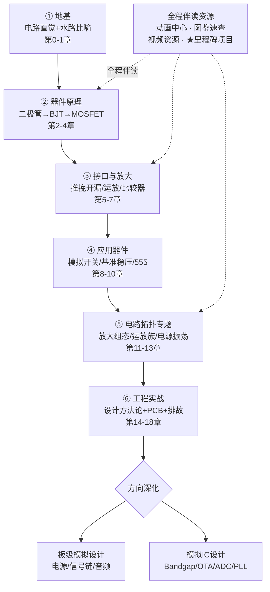

## 学习路线图

全书按「地基 → 器件 → 接口与放大 → 应用器件 → 拓扑专题 → 工程实战」六个阶段递进，走到头再按方向深化分流：板级模拟设计或模拟 IC 设计。沿途全程伴读，动画中心、视频资源与图鉴速查随时可查。

```mermaid
graph TD
    A[① 地基<br/>电路直觉+水路比喻<br/>第0-1章] --> B[② 器件原理<br/>二极管→BJT→MOSFET<br/>第2-4章]
    B --> C[③ 接口与放大<br/>推挽开漏/运放/比较器<br/>第5-7章]
    C --> D[④ 应用器件<br/>模拟开关/基准稳压/555<br/>第8-10章]
    D --> E[⑤ 电路拓扑专题<br/>放大组态/运放族/电源振荡<br/>第11-13章]
    E --> F[⑥ 工程实战<br/>设计方法论+PCB+排故<br/>第14-18章]
    F --> G{方向深化}
    G --> H[板级模拟设计<br/>电源/信号链/音频]
    G --> I[模拟IC设计<br/>Bandgap/OTA/ADC/PLL]
    R[全程伴读资源<br/>动画中心 · 图鉴速查<br/>视频资源 · ★里程碑项目] -. "全程伴读" .-> B
    R -.-> C
    R -.-> E
```
